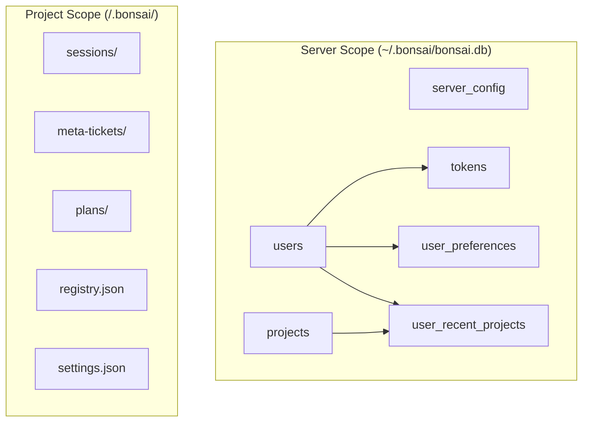

# Backend Storage Architecture

> Parent: [Architecture Design](../../DESIGN_DOC.md) | Status: **Active** | Created: 2026-04-13

## Table of Contents

1. [Overview](#overview)
2. [Goals & Constraints](#goals--constraints)
3. [Storage Scopes](#storage-scopes)
4. [SQLite Database](#sqlite-database)
5. [ServerStore Module](#serverstore-module)
6. [Auth Migration](#auth-migration)
7. [API Surface](#api-surface)
8. [Frontend Changes](#frontend-changes)
9. [Mobile Changes](#mobile-changes)
10. [Key Design Decisions](#key-design-decisions)
11. [Open Questions](#open-questions)

## Overview

Introduces server-level and user-level persistent storage using SQLite, complementing the existing per-project `.bonsai/` file-based storage. Enables cross-browser preference sync, server-wide user identity, and a known-projects registry.

## Goals & Constraints

**Goals:**
- Single source of truth for user preferences across all browsers/devices
- Server-wide user identity (tokens not tied to individual projects)
- Known-projects registry accessible before project selection
- Compatible with Tailscale remote access architecture
- Extensible for future teams/organizations model

**Non-Goals:**
- Replacing per-project `.bonsai/` storage (unchanged)
- Multi-server / distributed deployment (single-server for now)
- User registration UI (tokens provisioned via CLI)

**Constraints:**
- Zero external database server dependency (SQLite only)
- Must work with existing `0.0.0.0` + Vite proxy remote access setup
- Backwards-compatible with existing per-project `users.json` tokens (lazy migration)
- Both web and mobile frontends must be updated

## Storage Scopes



| Scope | Location | Contains | Changed? |
|-------|----------|----------|----------|
| **Server** | `~/.bonsai/bonsai.db` (or `$BONSAI_DATA_DIR/bonsai.db`) | Users, tokens, known projects, preferences | **NEW** |
| **Project** | `<project>/.bonsai/` | Sessions, specs, tickets, plans, registry | Unchanged |
| **Client** | Browser localStorage | Auth token (cache), filetree collapse state | Reduced scope |

## SQLite Database

### Location

`~/.bonsai/bonsai.db` — overridable via `BONSAI_DATA_DIR` environment variable or `data_dir` in `.env`.

Created lazily on first backend startup. The `~/.bonsai/` directory is the **server** data directory, completely separate from any project's `.bonsai/` folder.

### Connection Configuration

```sql
PRAGMA journal_mode = WAL;        -- concurrent reads + writes
PRAGMA synchronous = NORMAL;      -- safe with WAL, better performance
PRAGMA foreign_keys = ON;         -- enforce referential integrity
PRAGMA auto_vacuum = FULL;        -- reclaim space automatically
PRAGMA cache_size = -64000;       -- ~64MB RAM cache
PRAGMA temp_store = MEMORY;       -- temp tables in RAM
```

### Async Access

Use `aiosqlite` (not bare `sqlite3`) to avoid blocking the asyncio event loop. Single connection — SQLite serializes writes anyway; one connection avoids locking complexity.

### Schema

```sql
CREATE TABLE IF NOT EXISTS _schema_version (
    version    INTEGER PRIMARY KEY,
    applied_at TEXT NOT NULL
);

CREATE TABLE IF NOT EXISTS server_config (
    key        TEXT PRIMARY KEY,
    value      TEXT NOT NULL,       -- JSON-encoded
    updated_at TEXT NOT NULL
) WITHOUT ROWID;

CREATE TABLE IF NOT EXISTS users (
    id           TEXT PRIMARY KEY,  -- e.g. "danya"
    display_name TEXT NOT NULL,
    is_admin     INTEGER NOT NULL DEFAULT 0,  -- 1 = admin
    created_at   TEXT NOT NULL,     -- ISO 8601
    updated_at   TEXT NOT NULL
) WITHOUT ROWID;

CREATE TABLE IF NOT EXISTS tokens (
    token      TEXT PRIMARY KEY,    -- "bns_..." prefix
    user_id    TEXT NOT NULL REFERENCES users(id),
    created_at TEXT NOT NULL
) WITHOUT ROWID;

CREATE TABLE IF NOT EXISTS projects (
    path           TEXT PRIMARY KEY, -- absolute filesystem path
    name           TEXT NOT NULL,    -- display name (directory basename)
    registered_at  TEXT NOT NULL,
    last_opened_at TEXT NOT NULL
) WITHOUT ROWID;

CREATE TABLE IF NOT EXISTS user_preferences (
    user_id    TEXT PRIMARY KEY REFERENCES users(id),
    prefs      TEXT NOT NULL DEFAULT '{}',  -- JSON blob
    updated_at TEXT NOT NULL
) WITHOUT ROWID;

CREATE TABLE IF NOT EXISTS user_recent_projects (
    user_id      TEXT NOT NULL REFERENCES users(id),
    project_path TEXT NOT NULL REFERENCES projects(path),
    last_opened  TEXT NOT NULL,
    PRIMARY KEY (user_id, project_path)
) WITHOUT ROWID;

-- Indexes
CREATE INDEX IF NOT EXISTS idx_tokens_user_id
    ON tokens(user_id);
CREATE INDEX IF NOT EXISTS idx_recent_projects_user_time
    ON user_recent_projects(user_id, last_opened DESC);
```

### Schema Migrations

Manual `CREATE TABLE IF NOT EXISTS` with `_schema_version` tracking. Graduate to Alembic when schema grows past ~8 tables or needs column alterations.

**v1 → v2:** Added `is_admin INTEGER NOT NULL DEFAULT 0` to `users` table. Migration checks `PRAGMA table_info(users)` for idempotency before issuing `ALTER TABLE`. The earliest user (by `created_at`) is auto-promoted to admin so pre-admin installations have at least one admin.

## ServerStore Module

**File:** `backend/app/core/server_store.py`

Central abstraction for all server-level storage. Owns the SQLite connection and exposes typed async methods.

### Lifecycle

```python
class ServerStore:
    async open()     # open aiosqlite connection, set PRAGMAs, run migrations
    async close()    # close connection
```

Created in app lifespan, closed on shutdown.

### Public Interface

| Method | Signature | Description |
|--------|-----------|-------------|
| `get_user` | `(user_id: str) -> User \| None` | Look up user by ID |
| `create_user` | `(user_id: str, display_name: str) -> User` | Create new user |
| `ensure_user` | `(user_id: str, display_name: str) -> User` | Get or create |
| `list_users` | `() -> list[User]` | All server users |
| `resolve_token` | `(token: str) -> str \| None` | Token -> user_id |
| `create_token` | `(user_id: str) -> str` | Generate new token |
| `revoke_token` | `(token: str) -> None` | Delete token |
| `list_projects` | `() -> list[KnownProject]` | All known projects |
| `register_project` | `(path: str, name: str) -> None` | Idempotent upsert |
| `update_project_last_opened` | `(path: str) -> None` | Update timestamp |
| `remove_project` | `(path: str) -> None` | Remove from registry |
| `get_preferences` | `(user_id: str) -> dict` | User preference blob |
| `update_preferences` | `(user_id: str, patch: dict) -> dict` | Merge patch, return result |
| `get_recent_projects` | `(user_id: str, limit: int) -> list` | Recent projects for user |
| `add_recent_project` | `(user_id: str, project_path: str) -> None` | Upsert last_opened |

### Config Integration

```python
# backend/app/core/config.py
def get_data_dir() -> Path:
    env = os.environ.get("BONSAI_DATA_DIR")
    if env:
        return Path(env).expanduser().resolve()
    return Path.home() / ".bonsai"
```

`ServerSettings` gains optional `data_dir: str | None` for `.env` override.

## Auth Migration

### Current State

Per-project `users.json`:
```json
{
  "allowAnonymous": true,
  "users": [
    { "id": "danya", "displayName": "Danya", "token": "bns_..." }
  ]
}
```

### Target State

Server-wide SQLite (users + tokens tables). Per-project `users.json` deprecated.

### Migration Strategy

1. On auth, check server-wide SQLite first
2. If not found, fall back to per-project `users.json`
3. On fallback hit, **lazy-migrate** token + user to SQLite
4. New token creation writes to SQLite only
5. `allowAnonymous` removed — every connection requires a token
6. Existing per-project `users.json` files are not deleted (backwards compat)

### Bootstrap

Two paths for creating the first user:

**Web UI (portable executable):** On first launch with zero users, the frontend shows a SetupScreen. The user enters their name and ID, which calls `POST /api/setup` to create the first admin account and generate a token.

**CLI (development / server deployment):**
```bash
cd backend && uv run python -m app.cli create-user --id danya --name "Danya" --admin
# → Created user "danya" (Danya) [admin]
# → Token: bns_a8f3k2m9...
```

## Admin Role System

See [ADMIN_SYSTEM_DESIGN.md](ADMIN_SYSTEM_DESIGN.md) for the full admin spec. Summary:

- `is_admin` boolean flag on users (schema v2)
- First user created via `POST /api/setup` or `--admin` CLI flag is admin
- At least one admin must always exist (enforced on delete/revoke)
- Admin-only RPC methods for user management (`admin/*` namespace)
- Frontend: SetupScreen (first-user bootstrap), AdminPanel (user management)

## API Surface

### REST Endpoints (setup, no auth)

| Endpoint | Method | Auth | Description |
|----------|--------|------|-------------|
| `/api/setup/status` | GET | None | `{ needsSetup: bool }` — true when zero users exist |
| `/api/setup` | POST | None | Create first admin user + token. 403 if users already exist. |

### REST Endpoints (pre-WebSocket)

Used by ProjectPicker/LoginScreen before any WebSocket connection exists.

| Endpoint | Method | Auth | Description |
|----------|--------|------|-------------|
| `/api/user/profile` | GET | `?token=` | Get user profile (includes `isAdmin`) |
| `/api/user/preferences` | GET | `?token=` | Get preferences |
| `/api/user/preferences` | PUT | `?token=` | Update preferences (partial) |
| `/api/user/recent-projects` | GET | `?token=` | Recent projects for user |
| `/api/projects/known` | GET | `?token=` | All known projects |

### WebSocket RPC Methods (in-session)

| Method | Params | Response |
|--------|--------|----------|
| `user/getProfile` | — | `{ userId, displayName, isAdmin, createdAt }` |
| `user/getPreferences` | — | `{ theme, soundEnabled, ... }` |
| `user/updatePreferences` | `{ patch: {...} }` | Updated prefs object |
| `user/getRecentProjects` | `{ limit?: number }` | `[{ path, name, lastOpened }]` |

### Admin RPC Methods (admin-only)

| Method | Params | Response |
|--------|--------|----------|
| `admin/listUsers` | — | `{ users: [{ id, name, isAdmin, createdAt, tokenCount }] }` |
| `admin/createUser` | `{ userId, name?, isAdmin? }` | `{ userId, name, token, isAdmin }` |
| `admin/deleteUser` | `{ userId }` | `{ ok: true }` |
| `admin/setAdmin` | `{ userId }` | `{ ok: true }` |
| `admin/removeAdmin` | `{ userId }` | `{ ok: true }` |
| `admin/revokeToken` | `{ token }` | `{ ok: true }` |

## Frontend Changes

### New: SetupScreen

Shown on first launch when no users exist (`GET /api/setup/status` → `needsSetup: true`). Creates first admin account via `POST /api/setup`, displays generated token.

### New: LoginScreen

Shown when users exist but no valid token is stored. Token entry + validate flow.

### New: AdminPanel

Modal dialog accessible from Header (admin-only). User management: create, delete, toggle admin, revoke tokens.

### Flow Change

```
Before: App → ProjectPicker → WebSocket
After:  App → SetupScreen (if first run) → LoginScreen (if no token) → ProjectPicker → WebSocket
```

### localStorage Migration

| Key | Before | After |
|-----|--------|-------|
| `bonsai-recent-projects` | Source of truth | **Removed** — backend is source |
| `bonsai_token` | Auth credential | **Kept** — client credential |
| `bonsai-ui` | Source of truth | **Cache only** — backend is source |
| `bonsai-notification-sound` | Source of truth | **Cache only** — backend is source |
| `bonsai-message-history` | Source of truth | **Cache only** — backend is source |
| `bonsai-theme` | Source of truth | **Cache only** — backend is source |
| `bonsai-filetree-*` | Ephemeral UI | **Kept** — too volatile for server |

### Sync Pattern

1. On load: read localStorage (instant), then fetch from backend (async overwrite)
2. On change: write to backend (async), update localStorage (sync cache)
3. Backend is authoritative; localStorage is a warm cache for instant initial render

## Mobile Changes

The Kotlin Multiplatform mobile app (`/mobile/`) needs corresponding changes:

- **LoginScreen** — new screen, token entry + REST validation
- **ConnectionManager** — token becomes required parameter
- **ProjectPickerComponent** — fetch recent projects from backend REST API
- **Token storage** — Android DataStore / SharedPreferences
- **Preference sync** — fetch from backend on launch, sync changes back

## Key Design Decisions

| Decision | Choice | Rationale |
|----------|--------|-----------|
| Storage engine | SQLite via `aiosqlite` | Zero external deps (stdlib), WAL concurrent access, indexed lookups, relational model for future teams/orgs |
| Not PostgreSQL | — | Single-server deployment; SQLite avoids managing a DB server. Migrate later if needed. |
| Data location | `~/.bonsai/bonsai.db` | Natural home dir convention; `BONSAI_DATA_DIR` override for containers |
| No anonymous users | — | Simplifies model: every connection has a user, preferences always server-backed |
| Admin as boolean | `is_admin` column | Simple, extensible to RBAC later; avoids premature role table |
| First user is admin | `POST /api/setup` | Solves bootstrap for portable executables where CLI is unavailable |
| Preferences as JSON blob | `user_preferences.prefs` | Avoids schema migration on every new preference; Pydantic validates in Python |
| TEXT timestamps | ISO 8601 | Human-readable, consistent with existing `.bonsai/` JSON files, sufficient at this scale |
| `WITHOUT ROWID` | All TEXT-PK tables | Saves space, better perf for text-keyed lookups |
| Manual migrations | `CREATE IF NOT EXISTS` + version table | Schema is small and stable; Alembic when needed |
| Lazy token migration | Fallback to per-project `users.json` | Zero-downtime migration; existing tokens keep working |

## Open Questions

- Team/organization model (future): multi-role RBAC, groups, project-level permissions
- Token expiration: should tokens expire? Currently they don't.
- Multi-server migration path: when/if to introduce SQLAlchemy for Postgres portability
