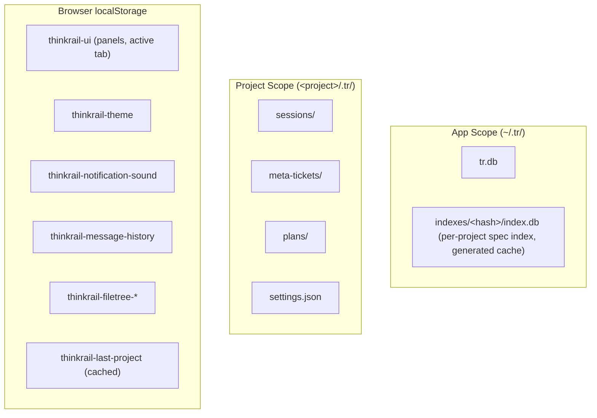

# Backend Storage Architecture

> Parent: [Architecture Design](../../DESIGN_DOC.md) | Status: **Active** | Updated: 2026-05-04

## Table of Contents

1. [Overview](#overview)
2. [Goals & Constraints](#goals--constraints)
3. [Storage Scopes](#storage-scopes)
4. [SQLite Database](#sqlite-database)
5. [AppStore Module](#appstore-module)
6. [API Surface](#api-surface)
7. [Frontend Storage](#frontend-storage)
8. [Key Design Decisions](#key-design-decisions)
9. [Removed Concepts](#removed-concepts)

## Overview

Defines the backend storage model. ThinkRail is a **single-user, localhost-only** developer tool (see `GOAL&REQUIREMENTS.md`); there is no concept of accounts, tokens, or authentication. Storage is split into two scopes:

- **App scope** — SQLite database at `~/.tr/tr.db` for app-wide state that outlives any single project (the known-projects registry, app settings).
- **Project scope** — `<project>/.tr/` directory for everything that belongs to a particular project (sessions, specs, tickets, plans, project-local settings).

Per-browser ephemeral UI state lives in `localStorage`.

## Goals & Constraints

**Goals:**
- A small, durable, machine-wide registry of known projects so the picker can show recents across browsers
- A small, durable, machine-wide place for app settings (theme defaults, last-opened-project, etc.)
- Compatible with the existing `aiosqlite` access pattern and `~/.tr/` data directory
- Keep per-project storage in `<project>/.tr/` unchanged

**Non-Goals:**
- Authentication or user identity — ThinkRail is single-user; the OS user owns the data
- Multi-server / distributed deployment
- Cross-machine sync — each developer's machine is independent
- Per-user preferences — there is one user (the OS user) and prefs that need to persist across browsers go in the `settings` table; everything else stays in `localStorage`

**Constraints (from `GOAL&REQUIREMENTS.md`):**
- Single-user only; no auth
- Localhost only
- File-based / embedded storage only — no external DB server
- Atomic writes — registry-style data must not corrupt on crash

## Storage Scopes



| Scope | Location | Contains |
|-------|----------|----------|
| **App** | `~/.tr/tr.db` (override via `$THINKRAIL_DATA_DIR`) | Known projects, app settings |
| **App (indexes)** | `~/.tr/indexes/<hash>/index.db` | Per-project spec index — generated cache, rebuildable |
| **Project** | `<project>/.tr/` | Sessions, specs, tickets, plans, project-local settings |
| **Browser** | `localStorage` | UI ephemeral state, last-opened-project cache |

## SQLite Database

### Location

`~/.tr/tr.db` — overridable via `$THINKRAIL_DATA_DIR` environment variable or `data_dir` in `.env`. Created lazily on first backend startup. The `~/.tr/` directory is the **app** data directory, completely separate from any project's `.tr/` folder.

### Connection Configuration

```sql
PRAGMA journal_mode = WAL;        -- safe concurrent access
PRAGMA synchronous = NORMAL;      -- safe with WAL
PRAGMA foreign_keys = ON;
PRAGMA auto_vacuum = FULL;
PRAGMA cache_size = -64000;       -- ~64MB cache
PRAGMA temp_store = MEMORY;
```

### Async Access

`aiosqlite`, single connection — SQLite serializes writes anyway and one connection avoids locking complexity. Don't mix sync `sqlite3` with async code.

### Schema (v3)

```sql
CREATE TABLE IF NOT EXISTS _schema_version (
    version    INTEGER PRIMARY KEY,
    applied_at TEXT NOT NULL
);

-- App-wide key/value settings.
-- Replaces the old `server_config` table. Holds singletons like
-- `last_opened_project` and any future cross-project app state.
CREATE TABLE IF NOT EXISTS settings (
    key        TEXT PRIMARY KEY,
    value      TEXT NOT NULL,       -- JSON-encoded
    updated_at TEXT NOT NULL
) WITHOUT ROWID;

-- Known projects, ordered by last_opened_at for the picker.
-- No longer joined to a user; there is one user.
CREATE TABLE IF NOT EXISTS projects (
    path           TEXT PRIMARY KEY,
    name           TEXT NOT NULL,
    registered_at  TEXT NOT NULL,
    last_opened_at TEXT NOT NULL
) WITHOUT ROWID;

CREATE INDEX IF NOT EXISTS idx_projects_last_opened
    ON projects(last_opened_at DESC);
```

That's the entire schema. Three tables (one of them just version metadata).

### Schema Migrations

Manual `CREATE TABLE IF NOT EXISTS` with `_schema_version` tracking.

**v2 → v3 (auth removal).** The schema bootstrap (`CREATE TABLE IF NOT EXISTS …`) runs **before** the migration step in `AppStore.open()`. On a v2 database that means the migration starts with `server_config` (legacy, populated) **and** an empty `settings` table (just created by the bootstrap) both present. The migration preserves `server_config` data through this overlap by handling four explicit cases for the rename.

Drop order (FKs → users / projects):
1. `DROP TABLE IF EXISTS user_recent_projects` (drop child first — FK → users, projects)
2. `DROP TABLE IF EXISTS user_preferences`
3. `DROP TABLE IF EXISTS tokens`
4. `DROP TABLE IF EXISTS users`

Then resolve `server_config` ↔ `settings` based on what exists in `sqlite_master`:

| `server_config` | `settings` | Action |
|-----------------|-----------|--------|
| exists, populated | exists, empty (typical v2-upgrade path) | `DROP TABLE settings`; `ALTER TABLE server_config RENAME TO settings` — preserves the legacy rows. |
| exists, populated | exists, has rows (extremely unlikely — implies a partial earlier migration) | `DROP TABLE server_config` defensively — keeping `settings` avoids clobbering newer data. |
| exists, populated | does not exist | `ALTER TABLE server_config RENAME TO settings` — straight rename. |
| does not exist | exists (fresh install via the `_SCHEMA` bootstrap) | No-op. |

Finally:

5. `INSERT INTO _schema_version VALUES (3, <iso8601>)`

The migration is destructive for user/token data — that's intentional. There are no users in single-user mode and tokens were a localhost-only artifact. The `projects` table survives untouched.

## AppStore Module

**File:** `backend/app/core/app_store.py` (renamed from `server_store.py`)

Central abstraction for app-scope storage. Owns the `aiosqlite` connection and exposes typed async methods. Class name: `AppStore` (renamed from `ServerStore`).

### Lifecycle

```python
class AppStore:
    async def open(self) -> None:    # connect, set PRAGMAs, run migrations
    async def close(self) -> None:   # close connection
    @property
    def is_open(self) -> bool: ...   # connection state
```

Created in the FastAPI lifespan, closed on shutdown. A single instance lives for the process lifetime.

### Public Interface

| Method | Signature | Description |
|--------|-----------|-------------|
| `list_projects` | `() -> list[KnownProject]` | All known projects, ordered by `last_opened_at DESC` |
| `register_project` | `(path: str, name: str) -> None` | Idempotent upsert |
| `update_project_last_opened` | `(path: str) -> None` | Touch timestamp |
| `remove_project` | `(path: str) -> None` | Drop from registry |
| `get_setting` | `(key: str) -> dict \| None` | Read JSON value (or None) |
| `set_setting` | `(key: str, value: dict) -> None` | Write JSON value (upsert) |

That is the entire surface. Anything more elaborate (per-project state, cross-project search) lives elsewhere.

### Config Integration

```python
# backend/app/core/config.py
def get_data_dir() -> Path:
    env = os.environ.get("THINKRAIL_DATA_DIR")
    if env:
        return Path(env).expanduser().resolve()
    return Path.home() / ".tr"
```

`ServerSettings` retains `data_dir: str | None` for `.env` overrides.

## API Surface

### REST Endpoints

All endpoints are tokenless. No setup or auth endpoints exist.

| Endpoint | Method | Description |
|----------|--------|-------------|
| `/api/projects/known` | GET | List known projects (for the picker) |
| `/api/projects/known` | POST | Register a project (idempotent upsert) — body `{path, name}` |
| `/api/projects/known?path=<path>` | DELETE | Remove a project from the registry |
| `/api/files/*`, `/api/fs/*`, `/api/project/*`, `/api/server-info` | various | Unchanged from previous spec |

All three known-projects endpoints are tokenless. **No `Authorization` header, no `?token=` parameter, anywhere.**

### WebSocket RPC

No `user/*`, no `admin/*`, no `auth` handshake. The connection carries only `?project=<path>`. Backend rejects connections to nonexistent project paths the same way it always did.

All other namespaces (`spec/*`, `agent/*`, `session/*`, `board/*`, `trash/*`, `vis/*`, `settings/*`, `subsessions/*`) continue unchanged.

## Frontend Storage

`localStorage` is the primary store for browser-local UI state. The frontend treats it as the source of truth for everything that doesn't need to survive a browser change:

| Key | Purpose |
|-----|---------|
| `thinkrail-ui` | Panel collapse, active tab |
| `thinkrail-theme` | Theme preference |
| `thinkrail-notification-sound` | Sound toggle |
| `thinkrail-message-history` | Chat input history |
| `thinkrail-filetree-*` | Filetree expand/collapse |
| `thinkrail-last-project` | Path of the most recently opened project (cache) |

The `thinkrail_token` key is **removed** from the frontend.

There is no per-user cross-browser sync because there is no user. If a developer wants their UI prefs to follow them between browsers on the same machine, that's served by the `settings` table and a small REST surface — implementing that is optional and not required by this architecture.

## Key Design Decisions

| Decision | Choice | Rationale |
|----------|--------|-----------|
| Storage engine | SQLite via `aiosqlite` | Embedded, atomic, well-supported. Already in the codebase. |
| Two tables only | `settings` + `projects` | ThinkRail is single-user; that's all we need. Anything more is speculative. |
| `WITHOUT ROWID` | All TEXT-PK tables | Saves space; better lookup perf for text keys. |
| TEXT timestamps | ISO 8601 | Consistent with the rest of the codebase. |
| No auth | Tokenless WebSocket and REST | `GOAL&REQUIREMENTS.md` constraint: localhost-only single-user. |
| `AppStore` not `ServerStore` | Naming | "Server" implied multi-user; `App` reflects single-user reality. |
| `~/.tr/` data dir | Unchanged | Established convention; `$THINKRAIL_DATA_DIR` for overrides (containers, tests). |
| Project storage unchanged | `<project>/.tr/` | Per-project data stays where developers expect. |
| Manual migrations | `CREATE IF NOT EXISTS` + version table | Schema is small; Alembic is overkill. |

## Removed Concepts

The following were introduced in earlier specs and have been removed in v3 (see [`feature_login_screen.md`](../implementation_tasks/frontend/feature_login_screen.md) — *"Remove Authentication & Single-User Cleanup"*):

- **Users** — table dropped; `User` model deleted; no `user_id` anywhere
- **Tokens** — table dropped; no token resolution; no `bns_*` strings
- **Per-user preferences** — table dropped; preferences either live in browser `localStorage` or in the global `settings` table if they need cross-browser persistence
- **Per-user recent projects** — `user_recent_projects` table dropped; recent-projects is now just `projects` ordered by `last_opened_at`
- **Admin role** — `is_admin` column gone; no admin-only endpoints
- **`/api/setup*` endpoints** — bootstrap is no longer needed; the app starts directly into the picker
- **`admin/*` RPC namespace** — removed
- **`user/*` RPC namespace** — removed (no user identity to fetch)
- **CLI auth subcommands** — `create-user`, `list-users`, `set-admin` removed from `app.cli`

The specs that documented the removed auth/admin/user system (`module-auth-migration`, `feature-admin-system`, `module-user-api`) have been deleted. Git history is the audit trail.
