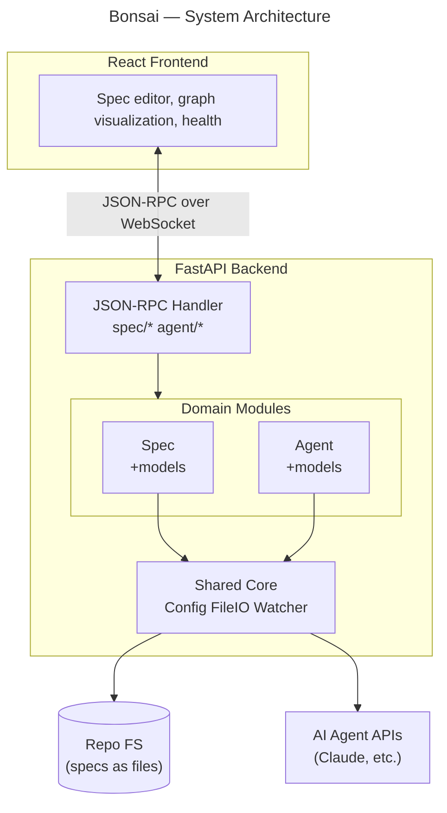
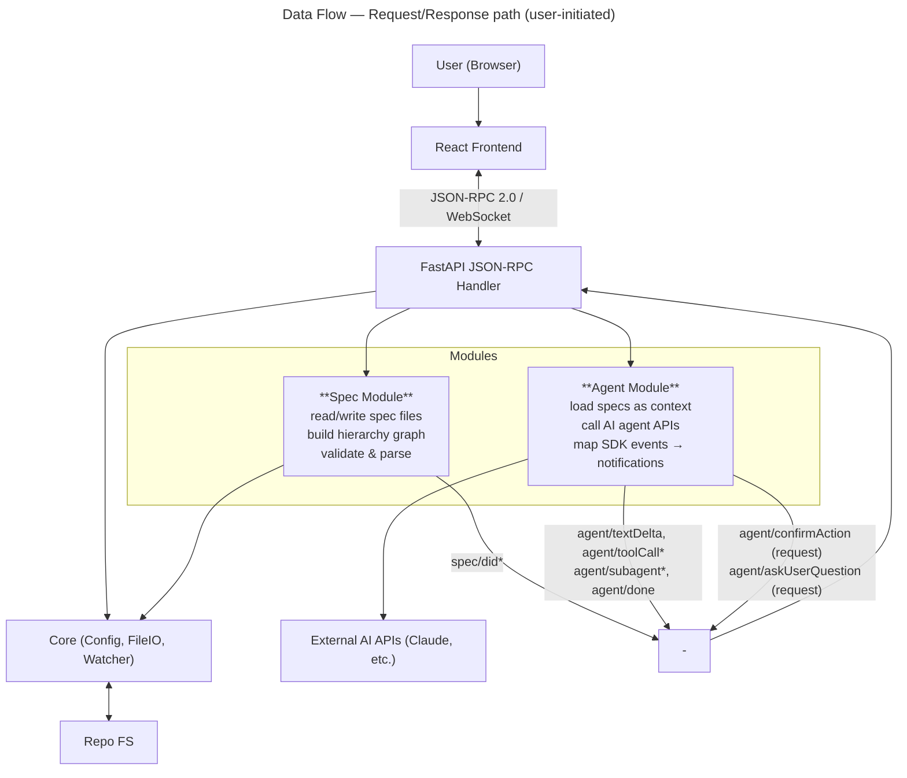
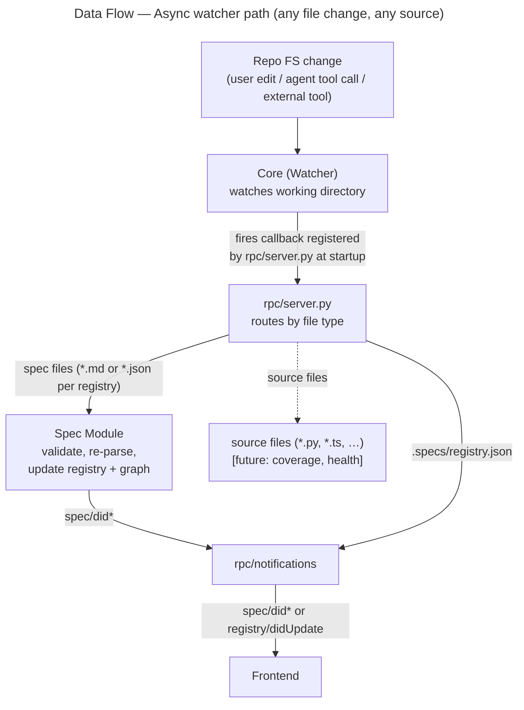

# Bonsai — Architecture Design

> Status: **Active** | Created: 2026-02-25

## Table of Contents
1. [Overview](#overview)
2. [Goals & Constraints](#goals--constraints)
3. [System Architecture](#system-architecture)
4. [Backend (Python)](#backend-python)
5. [Frontend (TypeScript/JavaScript)](#frontend-typescriptjavascript)
6. [Data Model](#data-model)
7. [API Design](#api-design)
8. [Key Design Decisions](#key-design-decisions)
9. [Deployment](#deployment)
10. [Open Questions](#open-questions)

## Overview

Bonsai is a developer tool and web workspace for specification-driven development. It provides a Python backend API and a TypeScript/JavaScript frontend that runs on developers' machines, offering a comprehensive environment for creating, editing, and visualizing hierarchical specifications that live in the project repository alongside code.

Bonsai serves as both a spec management layer and an AI agent orchestrator — enabling developers to align AI coding agents with clear intent, scope, and constraints through structured project context.

## Goals & Constraints

**Goals:**
- Provide a web-based workspace for managing hierarchical, interconnected specs
- Orchestrate AI coding agents using specs as structured context
- Visualize the spec hierarchy with integrated project health/coverage
- Keep specs in the repo as files, versioned alongside code

**Design Principles:**
- Separation of concerns — each module has one clear responsibility
- Simplicity first — start simple, add complexity only when proven necessary

**Non-Goals (for now):**
- Multi-user collaboration or team features
- Cloud hosting or remote deployment
- Real-time collaborative editing

## System Architecture

**Pattern:** Hybrid — layered at the top level (frontend/backend split) with modular domains inside the backend.



**Communication Protocol:** JSON-RPC 2.0 over WebSocket (LSP-style, true bidirectional)

The frontend and backend communicate over a single WebSocket connection. Both sides can send
**requests** (with `id`, require a response) and **notifications** (no `id`, fire-and-forget).
This mirrors the Language Server Protocol pattern exactly.

```
  React Frontend ◀═══ JSON-RPC 2.0 / WebSocket ═══▶ FastAPI Backend
    │                                                       │
    │  Client → Server (requests):                          │
    │   spec/*  agent/run  agent/send  agent/status         │
    │   agent/list  agent/interrupt  agent/end              │
    │   agent/respond                                       │
    │                                                       │
    │  Server → Client (notifications, no response):        │
    │   spec/did*  registry/didUpdate                       │
    │   agent/sessionStart  agent/textDelta                 │
    │   agent/toolCallStart  agent/toolCallEnd              │
    │   agent/subagentStart  agent/subagentEnd              │
    │   agent/notification  agent/compact                   │
    │   agent/progress  agent/permissionDenied              │
    │   agent/turnComplete  agent/interrupted               │
    │   agent/done  agent/error                             │
    │                                                       │
    │  Server → Client (requests, client must respond):     │
    │   agent/askUserQuestion  agent/confirmAction          │
    ▼                                                       ▼
  Browser                              ┌──── File Watcher ────┐
                                       │  .specs/registry.json │
                                       │  spec files (*.md,    │
                                       │  *.json per registry) │
                                       └───────────────────────┘
```

**Data Flow:**





## Backend (Python)

**Framework:** FastAPI

**Module Structure:**

```
backend/
├── app/
│   ├── main.py              # FastAPI app entry point
│   ├── rpc/                 # JSON-RPC Layer
│   │   ├── server.py        # WebSocket + JSON-RPC dispatcher (routes all 3 directions)
│   │   ├── methods/
│   │   │   ├── specs.py     # spec/* methods
│   │   │   └── agents.py    # agent/* methods (incl. agent/respond)
│   │   └── notifications.py # Server→client push (notifications + requests)
│   ├── spec/                # Spec Domain Module
│   │   ├── models.py        # Spec, RegistryEntry, Link models
│   │   ├── service.py       # CRUD operations
│   │   ├── parser.py        # Spec file parsing (Markdown or JSON)
│   │   ├── validator.py     # Spec validation
│   │   ├── graph.py         # Hierarchy & graph building
│   │   └── registry.py      # Registry read/write/validate (atomic writes)
│   ├── agent/               # Agent Domain Module
│   │   ├── models.py        # AgentTask, AgentEvent, AgentResult models
│   │   ├── service.py       # Orchestration facade
│   │   ├── runner.py        # Claude Agent SDK integration; maps SDK events → notifications
│   │   └── tracker.py       # Task lifecycle + asyncio.Future map for pending requests
│   └── core/                # Shared Core
│       ├── config.py        # App configuration
│       ├── fileio.py        # File system operations (read, write, delete files/dirs)
│       └── watcher.py       # Async file change watching
├── tests/
│   ├── test_spec/
│   ├── test_agent/
│   ├── test_rpc/
│   └── test_core/
├── pyproject.toml
└── requirements.txt
```

**Key Dependencies:**
- FastAPI + Uvicorn (web server + WebSocket)
- Pydantic (data validation & models)
- jsonrpcserver (JSON-RPC 2.0 message parsing and dispatch)
- claude-agent-sdk (Claude Agent SDK for AI agent orchestration)
- watchfiles (file system watching)
- pytest (testing)

**Module Documentation:**

| Module | Spec | Description |
|--------|------|-------------|
| Spec | [backend/app/spec/README.md](backend/app/spec/README.md) | Spec CRUD, parsing, validation, hierarchy graph |
| Core | [backend/app/core/README.md](backend/app/core/README.md) | App configuration, file I/O, async file watcher |
| Agent | [backend/app/agent/README.md](backend/app/agent/README.md) | Agent orchestration, Claude SDK integration, task lifecycle |
| RPC | [backend/app/rpc/README.md](backend/app/rpc/README.md) | WebSocket endpoint, JSON-RPC dispatch, notifications |
| Frontend | [frontend/README.md](frontend/README.md) | React SPA, UI components, state management |

**Feature Designs:**

| Feature | Spec | Description |
|---------|------|-------------|
| Proactive Agent Experience | [PROACTIVE_AGENT_EXPERIENCE_DESIGN.md](features/PROACTIVE_AGENT_EXPERIENCE_DESIGN.md) | Agent-driven UI: SuggestSession and UpdateProgress tools via canUseTool interception |

## Frontend (TypeScript/JavaScript)

**Framework:** React

**Component Structure** (design phase — code not yet implemented):

```
frontend/
├── src/
│   ├── main.tsx             # App bootstrap
│   ├── App.tsx              # Root component: providers + global overlays
│   ├── routes.tsx           # React Router route definitions
│   ├── components/
│   │   ├── AppShell/        # Three-panel layout, header, status bar
│   │   ├── ChatStream/      # Agent event rendering, streaming text
│   │   ├── GraphView/       # Spec hierarchy visualization + health
│   │   ├── NewSessionModal/ # Session creation form
│   │   ├── CommandPalette/  # Fuzzy search, action registry
│   │   ├── Notifications/   # Toast queue, tab badges
│   │   ├── DiffViewer/      # Spec + code side-by-side diff
│   │   ├── ProgressTab/     # Spec metrics, session tracker
│   │   ├── SessionHistory/  # Session archive, read-only replay
│   │   └── Console/         # xterm.js terminal emulator
│   ├── api/                 # WebSocket/JSON-RPC client
│   ├── store/               # Zustand state management
│   ├── styles/              # CSS custom properties, theming
│   ├── types/               # TypeScript type definitions
│   └── utils/               # Shared utilities
├── index.html
├── package.json
├── tsconfig.json
└── vite.config.ts
```

**Key Dependencies:**
- React 19 (UI framework)
- Zustand (state management, ~1KB)
- React Router 7 (client-side routing)
- xterm.js (terminal emulator, lazy-loaded)
- Custom DOM + SVG graph (no heavy graph library — ≤15 nodes per layer)
- Custom JSON-RPC client over WebSocket (~100 lines)

## Data Model

Specs are stored as files in the repository. The registry tracks metadata:

**Spec (file on disk):**
- Markdown or JSON files in the repo
- Markdown specs have informal free-form structure (headers, lists, tables, prose)
- JSON specs store structured content as a JSON object
- Content varies by type (goal, architecture, module, task)

**Registry Entry (`.specs/registry.json`):**
- `id` — unique identifier
- `type` — goal-and-requirements | architecture-design | module-design | task-spec
- `path` — relative file path
- `title` — human-readable name
- `status` — draft | active | stale | deprecated
- `covers` — source paths this spec covers
- `tags` — metadata labels
- `created` — creation date (ISO 8601)
- `updated` — last update date (ISO 8601)

**Links (in registry):**
- `from` / `to` — spec IDs
- `type` — parent | child | depends-on | references | implements

## API Design

**Style:** JSON-RPC 2.0 over WebSocket — true bidirectional (LSP-style)

**Project selection:** The WebSocket URL includes a `project` query parameter specifying the project directory: `ws://host/ws?project=/path/to/dir`. The backend validates `.specs/registry.json` exists and creates per-connection services scoped to that project.

**REST endpoints** for project and file management:
- `GET /api/project/validate?path=...` — check if path is a valid Bonsai project
- `POST /api/project/init` — initialize `.specs/` in a new directory
- `GET /api/project/files?path=...` — list project directory tree
- `GET /api/file/read?project=...&path=...` — read file contents
- `POST /api/file/write` — write file contents `{ project, path, content }`
- `GET /api/fs/list-dirs?base=...&prefix=...` — list subdirectories for path autocompletion (max 20, directories only)
- `POST /api/file/open-external` — open file in editor `{ project, path, editor: "idea"|"code"|"vim"|"nvim"|"nano" }`. Terminal editors (vim, nvim, nano, vi) open in a terminal emulator window.

**Session persistence:** Agent sessions are persisted to `.specs/sessions/{taskId}.json`. Events are saved as they stream. Completed/errored sessions survive backend restarts and page refreshes. The `session/continue` method replays old conversation history as context for a new SDK session.

Communication flows in three directions over a single WebSocket at `/ws?project=...`:
- **Client → Server requests:** `spec/*` CRUD + graph, `agent/*` session management, `session/*` persistence (list, get, continue, delete)
- **Server → Client notifications:** file watcher events (`spec/did*`, `registry/didUpdate`), agent streaming events (`agent/sessionStart`, `agent/textDelta`, `agent/toolCall*`, `agent/subagent*`, `agent/notification`, `agent/compact`, `agent/progress`, `agent/turnComplete`, `agent/interrupted`, `agent/done`, `agent/error`, `agent/permissionDenied`)
- **Server → Client requests:** `agent/askUserQuestion`, `agent/confirmAction` — client responds via `agent/respond`

Full protocol reference (method tables, params, message shapes): **[RPC Module spec](backend/app/rpc/README.md#methods)**

## Key Design Decisions

| Decision | Choice | Rationale |
|----------|--------|-----------|
| Architecture pattern | Hybrid — layered top-level (frontend/backend) with modular domains inside backend | Clean separation between transport (RPC), domain logic (Spec, Agent), and infrastructure (Core). Each module has one responsibility. |
| Communication protocol | JSON-RPC 2.0 over WebSocket | LSP-style true bidirectional messaging. Server can push notifications and initiate requests (e.g., agent questions). Single connection, simple framing. |
| Spec storage | Files in the repo (Markdown or JSON) | Git-friendly, versionable alongside code. No external database. Developers can read/edit specs with any text editor. |
| Registry as single JSON file | `.specs/registry.json` | Simplicity — one atomic file for all metadata. Easy to debug, version, and parse. Atomic writes prevent corruption. |
| Graph visualization | Custom DOM + SVG (no library) | Layered view shows ≤15 nodes. D3/React Flow/Cytoscape add 80-170KB for no benefit at this scale. |
| State management | Zustand (frontend) | 1KB, hook-based, no boilerplate. Stores split by domain for isolation. |
| Agent SDK integration | Isolated in `runner.py` only | Single swap point for SDK versions. Service and tracker are SDK-agnostic. |
| File change tracking | Filesystem watcher, not tool call interception | Ground truth — catches all file changes regardless of source (agent, user, external tool). Same validation pipeline for all changes. |
| Single-user, localhost | No auth, no multi-user, no cloud | Simplicity first — Bonsai is a developer's local tool. Multi-user adds complexity with no current demand. |

**Design Philosophy:** Start simple, add complexity only when proven necessary. Each module has one clear responsibility. The code should be small enough to read end-to-end. Prefer explicit wiring over implicit magic.

## Deployment

- Runs locally on developer machines
- Backend: `uvicorn` serving FastAPI
- Frontend: Dev server (Vite) or built static files served by FastAPI
- Single command to start: `bonsai serve` or similar
- No external database — file-based storage in the repo

## Open Questions

- How to handle agent API key management securely?
- Should the frontend be served by FastAPI (single process) or run separately?
- How to handle concurrent agent tasks and resource limits?

**Resolved:**
- ~~Which graph visualization library?~~ → Custom DOM + SVG (no library needed for ≤15 nodes)
- ~~JSON-RPC library?~~ → `jsonrpcserver` (see [rpc/README.md](backend/app/rpc/README.md))
