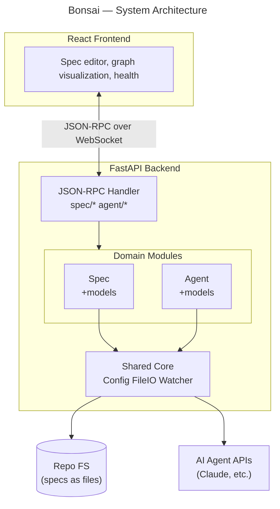
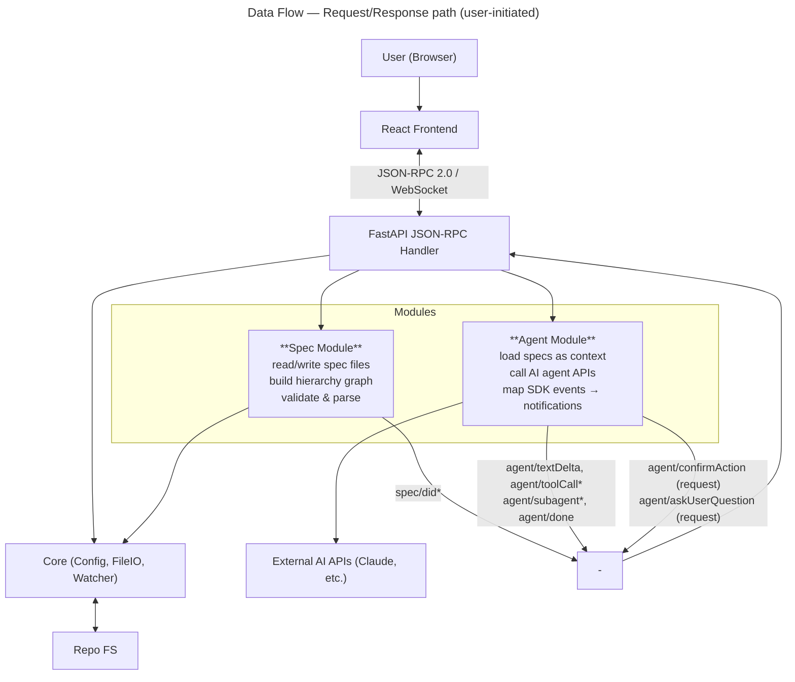
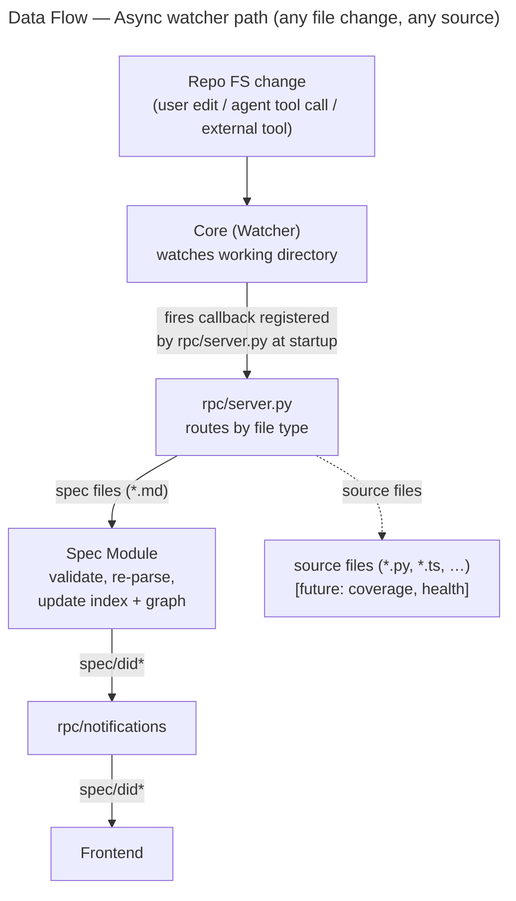

# Bonsai — Architecture Design

> Status: **Active** | Created: 2026-02-25

## Table of Contents
1. [Overview](#overview)
2. [Goals & Constraints](#goals--constraints)
3. [System Architecture](#system-architecture)
4. [Backend (Python)](#backend-python)
5. [Frontend (TypeScript/JavaScript)](#frontend-typescriptjavascript)
6. [Data Model](#data-model)
7. [API Design](#api-design)
8. [Key Design Decisions](#key-design-decisions)
9. [Deployment](#deployment)
10. [Open Questions](#open-questions)

## Overview

Bonsai is a developer tool and web workspace for specification-driven development. It provides a Python backend API and a TypeScript/JavaScript frontend that runs on developers' machines, offering a comprehensive environment for creating, editing, and visualizing hierarchical specifications that live in the project repository alongside code.

Bonsai serves as both a spec management layer and an AI agent orchestrator — enabling developers to align AI coding agents with clear intent, scope, and constraints through structured project context.

## Goals & Constraints

**Goals:**
- Provide a web-based workspace for managing hierarchical, interconnected specs
- Orchestrate AI coding agents using specs as structured context
- Visualize the spec hierarchy with integrated project health/coverage
- Keep specs in the repo as files, versioned alongside code

**Design Principles:**
- Separation of concerns — each module has one clear responsibility
- Simplicity first — start simple, add complexity only when proven necessary

**Non-Goals (for now):**
- Multi-user collaboration or team features
- Cloud hosting or remote deployment
- Real-time collaborative editing

## System Architecture

**Pattern:** Hybrid — layered at the top level (frontend/backend split) with modular domains inside the backend.



**Communication Protocol:** JSON-RPC 2.0 over WebSocket (LSP-style, true bidirectional)

The frontend and backend communicate over a single WebSocket connection. Both sides can send
**requests** (with `id`, require a response) and **notifications** (no `id`, fire-and-forget).
This mirrors the Language Server Protocol pattern exactly.

```
  React Frontend ◀═══ JSON-RPC 2.0 / WebSocket ═══▶ FastAPI Backend
    │                                                       │
    │  Client → Server (requests):                          │
    │   spec/*  agent/run  agent/send  agent/status         │
    │   agent/list  agent/interrupt  agent/end              │
    │   agent/respond                                       │
    │                                                       │
    │  Server → Client (notifications, no response):        │
    │   spec/did*                                           │
    │   agent/sessionStart  agent/textDelta                 │
    │   agent/toolCallStart  agent/toolCallEnd              │
    │   agent/subagentStart  agent/subagentEnd              │
    │   agent/notification  agent/compact                   │
    │   agent/progress  agent/permissionDenied              │
    │   agent/turnComplete  agent/interrupted               │
    │   agent/done  agent/error                             │
    │                                                       │
    │  Server → Client (requests, client must respond):     │
    │   agent/askUserQuestion  agent/confirmAction          │
    ▼                                                       ▼
  Browser                              ┌──── File Watcher ────┐
                                       │  spec files (*.md)    │
                                       │  .bonsai/* config     │
                                       └───────────────────────┘
```

**Data Flow:**





## Backend (Python)

**Framework:** FastAPI

**Module Structure:**

```
backend/
├── app/
│   ├── main.py              # FastAPI app entry point
│   ├── cli.py               # Schema export CLI (export-schema, export-ws-schema)
│   ├── api/                 # REST API Layer
│   │   ├── deps.py          # Shared dependencies (project resolution, AppStore access)
│   │   ├── errors.py        # HTTP error handlers
│   │   ├── schemas.py       # Request/response schemas
│   │   └── routers/         # files.py, fs.py, project.py, projects_known.py, server_info.py
│   ├── rpc/                 # JSON-RPC Layer
│   │   ├── server.py        # WebSocket + JSON-RPC dispatcher
│   │   ├── bus.py           # EventBus — pub/sub for multi-client notifications
│   │   ├── connections.py   # ClientConnection dataclass, conn_id context var
│   │   ├── notifications.py # Per-connection notify factory
│   │   └── methods/         # specs, agents, sessions, board, trash, vis, settings, subsessions
│   ├── spec/                # Spec Domain Module
│   │   ├── models.py        # Spec, SpecEntry, Link models
│   │   ├── service.py       # CRUD operations (async, backed by SQLite index)
│   │   ├── parser.py        # Spec file parsing (Markdown)
│   │   ├── validator.py     # Spec validation
│   │   ├── graph.py         # Hierarchy & graph building
│   │   ├── frontmatter.py   # YAML frontmatter parsing and serialization
│   │   ├── index.py         # SQLite index management (.bonsai/index.db)
│   │   └── migrate.py       # Migration from legacy registry.json to frontmatter
│   ├── agent/               # Agent Domain Module
│   │   ├── models.py        # AgentTask, AgentEvent, AgentResult models
│   │   ├── service.py       # Orchestration facade
│   │   ├── runner.py        # Claude Agent SDK integration; maps SDK events → notifications
│   │   ├── tracker.py       # Task lifecycle + asyncio.Future map for pending requests
│   │   ├── context.py       # Context assembly: skill instructions, project metadata, system prompt
│   │   ├── persistence.py   # Session persistence: metadata JSON + events JSONL
│   │   ├── permissions.py   # Tool approval routing (canUseTool hook)
│   │   ├── credentials.py   # API key management
│   │   ├── revise.py        # Voice transcript revision
│   │   ├── transcribe.py    # Audio transcription via OpenAI Whisper (optional)
│   │   ├── visualization.py # MCP visualization tool: 6 vis types rendered in ChatStream
│   │   ├── model_registry.py # Available model enumeration and caching
│   │   ├── pricing.py       # Token cost calculation
│   │   └── tools/           # MCP tools: specs, suggest_session, suggest_description, visualization, orchestrator, change_ticket_status
│   ├── board/               # Meta-Ticket & Plan Module
│   │   ├── models.py        # MetaTicket, Plan, Step, SpecDraft models
│   │   ├── service.py       # BoardService — CRUD, plan management, draft/patch operations
│   │   ├── storage.py       # File-based storage (.bonsai/meta-tickets/, plans/)
│   │   ├── plan.py          # Plan parsing and serialization
│   │   ├── state_machine.py # Ticket status transitions (idea→described→specified→planned→executing→done)
│   │   └── spec_drafts.py   # Spec draft management for tickets
│   ├── trash/               # Soft-Delete Module
│   │   ├── service.py       # TrashService — soft-delete, restore, purge, auto-cleanup
│   │   └── storage.py       # Trash directory management (.bonsai/trash/)
│   ├── vis/                 # Visualization Dashboard Module
│   │   ├── models.py        # Dashboard dataclasses (DashboardState, WorkflowStep, etc.)
│   │   └── service.py       # VisualizationService: compute dashboard state, push notifications
│   └── core/                # Shared Core
│       ├── config.py        # App configuration (frozen mode detection for packaging)
│       ├── settings.py      # Project settings (.bonsai/settings.json)
│       ├── fileio.py        # File system operations (read, write, delete files/dirs)
│       ├── watcher.py       # Async file change watching
│       ├── project.py       # .bonsai/ directory bootstrap and meta-file management
│       ├── app_store.py     # SQLite-backed known-projects registry and app-level settings
│       └── network_info.py  # LAN IP / hostname detection for mobile discovery
├── tests/
│   ├── test_spec/
│   ├── test_agent/
│   ├── test_rpc/
│   └── test_core/
├── pyproject.toml
└── requirements.txt

packaging/                   # Portable executable build infrastructure
├── entry.py                 # Standalone entry point (CLI args, browser auto-open)
└── bonsai.spec              # PyInstaller spec (onefile + onedir outputs)
```

**Key Dependencies:**
- FastAPI + Uvicorn (web server + WebSocket)
- Pydantic (data validation & models)
- jsonrpcserver (JSON-RPC 2.0 message parsing and dispatch)
- claude-agent-sdk (Claude Agent SDK for AI agent orchestration)
- watchfiles (file system watching)
- pytest (testing)

**Module Documentation:**

| Module | Spec | Description |
|--------|------|-------------|
| Spec | [backend/app/spec/README.md](backend/app/spec/README.md) | Spec CRUD, parsing, validation, hierarchy graph |
| Core | [backend/app/core/README.md](backend/app/core/README.md) | App configuration, file I/O, async file watcher |
| Agent | [backend/app/agent/README.md](backend/app/agent/README.md) | Agent orchestration, Claude SDK integration, task lifecycle |
| RPC | [backend/app/rpc/README.md](backend/app/rpc/README.md) | WebSocket endpoint, JSON-RPC dispatch, notifications |
| Board | [backend/app/board/README.md](backend/app/board/README.md) | Meta-ticket and plan management, spec drafts/patches, status state machine |
| Trash | [backend/app/trash/README.md](backend/app/trash/README.md) | Soft-delete service for sessions, specs, tickets, plans, drafts, patches |
| API | backend/app/api/ | REST API layer: project validation/init, file ops, server info, known-projects registry |
| Vis | [backend/app/vis/README.md](backend/app/vis/README.md) | Dashboard state computation: spec coverage, tasks, lint, recommendations |
| Packaging | [packaging/README.md](packaging/README.md) | Portable executable build infrastructure: PyInstaller, CI/CD |
| Electron | [electron/README.md](electron/README.md) | End-user desktop app: Electron shell wrapping the PyInstaller bundle, electron-builder installers, auto-update |
| Frontend | [frontend/README.md](frontend/README.md) | React SPA, UI components, state management |

**Feature Designs:**

| Feature | Spec | Description |
|---------|------|-------------|
| Proactive Agent Experience | [PROACTIVE_AGENT_EXPERIENCE_DESIGN.md](.bonsai/design_docs/PROACTIVE_AGENT_EXPERIENCE_DESIGN.md) | Agent-driven UI: SuggestSession and UpdateProgress tools via canUseTool interception |
| MCP Visualization | [VISUALIZATION_DESIGN.md](.bonsai/design_docs/VISUALIZATION_DESIGN.md) | Structured visual output via MCP tool: 6 vis types rendered in ChatStream |
| Voice Input | [VOICE_INPUT_DESIGN.md](.bonsai/design_docs/VOICE_INPUT_DESIGN.md) | Browser voice input: Web Speech API + MediaRecorder/Whisper fallback |
| Effort Support | [EFFORT_SUPPORT_DESIGN.md](.bonsai/design_docs/EFFORT_SUPPORT_DESIGN.md) | Configurable reasoning effort level passed to Claude SDK |
| Frontmatter + SQLite Index | [FRONTMATTER_REGISTRY_DESIGN.md](.bonsai/design_docs/FRONTMATTER_REGISTRY_DESIGN.md) | Replace registry.json with frontmatter in specs + SQLite index cache |
| Dual Mode Input | [DUAL_MODE_INPUT_DESIGN.md](.bonsai/design_docs/DUAL_MODE_INPUT_DESIGN.md) | Text + voice input modes with revision pipeline |
| Skill Session Start | [SKILL_SESSION_START_DESIGN.md](.bonsai/design_docs/SKILL_SESSION_START_DESIGN.md) | Session creation with skill context and spec pre-loading |
| Concurrency Orchestration | [CONCURRENCY_ORCHESTRATION_DESIGN.md](.bonsai/design_docs/CONCURRENCY_ORCHESTRATION_DESIGN.md) | Multi-step plan execution with agent session orchestration |
| Storage Architecture | [STORAGE_ARCHITECTURE.md](.bonsai/design_docs/STORAGE_ARCHITECTURE.md) | File-based storage layout for sessions, plans, tickets, trash |

## Frontend (TypeScript/JavaScript)

**Framework:** React

**Component Structure** (design phase — code not yet implemented):

```
frontend/
├── src/
│   ├── main.tsx             # App bootstrap
│   ├── App.tsx              # Root component: providers + global overlays
│   ├── routes.tsx           # React Router route definitions
│   ├── components/
│   │   ├── AppShell/        # Three-panel layout, header, status bar
│   │   ├── ChatStream/      # Agent event rendering, streaming text
│   │   ├── GraphView/       # Spec hierarchy visualization + health
│   │   ├── BoardView/       # Kanban board for meta-tickets
│   │   ├── MetaTicketDetail/ # Ticket detail panel with plans, drafts, patches
│   │   ├── SessionManager/  # Session list and management
│   │   ├── SpecTree/        # Spec tree sidebar with badges
│   │   ├── FileTree/        # Project file browser
│   │   ├── FileViewer/      # File content viewer with syntax highlighting
│   │   ├── CommandPalette/  # Fuzzy search, action registry
│   │   ├── Console/         # xterm.js terminal emulator
│   │   ├── MarkdownEditor/  # Spec content editing
│   │   └── shared/          # Reusable UI primitives
│   ├── api/                 # WebSocket/JSON-RPC client, hooks
│   ├── services/            # REST API clients (files, fs, project, serverInfo, setup, user)
│   ├── store/               # Zustand state management
│   ├── hooks/               # Custom React hooks
│   ├── context/             # React context providers
│   ├── styles/              # CSS custom properties, theming
│   ├── types/               # TypeScript type definitions
│   ├── utils/               # Shared utilities
│   └── constants/           # Application constants
├── ws-events.json           # WebSocket event JSON Schema (25 event types)
├── index.html
├── package.json
├── tsconfig.json
└── vite.config.ts
```

**Key Dependencies:**
- React 19 (UI framework)
- Zustand (state management, ~1KB)
- React Router 7 (client-side routing)
- xterm.js (terminal emulator, lazy-loaded)
- Custom DOM + SVG graph (no heavy graph library — ≤15 nodes per layer)
- Custom JSON-RPC client over WebSocket (~100 lines)
- openapi-typescript (REST API type generation from OpenAPI schema)
- json-schema-to-typescript (WebSocket event type generation from JSON Schema)

### Type Generation Pipeline

Frontend TypeScript types are **generated from backend Pydantic models** — the backend is the single source of truth for all API contracts.

```
Backend Pydantic Models
  ├── api/schemas.py (REST)  ──→  cli.py export-schema  ──→  openapi.json  ──→  openapi-typescript  ──→  src/api/generated.ts
  └── agent/models.py (WS)   ──→  cli.py export-ws-schema ──→  ws-events.json ──→  json2ts           ──→  src/types/ws-events.ts
```

`npm run generate` runs the full pipeline. It executes automatically as a `prebuild` hook during `npm run build`. Generated files have "DO NOT EDIT" headers. `main.py` also exports `openapi.json` on app startup for development convenience.

## Data Model

Specs are Markdown files with YAML frontmatter carrying all metadata (`id`, `type`, `status`, links, tags, covers). Frontmatter is the **sole source of truth**. A per-project SQLite cache (`.bonsai/index.db`, `.gitignored`) enables fast queries and graph traversal — always rebuildable from frontmatter. Plain `.md` files without frontmatter are auto-discovered as unmanaged documents.

Full schema, index tables, discovery rules, and migration plan: **[Frontmatter + SQLite Index Design](.bonsai/design_docs/FRONTMATTER_REGISTRY_DESIGN.md)**

## API Design

**Style:** JSON-RPC 2.0 over WebSocket — true bidirectional (LSP-style)

**Project selection:** The WebSocket URL includes a `project` query parameter specifying the project directory: `ws://host/ws?project=/path/to/dir`. The backend validates the project directory and creates per-connection services scoped to that project.

**REST endpoints** for project and file management:
- `GET /api/project/validate?path=...` — check if path is a valid Bonsai project
- `POST /api/project/init` — initialize `.bonsai/` in a new directory
- `GET /api/project/files?path=...&show_hidden=false` — list project directory tree. Visibility is controlled by `.bonsaihide` (gitignore-style config in project root; `pathspec` library). Pass `show_hidden=true` to bypass `.bonsaihide` rules and return all files.
- `GET /api/file/read?project=...&path=...` — read file contents
- `POST /api/file/write` — write file contents `{ project, path, content }`
- `GET /api/fs/list-dirs?base=...&prefix=...` — list subdirectories for path autocompletion (max 20, directories only)
- `POST /api/file/open-external` — open file in editor `{ project, path, editor: "idea"|"code"|"vim"|"nvim"|"nano" }`. Terminal editors (vim, nvim, nano, vi) open in a terminal emulator window.

**Session persistence:** Agent sessions are persisted to `.bonsai/sessions/{taskId}.json`. Events are saved as they stream. Completed/errored sessions survive backend restarts and page refreshes. The `session/continue` method replays old conversation history as context for a new SDK session.

Communication flows in three directions over a single WebSocket at `/ws?project=...`:
- **Client → Server requests:** `spec/*` CRUD + graph, `agent/*` session management, `session/*` persistence (list, get, continue, delete)
- **Server → Client notifications:** file watcher events (`spec/did*`), agent streaming events (`agent/sessionStart`, `agent/textDelta`, `agent/toolCall*`, `agent/subagent*`, `agent/notification`, `agent/compact`, `agent/progress`, `agent/turnComplete`, `agent/interrupted`, `agent/done`, `agent/error`, `agent/permissionDenied`)
- **Server → Client requests:** `agent/askUserQuestion`, `agent/confirmAction` — client responds via `agent/respond`

Full protocol reference (method tables, params, message shapes): **[RPC Module spec](backend/app/rpc/README.md#methods)**

## Key Design Decisions

| Decision | Choice | Rationale |
|----------|--------|-----------|
| Architecture pattern | Hybrid — layered top-level (frontend/backend) with modular domains inside backend | Clean separation between transport (RPC), domain logic (Spec, Agent), and infrastructure (Core). Each module has one responsibility. |
| Communication protocol | JSON-RPC 2.0 over WebSocket | LSP-style true bidirectional messaging. Server can push notifications and initiate requests (e.g., agent questions). Single connection, simple framing. |
| Spec storage | Markdown files with YAML frontmatter | Self-contained, git-friendly. Each file carries its own metadata. [Details](.bonsai/design_docs/FRONTMATTER_REGISTRY_DESIGN.md) |
| Spec index | Per-project SQLite (`.bonsai/index.db`, `.gitignored`) | Generated cache for fast queries. Rebuildable from frontmatter. Replaces former `registry.json`. |
| Agent MCP tools | 3 custom tools (`spec_search`, `spec_links`, `spec_delete`) | Only for operations standard file tools can't do. Agents use `Write`/`Edit`/`Read` for spec files. [Details](backend/app/agent/tools/SPECS_TOOLS.md) |
| Graph visualization | Custom DOM + SVG (no library) | Layered view shows ≤15 nodes. D3/React Flow/Cytoscape add 80-170KB for no benefit at this scale. |
| State management | Zustand (frontend) | 1KB, hook-based, no boilerplate. Stores split by domain for isolation. |
| Agent SDK integration | Isolated in `runner.py` only | Single swap point for SDK versions. Service and tracker are SDK-agnostic. |
| File change tracking | Filesystem watcher, not tool call interception | Ground truth — catches all file changes regardless of source (agent, user, external tool). Same validation pipeline for all changes. |
| Single-user, localhost | No authentication; tokenless WebSocket and REST. Multi-tab UX is supported (a single user opening multiple browser tabs) via EventBus pub/sub, but there are no accounts, tokens, or admin roles. | `GOAL&REQUIREMENTS.md` constraint: localhost-only single-user developer tool. See [Storage Architecture](.bonsai/design_docs/STORAGE_ARCHITECTURE.md). |

**Design Philosophy:** Start simple, add complexity only when proven necessary. Each module has one clear responsibility. The code should be small enough to read end-to-end. Prefer explicit wiring over implicit magic.

## Deployment

Bonsai runs locally on developer machines. No external database — all state is file-based in the repo.

### Runtime Modes

**Development mode** (two processes):
- Backend: `uv run python -m app.main` (FastAPI + uvicorn on port 8000)
- Frontend: `npm run dev` (Vite dev server on port 3000, proxies `/ws`, `/api/*` to backend)

**Packaged mode** (single executable):
- `./bonsai [--port 8000] [--host 0.0.0.0] [--no-browser]`
- One process serves everything: FastAPI handles `/ws` and `/api/*` routes, built frontend is served as static files at `/` with SPA fallback (`html=True`)
- Auto-opens browser on startup (unless `--no-browser`)

### Packaging Architecture

Bonsai is distributed as a portable executable via PyInstaller — no Python, Node.js, or other prerequisites required. The build bundles the Python 3.11 runtime, all backend dependencies (including native Rust/C extensions), and the pre-built frontend into a single binary.

```
Build pipeline:
  npm run build → frontend/dist/ (static files, ~3.6 MB)
  PyInstaller bundles: Python + backend deps + frontend/dist/ → executable

Runtime (packaged):
  ./bonsai --port 8000
    ├── FastAPI/uvicorn
    │     ├── /ws       → WebSocket RPC (existing)
    │     ├── /api/*    → REST endpoints (existing)
    │     └── /*        → bundled frontend/dist/ (StaticFiles mount)
    └── Opens browser → http://localhost:8000
```

**Frozen mode detection:** `backend/app/core/config.py` checks `sys.frozen` to determine if running inside a PyInstaller bundle. In frozen mode, `_BONSAI_ROOT` points to the directory containing the executable (for `.env` loading) instead of traversing `__file__` parents. `backend/app/main.py` uses `sys._MEIPASS` to locate the bundled `frontend_dist/` data directory.

**Frontend serving:** `main.py` mounts `StaticFiles(directory=frontend_dist, html=True)` as the last route in `create_app()`. Because explicit routes (`/ws`, `/api/*`) are registered first, they take priority. The static mount acts as a catch-all for the SPA.

### API Key Configuration

Follows `pydantic-settings` precedence: `.env` file next to the executable is loaded first, then `ANTHROPIC_API_KEY` environment variable as fallback. Users can use either method.

### CI/CD: Nightly Builds

GitHub Actions builds executables for Linux, macOS (ARM), and Windows on every push to `main`:

1. **Matrix build** (`ubuntu-latest`, `macos-latest`, `windows-latest`): checkout → build frontend (`npm ci && npm run build`) → install backend + PyInstaller → build executable
2. **Release job**: collects artifacts, creates/updates a rolling `nightly-latest` pre-release on GitHub

Users download from a stable URL: `github.com/<org>/bonsai/releases/tag/nightly-latest`

Build infrastructure lives in `packaging/` (see [packaging/README.md](packaging/README.md)) and `.github/workflows/nightly.yml`.

### End-User Distribution: Electron Desktop App

For end users, Bonsai is distributed as a native desktop installer (`.dmg` / `.AppImage` / `.exe`) — recommended over the standalone CLI executable. The Electron app is a thin shell that spawns the same PyInstaller `bonsai-dir/` bundle as a child process and renders the UI in a sandboxed `BrowserWindow` pointed at `http://127.0.0.1:<free-port>`.

```
Electron main process
  ├── pick free port in 9100–9199
  ├── spawn resources/backend/bonsai --port <p> --no-browser --host 127.0.0.1
  ├── TCP-poll until ready (30s timeout)
  ├── BrowserWindow.loadURL('http://127.0.0.1:<p>')
  └── before-quit: SIGTERM child → 5s grace → SIGKILL (taskkill /F /T on Windows)
```

`electron-updater` checks GitHub Releases on startup (packaged builds only). Auto-update works on Linux and Windows; macOS requires code signing and is currently a no-op. CI extends the same `build.yml` reusable workflow with an `electron` matrix that consumes the per-OS PyInstaller artifacts and uploads installers + auto-update sidecars (`latest.yml`, `*.blockmap`) into the same release.

Build infrastructure lives in `electron/` (see [electron/README.md](electron/README.md)).

### Platform Notes

- **Linux**: `chmod +x` required after download. No signing issues.
- **macOS**: Unsigned executables trigger Gatekeeper. Users run `xattr -d com.apple.quarantine bonsai-macos` on first use.
- **Windows**: May trigger SmartScreen. Users click "More info" → "Run anyway".

## Open Questions

- How to handle concurrent agent tasks and resource limits?

**Resolved:**
- ~~Which graph visualization library?~~ → Custom DOM + SVG (no library needed for ≤15 nodes)
- ~~JSON-RPC library?~~ → `jsonrpcserver` (see [rpc/README.md](backend/app/rpc/README.md))
- ~~Should the frontend be served by FastAPI?~~ → Yes, in packaged mode. `main.py` mounts `StaticFiles` as a catch-all. Dev mode still uses Vite proxy.
- ~~API key management?~~ → `.env` file next to executable (pydantic-settings) with `ANTHROPIC_API_KEY` env var as fallback. No secure vault needed for local dev tool.
