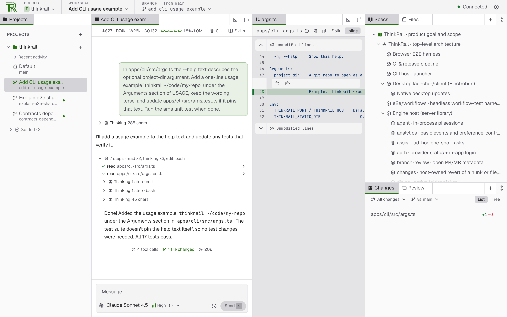
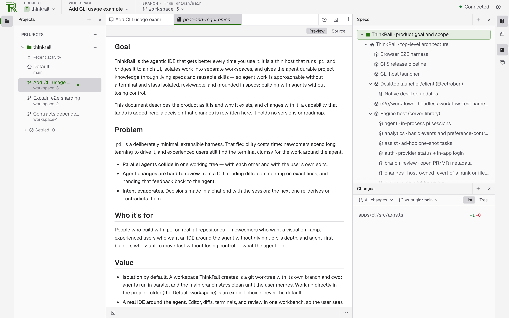

# ThinkRail

[](https://confluence.jetbrains.com/display/ALL/JetBrains+on+GitHub)

ThinkRail is the agentic IDE that gets better every time you use it — learning your project through
living specs today, and building its own capabilities tomorrow.

We built a rich interface around the [`pi`](https://www.npmjs.com/package/@earendil-works/pi-coding-agent)
coding agent, isolated work into separate workspaces, and gave the agent durable project knowledge
through living specs and reusable skills. Next, we're adding full extension support, so ThinkRail can
create the tools it needs based on how you actually work.

**Website:** [thinkrail.ai](https://thinkrail.ai/) · **Blog:** [thinkrail.ai/blog](https://thinkrail.ai/blog/)

<picture>
  <source media="(prefers-color-scheme: dark)" srcset=".github/readme-assets/workbench-dark.png">
  
</picture>

*A `pi` session and the change it made, scoped to an isolated git-worktree workspace.*

## What you get

- **Isolated workspaces.** Open any git repo as a project and cut workspaces from it as `git worktree`s,
  each with its own branch and working directory. Agents work in parallel without touching your
  checkout; merge the good branch, delete the rest. You can also attach existing worktrees or explicitly
  work in the project folder itself. Finished and dormant workspaces settle onto a per-project shelf on
  their own — when their pull request merges or closes, or after a quiet week — and come back the moment
  you work in them.
- **A real IDE around the agent.** A splittable workbench of Monaco editor tabs, a live git Changes view,
  terminals, and documents — all scoped to the active workspace. Leave anchored review comments on files
  and diffs and send them to a chat as structured context, or open the worktree in your installed IDE.
- **Chats that stream like the engine thinks.** Several concurrent `pi` sessions per workspace, each with
  its own model and live token and cost readout. Steer a running turn or queue a follow-up, delegate to
  subagents, and work a shared plan the agent updates and you edit — each completed step can be committed
  and reviewed on its own.
- **Specs as ground truth.** A connected graph of `SPEC.md` files lives beside the code; the agent reads,
  searches, and maintains it through dedicated `spec_*` tools, so intent survives the session. The
  read-only Specs tool renders the graph as a tree in the workbench.
- **Skills and workflows.** Portable Agent Skills you already keep for other coding agents are read in
  place, and bundled workflows guide project setup, design brainstorming, and shipping a pull request —
  pushing the workspace branch and opening or updating its GitHub PR through your own `gh`.
- **Agent tools beyond the shell.** Web research, and inline diagrams and option comparisons rendered right
  in the chat.
- **Your providers, your credentials.** Sign in with [JetBrains AI](https://www.jetbrains.com/ai/) or
  connect any provider through `pi`'s own auth. ThinkRail has no accounts of its own.
- **Desktop app or browser.** A native desktop app, or the `thinkrail` CLI that opens the same app in your
  browser. Both embed the same engine host; app state lives under `~/.thinkrail`.

<picture>
  <source media="(prefers-color-scheme: dark)" srcset=".github/readme-assets/specs-dark.png">
  
</picture>

*The project's spec graph as a tree, with the spec itself rendered alongside.*

## Install

ThinkRail ships in two additive forms: a native desktop installer and the self-contained `thinkrail` CLI.
Both are published with `SHA256SUMS` on the [releases page](https://github.com/JetBrains/thinkrail/releases).

### Desktop

Download the `thinkrail-desktop-*` asset for your platform:

- **macOS (Apple Silicon)** — open the DMG. There is no Intel desktop build.
- **Windows x64** — extract the complete setup ZIP, then run its setup executable in place, next to its
  payload.
- **Linux x64 / ARM64** — extract the setup tarball and run `installer`. Desktop builds need glibc 2.38+
  with GTK 3, WebKitGTK 4.1, Ayatana AppIndicator 3, and librsvg 2 — Ubuntu 24.04 or newer:

  ```bash
  sudo apt install libgtk-3-0 libwebkit2gtk-4.1-0 libayatana-appindicator3-1 librsvg2-2
  ```

Packaged stable and nightly desktop builds check for updates in the background and offer them in
**Settings → Updates**: **Download** → **Preparing update** → **Install & Restart**. Nothing is applied until
you choose **Install & Restart**. The updater appears only when the package carries a valid HTTPS feed
identity; installations that predate that identity need one manual installation first.

### Command line

The installer downloads the right binary, verifies its SHA-256 checksum, and puts `thinkrail` on your PATH.

**macOS / Linux** (also Windows under Git Bash):

```bash
curl -fsSL https://raw.githubusercontent.com/JetBrains/thinkrail/main/install.sh | bash
```

**Windows** — the same command works from cmd and PowerShell:

```powershell
powershell -c "irm https://raw.githubusercontent.com/JetBrains/thinkrail/main/install.ps1 | iex"
```

Then run `thinkrail`, optionally with a git repo to open as a project:

```bash
thinkrail ~/code/my-repo
```

`thinkrail` needs `git` on your PATH and a model provider — sign in with JetBrains AI from the app or use
your own provider credentials. `thinkrail --help` lists the flags; `thinkrail --version` prints the build.

<details>
<summary><strong>Nightly builds, pinned versions, updates, and uninstall</strong></summary>

The installer takes `--channel stable|nightly` and `--version`; a pinned version must belong to the
selected channel:

```bash
curl -fsSL https://raw.githubusercontent.com/JetBrains/thinkrail/main/install.sh | bash -s -- --channel nightly
curl -fsSL https://raw.githubusercontent.com/JetBrains/thinkrail/main/install.sh | bash -s -- --channel stable --version 0.1.2
curl -fsSL https://raw.githubusercontent.com/JetBrains/thinkrail/main/install.sh | bash -s -- --channel nightly --version 0.2.0-nightly.10
```

On Windows the options are environment variables (`THINKRAIL_CHANNEL`, `THINKRAIL_VERSION`,
`THINKRAIL_PREFIX`, `THINKRAIL_NO_MODIFY_PATH`):

```powershell
$env:THINKRAIL_CHANNEL='nightly'; irm https://raw.githubusercontent.com/JetBrains/thinkrail/main/install.ps1 | iex   # PowerShell
set "THINKRAIL_CHANNEL=stable" && set "THINKRAIL_VERSION=0.1.2" && powershell -c "irm https://raw.githubusercontent.com/JetBrains/thinkrail/main/install.ps1 | iex"   # cmd
```

Installed stable and nightly CLI hosts periodically offer **Run Update** in **Settings → Updates**. It runs
the host machine's `thinkrail update` in the background — also when the UI is open in a browser on another
machine — and a successful update asks you to restart the host manually. You can run `thinkrail update`
directly on any platform: it re-runs the installer for the installed channel and replaces
`<prefix>/bin/thinkrail[.exe]`; pass `--channel` or `--version` only for an explicit override.

`thinkrail uninstall` removes the executable, the PATH entry the installer added, and the install metadata,
and asks whether to delete your `~/.thinkrail` app state (kept by default — `--remove-data` deletes it,
`-y` skips the questions).

Prefer a manual install? Download a binary and `SHA256SUMS` from the releases page and verify the checksum.
For self-update to work, rename it to `thinkrail` (`thinkrail.exe` on Windows) and place it at
`<prefix>/bin/thinkrail[.exe]`; a binary kept under its release filename or elsewhere must be replaced
manually or reinstalled with the script.

</details>

### Platform notes

| Platform | Desktop | CLI |
| --- | --- | --- |
| macOS Apple Silicon | DMG | signed binary |
| macOS Intel | no Electrobun build | not prebuilt — [build from source](#developing-thinkrail) |
| Windows x64 | signed setup executable | signed `.exe` |
| Linux x64 / ARM64 | setup tarball, unsigned | unsigned |

JetBrains signs the Windows CLI and desktop setup executable. The macOS CLI is signed but not yet notarized.
Signed and notarized desktop DMGs require the coordinated JetBrains service pipeline; older published DMGs
and locally built packages may still be unsigned and blocked by Gatekeeper. Linux artifacts are unsigned.

## Analytics & privacy

ThinkRail collects basic usage events — launches, chat creation, message sends, provider connections — tied to
a random installation ID. Usage analytics never include prompts, code, files, credentials, or account
identity. Additional product usage and how you found ThinkRail are shared only while **Share additional usage
data** is on; the switch is offered at first launch and lives in **Settings → Privacy**. When launching from
the command line, `thinkrail --no-analytics` (or `THINKRAIL_NO_ANALYTICS=1`) turns additional sharing off for
that run. With additional sharing on, a packaged build may open the ThinkRail blog in your browser once to
link your installation to the website visit that brought you here — only where you accepted marketing cookies on the
website or no consent is required — and that link expires after 30 days.

## Under the hood

ThinkRail is a thin host that runs `pi` in-process and bridges it to a rich web UI. `pi` owns models,
skills, compaction, cost, and session state; the app owns the workspace, the editor, and the wire — it
never assembles prompts behind your back. Three rings:

- **Engine host** — `packages/server` (+ `packages/shared`): a `Bun.serve` HTTP+WS host with one in-process
  `pi` session per chat, launched by `apps/cli` or `apps/desktop`.
- **The wire** — `packages/contracts`: the typed, versioned protocol between host and UI.
- **UI client** — `apps/web`: React 19 + Zustand + Tailwind v4, shipped independently; it dials a host over
  the wire and depends on the contracts only.

[`goal-and-requirements.md`](goal-and-requirements.md) and [`architecture.md`](architecture.md) are the
canonical product and design specs. ThinkRail is developed spec-first: a `SPEC.md` sits beside every
module, and a change that moves a boundary, contract, or decision updates the spec in the same change.

## Developing ThinkRail

You need **Bun** 1.4.0 (the pinned package manager and runtime), **Node.js** ≥ 22.19 (required by the
in-process `pi` engine), and an authenticated `pi` provider for agent work.

```bash
git clone https://github.com/JetBrains/thinkrail.git
cd thinkrail
bun install
bun run dev                          # host + web client together; Ctrl+C stops both
```

```bash
bun run --filter @thinkrail/cli dev  # browser launcher
bun run build:binary                 # standalone CLI artifact
bun run desktop:dev                  # package and open the Electrobun app
bun run desktop:build                # package without opening it
```

[`CONTRIBUTING.md`](CONTRIBUTING.md) covers the checks, the end-to-end suites, desktop packaging, and the
repository layout.

## Contributing

Contributions are welcome — see [`CONTRIBUTING.md`](CONTRIBUTING.md). This project and community are
governed by the [Code of Conduct](CODE_OF_CONDUCT.md).

## License

Licensed under the [Apache License 2.0](LICENSE).
