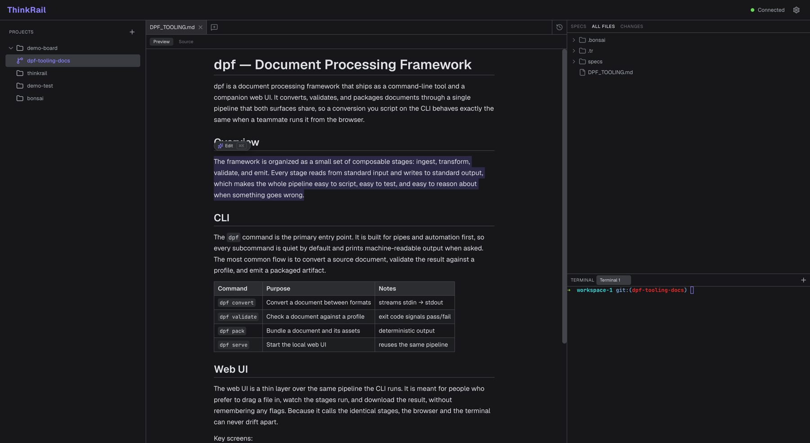
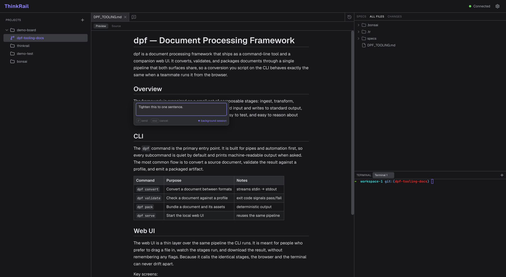
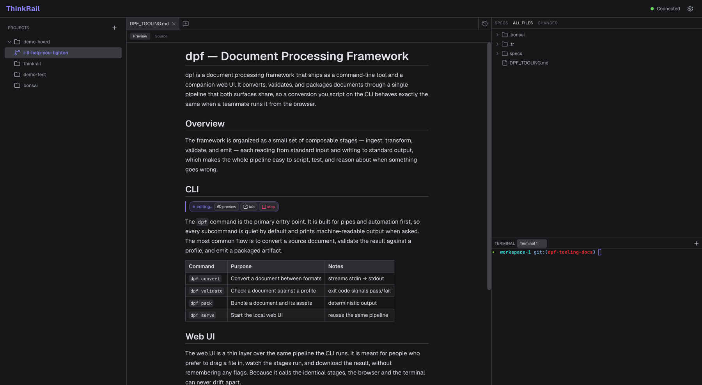
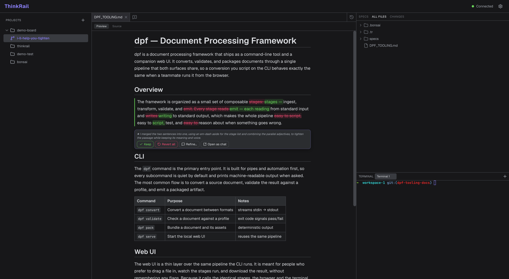
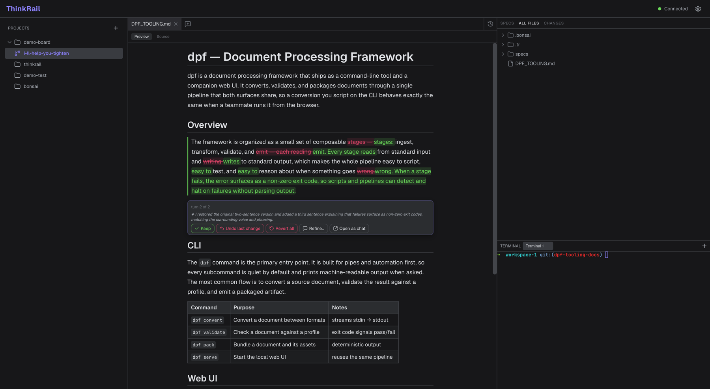
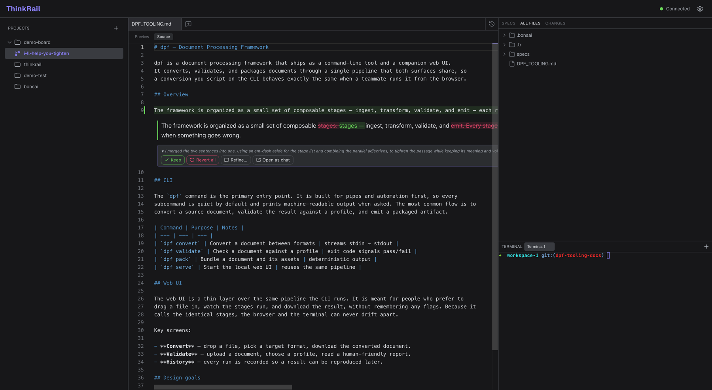
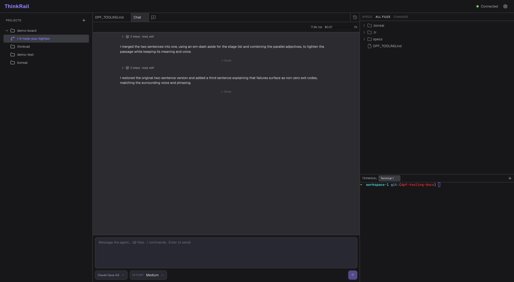
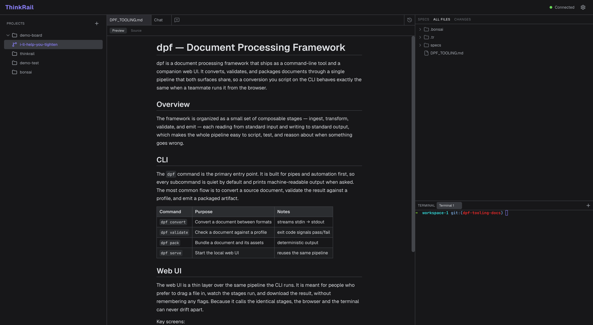
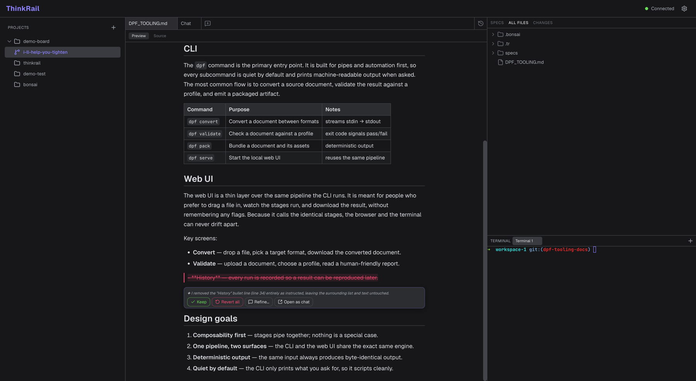

# Inline AI-editing v0 — user walkthrough

This document walks every user scenario for **inline AI-editing** and shows each step with a screenshot
captured from the running web UI. Screenshots use a sample doc for a fictional **dpf — Document Processing
Framework** (a CLI + companion web UI) so the edits read naturally.

Inline AI-editing lets you **select text in an open file, tell the agent what to change, and review the
result in place** — the change is woven into the document with a colored left bar marking the region, and a
small action box (Keep / Undo-last / Revert-all / Refine / Open-as-chat) sits directly below it. The edit
runs in a **hidden per-edit `pi` session** that never shows in the tab strip unless you promote it. Both the
rendered-markdown view and the Monaco source view are supported, with matching behavior.

> Marker colors: **green** left bar = the reviewed region adds/rewrites content · **red** = a pure deletion
> · **violet** = the region the agent is currently running on.

---

## 1. Trigger — select text → the Edit pill

Select any text in the rendered markdown (or Monaco source). A floating **✦ Edit ⌘K** pill appears at the
selection.

## 2. Instruct — the one-line popup

Click the pill (or press ⌘K) to open a one-line instruction popup. Type what you want changed and press
**Enter** to fire (Esc cancels). The footer notes the edit runs as a **background session**.

## 3. Working — violet bar + status chip

The hidden session starts. The region the agent is working on gets a **violet left bar** and an **editing…**
chip with `👁 preview` (a read-only live transcript), `⧉ tab` (promote to a chat tab), and `■ stop`.

## 4. Review (rendered) — woven diff + green bar + action box

When the turn ends the change is shown **in place**: old text struck through, new text highlighted
(word-level), with a **green left bar** marking the reviewed region. Directly below sits the action box with
the agent's one-line "why" and the quick actions.

## 5. Refine — a follow-up turn

**Refine…** opens the same one-line popup and runs another turn on the *same* session. The review gains a
**"turn N of M"** indicator and an **Undo last change** action. (Here the refine expanded the sentence back
out and added a third sentence about non-zero exit codes.)

## 6. Undo last change — step back one turn

**Undo last change** restores the snapshot from the start of the current turn and pops it, returning to the
review of the previous turn. With a single turn left, the "turn N of M" indicator and Undo action disappear.

## 7. Monaco source view — same review, natively

Switching to **Source** shows the same review as a native Monaco decoration: the changed buffer line gets a
**green gutter bar + subtle green wash**, and a view zone below holds the woven diff + action box. The review
survives the Preview↔Source toggle (this shot was taken right after toggling).

## 8. Open as chat — promote the hidden session

**Open as chat** promotes the hidden per-edit session into a normal chat tab with its full transcript intact
(every turn, its tool calls, and the cost meter) — useful when a quick edit turns into a longer conversation.

## 9. Keep — accept the change

**Keep** resolves the review; the file already holds the edited text, and the review UI clears.

## 10. Deletion — the red bar

When a turn's replacement text is empty (a pure deletion), the reviewed region shows the removed text struck
through with a **red left bar**. **Revert all** restores the fire-time original.

---

## Scenarios shown in text (harder to screenshot)

- **One pending edit per file.** While a request is pending on a file (working *or* review), selecting text
  in that same file does not offer a new Edit pill, and the fire path itself refuses a second request —
  covered by `apps/web/src/inline-edit/actions.test.ts`. Parallel edits on *different* files are allowed;
  each runs its own hidden session and review.
- **Other files touched in a turn.** If the agent edits files other than the target, the review shows an
  "▲ also touched N other files — view in Changes" notice linking to the git-diff panel. Note: **Undo/Revert
  only restore the target file** — other files are surfaced but not rolled back inline (resolve them via
  Changes). "Revert all" means *all turns for this file*, not all files.
- **Multiple edits to the same file in one turn.** All fold into the turn; the highlighted range and the
  snapshot-based revert always reflect the full change. (The woven diff currently renders the first hunk;
  the file on disk and revert remain exact — see the PR's "Known limitations".)
- **No-changes / error.** If the agent makes no change, the review shows an info card with the agent's reply
  (Dismiss / Refine). A terminal provider failure shows an error card (Retry / Dismiss / Open-as-chat).
- **Host restart (known v0 gap).** In-flight requests are not reset on reconnect; a `working` edit stays on
  the chip and **Stop** is the manual escape.

## How the review is anchored (both surfaces)

- **Rendered markdown:** a per-render rehype pass stamps blocks with source-line ranges; a line-diff of the
  turn's base vs the current content locates the changed block, and the woven diff + action box are spliced
  in place (never a floating card).
- **Monaco source:** a decorations collection highlights the changed buffer lines (wash + gutter bar) and a
  native view zone between the lines holds the woven diff + action box.

Both share the same word-diff renderer and the same colored-left-bar component, so the two surfaces stay in
lockstep.
