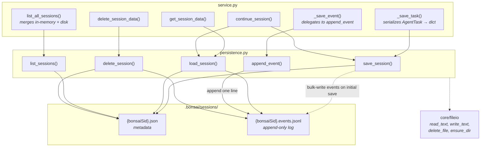

# Agent Persistence — Submodule Specification

> Parent: [Agent Module](README.md) | Status: **Active** | Created: 2026-03-03

## Purpose

Stateless session persistence — saves, loads, lists, and deletes agent session data under `.bonsai/sessions/`. Uses a split storage model: metadata in `.json` files, events in append-only `.events.jsonl` logs. Pure functions with no internal state. All functions take `project_root: Path` as first argument; the service layer owns serialization of domain models into the dict format that persistence writes to disk.

## Architecture

**Pattern:** Stateless CRUD — pure functions over split file storage (metadata + append-only event log).



## Storage Layout

```
{project_root}/
  .bonsai/
    sessions/
      {bonsaiSid}.json            ← metadata (small, rewritten on status change)
      {bonsaiSid}.events.jsonl    ← append-only event log (one JSON per line)
```

### Metadata file (`{bonsaiSid}.json`)

```json
{
  "bonsaiSid": "uuid",
  "name": "session name",
  "skillId": "module-design",
  "specIds": ["spec-1", "spec-2"],
  "config": { "model": "claude-sonnet-4-6", "maxTurns": 25 },
  "status": "done",
  "sessionId": "sdk-session-id",
  "createdAt": "2026-03-03T...",
  "updatedAt": "2026-03-03T...",
  "metrics": {}
}
```

### Events log (`{bonsaiSid}.events.jsonl`)

```
{"eventType":"sessionStart","payload":{...}}
{"eventType":"textDelta","payload":{"text":"Hello..."}}
{"eventType":"toolCallStart","payload":{"toolName":"Read",...}}
{"eventType":"toolCallEnd","payload":{"output":"..."}}
{"eventType":"turnComplete","payload":{...}}
```

Each line is a self-contained JSON object. New events are appended with a single `file.write()` — no read-modify-write cycle.

## Public Interface

### `save_session`

```python
def save_session(project_root: Path, data: dict[str, Any]) -> None
```

Write session metadata to `.bonsai/sessions/{bonsaiSid}.json`. If `data` contains an `"events"` key, those events are bulk-written to the `.events.jsonl` file (used during initial save). The events key is stripped from the metadata file. Silently returns if `data["bonsaiSid"]` is missing or empty. For backward compatibility, accepts `"taskId"` as a fallback key and migrates it to `"bonsaiSid"`.

### `load_session`

```python
def load_session(project_root: Path, bonsai_sid: str) -> dict[str, Any] | None
```

Load a session from disk — reads metadata from `.json` and events from `.events.jsonl`, combining them into a single dict with an `"events"` key. Returns `None` if the metadata file does not exist. For backward compatibility, migrates old `"taskId"` keys to `"bonsaiSid"` on read.

### `list_sessions`

```python
def list_sessions(project_root: Path) -> list[dict[str, Any]]
```

List all sessions from disk, sorted by modification time (newest first). Returns **metadata only** — events are not loaded. Each entry contains:

| Field | Type | Description |
|-------|------|-------------|
| `bonsaiSid` | `str` | Session identifier |
| `name` | `str` | Display name |
| `skillId` | `str \| None` | Skill used (if any) |
| `specIds` | `list[str]` | Spec IDs loaded as context |
| `status` | `str` | Last known status |
| `model` | `str` | Model name from config |
| `createdAt` | `str` | ISO timestamp |
| `updatedAt` | `str` | ISO timestamp |
| `metrics` | `dict` | Cost/usage metrics |

### `append_event`

```python
def append_event(project_root: Path, bonsai_sid: str, event: dict[str, Any]) -> None
```

Append a single event to the session's `.events.jsonl` log. **O(1) operation** — opens the file in append mode and writes one JSON line. Does not read or rewrite existing data.

### `delete_session`

```python
def delete_session(project_root: Path, bonsai_sid: str) -> bool
```

Delete a session from disk — removes both the `.json` metadata file and the `.events.jsonl` log. Returns `True` if any file was deleted, `False` if neither existed.

> **Note:** In practice, `service.py` always uses `trash_service.trash_session()` (soft-delete to `.bonsai/trash/sessions/`) instead of calling this function directly. This hard-delete function remains as a fallback for cases where no `trash_service` is injected.

## File Organization

| File | Responsibility | Depends On |
|------|---------------|------------|
| `persistence.py` | All five CRUD functions above | core/fileio |

Single-file submodule. No classes — pure functions with private helpers (`_sessions_dir`, `_meta_path`, `_events_path`).

## Design Decisions

| Decision | Choice | Rationale |
|----------|--------|-----------|
| Split metadata + events | `.json` for metadata, `.events.jsonl` for events | Metadata is small and rarely changes. Events are frequent and append-only. Split avoids O(n) rewrites on every event. |
| Append-only event log | JSON Lines format (`.jsonl`) | O(1) append via `file.open("a")`. Each line is self-contained JSON. No read-modify-write cycle. Standard format with good tooling support. |
| Pure functions, not a class | All functions take `project_root` as first arg | No state to manage. Easier to test and doesn't need lifecycle management. `project_root` is passed from service. |
| Metadata-only listing | `list_sessions` reads only `.json` files | Avoids loading potentially large event logs just to display a session list. |
| Serialization lives in service | `_save_task` in service.py converts `AgentTask → dict` | Keeps persistence decoupled from Pydantic models. persistence.py only knows about dicts and paths. |
| Silent failure on save | Exceptions logged but swallowed | Session persistence is best-effort. A write failure should not crash a running agent session. |
| Flat file structure | Two files per session in a single directory | Simple to implement, list, and debug. No database dependency. Sufficient for expected session counts (tens to low hundreds). |

## Known Limitations

- **No atomic writes** — concurrent writes to the same session metadata file could corrupt data. No file locking is used. In practice, only one service instance writes at a time.

## Related Specs

- **Parent:** [Agent Module](README.md)
- **Depends on:** [Core FileIO](../core/README.md) (for `read_text`, `write_text`, `delete_file`, `ensure_dir`)
- **Used by:** `service.py` (calls all five functions for session lifecycle and event persistence)
