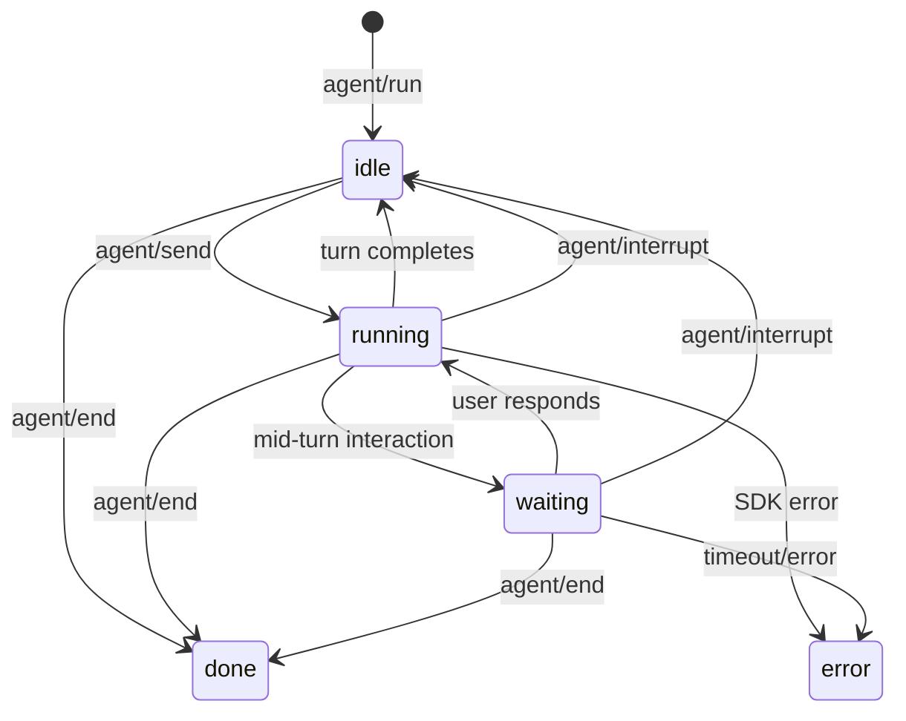
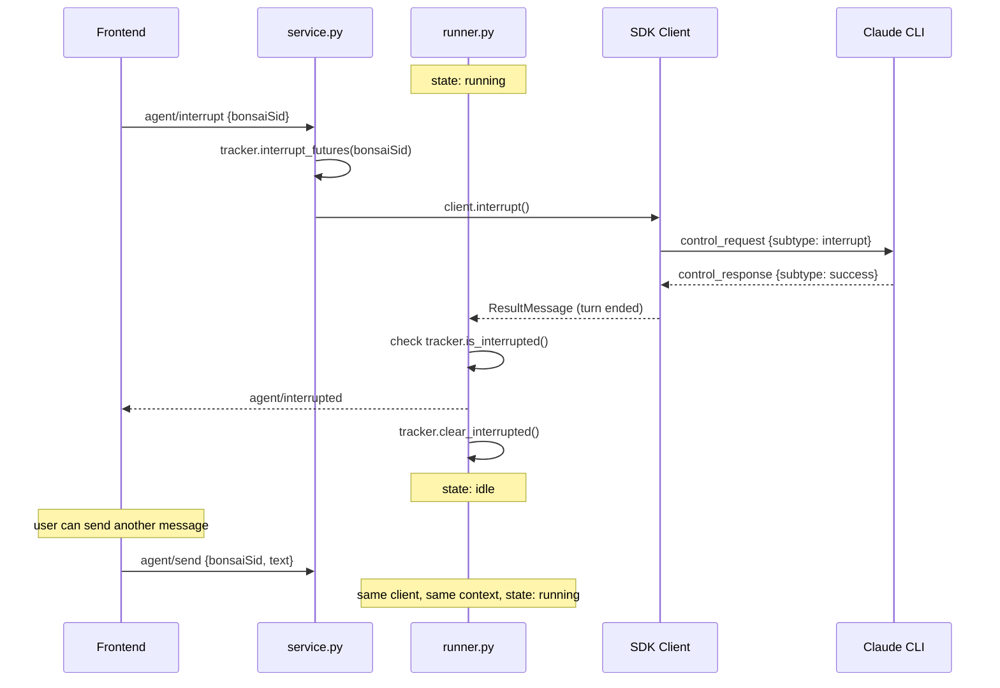
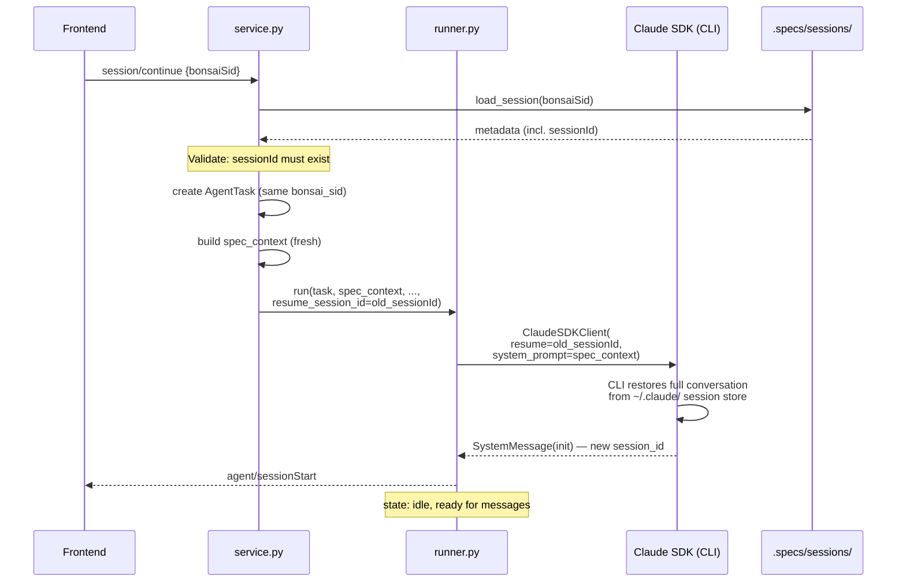
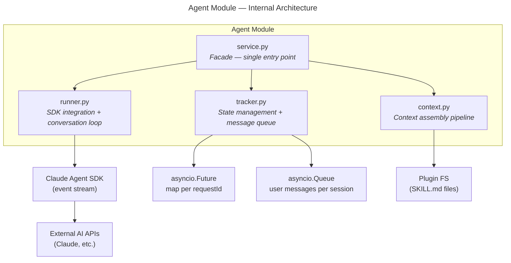

# Agent Module — Design Specification

> Parent: [DESIGN_DOC.md](../../../DESIGN_DOC.md) | Status: **Active** | Created: 2026-02-25 | Updated: 2026-03-08

## Table of Contents
1. [Purpose](#purpose)
2. [Session Lifecycle](#session-lifecycle)
3. [Session Continuation (Resume)](#session-continuation-resume)
4. [Internal Architecture](#internal-architecture)
5. [File Organization](#file-organization)
6. [Public Interface](#public-interface)
7. [Context Assembly](#context-assembly)
8. [Plugin Wiring](#plugin-wiring)
9. [TODO](#todo)
10. [Design Decisions](#design-decisions)
11. [Dependencies](#dependencies)
12. [Known Limitations](#known-limitations)
13. [Related Specs](#related-specs)

## Purpose

The Agent module orchestrates persistent conversational AI agent sessions. It manages the full lifecycle — creating SDK clients, multi-turn messaging, streaming events, mid-turn interactions (questions, tool approvals), interruption, and **session continuation via the SDK's native resume** (`--resume <sessionId>`) which preserves full conversation context without lossy text replay.

Sessions are modeled after the Claude Code chat experience: the user starts a session with spec context, sends messages, receives streaming responses, and can continue the conversation across multiple turns until they explicitly end the session.

## Session Lifecycle

### States



| State | Description |
|-------|-------------|
| `idle` | Session open, waiting for user message (initial state) |
| `running` | SDK turn in progress (processing user message) |
| `waiting` | Suspended on a mid-turn interaction (question or tool approval) — runner awaits a Future |
| `done` | Session ended gracefully |
| `error` | Session ended due to error |

### Lifecycle Sequence

```mermaid
sequenceDiagram
    participant F as Frontend
    participant B as Backend (runner.py)
    participant S as Claude SDK

    F->>B: agent/run {specIds, config}
    B->>S: create SDK client
    S-->>B: SystemMessage(init)
    B-->>F: {bonsaiSid}
    Note over B: state: idle

    rect rgb(40, 40, 60)
        Note over F,S: Conversation loop (repeats)

        F->>B: agent/send {bonsaiSid, text}
        B->>S: query(text)
        Note over B: state: running
        S-->>B: streaming
        B-->>F: agent/textDelta
        S-->>B: ToolUseBlock
        B-->>F: agent/toolCallStart
        S-->>B: ToolResultBlock
        B-->>F: agent/toolCallEnd

        opt Mid-turn interactions (canUseTool)
            B->>F: agent/askUserQuestion
            Note over B: suspends on Future
            F->>B: agent/respond
            Note over B: Future resolved
            B->>F: agent/confirmAction
            Note over B: suspends on Future
            F->>B: agent/respond
            Note over B: Future resolved
        end

        S-->>B: ResultMessage
        B-->>F: agent/turnComplete
        Note over B: state: idle
    end

    F->>B: agent/end {bonsaiSid}
    B->>S: close SDK client
    B-->>F: agent/done
    Note over B: state: done
```



### Interrupt Flow

`agent/interrupt` cancels the current turn but keeps the session alive. The SDK client is **not destroyed** — `service.py` calls `client.interrupt()` which sends a control protocol message to the CLI subprocess, gracefully stopping the current generation while preserving full conversation context.

**Two states require different mechanisms:**

| Current state | What's blocked | Interrupt mechanism |
|---------------|----------------|---------------------|
| `running` | `client.receive_response()` streaming | `await client.interrupt()` → SDK sends `{"subtype": "interrupt"}` control request to CLI |
| `waiting` | `await future` in `can_use_tool` callback | `tracker.interrupt_futures()` resolves futures with `{"behavior": "deny", "interrupt": true}` → SDK stops turn |



**Key:** The runner stays alive in its conversation loop — no re-launch, no new client, no context rebuilt. After the interrupted `ResultMessage` is processed, the runner goes back to `await tracker.get_next_message()`, waiting for the next user message on the same SDK client.

## Session Continuation (Resume)

### Overview

When a session ends (done/error) or the backend restarts, the frontend can resume it via `session/continue`. This uses the Claude Code SDK's **native `--resume <sessionId>`** flag, which restores the full conversation context (all messages, tool calls, and results) without lossy reconstruction.

### Resume Flow



### Key Design Points

| Aspect | Design |
|--------|--------|
| **Session identity** | Same `bonsai_sid` is reused. The CLI may assign a new internal `session_id`. |
| **Context restoration** | Full conversation history restored natively by CLI — no text replay, no truncation. |
| **System prompt** | Fresh spec context is built from current specs/skills (passed via `system_prompt`). |
| **Event persistence** | New events from the resumed session append to the same `.events.jsonl` file. |
| **Metadata update** | Metadata `.json` is updated with new status and `sessionId`. |
| **Missing sessionId** | If the stored session has no `sessionId` (pre-resume era), `continue_session` raises a `ValueError`. |

### What Changed (vs. Previous Design)

| Before (text replay) | After (native resume) |
|-----------------------|-----------------------|
| Iterated over saved events, built truncated text summary | Passes `sessionId` to SDK `--resume` flag |
| Tool outputs truncated to 500 chars | Full tool outputs preserved by CLI |
| History injected as part of system prompt (extra input tokens) | CLI manages context window internally |
| New SDK session with no real history | CLI restores actual conversation state |
| Complex `context_parts` / `history_context` code | Simple: `resume_session_id=old_session_id` |

## Internal Architecture

**Pattern:** Service facade over three collaborators — `context.py` (prompt assembly), `runner.py` (SDK integration), and `tracker.py` (session lifecycle + pending request state).



## File Organization

| File | Responsibility | Depends On |
|------|---------------|------------|
| `models.py` | Pydantic models: AgentTask, AgentConfig, AgentEvent, AgentResult, Question, QuestionOption, AskUserQuestionResponse, ToolApprovalResponse | — |
| `context.py` | Context assembly pipeline: loads skill instructions, project metadata, and spec content; composes system prompt. See [CONTEXT.md](CONTEXT.md). | models, visualization, spec/service |
| `service.py` | Facade — start sessions, send messages, interrupt turns, end sessions, continue sessions (native resume), relay responses to pending futures | context, runner, tracker, core/config, spec/service |
| `visualization.py` | Bonsai visualization MCP tool: JSON schema (`VIZ_SCHEMA`), async handler, MCP server instance (`viz_mcp_server`), and system prompt instructions (`VIZ_INSTRUCTIONS`). Consumed by `runner.py` (wiring) and `context.py` (prompt assembly). | claude-agent-sdk |
| `runner.py` | Claude Agent SDK integration: manage SDK client lifecycle, conversation loop (wait for message -> query -> stream events -> repeat), map SDK events to notifications, register `canUseTool` / hooks, wire local plugin into SDK. Accepts optional `resume_session_id` to pass to `ClaudeAgentOptions.resume`. | models, tracker, visualization |
| `tracker.py` | Session lifecycle (pending/idle/running/done/error), message queue per session (`asyncio.Queue`), registry of in-flight `asyncio.Future` objects keyed by `requestId`, **interrupt flag** per session for notification routing | models |
| `persistence.py` | Session persistence — split storage: metadata in `.json`, events in append-only `.events.jsonl`. Save/load/list/append/delete. See [PERSISTENCE.md](PERSISTENCE.md). | core/fileio |

## Public Interface

### Service Layer (called by RPC methods)

**Class:** `AgentService(config: AppConfig, spec_service: SpecService)`

| Method | Signature | Description |
|--------|-----------|-------------|
| `rebind_notify` | `(notify: Callable) -> None` | Update the WebSocket callback for all running tasks. Called when a new WebSocket connects so in-flight runners stream to the fresh connection. |
| `run_task` | `(spec_ids: list[str], config: AgentConfig, notify: Callable, skill_id: str \| None = None, name: str = "") -> AgentTask` | Start a persistent agent session. Builds context from specs, skill, and project metadata via `context.build_context()`, then launches the background runner. Task is created in `idle` state and returned immediately. |
| `send_message` | `(bonsai_sid: str, text: str) -> None` | Send a user message to the session, triggering a new turn. Enqueues the message; runner picks it up and calls `client.query()`. |
| `interrupt_task` | `(bonsai_sid: str) -> None` | Cancel the current turn non-destructively. Calls `tracker.interrupt_futures()` to resolve pending futures with deny+interrupt, then calls `client.interrupt()` on the stored SDK client. The runner stays alive, the client is preserved, and the session returns to `idle` — ready for new messages with full context intact. |
| `end_session` | `(bonsai_sid: str) -> None` | Gracefully close the session and SDK client. Session enters `done` state. |
| `update_config` | `(bonsai_sid: str, model: str \| None = None, permission_mode: str \| None = None) -> dict` | Update model and/or permission mode on a live session via the SDK client. |
| `get_task` | `(bonsai_sid: str) -> AgentTask` | Get current session status and metadata |
| `list_tasks` | `() -> list[AgentTask]` | List all sessions (idle, running, done, error) |
| `respond` | `(bonsai_sid: str, request_id: str, response: dict) -> None` | Resolve a pending `asyncio.Future` with the client's answer (for mid-turn interactions) |
| `list_all_sessions` | `() -> list[dict]` | List all sessions: in-memory active + on-disk archived (metadata only) |
| `get_session_data` | `(bonsai_sid: str) -> dict \| None` | Get full session data including events from disk |
| `continue_session` | `async (bonsai_sid: str, notify: Callable) -> AgentTask` | **Resume a session using SDK native `--resume`.** Loads stored `sessionId` from disk, validates it exists, builds fresh spec context, then launches `_run_background` with `resume_session_id=old_session_id`. Raises `ValueError` if session not found or has no stored `sessionId`. |
| `delete_session_data` | `(bonsai_sid: str) -> bool` | Delete a session file from disk |

### Runner Interface

**Function:** `run(task, spec_context, notify, tracker, cwd, plugin_dir, resume_session_id)`

| Parameter | Type | Description |
|-----------|------|-------------|
| `task` | `AgentTask` | Session record |
| `spec_context` | `str` | Assembled system prompt |
| `notify` | `Callable` | WebSocket push callback |
| `tracker` | `Tracker` | State + queue + futures manager |
| `cwd` | `Any \| None` | Working directory for SDK |
| `plugin_dir` | `Any \| None` | Plugin directory for SDK |
| `resume_session_id` | `str \| None` | **When set, passed to `ClaudeAgentOptions(resume=...)` to restore a previous CLI session.** Defaults to `None` (new session). |

### Models

All models with multi-word fields use a `camelCase` alias generator (`to_camel` in `models.py`). Python code uses `snake_case` field names; JSON wire format uses `camelCase` via `model_dump(by_alias=True)`.

#### Core Models

| Model | Fields (Python / JSON wire) | Description |
|-------|--------|-------------|
| `AgentTask` | bonsai_sid/`bonsaiSid`, status, spec_ids/`specIds`, skill_id/`skillId`?, config, session_id/`sessionId`?, created, updated | Session record. `status` is one of: `idle`, `running`, `done`, `error`. `skill_id` references the selected skill (if any). |
| `AgentConfig` | model, max_turns/`maxTurns`, permission_mode/`permissionMode`, stream_text/`streamText` | Run configuration |
| `AgentEvent` | bonsai_sid/`bonsaiSid`, session_id/`sessionId`, event_type/`eventType`, payload | Serializable event to send as notification |
| `AgentResult` | bonsai_sid/`bonsaiSid`, session_id/`sessionId`, result, cost_usd/`costUsd`, turns, duration_ms/`durationMs`, usage | Turn result (sent with `turnComplete`) or final session result (sent with `done`) |

#### Interactive Request/Response Models

These types define the data exchanged during mid-turn interactions. Both `AskUserQuestion` and tool approvals flow through the SDK's `canUseTool` callback — our `runner.py` translates them into JSON-RPC requests/responses for the frontend.

**Question types** (sent to frontend in `agent/askUserQuestion` params):

| Model | Fields | Description |
|-------|--------|-------------|
| `Question` | question: str, header: str, options: list[QuestionOption], multi_select/`multiSelect`: bool | A single question with selectable options. 1-4 questions per request, 2-4 options per question. |
| `QuestionOption` | label: str, description: str | A selectable option within a question |

**Response types** (received from frontend via `agent/respond`):

| Model | Fields | Description |
|-------|--------|-------------|
| `AskUserQuestionResponse` | questions: list[Question], answers: dict[str, str] | Response to a question request. `questions` passes through the original questions. `answers` maps question text -> selected label. Multi-select joins labels with `", "`. Free-text "Other" input uses the user's text directly. |
| `ToolApprovalResponse` | behavior: `"allow"` \| `"deny"`, message?: str, interrupt?: bool | Response to a tool approval request. `message` is the denial reason. `interrupt=true` aborts the entire task. |

**SDK mapping:**

The SDK uses a single `canUseTool` callback for both questions and tool approvals. `runner.py` distinguishes them by `tool_name`:

| `tool_name` in `canUseTool` | Bonsai protocol method | Frontend response -> SDK return |
|------------------------------|------------------------|-------------------------------|
| `"AskUserQuestion"` | `agent/askUserQuestion` | `AskUserQuestionResponse` -> `PermissionResultAllow(updated_input={"questions": [...], "answers": {...}})` |
| `"SuggestSession"` | `agent/suggestSession` | Approve `{"behavior":"allow"}` -> `PermissionResultAllow(updated_input={...input, "approved": true})`. Dismiss `{"behavior":"deny"}` -> `PermissionResultAllow(updated_input={...input, "dismissed": true})`. Never returns `PermissionResultDeny`. See [SuggestSession Backend Spec](tools/SUGGEST_SESSION.md). |
| Any other tool | `agent/confirmAction` | `ToolApprovalResponse` -> `PermissionResultAllow()` or `PermissionResultDeny(message=..., interrupt=...)` |

### Event Types (AgentEvent.event_type)

These map 1-to-1 to the `agent/*` notification methods in the protocol:

| event_type | Triggered by | Protocol method | Status |
|------------|-------------|-----------------|--------|
| `session_start` | `SDKSystemMessage` subtype `init` | `agent/sessionStart` | Implemented |
| `text_delta` | `SDKAssistantMessage` text block / `SDKPartialAssistantMessage` text_delta | `agent/textDelta` | Partial — full blocks only; streaming partial messages TODO |
| `tool_call_start` | `SDKAssistantMessage` tool_use block | `agent/toolCallStart` | Implemented |
| `tool_call_end` | `SDKUserMessage` tool_result block | `agent/toolCallEnd` | Implemented |
| `turn_complete` | `SDKResultMessage` (non-terminal, session stays open) | `agent/turnComplete` | Implemented |
| `interrupted` | `agent/interrupt` cancels current turn | `agent/interrupted` | Implemented |
| `subagent_start` | `SubagentStart` hook | `agent/subagentStart` | TODO |
| `subagent_end` | `SubagentStop` hook | `agent/subagentEnd` | TODO |
| `notification` | `Notification` hook | `agent/notification` | TODO |
| `compact` | `SDKCompactBoundaryMessage` | `agent/compact` | TODO |
| `progress` | Internal milestones | `agent/progress` | TODO |
| `done` | Session closed (via `agent/end` or session-level termination) | `agent/done` | Implemented |
| `error` | `SDKResultMessage` error subtypes / unhandled exception | `agent/error` | Implemented |
| `permission_denied` | `SDKResultMessage.permission_denials` | `agent/permissionDenied` | TODO |

### Interactive Request/Response Flow

For mid-turn interactions where the agent needs user input, `runner.py` suspends the SDK generator and the frontend must respond via `agent/respond`:

| Trigger | Server sends | Client responds with |
|---------|-------------|----------------------|
| `canUseTool` fires with `tool_name="AskUserQuestion"` | `agent/askUserQuestion` (JSON-RPC request with `id`); params: `{ bonsaiSid, questions }` | `agent/respond { bonsaiSid, requestId, response: AskUserQuestionResponse }` |
| `canUseTool` fires with `tool_name="SuggestSession"` | `agent/suggestSession` (JSON-RPC request with `id`); params: `{ bonsaiSid, skill, specIds, name, reason }` | `agent/respond { bonsaiSid, requestId, response: ToolApprovalResponse }` — approve: `{"behavior":"allow"}`, dismiss: `{"behavior":"deny"}` |
| `canUseTool` fires with any other `tool_name` | `agent/confirmAction` (JSON-RPC request with `id`); params: `{ bonsaiSid, toolName, toolInput }` | `agent/respond { bonsaiSid, requestId, response: ToolApprovalResponse }` |

**Suspension mechanism:**
1. Runner registers a new `asyncio.Future` in `tracker.py` keyed by `requestId`
2. Runner sends the JSON-RPC request to the frontend via the `notify` callback
3. Runner `await`s the Future
4. Frontend user responds -> RPC layer calls `service.respond(bonsai_sid, request_id, response)`
5. `tracker.py` resolves the Future; runner resumes and returns the response to the SDK

**Timeout:** If no response arrives within a configurable deadline, the Future is cancelled, the action is auto-denied, and an `agent/notification` event is sent to inform the frontend.

### Tracker — Interrupt Primitives

The tracker manages an **interrupt flag** per session, used to coordinate between `service.interrupt_task()` (which sets the flag) and `runner.py` (which checks and clears it when processing the resulting `ResultMessage`).

| Method | Signature | Description |
|--------|-----------|-------------|
| `set_interrupted` | `(bonsai_sid: str) -> None` | Set the interrupt flag for this session. Called by `service.interrupt_task()` before calling `client.interrupt()`. |
| `is_interrupted` | `(bonsai_sid: str) -> bool` | Check whether the interrupt flag is set. Called by runner when processing `ResultMessage` to decide between emitting `agent/interrupted` vs `agent/turnComplete`. |
| `clear_interrupted` | `(bonsai_sid: str) -> None` | Clear the interrupt flag after processing. Called by runner after emitting the `agent/interrupted` notification. |
| `interrupt_futures` | `(bonsai_sid: str) -> None` | Resolve all pending futures for this session with `{"behavior": "deny", "message": "Interrupted", "interrupt": true}`. Unlike `cancel_futures()` (which raises `CancelledError`), this produces a clean `PermissionResultDeny(interrupt=True)` that tells the SDK to stop the turn gracefully. |

**Why resolve instead of cancel?** Cancelling a future raises `CancelledError` which propagates unpredictably through the SDK's `can_use_tool` callback. Resolving with `deny + interrupt=True` uses the SDK's intended mechanism — `PermissionResultDeny(interrupt=True)` tells the SDK to end the turn cleanly and emit a `ResultMessage`.

### Conversation Loop (runner.py)

The runner maintains a persistent SDK client and loops over user messages:

```python
async with ClaudeSDKClient(options=options) as client:
    tracker.set_client(task.bonsai_sid, client)
    # Emit agent/sessionStart, enter idle state

    while True:
        message = await tracker.get_next_message(task.bonsai_sid)  # blocks until agent/send

        if message is END_SIGNAL:
            break  # agent/end was called

        await client.query(message)
        # state: running

        async for sdk_event in client.receive_response():
            # Map SDK events -> notifications (same as current)

            if isinstance(sdk_event, ResultMessage):
                if tracker.is_interrupted(task.bonsai_sid):
                    # Interrupt path — emit interrupted, not turnComplete
                    await notify("agent/interrupted", {...})
                    tracker.clear_interrupted(task.bonsai_sid)
                else:
                    await notify("agent/turnComplete", {...})
                tracker.set_status(task.bonsai_sid, "idle")
                break  # back to conversation loop, same client

    # Session closed -> emit agent/done
```

**Message delivery:** `tracker.py` maintains an `asyncio.Queue` per session. `service.send_message()` pushes to the queue; `runner.py` pulls from it. `service.end_session()` pushes a sentinel `END_SIGNAL` to break the loop.

**Interrupt handling:** When `service.interrupt_task()` calls `client.interrupt()`, the SDK sends a control request to the CLI and the `receive_response()` generator yields a final `ResultMessage`. The runner checks `tracker.is_interrupted()` to emit `agent/interrupted` instead of `agent/turnComplete`, then clears the flag and returns to idle — same client, same context, no re-launch.

## Context Assembly

Context assembly is handled by the `context.py` submodule. It builds the system prompt passed to the Claude Agent SDK by gathering content from three sources:

1. **Skill instructions** — loaded from `{plugin_dir}/skills/{skill_id}/SKILL.md` (if a skill is selected)
2. **Project metadata** — working directory path from `AppConfig`
3. **Specification content** — loaded by ID via `spec_service.get_spec()`

Sections are ordered Skill -> Project -> Specs, with framing prompts (markdown headers and introductory text) between sections to help the LLM distinguish context types.

**Full specification:** [CONTEXT.md](CONTEXT.md)

## Plugin Wiring

The Bonsai `claude-plugin/` is wired into the Claude Agent SDK client as a **local plugin** via `ClaudeAgentOptions.plugins`. This gives sessions native SDK-level support for plugin hooks, custom commands, and namespaced skill invocation — beyond what context assembly alone provides.

### How It Works

```
  context.py                          runner.py
  +--------------------+              +------------------------------+
  | Loads SKILL.md     |              | ClaudeAgentOptions(          |
  | into system        |              |   ...                        |
  | prompt text        |              |   plugins=[{                 |
  +--------------------+              |     "type": "local",         |
         |                            |     "path": plugin_dir       |
         |                            |   }]                         |
         v                            | )                            |
  System prompt has                   +------------------------------+
  skill instructions                         |
  (context assembly)                         v
                                      SDK loads plugin natively
                                      (hooks, commands, skills)
```

**Dual loading:** Skill instructions are loaded twice — once by `context.py` (into the system prompt as text) and once by the SDK (natively via the plugin manifest). This is intentional for now; the context assembly provides explicit framing, while the SDK plugin enables runtime features (hooks, commands). May be consolidated later.

### Runner Changes

`runner.run()` accepts an optional `plugin_dir: Path | None` parameter. When set and the path exists:

```python
plugins = []
if plugin_dir and plugin_dir.is_dir():
    plugins.append({"type": "local", "path": str(plugin_dir)})

options = ClaudeAgentOptions(
    ...
    plugins=plugins,
)
```

When `plugin_dir` is `None` or the directory doesn't exist, `plugins` is an empty list — the session works without a plugin, same as before.

### Service Changes

`service.py` passes `self._config.plugin_dir` through to `runner.run()`:

```python
await runner.run(
    task=task,
    spec_context=context,
    notify=notify,
    tracker=self._tracker,
    cwd=self._config.project_root,
    plugin_dir=self._config.plugin_dir,
)
```

## TODO

- **Add `streaming` field to `agent/textDelta`:** Set to `false` for `AssistantMessage` full blocks and `true` for `SDKPartialAssistantMessage` text deltas (once partial message handling is implemented).

## Design Decisions

| Decision | Choice | Rationale |
|----------|--------|-----------|
| Persistent session model | SDK client stays open across multiple turns; user sends messages via `agent/send` | Matches Claude Code chat experience; enables multi-turn conversation with accumulated context |
| **Native resume for continue** | `continue_session` passes stored `sessionId` to `ClaudeAgentOptions(resume=...)` | Full conversation context restored by CLI natively. Eliminates lossy text replay (old approach truncated tool outputs to 500 chars, lost structured data, cost extra input tokens). |
| **resume_session_id as runner param** | `runner.run()` accepts optional `resume_session_id: str \| None`; service decides when to pass it | Runner stays SDK-focused (just maps param to options). Service owns the "should we resume?" decision. Clean separation. |
| **No text replay fallback** | If stored session has no `sessionId`, raise `ValueError` instead of falling back to text replay | Simplicity. Text replay was lossy anyway. Old sessions without `sessionId` are rare and can be started fresh. |
| Message queue for user input | `asyncio.Queue` per session in `tracker.py` | Clean producer-consumer pattern; `agent/send` pushes, runner pulls. Decouples RPC layer from runner timing. |
| **Non-destructive interrupt** | `interrupt` calls `client.interrupt()` on the live SDK client; `end` pushes END_SIGNAL to close the session | Uses the SDK's built-in control protocol (`{"subtype": "interrupt"}`) to stop the current turn without destroying the client or conversation context. Previous approach (`bg.cancel()` + re-launch) was destructive — killed the runner, destroyed the SDK client, and lost all accumulated context. |
| **Interrupt flag on tracker** | Tracker holds a per-session interrupt flag; runner checks it on ResultMessage | Cleanly routes `ResultMessage` to either `agent/interrupted` or `agent/turnComplete` notification without race conditions. Service sets the flag before calling `client.interrupt()`; runner clears it after emitting the notification. |
| **Resolve futures, don't cancel** | `interrupt_futures()` resolves with `deny + interrupt=True` instead of `cancel()` | Cancelling a future raises `CancelledError` which propagates unpredictably. Resolving with `PermissionResultDeny(interrupt=True)` uses the SDK's intended mechanism to end the turn cleanly. |
| `turnComplete` vs `done` | `turnComplete` fires after each turn; `done` fires once when session closes | Clear separation between turn-level and session-level events; frontend can distinguish "ready for next message" from "conversation over" |
| SDK integration point | `runner.py` only | Single place to swap SDK versions or add a Python-side SDK wrapper; service and tracker are SDK-agnostic |
| Suspension pattern | `asyncio.Future` per `requestId` | Idiomatic async Python; futures can be awaited, cancelled, and inspected without threads |
| Streaming text | `includePartialMessages: true` in SDK config | Required to emit `text_delta` events for live typewriter view; can be toggled via `AgentConfig.stream_text` |
| Notify callback | Injected into runner at session start; supports both notifications (`request_id=None`) and server-initiated requests (`request_id` set) | Keeps the runner decoupled from WebSocket details; RPC layer owns the connection and callback creation |
| Agent file change tracking | Filesystem watcher (core/watcher), not tool call interception | Watcher is ground truth — catches all file changes regardless of source (agent, user, external). Same pipeline as user changes: watcher -> spec/service -> rpc/notifications. |
| Context assembly | Dedicated `context.py` submodule with pipeline: gather -> compose | Separates prompt construction from session orchestration. Pure function, easy to test. Supports specs, skills, and project metadata as distinct sources with framing prompts. |
| Plugin wiring | Pass `plugin_dir` to SDK via `plugins=[{"type": "local", "path": ...}]` | Enables native SDK features (hooks, commands, namespaced skills) beyond what system prompt text provides. Bonsai plugin only — no project-local plugin discovery. |
| Dual skill loading | Skills loaded both in context.py (prompt text) and via SDK plugin (native) | Context assembly provides explicit framing for the LLM. SDK plugin enables runtime hook/command support. Intentional duplication, may consolidate later. |
| Silent skip on missing plugin | Empty `plugins` list when `plugin_dir` is None or doesn't exist | Graceful degradation — sessions work without a plugin, matching current behavior. No error, no warning. |

## Dependencies

| Dependency | Usage |
|------------|-------|
| `core/config` | Project root, API key resolution |
| `spec/service` | Load spec content to build agent context |
| `claude-agent-sdk` (Python) | Agent execution, event stream, and native session resume (`ClaudeAgentOptions.resume`) |
| `asyncio` | Future-based suspension for interactive requests, Queue for message delivery |

## Known Limitations

- **CLI session expiry** — The Claude CLI may garbage-collect old sessions from `~/.claude/`. If the CLI session referenced by `sessionId` no longer exists, `--resume` will fail. `continue_session` should handle this gracefully (surface error to frontend).
- **System prompt changes not applied on resume** — When resuming, the CLI restores the original system prompt from the session. If specs or skills have changed since the session was created, the resumed session won't reflect those changes.
- **No cross-machine resume** — CLI sessions are stored locally in `~/.claude/`. Resuming only works on the same machine where the session was originally created.
- Single WebSocket connection assumed — if the client disconnects mid-session, pending futures will time out rather than being immediately cancelled
- Concurrent session limit is not yet defined; multiple simultaneous agent sessions are architecturally supported but resource limits are an open question

## Related Specs

- **Parent:** [Architecture Design](../../../DESIGN_DOC.md)
- **Submodules:** [Context Assembly](CONTEXT.md) — prompt construction pipeline, [Session Persistence](PERSISTENCE.md) — disk I/O for session data, [SuggestSession](tools/SUGGEST_SESSION.md) — proactive session suggestions, [UpdateProgress](tools/PROGRESS.md) — proactive progress updates
- **Depends on:** [Spec Module](../spec/README.md) (for loading spec context), [Core Config](../core/README.md) (for project root and plugin dir)
- **Related modules:** `rpc/methods/agents.py` (JSON-RPC interface to this module), `rpc/notifications.py` (WebSocket push)
