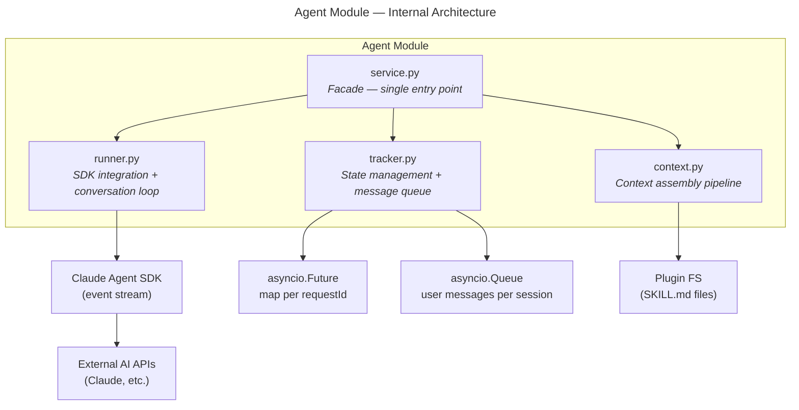

# Agent Module — Design Specification

> Parent: [DESIGN_DOC.md](../../../DESIGN_DOC.md) | Status: **Active** | Created: 2026-02-25 | Updated: 2026-03-03

## Table of Contents
1. [Purpose](#purpose)
2. [Session Lifecycle](#session-lifecycle)
3. [Internal Architecture](#internal-architecture)
4. [File Organization](#file-organization)
5. [Public Interface](#public-interface)
6. [Context Assembly](#context-assembly)
7. [TODO](#todo)
8. [Design Decisions](#design-decisions)
9. [Dependencies](#dependencies)
10. [Known Limitations](#known-limitations)
11. [Related Specs](#related-specs)

## Purpose

The Agent module orchestrates persistent conversational AI agent sessions. It manages the full lifecycle of a chat session — creating the SDK client, accepting user messages across multiple turns, streaming SDK events to the frontend as JSON-RPC notifications, handling interactive mid-turn flows (user questions, tool permission confirmations), and supporting interruption and graceful shutdown.

Sessions are modeled after the Claude Code chat experience: the user starts a session with spec context, sends messages, receives streaming responses, and can continue the conversation across multiple turns until they explicitly end the session.

## Session Lifecycle

### States

```
   agent/run creates task in idle

            idle ◀──────────────────────────────┐
              │                                    │
         agent/send                                │
              │                                    │
              ▼          turn completes            │
           running ──────────────────────▶ idle    │
              │                            │       │
              │       agent/interrupt      │       │
              ├───────────────────────────▶┘       │
              │                                    │
              ├──── agent/end ────────▶ done       │
              │                                    │
              ├──── SDK error ────────▶ error      │
              │                                    │
            idle ─── agent/end ───────▶ done       │
            idle ─── agent/send ──────▶ running ───┘
```

| State | Description |
|-------|-------------|
| `idle` | Session open, waiting for user message (initial state) |
| `running` | SDK turn in progress (processing user message) |
| `done` | Session ended gracefully |
| `error` | Session ended due to error |

### Lifecycle Sequence

```
Frontend                      Backend (runner.py)              Claude SDK
   │                               │                              │
   │── agent/run {specIds,config} ─▶│── create SDK client ────────▶│
   │◀── {taskId} ─────────────────│◀── SystemMessage(init) ──────│
   │                               │   state: idle                 │
   │                               │                               │
   │   ┌── Conversation loop (repeats) ───────────────────────┐   │
   │   │                                                       │   │
   │── agent/send {taskId, text} ──▶│── query(text) ──────────▶│   │
   │   │                            │   state: running          │   │
   │◀─ agent/textDelta ────────────│◀─ streaming ──────────────│   │
   │◀─ agent/toolCallStart ────────│◀─ ToolUseBlock ───────────│   │
   │◀─ agent/toolCallEnd ──────────│◀─ ToolResultBlock ────────│   │
   │   │                            │                           │   │
   │   │   Mid-turn interactions (canUseTool):                 │   │
   │   │   ◀─ agent/askUserQuestion ── (suspends on Future)    │   │
   │   │   ─▶ agent/respond ────────── (Future resolved)       │   │
   │   │   ◀─ agent/confirmAction ──── (suspends on Future)    │   │
   │   │   ─▶ agent/respond ────────── (Future resolved)       │   │
   │   │                                                       │   │
   │◀─ agent/turnComplete ─────────│◀─ ResultMessage ──────────│   │
   │   │                            │   state: idle             │   │
   │   │                                                       │   │
   │   └───────────────────────────────────────────────────────┘   │
   │                               │                               │
   │── agent/end {taskId} ─────────▶│── close SDK client ─────────▶│
   │◀─ agent/done ─────────────────│   state: done                 │
```

### Interrupt Flow

`agent/interrupt` cancels the current turn but keeps the session alive:

```
Frontend                      Backend
   │                               │
   │   (agent is running a turn)   │   state: running
   │── agent/interrupt {taskId} ──▶│
   │                               │── cancel SDK turn
   │◀─ agent/interrupted ─────────│   state: idle
   │                               │
   │   (user can send another message)
   │── agent/send {taskId, text} ──▶│   state: running
```

## Internal Architecture

**Pattern:** Service facade over three collaborators — `context.py` (prompt assembly), `runner.py` (SDK integration), and `tracker.py` (session lifecycle + pending request state).



## File Organization

| File | Responsibility | Depends On |
|------|---------------|------------|
| `models.py` | Pydantic models: AgentTask, AgentConfig, AgentEvent, AgentResult, Question, QuestionOption, AskUserQuestionResponse, ToolApprovalResponse | — |
| `context.py` | Context assembly pipeline: loads skill instructions, project metadata, and spec content; composes system prompt. See [CONTEXT.md](CONTEXT.md). | spec/service, core/config |
| `service.py` | Facade — start sessions, send messages, interrupt turns, end sessions, relay responses to pending futures | context, runner, tracker, core/config, spec/service |
| `runner.py` | Claude Agent SDK integration: manage SDK client lifecycle, conversation loop (wait for message → query → stream events → repeat), map SDK events to notifications, register `canUseTool` / hooks | models, tracker |
| `tracker.py` | Session lifecycle (pending/idle/running/done/error), message queue per session (`asyncio.Queue`), registry of in-flight `asyncio.Future` objects keyed by `requestId` | models |
| `persistence.py` | Session persistence to `.specs/sessions/{taskId}.json` — save/load/list/delete session data including events. Auto-saves on task creation, turn complete, done, and error. | core/fileio |

## Public Interface

### Service Layer (called by RPC methods)

**Class:** `AgentService(config: AppConfig, spec_service: SpecService)`

| Method | Signature | Description |
|--------|-----------|-------------|
| `run_task` | `(spec_ids: list[str], config: AgentConfig, notify: Callable, skill_id: str \| None = None) → AgentTask` | Start a persistent agent session. Builds context from specs, skill, and project metadata via `context.build_context()`, then launches the background runner. Task is created in `idle` state and returned immediately. `notify` is a callback for server→client messages, signature: `async def notify(method: str, params: dict, request_id: str \| None = None) -> None` — created by `rpc/notifications.make_notify` |
| `send_message` | `(task_id: str, text: str) → None` | Send a user message to the session, triggering a new turn. Enqueues the message; runner picks it up and calls `client.query()`. |
| `interrupt_task` | `(task_id: str) → None` | Cancel the current turn. Session stays `idle` and can accept new messages. |
| `end_session` | `(task_id: str) → None` | Gracefully close the session and SDK client. Session enters `done` state. |
| `get_task` | `(task_id: str) → AgentTask` | Get current session status and metadata |
| `list_tasks` | `() → list[AgentTask]` | List all sessions (idle, running, done, error) |
| `respond` | `(task_id: str, request_id: str, response: dict) → None` | Resolve a pending `asyncio.Future` with the client's answer (for mid-turn interactions) |
| `list_all_sessions` | `() → list[dict]` | List all sessions: in-memory active + on-disk archived (metadata only) |
| `get_session_data` | `(task_id: str) → dict \| None` | Get full session data including events from disk |
| `continue_session` | `async (task_id: str, notify: Callable) → AgentTask` | Continue a dead session — loads old conversation, replays as context for new SDK session |
| `delete_session_data` | `(task_id: str) → bool` | Delete a session file from disk |

### Models

All models with multi-word fields use a `camelCase` alias generator (`to_camel` in `models.py`). Python code uses `snake_case` field names; JSON wire format uses `camelCase` via `model_dump(by_alias=True)`.

#### Core Models

| Model | Fields (Python / JSON wire) | Description |
|-------|--------|-------------|
| `AgentTask` | id, status, spec_ids/`specIds`, config, session_id/`sessionId`?, created, updated | Session record. `status` is one of: `idle`, `running`, `done`, `error`. |
| `AgentConfig` | model, max_turns/`maxTurns`, permission_mode/`permissionMode`, stream_text/`streamText` | Run configuration |
| `AgentEvent` | task_id/`taskId`, session_id/`sessionId`, event_type/`eventType`, payload | Serializable event to send as notification |
| `AgentResult` | task_id/`taskId`, session_id/`sessionId`, result, cost_usd/`costUsd`, turns, duration_ms/`durationMs`, usage | Turn result (sent with `turnComplete`) or final session result (sent with `done`) |

#### Interactive Request/Response Models

These types define the data exchanged during mid-turn interactions. Both `AskUserQuestion` and tool approvals flow through the SDK's `canUseTool` callback — our `runner.py` translates them into JSON-RPC requests/responses for the frontend.

**Question types** (sent to frontend in `agent/askUserQuestion` params):

| Model | Fields | Description |
|-------|--------|-------------|
| `Question` | question: str, header: str, options: list[QuestionOption], multi_select/`multiSelect`: bool | A single question with selectable options. 1-4 questions per request, 2-4 options per question. |
| `QuestionOption` | label: str, description: str | A selectable option within a question |

**Response types** (received from frontend via `agent/respond`):

| Model | Fields | Description |
|-------|--------|-------------|
| `AskUserQuestionResponse` | questions: list[Question], answers: dict[str, str] | Response to a question request. `questions` passes through the original questions. `answers` maps question text → selected label. Multi-select joins labels with `", "`. Free-text "Other" input uses the user's text directly. |
| `ToolApprovalResponse` | behavior: `"allow"` \| `"deny"`, message?: str, interrupt?: bool | Response to a tool approval request. `message` is the denial reason. `interrupt=true` aborts the entire task. |

**SDK mapping:**

The SDK uses a single `canUseTool` callback for both questions and tool approvals. `runner.py` distinguishes them by `tool_name`:

| `tool_name` in `canUseTool` | Bonsai protocol method | Frontend response → SDK return |
|------------------------------|------------------------|-------------------------------|
| `"AskUserQuestion"` | `agent/askUserQuestion` | `AskUserQuestionResponse` → `PermissionResultAllow(updated_input={"questions": [...], "answers": {...}})` |
| Any other tool | `agent/confirmAction` | `ToolApprovalResponse` → `PermissionResultAllow()` or `PermissionResultDeny(message=..., interrupt=...)` |

### Event Types (AgentEvent.event_type)

These map 1-to-1 to the `agent/*` notification methods in the protocol:

| event_type | Triggered by | Protocol method | Status |
|------------|-------------|-----------------|--------|
| `session_start` | `SDKSystemMessage` subtype `init` | `agent/sessionStart` | Implemented |
| `text_delta` | `SDKAssistantMessage` text block / `SDKPartialAssistantMessage` text_delta | `agent/textDelta` | Partial — full blocks only; streaming partial messages TODO |
| `tool_call_start` | `SDKAssistantMessage` tool_use block | `agent/toolCallStart` | Implemented |
| `tool_call_end` | `SDKUserMessage` tool_result block | `agent/toolCallEnd` | Implemented |
| `turn_complete` | `SDKResultMessage` (non-terminal, session stays open) | `agent/turnComplete` | Implemented |
| `interrupted` | `agent/interrupt` cancels current turn | `agent/interrupted` | Implemented |
| `subagent_start` | `SubagentStart` hook | `agent/subagentStart` | TODO |
| `subagent_end` | `SubagentStop` hook | `agent/subagentEnd` | TODO |
| `notification` | `Notification` hook | `agent/notification` | TODO |
| `compact` | `SDKCompactBoundaryMessage` | `agent/compact` | TODO |
| `progress` | Internal milestones | `agent/progress` | TODO |
| `done` | Session closed (via `agent/end` or session-level termination) | `agent/done` | Implemented |
| `error` | `SDKResultMessage` error subtypes / unhandled exception | `agent/error` | Implemented |
| `permission_denied` | `SDKResultMessage.permission_denials` | `agent/permissionDenied` | TODO |

### Interactive Request/Response Flow

For mid-turn interactions where the agent needs user input, `runner.py` suspends the SDK generator and the frontend must respond via `agent/respond`:

| Trigger | Server sends | Client responds with |
|---------|-------------|----------------------|
| `canUseTool` fires with `tool_name="AskUserQuestion"` | `agent/askUserQuestion` (JSON-RPC request with `id`); params: `{ taskId, questions }` | `agent/respond { taskId, requestId, response: AskUserQuestionResponse }` |
| `canUseTool` fires with any other `tool_name` | `agent/confirmAction` (JSON-RPC request with `id`); params: `{ taskId, toolName, toolInput }` | `agent/respond { taskId, requestId, response: ToolApprovalResponse }` |

**Suspension mechanism:**
1. Runner registers a new `asyncio.Future` in `tracker.py` keyed by `requestId`
2. Runner sends the JSON-RPC request to the frontend via the `notify` callback
3. Runner `await`s the Future
4. Frontend user responds → RPC layer calls `service.respond(task_id, request_id, response)`
5. `tracker.py` resolves the Future; runner resumes and returns the response to the SDK

**Timeout:** If no response arrives within a configurable deadline, the Future is cancelled, the action is auto-denied, and an `agent/notification` event is sent to inform the frontend.

### Conversation Loop (runner.py)

The runner maintains a persistent SDK client and loops over user messages:

```python
async with ClaudeSDKClient(options=options) as client:
    # Emit agent/sessionStart, enter idle state

    while True:
        message = await tracker.get_next_message(task.id)  # blocks until agent/send

        if message is END_SIGNAL:
            break  # agent/end was called

        await client.query(message)
        # state: running

        async for sdk_event in client.receive_response():
            # Map SDK events → notifications (same as current)
            # On ResultMessage → emit agent/turnComplete, enter idle state

    # Session closed → emit agent/done
```

**Message delivery:** `tracker.py` maintains an `asyncio.Queue` per session. `service.send_message()` pushes to the queue; `runner.py` pulls from it. `service.end_session()` pushes a sentinel `END_SIGNAL` to break the loop.

## Context Assembly

Context assembly is handled by the `context.py` submodule. It builds the system prompt passed to the Claude Agent SDK by gathering content from three sources:

1. **Skill instructions** — loaded from `{plugin_dir}/skills/{skill_id}/SKILL.md` (if a skill is selected)
2. **Project metadata** — working directory path from `AppConfig`
3. **Specification content** — loaded by ID via `spec_service.get_spec()`

Sections are ordered Skill → Project → Specs, with framing prompts (markdown headers and introductory text) between sections to help the LLM distinguish context types.

**Full specification:** [CONTEXT.md](CONTEXT.md)

## TODO

- **Add `streaming` field to `agent/textDelta`:** Set to `false` for `AssistantMessage` full blocks and `true` for `SDKPartialAssistantMessage` text deltas (once partial message handling is implemented).

## Design Decisions

| Decision | Choice | Rationale |
|----------|--------|-----------|
| Persistent session model | SDK client stays open across multiple turns; user sends messages via `agent/send` | Matches Claude Code chat experience; enables multi-turn conversation with accumulated context |
| Message queue for user input | `asyncio.Queue` per session in `tracker.py` | Clean producer-consumer pattern; `agent/send` pushes, runner pulls. Decouples RPC layer from runner timing. |
| Interrupt vs End | `interrupt` cancels current turn (session stays idle); `end` closes the session | Mirrors Claude Code behavior — Escape stops the current response, but you can keep chatting |
| `turnComplete` vs `done` | `turnComplete` fires after each turn; `done` fires once when session closes | Clear separation between turn-level and session-level events; frontend can distinguish "ready for next message" from "conversation over" |
| SDK integration point | `runner.py` only | Single place to swap SDK versions or add a Python-side SDK wrapper; service and tracker are SDK-agnostic |
| Suspension pattern | `asyncio.Future` per `requestId` | Idiomatic async Python; futures can be awaited, cancelled, and inspected without threads |
| Streaming text | `includePartialMessages: true` in SDK config | Required to emit `text_delta` events for live typewriter view; can be toggled via `AgentConfig.stream_text` |
| Notify callback | Injected into runner at session start; supports both notifications (`request_id=None`) and server-initiated requests (`request_id` set) | Keeps the runner decoupled from WebSocket details; RPC layer owns the connection and callback creation |
| Agent file change tracking | Filesystem watcher (core/watcher), not tool call interception | Watcher is ground truth — catches all file changes regardless of source (agent, user, external). Same pipeline as user changes: watcher → spec/service → rpc/notifications. More reliable than intercepting agent tool calls, and adds no complexity to runner.py |
| Context assembly | Dedicated `context.py` submodule with pipeline: gather → compose | Separates prompt construction from session orchestration. Pure function, easy to test. Supports specs, skills, and project metadata as distinct sources with framing prompts. |

## Dependencies

| Dependency | Usage |
|------------|-------|
| `core/config` | Project root, API key resolution |
| `spec/service` | Load spec content to build agent context |
| `claude-agent-sdk` (Python) | Agent execution and event stream |
| `asyncio` | Future-based suspension for interactive requests, Queue for message delivery |

## Known Limitations

- Single WebSocket connection assumed — if the client disconnects mid-session, pending futures will time out rather than being immediately cancelled
- No persistent session storage — session list is in-memory only; restarts lose session history
- Concurrent session limit is not yet defined; multiple simultaneous agent sessions are architecturally supported but resource limits are an open question
- No session resume after disconnect — if the WebSocket drops, the session continues running but notifications are lost; reconnecting does not replay missed events

## Related Specs

- **Parent:** [Architecture Design](../../../DESIGN_DOC.md)
- **Submodules:** [Context Assembly](CONTEXT.md) — prompt construction pipeline
- **Depends on:** [Spec Module](../spec/README.md) (for loading spec context), [Core Config](../core/README.md) (for project root and plugin dir)
- **Related modules:** `rpc/methods/agents.py` (JSON-RPC interface to this module), `rpc/notifications.py` (WebSocket push)
