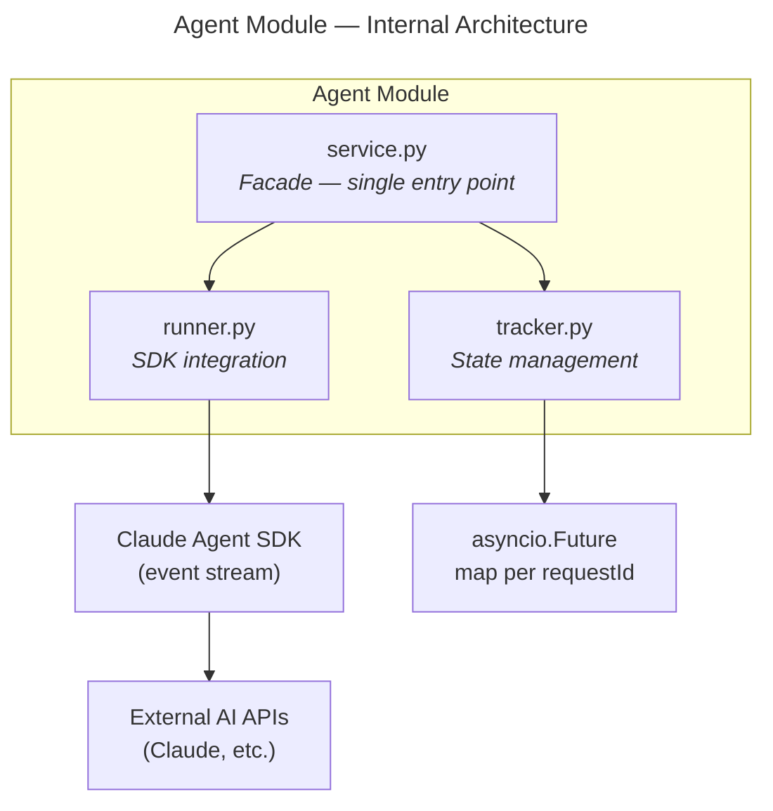

# Agent Module — Design Specification

> Parent: [DESIGN_DOC.md](../../../DESIGN_DOC.md) | Status: **Active** | Created: 2026-02-25

## Purpose

The Agent module orchestrates AI coding agent runs. It accepts a task (a set of spec IDs + config), feeds the specs as context to the Claude Agent SDK, streams the resulting SDK events to the frontend as JSON-RPC notifications, and handles interactive mid-run flows (user questions, tool permission confirmations) by suspending execution until the frontend responds.

## Internal Architecture

**Pattern:** Service facade over two collaborators — `runner.py` (SDK integration) and `tracker.py` (task lifecycle + pending request state).

## File Organization

| File | Responsibility | Depends On |
|------|---------------|------------|
| `models.py` | Pydantic models: AgentTask, AgentConfig, AgentEvent, AgentResult, Question, QuestionOption, AskUserQuestionResponse, ToolApprovalResponse | — |
| `service.py` | Facade — start/interrupt tasks, relay frontend responses to pending futures | runner, tracker, core/config, spec/service |
| `runner.py` | Claude Agent SDK integration: iterate event stream, map SDK events to `AgentEvent` notifications, register `canUseTool` / hooks | models, tracker |
| `tracker.py` | Task lifecycle (pending/running/done/error), registry of in-flight `asyncio.Future` objects keyed by `requestId` | models |

## Public Interface

### Service Layer (called by RPC methods)

| Method | Signature | Description |
|--------|-----------|-------------|
| `run_task` | `(spec_ids: list[str], config: AgentConfig, notify: Callable) → AgentTask` | Start an agent task; `notify` is a callback for server→client messages, signature: `async def notify(method: str, params: dict, request_id: str \| None = None) -> None` — created by `rpc/notifications.make_notify` |
| `interrupt_task` | `(task_id: str) → None` | Interrupt a running task |
| `get_task` | `(task_id: str) → AgentTask` | Get current task status and metadata |
| `list_tasks` | `() → list[AgentTask]` | List all tasks (running, done, error) |
| `respond` | `(task_id: str, request_id: str, response: dict) → None` | Resolve a pending `asyncio.Future` with the client's answer |

### Models

#### Core Models

| Model | Fields | Description |
|-------|--------|-------------|
| `AgentTask` | id, status, spec_ids, config, session_id?, created, updated | Task record |
| `AgentConfig` | model, max_turns, permission_mode, stream_text | Run configuration |
| `AgentEvent` | task_id, session_id, event_type, payload | Serializable event to send as notification |
| `AgentResult` | task_id, session_id, result, cost_usd, turns, duration_ms, usage | Terminal success result |

#### Interactive Request/Response Models

These types define the data exchanged during mid-run interactions. Both `AskUserQuestion` and tool approvals flow through the SDK's `canUseTool` callback — our `runner.py` translates them into JSON-RPC requests/responses for the frontend.

**Question types** (sent to frontend in `agent/askUserQuestion` params):

| Model | Fields | Description |
|-------|--------|-------------|
| `Question` | question: str, header: str, options: list[QuestionOption], multi_select: bool | A single question with selectable options. 1-4 questions per request, 2-4 options per question. |
| `QuestionOption` | label: str, description: str | A selectable option within a question |

**Response types** (received from frontend via `agent/respond`):

| Model | Fields | Description |
|-------|--------|-------------|
| `AskUserQuestionResponse` | questions: list[Question], answers: dict[str, str] | Response to a question request. `questions` passes through the original questions. `answers` maps question text → selected label. Multi-select joins labels with `", "`. Free-text "Other" input uses the user's text directly. |
| `ToolApprovalResponse` | behavior: `"allow"` \| `"deny"`, message?: str, interrupt?: bool | Response to a tool approval request. `message` is the denial reason. `interrupt=true` aborts the entire task. |

**SDK mapping:**

The SDK uses a single `canUseTool` callback for both questions and tool approvals. `runner.py` distinguishes them by `tool_name`:

| `tool_name` in `canUseTool` | Bonsai protocol method | Frontend response → SDK return |
|------------------------------|------------------------|-------------------------------|
| `"AskUserQuestion"` | `agent/askUserQuestion` | `AskUserQuestionResponse` → `PermissionResultAllow(updated_input={"questions": [...], "answers": {...}})` |
| Any other tool | `agent/confirmAction` | `ToolApprovalResponse` → `PermissionResultAllow()` or `PermissionResultDeny(message=..., interrupt=...)` |

### Event Types (AgentEvent.event_type)

These map 1-to-1 to the `agent/*` notification methods in the protocol:

| event_type | Triggered by | Protocol method |
|------------|-------------|-----------------|
| `session_start` | `SDKSystemMessage` subtype `init` | `agent/sessionStart` |
| `text_delta` | `SDKAssistantMessage` text block / `SDKPartialAssistantMessage` text_delta | `agent/textDelta` |
| `tool_call_start` | `SDKAssistantMessage` tool_use block | `agent/toolCallStart` |
| `tool_call_end` | `SDKUserMessage` tool_result block | `agent/toolCallEnd` |
| `subagent_start` | `SubagentStart` hook | `agent/subagentStart` |
| `subagent_end` | `SubagentStop` hook | `agent/subagentEnd` |
| `notification` | `Notification` hook | `agent/notification` |
| `compact` | `SDKCompactBoundaryMessage` | `agent/compact` |
| `progress` | Internal milestones | `agent/progress` |
| `done` | `SDKResultMessage` subtype `success` | `agent/done` |
| `error` | `SDKResultMessage` error subtypes | `agent/error` |
| `permission_denied` | `SDKResultMessage.permission_denials` | `agent/permissionDenied` |

### Interactive Request/Response Flow

For mid-run interactions where the agent needs user input, `runner.py` suspends the SDK generator and the frontend must respond via `agent/respond`:

| Trigger | Server sends | Client responds with |
|---------|-------------|----------------------|
| `canUseTool` fires with `tool_name="AskUserQuestion"` | `agent/askUserQuestion` (JSON-RPC request with `id`) | `agent/respond { taskId, requestId, response: AskUserQuestionResponse }` |
| `canUseTool` fires with any other `tool_name` | `agent/confirmAction` (JSON-RPC request with `id`) | `agent/respond { taskId, requestId, response: ToolApprovalResponse }` |

**Suspension mechanism:**
1. Runner registers a new `asyncio.Future` in `tracker.py` keyed by `requestId`
2. Runner sends the JSON-RPC request to the frontend via the `notify` callback
3. Runner `await`s the Future
4. Frontend user responds → RPC layer calls `service.respond(task_id, request_id, response)`
5. `tracker.py` resolves the Future; runner resumes and returns the response to the SDK

**Timeout:** If no response arrives within a configurable deadline, the Future is cancelled, the action is auto-denied, and an `agent/notification` event is sent to inform the frontend.

## Design Decisions

| Decision | Choice | Rationale |
|----------|--------|-----------|
| SDK integration point | `runner.py` only | Single place to swap SDK versions or add a Python-side SDK wrapper; service and tracker are SDK-agnostic |
| Suspension pattern | `asyncio.Future` per `requestId` | Idiomatic async Python; futures can be awaited, cancelled, and inspected without threads |
| Streaming text | `includePartialMessages: true` in SDK config | Required to emit `text_delta` events for live typewriter view; can be toggled via `AgentConfig.stream_text` |
| Notify callback | Injected into runner at task start; supports both notifications (`request_id=None`) and server-initiated requests (`request_id` set) | Keeps the runner decoupled from WebSocket details; RPC layer owns the connection and callback creation |
| Agent file change tracking | Filesystem watcher (core/watcher), not tool call interception | Watcher is ground truth — catches all file changes regardless of source (agent, user, external). Same pipeline as user changes: watcher → spec/service → rpc/notifications. More reliable than intercepting agent tool calls, and adds no complexity to runner.py |

## Dependencies

| Dependency | Usage |
|------------|-------|
| `core/config` | Project root, API key resolution |
| `spec/service` | Load spec content to build agent context |
| `claude-agent-sdk` (Python) | Agent execution and event stream |
| `asyncio` | Future-based suspension for interactive requests |

## Known Limitations

- Single WebSocket connection assumed — if the client disconnects mid-task, pending futures will time out rather than being immediately cancelled
- No persistent task storage — task list is in-memory only; restarts lose task history
- Concurrent task limit is not yet defined; multiple simultaneous agent runs are architecturally supported but resource limits are an open question

## Related Specs

- **Parent:** [Architecture Design](../../../DESIGN_DOC.md)
- **Depends on:** [Spec Module](../spec/README.md) (for loading spec context)
- **Related modules:** `rpc/methods/agents.py` (JSON-RPC interface to this module), `rpc/notifications.py` (WebSocket push)
