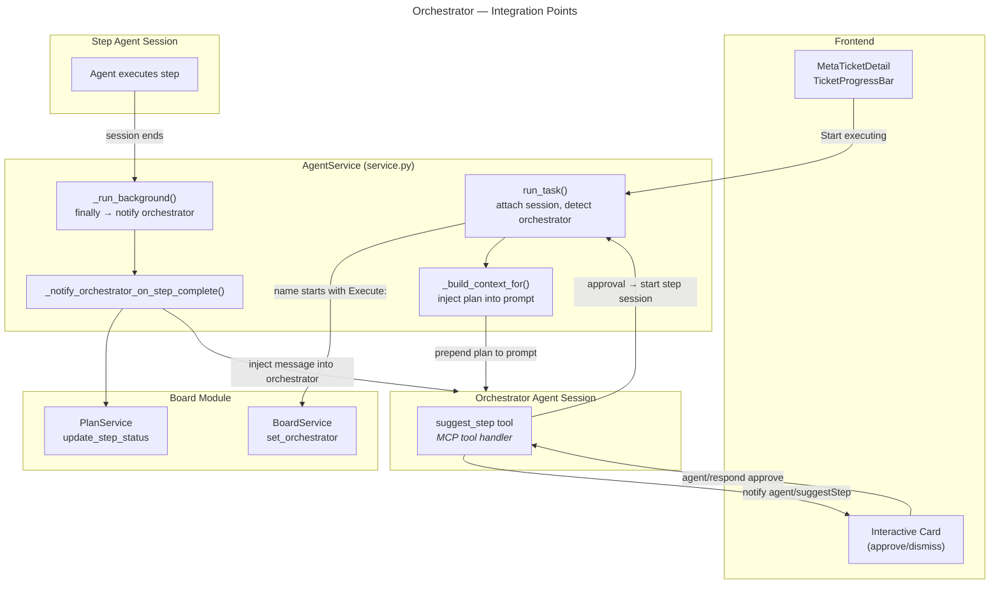
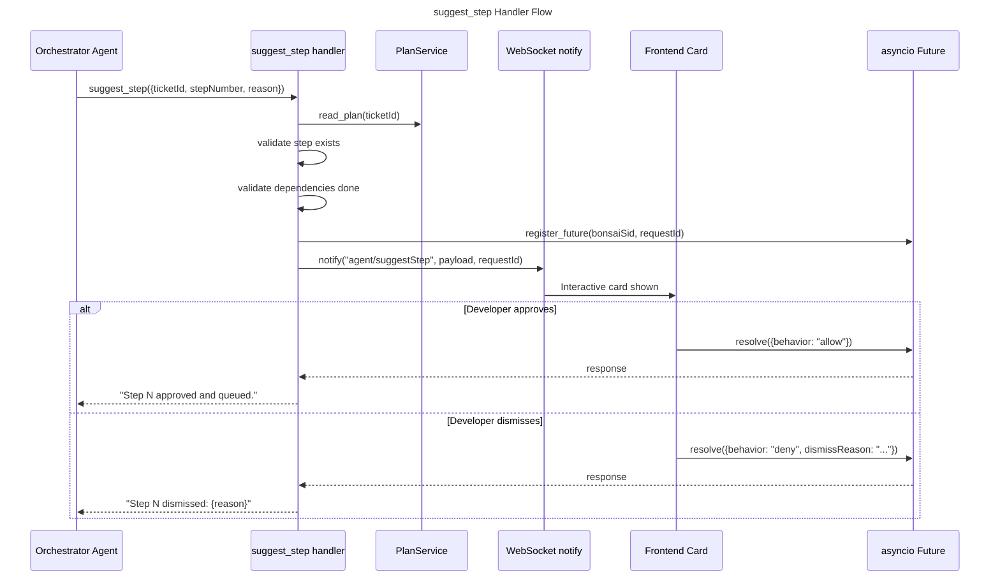

# Orchestrator Tools — Sub-Specification

> Parent: [Agent Tools](README.md) | Status: **Active** | Created: 2026-03-27

## Table of Contents
1. [Purpose](#purpose)
2. [Internal Architecture](#internal-architecture)
3. [Suggest Step Tool](#suggest-step-tool)
4. [Step Completion Notification](#step-completion-notification)
5. [Plan Context Injection](#plan-context-injection)
6. [Orchestrator Detection](#orchestrator-detection)
7. [Lifecycle Skills](#lifecycle-skills)
8. [Design Decisions](#design-decisions)
9. [Known Limitations](#known-limitations)
10. [Related Specs](#related-specs)

## Purpose

The orchestrator system enables semi-automatic plan execution. An orchestrator agent session reads a ticket's implementation plan, proposes steps for execution via an interactive tool, and receives completion notifications when step sessions finish. The system bridges the gap between fully manual step-by-step execution and fully autonomous multi-step runs.

The orchestrator pattern involves four integration points:
1. **suggest_step tool** — agent proposes a step, developer approves/dismisses
2. **Step completion notification** — background callback when a step session ends
3. **Plan context injection** — plan document prepended to orchestrator session prompt
4. **Orchestrator detection** — sessions named "Execute:..." are auto-registered as orchestrators

## Internal Architecture



## Suggest Step Tool

**Tool name:** `suggest_step`
**MCP server:** `bonsai-orchestrator` (or added to `bonsai-proactive`)
**Pattern:** Interactive tool — validates, sends card, suspends on Future, returns on response

### Schema

```json
{
  "type": "object",
  "required": ["ticketId", "stepNumber"],
  "properties": {
    "ticketId": {
      "type": "string",
      "description": "Meta-ticket ID"
    },
    "stepNumber": {
      "type": "integer",
      "description": "Plan step number to execute"
    },
    "reason": {
      "type": "string",
      "description": "Why this step should run next"
    }
  }
}
```

### Handler Flow



### Validation

Before sending the interactive card:
1. **Plan exists:** `PlanService.plan_exists(ticketId)` must return true
2. **Step exists:** Step with matching `stepNumber` must be in the plan
3. **Dependencies met:** All steps in `step.depends_on` must have status `"done"`
4. **Step is pending:** Step status must be `"pending"` (not already executing/done/failed)

Validation failures return MCP `isError` responses — no card is shown.

### Notification Payload

```typescript
// agent/suggestStep notification
{
  bonsaiSid: string;       // orchestrator session ID
  ticketId: string;
  stepNumber: number;
  stepTitle: string;
  reason: string;
  skill: string;           // from plan step
  inputSpecIds: string[];  // from plan step
}
```

## Step Completion Notification

When any agent session ends, the `_run_background` finally block calls `_notify_orchestrator_on_step_complete`. This is the mechanism that feeds progress back to the orchestrator.

### Implementation (`AgentService._notify_orchestrator_on_step_complete`)

```python
async def _notify_orchestrator_on_step_complete(self, task: AgentTask) -> None:
    # 1. Skip if no meta_ticket_id or no board_service
    if not task.meta_ticket_id or not self.board_service:
        return

    # 2. Load ticket, find orchestrator session
    ticket = self.board_service.get_ticket(task.meta_ticket_id)
    orch_sid = ticket.orchestrator_session_id
    if not orch_sid or orch_sid == task.bonsai_sid:
        return  # Don't notify self

    # 3. Update plan step status matching this session
    if ticket.plan_path and self.board_service.plans.plan_exists(task.meta_ticket_id):
        plan = self.board_service.plans.read_plan(task.meta_ticket_id)
        for step in plan.all_steps():
            if step.session_id == task.bonsai_sid:
                new_status = "done" if task.status == "done" else "failed"
                self.board_service.plans.update_step_status(
                    task.meta_ticket_id, step.number, new_status,
                )
                break

    # 4. Inject message into orchestrator session
    if self._tracker.has_task(orch_sid):
        status_word = "completed successfully" if task.status == "done" else f"ended with status: {task.status}"
        msg = f"[Step session {task.name or task.bonsai_sid[:8]} {status_word}]"
        self._tracker.enqueue_message(orch_sid, msg)
```

### Behavior

| Step Session Outcome | Plan Step Update | Orchestrator Message |
|---------------------|-----------------|---------------------|
| `status == "done"` | Step set to `"done"` | `[Step session {name} completed successfully]` |
| `status == "error"` | Step set to `"failed"` | `[Step session {name} ended with status: error]` |
| No matching step | No update | Message still sent |
| Orchestrator not live | Plan updated | No message (orchestrator not in tracker) |

## Plan Context Injection

When building the system prompt for a session linked to a meta-ticket with a plan, `AgentService._build_context_for` reads and injects the plan document.

### Implementation

```python
def _build_context_for(self, task: AgentTask) -> str:
    session_prompt = task.session_prompt

    if task.meta_ticket_id and self.board_service:
        ticket = self.board_service.get_ticket(task.meta_ticket_id)
        if ticket.plan_path and self.board_service.plans.plan_exists(task.meta_ticket_id):
            plan = self.board_service.plans.read_plan(task.meta_ticket_id)
            plan_text = _render_plan(plan)
            plan_section = (
                "## Implementation Plan\n\n"
                "The following plan is associated with this ticket. "
                "As the orchestrator, read the plan, identify the next unblocked step, "
                "and call `suggest_step` to propose it for execution.\n\n"
                f"{plan_text}"
            )
            session_prompt = f"{session_prompt}\n\n{plan_section}" if session_prompt else plan_section

    return build_context(spec_ids=task.spec_ids, ..., session_prompt=session_prompt)
```

The injected plan section:
- Includes full rendered Markdown of the plan
- Instructs the agent to use `suggest_step` for proposing steps
- Is appended to any existing session prompt (from the skill)

## Orchestrator Detection

Sessions are automatically registered as orchestrators based on their name prefix.

### Detection Logic (`AgentService.run_task`)

```python
if meta_ticket_id and self.board_service:
    self.board_service.attach_session(meta_ticket_id, task.bonsai_sid)
    ticket = self.board_service.get_ticket(meta_ticket_id)
    if ticket.plan_path and (name.startswith("Execute:") or name.startswith("Orchestrate:")):
        self.board_service.set_orchestrator(meta_ticket_id, task.bonsai_sid)
```

| Session Name | Orchestrator? | Auto-Transition |
|-------------|---------------|-----------------|
| `"Execute: Fix login bug"` | Yes | `planned` -> `executing` |
| `"Orchestrate: Refactor DB"` | Yes | `planned` -> `executing` |
| `"Specify: Add search"` | No | (none) |
| `"describe: New feature"` | No | (none) |

The `set_orchestrator` call on `BoardService` auto-transitions the ticket from `planned` to `executing`.

## Lifecycle Skills

Four skills in `claude-plugin/skills/` map to the ticket lifecycle stages. Each skill provides a system prompt that guides the agent through a specific phase.

| Skill ID | Phase | Trigger Condition | Session Name Pattern | Agent Goal |
|----------|-------|-------------------|---------------------|------------|
| `ticket-describe` | Idea formulation | Ticket has no body | `"Describe: {title}"` | Generate structured description from rough idea |
| `ticket-specify` | Specification | `idea` status + has body | `"Specify: {title}"` | Create formal specs using spec tools |
| `ticket-plan` | Planning | `specified` status | `"Create Plan: {title}"` | Create implementation plan with steps |
| `ticket-execute` | Execution | Has plan path | `"Execute: {title}"` | Read plan, propose steps via suggest_step |

### Skill-to-Agent Behavior

| Skill | Tools Used | Output |
|-------|-----------|--------|
| `ticket-describe` | File read, project analysis | Updates ticket body via description |
| `ticket-specify` | `spec_save`, `registry_mutate` | Creates spec files + registry entries, auto-linked to ticket |
| `ticket-plan` | `board/createPlan` (via spec tools or direct) | Creates `.bonsai/plans/{id}.md` |
| `ticket-execute` | `suggest_step`, delegates to step sessions | Orchestrates full plan execution |

## Design Decisions

| Decision | Choice | Rationale |
|----------|--------|-----------|
| Interactive suggest_step | Future-based suspension, same as SuggestSession | Developer stays in the loop. Can approve, dismiss, or modify before execution begins. |
| Convention-based orchestrator detection | Session name prefix `"Execute:"` / `"Orchestrate:"` | Simple, no extra API parameter needed. The frontend controls the name via TicketSession. |
| Plan injection into prompt | Full plan Markdown prepended to session prompt | Agent has complete context without needing to read the plan file. One-shot context is more reliable than tool-based plan reading. |
| Step completion via finally block | `_run_background` always calls `_notify_orchestrator_on_step_complete` | Guaranteed execution regardless of how the session ends (success, error, cancel). |
| Message injection for orchestrator | `tracker.enqueue_message(orch_sid, msg)` | Wakes up the orchestrator if idle, adding completion info to its conversation. |
| Milestone-aware orchestration | Orchestrator uses `plan.all_steps()` instead of `plan.steps` to iterate across all milestones | Decouples orchestrator logic from milestone structure; flat step iteration works regardless of grouping. |
| Plan step update by session_id match | Loop through `plan.all_steps()` to find matching session_id | Simple, O(n) where n is number of steps (small). No index needed. |

## Known Limitations

- **suggest_step tool is not yet implemented as a standalone file:** The tool schema and flow are designed but the MCP tool handler file (`suggest_step.py`) needs to be created following the tool file contract.
- **No step retry logic:** If a step fails, the orchestrator receives the failure message but has no built-in "retry step" tool. The developer must manually restart or the agent must call suggest_step again.
- **Single orchestrator per ticket:** Only one session can be the orchestrator. Starting a new execute session overwrites the previous orchestrator_session_id.
- **No plan modification tool:** The orchestrator cannot modify the plan (add/remove/reorder steps) during execution. Plan changes require a new session.
- **Completion notification is fire-and-forget:** If the orchestrator session crashed between step start and completion, the notification is lost. The plan step status is still updated on disk.
- **No parallel step execution yet:** Steps now have a `parallel_with` field indicating which steps can run concurrently, but the orchestrator still proposes one step at a time via suggest_step. Parallel execution support is future work.

## Related Specs

- **Parent:** [Agent Tools](README.md)
- **Board integration:** [Board Module](../../board/README.md), [PlanService](../../board/PLAN_SERVICE.md)
- **Agent integration:** [AgentService](../service.py) (run_task, _notify_orchestrator_on_step_complete, _build_context_for)
- **Frontend:** [MetaTicketDetail](../../../../frontend/src/components/MetaTicketDetail/README.md) (TicketProgressBar actions, TicketSession skill selection)
- **Sibling tools:** [SuggestSession](SUGGEST_SESSION.md), [Spec Tools](SPECS_TOOLS.md)
