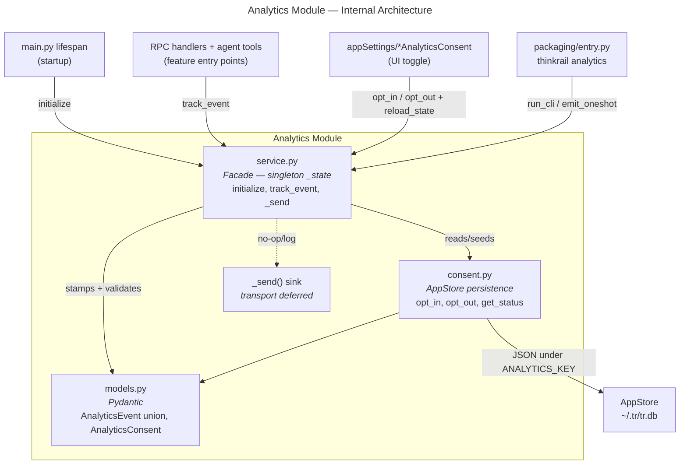

# Analytics Module — Design Specification

> Parent: [DESIGN_DOC.md](../../../DESIGN_DOC.md) | Status: **Active** | Created: 2026-06-16

## Table of Contents
1. [Purpose](#purpose)
2. [Privacy Invariant](#privacy-invariant)
3. [Internal Architecture](#internal-architecture)
4. [File Organization](#file-organization)
5. [Public Interface](#public-interface)
6. [Consent & Seeding](#consent--seeding)
7. [Control Surfaces](#control-surfaces)
8. [Design Decisions](#design-decisions)
9. [Dependencies](#dependencies)
10. [Known Limitations](#known-limitations)
11. [Related Specs](#related-specs)

## Purpose

The Analytics module answers **product** questions — retention, acquisition, and which top-level features get used — without inspecting user activity. It abstracts usage analytics behind a tiny facade (`initialize` / `track_event`) and hides the concrete delivery backend behind a private sink.

The module owns:
- A typed, closed event data model (`AnalyticsEvent` discriminated union).
- The consent record (`installation_id` + `enabled`) persisted in `AppStore` and treated as the single runtime source of truth.
- Stamping each event with the only stable identifier (`installation_id`) and low-cardinality, non-personal environment metadata (`channel`, `version`, `os`, `arch`).
- The transport sink (`_send`) — currently no-op / log-only; the real delivery backend is deferred.

The three product questions it serves:
- **Retention / churn** — recurring `app_started` activity tied to `installation_id`.
- **Acquisition** — `app_installed` per `channel` / `os` / `arch` / `version`.
- **Top-level feature usage** — one named event per feature (e.g. `board_viewed`, `orchestrator_step_suggested`) — coarse by design: *which* features, not per-action telemetry.

## Privacy Invariant

**Hard invariant:** the only stable identifier is `installation_id` (a `uuid4`). Events carry only non-personal environment metadata.

| Field | Sent | Cardinality |
|-------|------|-------------|
| `installation_id` | yes (the only persisted identifier) | per-install `uuid4` |
| `channel` | yes (env) | `stable` \| `nightly` \| `dev` |
| `version` | yes (env) | release version string |
| `os` | yes (env) | `macos` \| `linux` \| `windows` |
| `arch` | yes (env) | `x64` \| `arm64` |

The `event` discriminator itself is a closed `Literal` (one value per event type), so the only per-event variation is which named event fired.

**Never sent:** project paths, file/spec/ticket names, prompts, code, transcripts, token counts, hostnames, usernames, or IP-derived fields.

The complete field set of the `AnalyticsEvent` union is asserted against an explicit allowlist in `backend/tests/analytics/test_models.py`. Any future field addition that is not in the allowlist fails CI — a content leak cannot land silently.

## Internal Architecture

**Pattern:** Service facade (singleton state) over a pure persistence module, with the transport behind a private sink.

`service.py` is the single in-process entry point. `initialize()` is called once at startup; it consults the consent record, seeds it on a fresh install, sets the in-memory `_state`, and emits the lifecycle events. `track_event()` is fire-and-forget: it stamps the in-memory `_state` (never reads the DB per call) and hands the serialized payload to `_send`. Both are wrapped so they can never block or crash their callers.

`consent.py` is stateless persistence — it loads/saves the `AnalyticsConsent` record in `AppStore` under `ANALYTICS_KEY` (mirroring `core/session_defaults.py`) and exposes `opt_in` / `opt_out` / `get_status`. It never touches `_state` or the network.

## File Organization

| File | Responsibility | Depends On |
|------|---------------|------------|
| `models.py` | Pydantic event union (`Literal` `event` discriminator): lifecycle `AppInstalledEvent` / `AppStartedEvent` plus one named event per feature (`AgentSessionStartedEvent`, `SpecsViewedEvent`, …); `AnalyticsConsent` (internal record) and `AnalyticsStatus` (wire view, no id). camelCase serialization via shared `to_camel`. `EVENT_FIELD_ALLOWLIST` constant enforcing the privacy invariant. | pydantic, agent/models (`to_camel`) |
| `consent.py` | `AnalyticsConsent` persistence in `AppStore` under `ANALYTICS_KEY`: `load_consent`, `save_consent`, `opt_in` (fresh `uuid4`), `opt_out` (clear id, disable), `get_status`. Plus `run_cli` for the packaged CLI. Mirrors `core/session_defaults.py`. | models, core/app_store, core/config |
| `service.py` | Facade: singleton `_state`, env detection (`channel`/`version`/`os`/`arch`), `initialize` (crash-safe seed + lifecycle emit + first-run notice), `track_event` (fire-and-forget), `reload_state` (refresh `_state` after a toggle), `emit_oneshot` (best-effort emit from a short-lived process), private `_send` sink. | models, consent, core/app_store, core/config, version |
| `__init__.py` | Public surface: `initialize`, `track_event`, `opt_in`, `opt_out`, `get_status`, `reload_state`, `emit_oneshot`, `run_cli`, `models`, and the event classes. | service, consent, models |

## Public Interface

### Facade (`service.py`)

| Function | Signature | Description |
|----------|-----------|-------------|
| `initialize` | `(app_store: AppStore) -> None` (async) | Called once at startup after `app_store.open()`. Loads consent; on a fresh install seeds it from the install default (`install.json`), and if enabled mints an `installation_id`, emits `app_installed`, and prints the first-run notice. Then emits `app_started` when enabled. No-op and **never touches the network** when disabled. Fully wrapped — never blocks or crashes startup. |
| `track_event` | `(event: AnalyticsEvent) -> None` | Fire-and-forget. Silently no-ops when disabled/uninitialized. Stamps `installation_id` (and `channel`/`version`/`os`/`arch` on events that carry them) from `_state`, then hands the payload to `_send`. **Never raises into callers.** |
| `reload_state` | `(app_store: AppStore) -> AnalyticsConsent` (async) | Refresh the in-memory `_state` from the persisted record. Called after a UI/CLI toggle so the running server respects the change immediately. |
| `emit_oneshot` | `(event: AnalyticsEvent) -> None` | Best-effort emit from a short-lived process with no running server (the `upgrade` CLI). Opens its own `AppStore`, respects consent, then sends. Wrapped so it never affects its caller. |

### Consent persistence (`consent.py`)

| Function | Signature | Description |
|----------|-----------|-------------|
| `opt_in` | `(app_store: AppStore) -> str` (async) | Generate + persist a fresh `installation_id`, set `enabled=True`, return the id. |
| `opt_out` | `(app_store: AppStore) -> None` (async) | Delete the `installation_id`, set `enabled=False`. |
| `get_status` | `(app_store: AppStore) -> AnalyticsConsent` (async) | Return the stored record, or the default posture (`enabled=True`, no id) when none exists. For `analytics --status` and the UI read. |
| `load_consent` / `save_consent` | `(app_store[, consent]) -> AnalyticsConsent \| None` (async) | Low-level load/save of the JSON record under `ANALYTICS_KEY`. |
| `run_cli` | `(action: Literal["enable","disable","status"]) -> int` | Packaged-CLI entry: opens an `AppStore`, applies the action, prints status, returns an exit code. |

### Models (`models.py`)

| Model | Fields (camelCase on the wire) | Description |
|-------|--------------------------------|-------------|
| `AppInstalledEvent` | `event="app_installed"`, `installationId`, `channel`, `version`, `os`, `arch` | Acquisition — emitted once, when the `installation_id` is first minted. |
| `AppStartedEvent` | `event="app_started"`, `installationId`, `channel`, `version`, `os`, `arch` | Retention / churn — emitted on each backend startup. |
| Feature events | `event="<name>"`, `installationId` | One named event per top-level feature (see table below). Each carries only the installation id. |
| `AnalyticsConsent` | `enabled: bool`, `installationId: str \| None` | The persisted consent record; the single runtime source of truth. **Backend-internal — never crosses the wire.** |
| `AnalyticsStatus` | `enabled: bool` | Wire view of consent for the UI toggle. Every event is sent backend-side, so the frontend never sees the `installation_id` — only `enabled` crosses the wire. The curated RPC payload model. |
| `AnalyticsEvent` | `Annotated[Union[...], Field(discriminator="event")]` | Discriminated union — single source of truth for validation and the privacy allowlist test. |

### Feature events & entry points

Each top-level feature has its own event type. They are coarse by design — one event per feature, not per-action — and emitted at:

| Event | Emit location | Rationale |
|-------|---------------|-----------|
| `AgentSessionStartedEvent` | `rpc/methods/agents.py:run_agent` and `start_draft` | The two ways a user starts a session — direct run and draft Start. |
| `SpecsViewedEvent` | `rpc/methods/specs.py:list_specs` | Primary spec-browsing entry. |
| `SpecGraphViewedEvent` | `rpc/methods/specs.py:get_graph` | Distinct spec-graph visualization. |
| `BoardViewedEvent` | `rpc/methods/board.py:list_tickets` | Board view entry. |
| `VoiceTranscriptRevisedEvent` | `rpc/methods/agents.py:revise_transcript_rpc` | Voice-to-text revision. |
| `VisualizationShownEvent` | `agent/tools/visualization.py` | Agent renders a structured visualization. |
| `OrchestratorStepSuggestedEvent` | `agent/tools/orchestrator.py` | Agent proposes a plan step. |
| `UpgradeStartedEvent` | `packaging/entry.py:_run_upgrade` (via `emit_oneshot`) | The `thinkrail upgrade` command. |

## Consent & Seeding

The `AppStore` consent record (`~/.tr/tr.db`, key `analytics`) is the **single runtime source of truth** consulted by `initialize()` / `track_event()`. The `settings` table is key/value, so there is **no schema migration** (pattern follows `core/session_defaults.py`).

Seeding & authority rules:
- **Fresh install, no `--no-analytics`:** mint `installation_id`, `enabled=true`, emit `app_installed` (the opt-out default).
- **`--no-analytics` at install:** seed `{enabled:false}`, no `installation_id`.
- The install flag (`~/.config/thinkrail/install.json`) **only seeds** the record when none exists yet. Thereafter the CLI and UI toggle mutate the `AppStore` record directly.
- **`thinkrail upgrade` re-runs `install.sh`**, but because the `AppStore` record is authoritative and `install.sh` only seeds when no record exists, an upgrade can **never silently flip** a runtime opt-out.

`installation_id` lifecycle:
- `opt_out` deletes the `installation_id` and stops all network calls.
- Re-enabling mints a **fresh** `uuid4` — no cohort continuity across opt-out (privacy-correct).
- No "final beacon" is sent on opt-out.

## Control Surfaces

Three surfaces, one source of truth (the `AppStore` consent record):

1. **Install flag** — `install.sh` accepts `--analytics` / `--no-analytics` and records the choice in `install.json` alongside `channel`. Seeds the `AppStore` record on first start only.
2. **CLI** — `thinkrail analytics --enable | --disable | --status` (`packaging/entry.py:_run_analytics` → `analytics.run_cli`). Mutates / reads the `AppStore` record directly.
3. **In-app Settings toggle** — `appSettings/getAnalyticsConsent` / `appSettings/setAnalyticsConsent` RPCs bound to the same record; toggling calls `opt_in` / `opt_out` then `reload_state`. The RPC returns `AnalyticsStatus` (only `enabled`) — the `installation_id` never leaves the backend.

## Design Decisions

| Decision | Choice | Rationale |
|----------|--------|-----------|
| Default posture | Opt-out (enabled by default) | Maximizes signal for retention/acquisition; transparency requirements (README + first-run notice + install notice) compensate. |
| Single source of truth | `AppStore` consent record | One authoritative record across install flag, CLI, and UI; no drift, and upgrade can't flip a runtime opt-out. |
| In-memory `_state` cache | `track_event` reads `_state`, not the DB | `track_event` is sync, fire-and-forget, and hot; a per-event async DB read is unacceptable. `reload_state` keeps the cache fresh after a toggle. |
| Closed event union + field allowlist | `Literal` discriminator + `EVENT_FIELD_ALLOWLIST` test | Makes the privacy invariant machine-checked — a content-leaking field fails CI. |
| One named event per feature | Distinct event types (`BoardViewedEvent`, …), not one generic event with a `feature` enum | Reads naturally and lets each event grow its own fields later; still coarse — 8 top-level features, not the 27 `AgentEvent` types. |
| Deferred transport | No-op / log-only `_send` sink | Lands the abstraction + consent plumbing without committing to a vendor. Endpoint/key use the `THINKRAIL_`-prefixed env-override convention (as `upgrade.py` does). |
| Fresh `uuid4` on re-enable | No id continuity across opt-out | Privacy-correct: an opted-out-then-back-in user is not re-identified. |
| camelCase serialization | `to_camel` alias generator | Wire format matches frontend TypeScript conventions (same pattern as agent models). |

## Dependencies

| Dependency | Usage |
|------------|-------|
| `pydantic` | Event union validation + camelCase serialization. |
| `app.agent.models` | Shared `to_camel` alias generator. |
| `app.core.app_store` | `get_setting` / `set_setting` for the consent record. |
| `app.core.config` | `ENV_PREFIX`, `CONFIG_DIRNAME`, `get_data_dir` (install.json path, env overrides, data dir). |
| `app.version` | `VERSION`, `CHANNEL` for event stamping. |
| `httpx` | Declared dep, reserved for the real transport (not yet wired). |

## Known Limitations

- **No real transport backend.** `_send` is a no-op / log-only sink; events are stamped, validated, and dropped. Standing up the delivery backend (and the matching `httpx.AsyncClient` fire-and-forget send, retention pipeline, and data-retention policy) is deferred until a vendor is chosen.
- **No client-side throttling.** Feature entry points such as `spec/list` and `board/list` fire on each call, so feature events can be chatty. Harmless against a log-only sink; a real backend will need debouncing or server-side dedup.
- **`dev` channel is not excluded.** Local dev runs emit with `channel=dev`. Acceptable while the sink is no-op; a real backend should filter `dev`.
- **`emit_oneshot` opens its own `AppStore`.** The `upgrade` CLI runs in a separate process with no initialized `_state`, so its event pays a short DB open/close. Best-effort and wrapped — never affects the upgrade.
- **No notification broadcast on toggle.** A consent change made via the CLI is not pushed to open browser tabs; the UI reflects it on next read.

## Related Specs

- **Parent:** [Architecture Design](../../../DESIGN_DOC.md)
- **Consumers:** [RPC appSettings methods](../rpc/methods/settings.py), feature entry points in [agent RPC methods](../rpc/methods/agents.py), [spec RPC methods](../rpc/methods/specs.py), [board RPC methods](../rpc/methods/board.py), [visualization tool](../agent/tools/visualization.py), [orchestrator tool](../agent/tools/orchestrator.py)
- **Startup:** [main.py lifespan](../main.py)
- **CLI:** [packaging/entry.py](../../../packaging/entry.py), [install.sh](../../../install.sh)
- **Related:** [Session defaults](../core/session_defaults.py) (the persistence pattern this mirrors), [Upgrade](../upgrade.py) (the CLI two-tier shape this mirrors)
</content>
</invoke>
