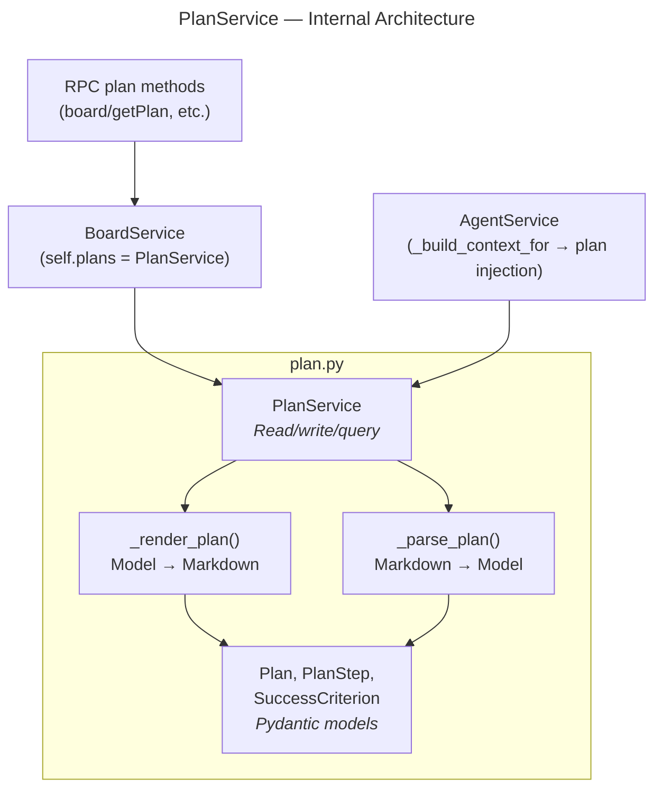
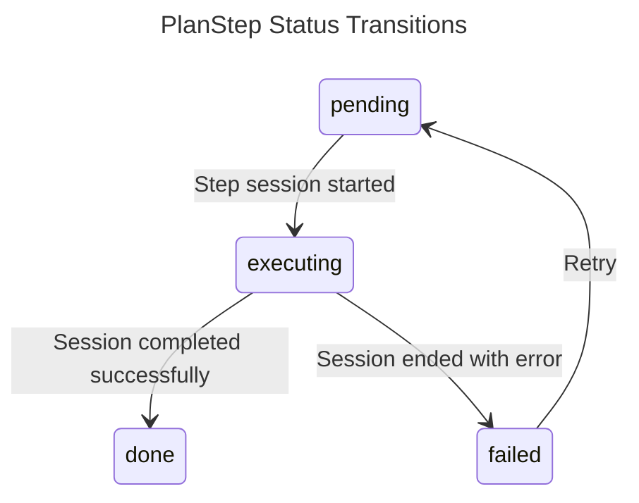

# PlanService — Sub-Specification

> Parent: [Board Module](README.md) | Status: **Active** | Created: 2026-03-27

## Table of Contents
1. [Purpose](#purpose)
2. [Internal Architecture](#internal-architecture)
3. [File Organization](#file-organization)
4. [Public Interface](#public-interface)
5. [Markdown Format](#markdown-format)
6. [Design Decisions](#design-decisions)
7. [Known Limitations](#known-limitations)
8. [Related Specs](#related-specs)

## Purpose

The PlanService manages implementation plan documents for meta-tickets. Plans are the orchestration blueprint that breaks down a ticket into sequential, dependency-aware steps. Each step maps to an agent session with specific skills, input specs, and success criteria.

Plans are stored as Markdown files at `.tr/plans/{ticket_id}.md` and support full round-trip parsing: write a Plan model to Markdown, read it back, and get the same model. This makes plans human-readable, git-friendly, and editable by both agents and developers.

## Internal Architecture

**Pattern:** Service + pure-function serialization

The PlanService is a thin wrapper around Markdown read/write functions. All serialization logic is in module-level pure functions (`_render_plan`, `_parse_plan`). The service adds path management and higher-level operations (step status updates, criterion checks, next-step logic).



## File Organization

All plan code lives in a single file `plan.py` within the board module:

| Section | Responsibility |
|---------|---------------|
| Models | `SuccessCriterion`, `PlanStep`, `Milestone`, `Plan` — Pydantic models with camelCase serialization |
| Markdown serialization | `_render_plan()` — converts Plan to Markdown string |
| Markdown parsing | `_parse_plan()`, `_parse_steps()`, `_parse_criteria()`, `_extract_field()` — converts Markdown back to Plan |
| Service | `PlanService` — path management, CRUD, step operations |

## Public Interface

### Models

| Model | Fields | Description |
|-------|--------|-------------|
| `SuccessCriterion` | text: `str`, checked: `bool` (default `False`) | A single verifiable criterion rendered as a Markdown checkbox |
| `PlanStep` | number: `int`, title: `str`, status: `Literal["pending", "executing", "done", "failed"]`, skill: `str` (default `"default"`), depends_on: `list[int]`, input_spec_ids: `list[str]`, session_id: `str \| None`, success_criteria: `list[SuccessCriterion]`, milestone_number: `int` (default `1`), parallel_with: `list[int]` (default `[]`), agent_instructions: `str` (default `""`) | One step in the execution plan |
| `Milestone` | number: `int`, title: `str`, description: `str` (default `""`), steps: `list[PlanStep]`, status: computed property | A group of related steps. Status is computed from child steps: `"executing"` if any step is executing, `"done"` if all done, `"failed"` if any failed and none executing, else `"pending"`. |
| `Plan` | ticket_id: `str`, title: `str`, status: `Literal["draft", "ready", "executing", "done"]`, milestones: `list[Milestone]`, verification: `list[SuccessCriterion]` | Full plan document. Use `all_steps()` to get a flat list of all steps across milestones. |

### Step Status Flow



### Plan Status (Auto-Computed)

| Condition | Plan Status |
|-----------|-------------|
| Any step is `executing` | `executing` |
| All steps are `done` or `failed` (and at least one step exists) | `done` |
| Otherwise | Unchanged (stays `draft` or `ready`) |

### PlanService Methods

**Class:** `PlanService(config: AppConfig)`

| Method | Signature | Description |
|--------|-----------|-------------|
| `plan_exists` | `(ticket_id: str) -> bool` | Check if plan file exists on disk |
| `read_plan` | `(ticket_id: str) -> Plan` | Parse plan from Markdown file |
| `write_plan` | `(ticket_id: str, plan: Plan) -> str` | Write plan to Markdown; returns relative path `plans/{ticket_id}.md` |
| `create_plan` | `(ticket_id: str, title: str, steps: list[PlanStep], verification?: list[SuccessCriterion]) -> Plan` | Create new plan with `draft` status and write to disk. Accepts flat steps for backward compatibility (wraps them in a single milestone). |
| `update_step_status` | `(ticket_id: str, step_number: int, status: str, session_id?: str) -> Plan` | Update a step's status (and optional session ID); auto-computes plan status |
| `check_criterion` | `(ticket_id: str, step_number: int, criterion_index: int, checked: bool) -> Plan` | Toggle a success criterion checkbox on a step |
| `get_next_step` | `(ticket_id: str) -> PlanStep \| None` | Find next unblocked pending step (all dependencies done) |
| `read_plan_raw` | `(ticket_id: str) -> str` | Return raw Markdown content of the plan file (not parsed) |
| `write_plan_raw` | `(ticket_id: str, content: str) -> Plan` | Write raw Markdown to disk, re-parse, return Plan model |
| `save_plan` | `(ticket_id: str, plan: Plan) -> Plan` | Write a full structured Plan model to disk |

### Output Contracts

| Method | Returns | Error Cases |
|--------|---------|-------------|
| `plan_exists` | `bool` | — |
| `read_plan` | `Plan` | `FileNotFoundError` if plan file missing |
| `write_plan` | `str` (relative path) | — |
| `create_plan` | `Plan` | — |
| `update_step_status` | `Plan` | `FileNotFoundError`, step not found (silently skipped) |
| `check_criterion` | `Plan` | `FileNotFoundError`, step/criterion not found (silently skipped) |
| `get_next_step` | `PlanStep \| None` | `FileNotFoundError` |
| `read_plan_raw` | `str` | `FileNotFoundError` |
| `write_plan_raw` | `Plan` | Parse errors if markdown is malformed |
| `save_plan` | `Plan` | — |

## Markdown Format

Plans are rendered as structured Markdown with milestone grouping:

```markdown
# Plan: {title}

## Meta
- **Ticket:** {ticket_id}
- **Status:** {status}
- **Updated:** {date}

## Milestone 1: Title

### Step 1: {title}
- **Status:** {status}
- **Skill:** {skill}
- **Depends on:** Step 1, Step 2
- **Parallel with:** Step 3, Step 4
- **Agent instructions:** {agent_instructions}
- **Input specs:** [spec-id-1, spec-id-2]
- **Session:** {session_id}
- **Success criteria:**
  - [ ] Criterion text
  - [x] Completed criterion

## Milestone 2: Title

### Step 3: {title}
...

## Verification
- [ ] Global verification criterion
- [x] Completed global criterion
```

The serializer always writes milestone format. Steps include the new `Parallel with` and `Agent instructions` fields when non-empty.

### Parsing Rules

| Field | Extraction Method | Default |
|-------|-------------------|---------|
| Title | `^# Plan:\s*(.+)$` regex on first heading | Empty string |
| Status | `**Status:**` field in Meta section | `"draft"` |
| Milestones | Split by `## Milestone N: title` headings | Single milestone wrapping all steps |
| Steps | Split by `### Step N: title` headings within each milestone | Empty list |
| Step fields | `**Field:**` bold-colon pattern | Defaults per field |
| Depends on | `Step N` references in depends-on field | Empty list |
| Parallel with | `Step N` references in parallel-with field | Empty list |
| Agent instructions | Text after `**Agent instructions:**` | Empty string |
| Input specs | Comma-separated IDs in `[brackets]` | Empty list |
| Success criteria | `- [x]` / `- [ ]` checkbox syntax | Empty list |
| Verification | Same checkbox syntax in Verification section | Empty list |

**Backward-compatible parsing:** The parser detects whether `## Milestone` headers exist in the Markdown. If they do not (legacy flat-step format), all steps are wrapped into a single milestone automatically. This allows old plan files to be read without modification.

## Design Decisions

| Decision | Choice | Rationale |
|----------|--------|-----------|
| Markdown format | Human-readable Markdown with structured sections | Git-friendly, developer-editable, agent-writable. Plans are read by humans more than machines. |
| Round-trip fidelity | Parse and render produce equivalent plans | Agents can read existing plans, modify them, and write them back without data loss. |
| Single file per plan | `.tr/plans/{ticket_id}.md` | One plan per ticket. Simple path derivation. |
| Auto-computed plan status | Derived from step statuses on `update_step_status` | Reduces manual status management. Plan status always reflects reality. |
| Milestone grouping | Steps grouped into `Milestone` objects; `Plan.all_steps()` provides flat access | Milestones give structure for large plans while `all_steps()` preserves backward-compatible flat iteration. |
| Dependency tracking | `depends_on: list[int]` referencing step numbers | Simple integer references. `get_next_step` uses this to find unblocked steps. |
| Tolerant parsing | Missing fields get defaults rather than raising errors | Plans may be partially written by agents or edited by developers. Strict validation would reject useful partial plans. |
| CamelCase serialization | Pydantic alias generator (shared with board models) | Consistent wire format for API responses. |

## Known Limitations

- **No plan versioning:** Overwriting the plan file loses history. Git provides versioning at the project level.
- **Step numbers are positional:** Removing or reordering steps can break `depends_on` references. Steps should be appended, not inserted.
- **No plan templates:** Plans are created from scratch each time. A template system for common patterns (e.g., "implement module") is not yet designed.
- **Loose coupling to steps:** `update_step_status` silently skips if the step number is not found. This avoids errors but can hide bugs.
- **Date in render only:** The `Updated` field in the Meta section is set to `date.today()` on render but not parsed back into the model.

## Related Specs

- **Parent:** [Board Module](README.md)
- **Consumers:** [RPC board methods](../../rpc/methods/board.py) (`board/getPlan`, `board/createPlan`, `board/updateStep`, `board/getNextStep`), [AgentService._build_context_for](../agent/service.py) (plan injection into session prompt)
- **Related:** [Orchestrator tools](../agent/tools/ORCHESTRATOR.md) (suggest_step reads plans, step completion updates plans)
