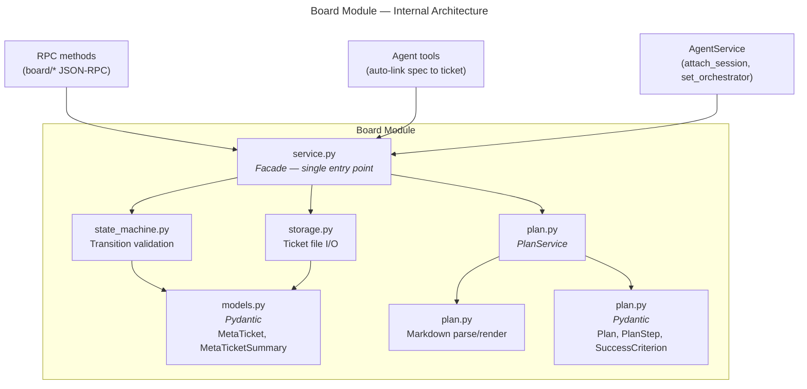

# Board Module — Design Specification

> Parent: [DESIGN_DOC.md](../../../DESIGN_DOC.md) | Status: **Active** | Created: 2026-03-27

## Table of Contents
1. [Purpose](#purpose)
2. [Internal Architecture](#internal-architecture)
3. [File Organization](#file-organization)
4. [Public Interface](#public-interface)
5. [Design Decisions](#design-decisions)
6. [Dependencies](#dependencies)
7. [Known Limitations](#known-limitations)
8. [Related Specs](#related-specs)

## Purpose

The Board module is the meta-ticket lifecycle engine. It combines issue tracking with agent orchestration, managing the full progression of work items from raw idea through specification, planning, execution, and completion. Each meta-ticket acts as a container linking specs, sessions, and plans into a cohesive workflow.

The module owns:
- Meta-ticket CRUD and persistence (JSON files under `.tr/meta-tickets/`)
- Status state machine with validated transitions and auto-advancement
- Plan document management (Markdown files under `.tr/plans/`)
- Linking specs, sessions, and orchestrator sessions to tickets

## Internal Architecture

**Pattern:** Service-centric (facade) with plan sub-service

`service.py` is the single entry point for all board operations. It is called from two directions:
1. **RPC methods** — user-initiated CRUD via JSON-RPC (`board/list`, `board/create`, etc.)
2. **Agent tools** — automatic linking when agent sessions create specs (`specs.py` calls `board_svc.link_spec`)

The `BoardService` facade composes a `PlanService` instance for plan-specific operations. Both are stateless — all data lives on disk.



## File Organization

| File | Responsibility | Depends On |
|------|---------------|------------|
| `models.py` | Pydantic models: MetaTicket, MetaTicketSummary, SpecChange, status/type literals, camelCase serialization config. `MetaTicketSummary.from_ticket()` builds summaries with `spec_change_count`. | pydantic |
| `service.py` | Facade — all ticket CRUD, spec linking, session attachment, orchestrator setting, plan auto-detection. Composes `PlanService` and `SpecDraftService`. | models, storage, state_machine, plan, spec_drafts, core/config |
| `spec_drafts.py` | SpecDraftService — shadow directory for spec changes during ticket-specify sessions. Writes go to `.tr/spec-drafts/{ticket_id}/` with manifest tracking. Supports apply/discard per-entry or all-at-once. | core/config, core/fileio, spec/service |
| `storage.py` | Ticket file I/O: `ticket_path`, `read_ticket`, `write_ticket` (atomic via temp+rename), `list_tickets`, `delete_ticket` | models, core/fileio |
| `state_machine.py` | `VALID_TRANSITIONS` dict, `can_transition`, `validate_transition`, `InvalidTransitionError` | models |
| `plan.py` | PlanService + Plan/PlanStep/SuccessCriterion models + Markdown render/parse round-trip | models (camelCase config), core/config, core/fileio |
| `__init__.py` | Re-exports: BoardService, TicketNotFoundError, InvalidTransitionError, all model types | service, models, state_machine |

## Public Interface

### Service Layer (called by RPC methods and AgentService)

**Class:** `BoardService(config: AppConfig)`

| Method | Signature | Description |
|--------|-----------|-------------|
| `list_tickets` | `() -> list[MetaTicketSummary]` | List all tickets with auto-detected plan paths |
| `get_ticket` | `(id: str) -> MetaTicket` | Get full ticket with auto-plan detection |
| `create_ticket` | `(title: str, body: str, type: MetaTicketType) -> MetaTicket` | Create new ticket (defaults to `idea` status). Auto-creates a draft plan skeleton at `.tr/plans/{ticket_id}.md` and sets `plan_path`. |
| `update_ticket` | `(id: str, *, title?, body?, status?, type?) -> MetaTicket` | Update fields; validates status transitions |
| `delete_ticket` | `(id: str) -> None` | Soft-delete ticket to `.tr/trash/` via TrashService (falls back to hard-delete if no TrashService) |
| `detach_session` | `(ticket_id: str, session_id: str) -> MetaTicket` | Remove a session reference from a ticket's session_ids and clear orchestrator_session_id if it matches |
| `detach_session_from_all` | `(session_id: str) -> None` | Scan all tickets and detach the given session. Called automatically when a session is trashed. |
| `link_spec` | `(ticket_id: str, spec_id: str) -> MetaTicket` | Link a spec; auto-transitions `described` to `specified` |
| `unlink_spec` | `(ticket_id: str, spec_id: str) -> MetaTicket` | Remove spec link |
| `attach_session` | `(ticket_id: str, session_id: str) -> MetaTicket` | Associate a session with the ticket |
| `set_orchestrator` | `(ticket_id: str, session_id: str) -> MetaTicket` | Set orchestrator session; auto-transitions `planned` to `executing` |
| `set_plan_path` | `(ticket_id: str, plan_path: str) -> MetaTicket` | Set plan path; auto-transitions `specified` to `planned` |
| `add_spec_change` | `(ticket_id: str, change: SpecChange) -> MetaTicket` | Append a `SpecChange` entry to the ticket's `spec_changes` list. Called by `RecordSpecChange` tool after each spec save. |

**Properties:**
- `plans: PlanService` — sub-service for plan document operations (see [PLAN_SERVICE.md](PLAN_SERVICE.md))
- `spec_drafts: SpecDraftService` — sub-service for spec draft management during ticket-specify sessions. Drafts stored at `.tr/spec-drafts/{ticket_id}/` with a manifest.json tracking operations (create/update/delete). See `docs/superpowers/specs/2026-04-03-spec-drafts-design.md`.

### Models

| Model | Fields | Description |
|-------|--------|-------------|
| `MetaTicket` | id, title, body, status, type, plan_path, orchestrator_session_id, linked_spec_ids, session_ids, spec_changes, created, updated | Full ticket with all fields. `spec_changes` is a list of `SpecChange` entries recording spec modifications made during agent sessions. CamelCase serialization via alias generator. |
| `MetaTicketSummary` | id, title, status, type, plan_path, orchestrator_session_id, linked_spec_ids, session_ids, spec_change_count, created, updated | Lightweight listing model (no body, no full spec_changes). `spec_change_count: int` provides a count for UI display without sending full change data. Constructed via `MetaTicketSummary.from_ticket()` class method. |
| `SpecChange` | spec_id, spec_title, change_type, summary, sections_changed, detail, session_id, created | Records a single spec modification. `change_type` is one of `"created"`, `"modified"`, `"deleted"`. `sections_changed` lists which spec sections were affected. `detail` is an optional longer description. `session_id` links the change to the agent session that made it. |
| `MetaTicketStatus` | `Literal["idea", "described", "specified", "planned", "executing", "done"]` | Status type alias (6 states) |
| `MetaTicketType` | `Literal["feature", "bug", "idea", "improvement"]` | Type classification alias |

### Auto-Transitions

The service automatically advances ticket status when preconditions are met:

| Trigger | From | To | Condition |
|---------|------|----|-----------|
| SuggestDescription | `idea` | `described` | Agent suggests a description (via "Describe with AI") |
| `link_spec` | `described` | `specified` | First spec linked |
| Plan file detected | `specified` | `planned` | `.tr/plans/{id}.md` exists (checked on `list_tickets` / `get_ticket`) |
| `set_plan_path` | `specified` | `planned` | Explicit plan path set |
| `set_orchestrator` | `planned` | `executing` | Orchestrator session assigned |

### State Machine

```
idea --> described --> specified --> planned --> executing --> done
  |         |             |            |            |          |
  +-> done  +-> idea      +-> described +-> specified +-> planned +-> idea
            +-> done      +-> done     +-> done     +-> done   +-> executing
```

| From | Valid Targets |
|------|--------------|
| `idea` | `described`, `done` |
| `described` | `idea`, `specified`, `done` |
| `specified` | `described`, `planned`, `done` |
| `planned` | `specified`, `executing`, `done` |
| `executing` | `planned`, `done` |
| `done` | `idea`, `executing` |

### Agent Tool: ChangeTicketStatus

**File:** `backend/app/agent/tools/change_ticket_status.py`

An MCP tool that allows agents to change a ticket's status. The agent proposes a status change, which requires user confirmation via `AskUserQuestion` before being applied. This enables agents to advance the ticket lifecycle (e.g., moving from `idea` to `described` after generating a description) while keeping the user in the loop.

### Agent Tool: RecordSpecChange

**File:** `backend/app/agent/tools/record_spec_change.py`

An MCP tool that agents call after writing or editing a spec file to record what changed. Agents write spec files directly using standard Write/Edit tools with YAML frontmatter; the watcher validates and indexes automatically. This tool creates a `SpecChange` entry and appends it to the ticket via `board_svc.add_spec_change()`. The `ticket-specify` skill is updated to call this tool after each spec write, capturing the spec_id, change_type (created/modified/deleted), a summary of what changed, and which sections were affected.

### Output Contracts

| Method | Returns | Error Cases |
|--------|---------|-------------|
| `list_tickets` | `list[MetaTicketSummary]` (may be empty) | Directory missing (returns empty list) |
| `get_ticket` | `MetaTicket` | `TicketNotFoundError` — ID not found on disk |
| `create_ticket` | `MetaTicket` | — (ID auto-generated, no conflict) |
| `update_ticket` | `MetaTicket` | `TicketNotFoundError`, `InvalidTransitionError` |
| `delete_ticket` | `None` | `TicketNotFoundError` |
| `link_spec` / `unlink_spec` | `MetaTicket` | `TicketNotFoundError` |
| `attach_session` | `MetaTicket` | `TicketNotFoundError` |
| `set_orchestrator` | `MetaTicket` | `TicketNotFoundError` |
| `set_plan_path` | `MetaTicket` | `TicketNotFoundError` |
| `add_spec_change` | `MetaTicket` | `TicketNotFoundError` |

### Exceptions

| Exception | Raised By | Description |
|-----------|-----------|-------------|
| `TicketNotFoundError` | `service.py` | Ticket ID does not exist on disk |
| `InvalidTransitionError` | `state_machine.py` | Status transition not in `VALID_TRANSITIONS` |

## Design Decisions

| Decision | Choice | Rationale |
|----------|--------|-----------|
| File-per-ticket storage | Individual JSON files at `.tr/meta-tickets/{id}.json` | Simple, git-friendly, no shared-file contention. Each ticket is an independent unit. |
| Atomic writes | temp file + rename | Prevents partial writes on crash. Same pattern as the spec registry. |
| Auto-detection of plans | `list_tickets` and `get_ticket` check for plan file existence | Decouples plan creation (by agent) from ticket metadata. Plans can be created by any tool. |
| Auto-transitions | Service methods advance status on preconditions | Reduces manual status management. Developer only needs to link specs / create plans / set orchestrator. |
| CamelCase serialization | Pydantic alias generator on all models | Wire format matches frontend TypeScript conventions. Same pattern as agent models. |
| PlanService as composition | `BoardService.plans = PlanService(config)` | Plan operations are complex enough to warrant their own class but not a separate module. |
| Stateless service | No in-memory cache; reads from disk each call | Simplicity. Multiple processes (backend + agent) can modify tickets without cache invalidation. |

## Dependencies

| Dependency | Usage |
|------------|-------|
| `core/config` | Project root path for `.tr/` directory location |
| `core/fileio` | `ensure_dir`, `read_text`, `write_text` for plan files; `read_text` for ticket files |
| `pydantic` | Model validation and camelCase serialization |

## Known Limitations

- **No file watcher integration:** Unlike specs, meta-ticket changes on disk are not automatically detected and pushed to the frontend. The frontend refreshes the board by polling or re-fetching after mutations.
- **No concurrent write protection:** If two processes update the same ticket simultaneously, the last write wins. The atomic write prevents corruption but not lost updates.
- **No ticket search or filtering API:** `list_tickets` returns all tickets. As ticket count grows, a filter/search endpoint may be needed.
- **Plan format is loosely validated:** The Markdown parser is tolerant of missing fields. A malformed plan file will parse with default values rather than raising an error.
- **No notification broadcasting:** Board mutations do not yet emit WebSocket notifications to all connected clients. The frontend relies on the RPC response to update its local state.

## Sub-modules

| Sub-module | Spec | Description |
|------------|------|-------------|
| PlanService | [PLAN_SERVICE.md](PLAN_SERVICE.md) | Plan document read/write/parse |

## Related Specs

- **Parent:** [Architecture Design](../../../DESIGN_DOC.md)
- **Sub-modules:** [PlanService](PLAN_SERVICE.md)
- **Consumers:** [RPC board methods](../../rpc/methods/board.py), [AgentService](../agent/service.py) (attach_session, set_orchestrator), [Agent spec tools](../agent/tools/specs.py) (auto-link)
- **Frontend:** [BoardView](../../../frontend/src/components/BoardView/README.md), [MetaTicketDetail](../../../frontend/src/components/MetaTicketDetail/README.md)
- **Related:** [Orchestrator tools](../agent/tools/ORCHESTRATOR.md)
