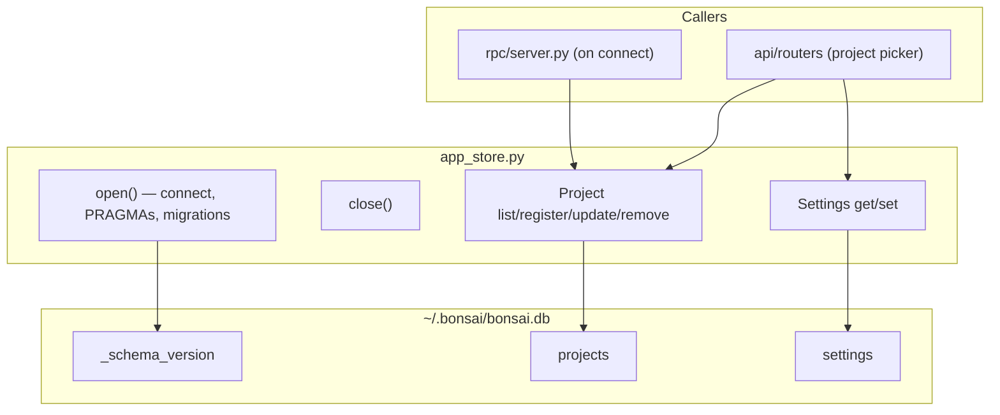

# App Store — Module Design

> Parent: [Storage Architecture](../../../.bonsai/design_docs/STORAGE_ARCHITECTURE.md) | Status: **Active** | Updated: 2026-05-04

## Purpose

Central abstraction for app-level persistent storage. Owns the SQLite database connection at `~/.bonsai/bonsai.db` and exposes typed async methods for the **known-projects registry** and **app-wide key/value settings**. Bonsai is single-user and localhost-only — there is no concept of users, tokens, or per-user preferences in this module.

## Internal Architecture

**Pattern:** Async facade over a single `aiosqlite` connection.



## File Organization

| File | Responsibility | Depends On |
|------|----------------|------------|
| `app_store.py` | SQLite connection, schema, project + settings CRUD | `aiosqlite`, `config.py` (`get_data_dir`) |
| `config.py` | `get_data_dir()` function | `pydantic-settings` |

## Public Interface

### Lifecycle

| Method | Signature | Description |
|--------|-----------|-------------|
| `open` | `async () -> None` | Open DB connection, set PRAGMAs, run migrations (v2 → v3) |
| `close` | `async () -> None` | Close DB connection |
| `is_open` | `property -> bool` | Connection state |

### Projects

| Method | Signature | Description |
|--------|-----------|-------------|
| `list_projects` | `async () -> list[KnownProject]` | All known projects, ordered by `last_opened_at DESC` |
| `register_project` | `async (path: str, name: str) -> None` | Idempotent upsert (updates name on conflict) |
| `update_project_last_opened` | `async (path: str) -> None` | Touch timestamp |
| `remove_project` | `async (path: str) -> None` | Drop from registry |

### Settings

| Method | Signature | Description |
|--------|-----------|-------------|
| `get_setting` | `async (key: str) -> dict \| None` | JSON-decoded value, or `None` on miss |
| `set_setting` | `async (key: str, value: dict) -> None` | JSON-encoded upsert |

## Models

| Model | Fields | Description |
|-------|--------|-------------|
| `KnownProject` | `path, name, registered_at, last_opened_at` | Registered project (1:1 with DB row) |

`KnownProject` is a Python `@dataclass`.

## Schema (v3)

```sql
CREATE TABLE _schema_version (
    version    INTEGER PRIMARY KEY,
    applied_at TEXT NOT NULL
);

CREATE TABLE settings (
    key        TEXT PRIMARY KEY,
    value      TEXT NOT NULL,       -- JSON-encoded
    updated_at TEXT NOT NULL
) WITHOUT ROWID;

CREATE TABLE projects (
    path           TEXT PRIMARY KEY,
    name           TEXT NOT NULL,
    registered_at  TEXT NOT NULL,
    last_opened_at TEXT NOT NULL
) WITHOUT ROWID;

CREATE INDEX idx_projects_last_opened ON projects(last_opened_at DESC);
```

See [`STORAGE_ARCHITECTURE.md`](../../../.bonsai/design_docs/STORAGE_ARCHITECTURE.md#schema-v3) for the canonical definition.

## Migration v2 → v3

Triggered automatically in `open()` when `MAX(_schema_version.version) < 3`. The schema bootstrap (`CREATE TABLE IF NOT EXISTS …`) runs **before** migration, which means a v2 DB enters the migration with `server_config` (legacy, populated) **and** an empty `settings` table (just created). The migration is structured to preserve `server_config` data through this overlap.

1. `DROP TABLE IF EXISTS user_recent_projects` (drop child first — FK → users, projects)
2. `DROP TABLE IF EXISTS user_preferences`
3. `DROP TABLE IF EXISTS tokens`
4. `DROP TABLE IF EXISTS users`
5. **Conditional rename of `server_config` → `settings`** — four cases:
   - `server_config` exists **and** `settings` exists empty (the typical v2-upgrade path): drop the empty `settings`, then `ALTER TABLE server_config RENAME TO settings` so any preserved key/value rows survive.
   - `server_config` exists **and** `settings` exists with rows (extremely unlikely — implies a partial earlier migration): drop `server_config` defensively to avoid clobbering newer data.
   - `server_config` exists, no `settings`: rename normally.
   - No `server_config` (fresh install via the `_SCHEMA` bootstrap): no-op — `settings` is already in place.
6. `INSERT INTO _schema_version VALUES (3, <iso8601>)`

The migration is destructive for user/token data — that is intentional. There are no users in single-user mode.

## Design Decisions

| Decision | Choice | Rationale |
|----------|--------|-----------|
| Single connection | One `aiosqlite` connection | SQLite serializes writes anyway; avoids pool complexity |
| PRAGMAs in `open()` | Set once on connection | Connection-level settings in SQLite |
| `WITHOUT ROWID` | All TEXT-PK tables | Saves space; better lookup perf for text keys |
| Settings as JSON | `value TEXT` column | Avoids schema migration per setting; values are small JSON blobs |
| Idempotent `register_project` | `INSERT … ON CONFLICT DO UPDATE` | Called on every WebSocket connect; must be safe to repeat |
| Manual migrations | `CREATE IF NOT EXISTS` + `_schema_version` row | Schema is small; Alembic is overkill |

## Dependencies

| Dependency | Usage |
|------------|-------|
| `aiosqlite` | Async SQLite access without blocking the event loop |
| `core/config` | `get_data_dir()` for the database file path |
| `json` (stdlib) | Encode/decode setting values |

## Known Limitations

- Single `aiosqlite` connection may bottleneck under very high read concurrency (>100 concurrent reads). Add a pool if needed — the surface is small enough that it is not a near-term concern.
- Schema migrations are manual — will need Alembic when the schema grows.
