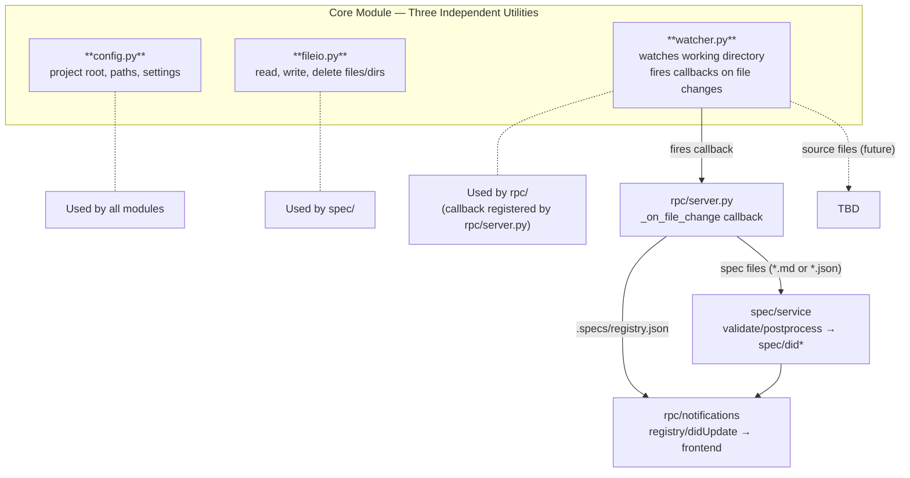

# Core Module — Design Specification

> Parent: [DESIGN_DOC.md](../../../DESIGN_DOC.md) | Status: **Active** | Created: 2026-02-25

## Table of Contents
1. [Purpose](#purpose)
2. [Internal Architecture](#internal-architecture)
3. [File Organization](#file-organization)
4. [Public Interface](#public-interface)
5. [Design Decisions](#design-decisions)
6. [Dependencies](#dependencies)
7. [Known Limitations](#known-limitations)
8. [Related Specs](#related-specs)

## Purpose

The Core module provides shared infrastructure for all backend modules. It handles application
configuration (project root discovery, directory paths, settings), file system operations
(read, write, delete files and directories), and async filesystem watching.

`watcher.py` watches the entire working directory and fires callbacks when files change.
At this design stage, spec files (`*.md`, `*.json`), `.specs/*`, and `registry.json` are the primary
consumers of change events. Source code files will be added as consumers in later stages
(e.g. coverage tracking, detecting agent-authored source changes).

The watcher serves two purposes:
1. **User/external changes** — detect edits made outside Bonsai (editor, git, external tools)
   so the backend can validate, postprocess, and notify the frontend to update views.
2. **Agent changes** — detect spec file edits made by the AI agent during a run, applying
   the same validation/postprocessing pipeline as for user changes (more reliable than
   intercepting tool calls).

## Internal Architecture

**Pattern:** Three independent utilities with no interaction between them.

## File Organization

| File | Responsibility | Depends On |
|------|---------------|------------|
| `config.py` | App configuration: project root discovery, directory paths, settings | pydantic |
| `fileio.py` | File system operations: read, write, delete files; create directories | — |
| `settings.py` | Project settings: load/save/ensure `.bonsai/settings.json` | pydantic, fileio |
| `watcher.py` | Async file change watching: detect spec file and registry changes | watchfiles / watchdog |

## Public Interface

### config.py

These methods are of the `AppConfig` model

| Function            | Signature                    | Description                                    |
|---------------------|------------------------------|------------------------------------------------|
| `get_project_root`  | `AppConfig.() → Path`        | Discover and return the project root directory |
| `get_spec_dir`      | `AppConfig.() → Path`        | Path to the `.specs/` directory                |
| `get_registry_path` | `AppConfig.() → Path`        | Path to `.specs/registry.json`                 |
| `load_config`       | `(project_root) → AppConfig` | Load application settings (Pydantic model)     |

### fileio.py

| Function | Signature | Description |
|----------|-----------|-------------|
| `read_text` | `(path: Path) → str` | Read file contents as text |
| `write_text` | `(path: Path, content: str) → None` | Write text to file, creating parent directories if needed |
| `delete_file` | `(path: Path) → None` | Delete a file |
| `ensure_dir` | `(path: Path) → None` | Create directory and all parents if they don't exist |

### watcher.py

| Function | Signature | Description |
|----------|-----------|-------------|
| `watch` | `async (paths: list[Path], callback: Callable) → WatchHandle` | Start watching paths for file changes |
| `stop` | `async (handle: WatchHandle) → None` | Stop a file watch |

### settings.py

| Function | Signature | Description |
|----------|-----------|-------------|
| `load_settings` | `(project_root: Path) → ProjectSettings` | Read `.bonsai/settings.json`, returning defaults if missing |
| `save_settings` | `(project_root: Path, data: dict) → ProjectSettings` | Validate and write settings |
| `ensure_settings_file` | `(project_root: Path) → ProjectSettings` | Create settings file with defaults if it doesn't exist |

### Models

| Model | Fields | Description |
|-------|--------|-------------|
| `AppConfig` | project_root, spec_dir, host, port | Application configuration (Pydantic) |
| `ProjectSettings` | default_model, default_effort, model_refresh_interval_hours | User-configurable project settings (`.bonsai/settings.json`) |
| `WatchHandle` | (opaque) | Handle to a running file watch |

### Output Contracts

| Function | Returns | Error Cases |
|----------|---------|-------------|
| `get_project_root` | `Path` (absolute) | Project root not found |
| `load_config` | `AppConfig` | Invalid config values |
| `watch` | `WatchHandle` | Invalid paths |
| `stop` | `None` | — |

## Design Decisions

| Decision | Choice | Rationale |
|----------|--------|-----------|
| fileio.py in core/ | Shared file I/O utilities used by domain modules | Centralizes file operations, avoids scattered pathlib calls across modules, consistent error handling |
| Registry handling in spec/, not core/ | spec/ owns the registry as domain state | Separation of concerns — registry is spec domain logic, not shared infrastructure |
| Watcher as separate file from config | Async watching is a distinct infrastructure concern | Separation of concerns — config is synchronous project setup, watcher is async runtime |
| No logging/error utilities | Use Python stdlib logging directly | Simplicity — add shared utilities only when a real pattern emerges |

## Dependencies

| Dependency | Usage |
|------------|-------|
| `pydantic` | AppConfig model validation |
| `watchfiles` | File system change detection |

## Known Limitations

None — the module is intentionally minimal.

## Sub-modules

None.

## Related Specs

- **Parent:** [Architecture Design](../../../DESIGN_DOC.md)
- **Consumers:** [Spec Module](../spec/README.md), [Agent Module](../agent/README.md), [RPC Module](../rpc/README.md)
