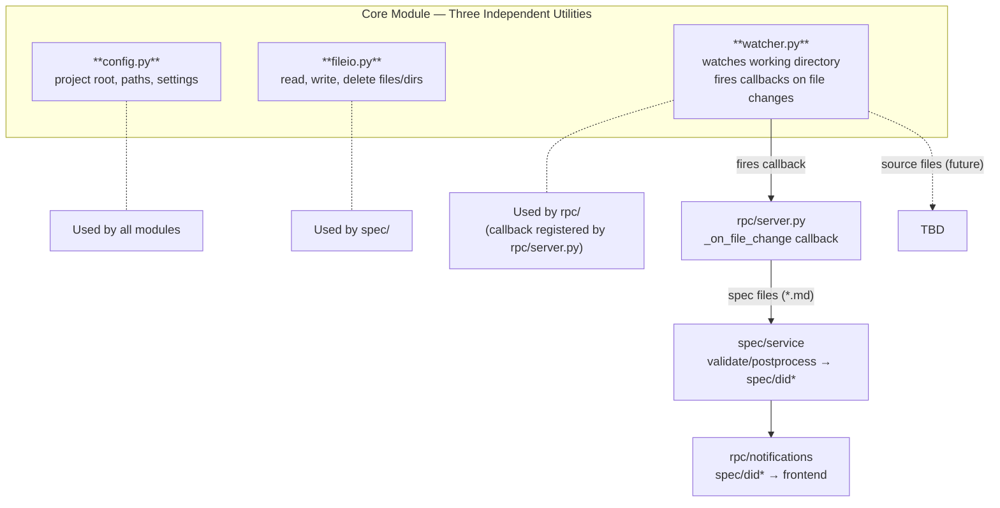

# Core Module — Design Specification

> Parent: [DESIGN_DOC.md](../../../DESIGN_DOC.md) | Status: **Active** | Created: 2026-02-25

## Table of Contents
1. [Purpose](#purpose)
2. [Internal Architecture](#internal-architecture)
3. [File Organization](#file-organization)
4. [Public Interface](#public-interface)
5. [Design Decisions](#design-decisions)
6. [Dependencies](#dependencies)
7. [Known Limitations](#known-limitations)
8. [Related Specs](#related-specs)

## Purpose

The Core module provides shared infrastructure for all backend modules. It handles application
configuration (project root discovery, directory paths, settings), file system operations
(read, write, delete files and directories), and async filesystem watching.

`watcher.py` watches the entire working directory and fires callbacks when files change.
At this design stage, spec files (`*.md`) and `.bonsai/*` config files are the primary
consumers of change events. Source code files will be added as consumers in later stages
(e.g. coverage tracking, detecting agent-authored source changes).

The watcher serves two purposes:
1. **User/external changes** — detect edits made outside Bonsai (editor, git, external tools)
   so the backend can validate, postprocess, and notify the frontend to update views.
2. **Agent changes** — detect spec file edits made by the AI agent during a run, applying
   the same validation/postprocessing pipeline as for user changes (more reliable than
   intercepting tool calls).

## Internal Architecture

**Pattern:** Three independent utilities with no interaction between them.

## File Organization

| File | Responsibility | Depends On |
|------|---------------|------------|
| `config.py` | App configuration: project root discovery, directory paths, server settings, frozen mode detection | pydantic, pydantic-settings |
| `fileio.py` | File system operations: read, write, delete files; create directories | — |
| `project.py` | Lazy auto-creation of `.bonsai/` meta-files and subdirectories; ensures settings.json exists with defaults on access | fileio, settings |
| `settings.py` | Project settings: load/save/ensure `.bonsai/settings.json` | pydantic, project |
| `watcher.py` | Async file change watching: detect spec file and config changes | watchfiles / watchdog |
| `app_store.py` | SQLite-backed registry of known projects + app-wide key/value `settings`. Single-user; no users, tokens, or per-user data. See [APP_STORE.md](APP_STORE.md). | aiosqlite |
| `network_info.py` | LAN IP, hostname, and Tailscale status detection for mobile client discovery | — |

## Public Interface

### config.py

**Frozen mode detection:** two anchors are computed depending on runtime mode. In development both collapse to the repo root. In frozen mode (PyInstaller bundle, detected via `sys.frozen`):

- `_BUNDLE_ROOT` resolves to `sys._MEIPASS` — the bundle's resource root. Used to find packed assets (`claude-plugin/`, `frontend_dist/`). For directory-mode bundles this lives under `_internal/`; for onefile bundles it's a temp extraction dir.
- `_ENV_DIR` resolves to `sys.executable`'s parent — next to the launcher. Used for `.env` lookup so users can override defaults by dropping a `.env` beside the binary.

**`ServerSettings`** (Pydantic `BaseSettings`):

| Field | Type | Default | Description |
|-------|------|---------|-------------|
| `backend_port` | `int` | `8000` | Server port. Read from `.env` or `BACKEND_PORT` env var. |
| `backend_host` | `str` | `"0.0.0.0"` | Bind address. Read from `.env` or `BACKEND_HOST` env var. |

**`AppConfig` methods:**

| Function            | Signature                    | Description                                    |
|---------------------|------------------------------|------------------------------------------------|
| `get_project_root`  | `AppConfig.() → Path`        | Discover and return the project root directory |
| `get_bonsai_dir`    | `AppConfig.() → Path`        | Path to the `.bonsai/` directory               |
| `load_config`       | `(project_root) → AppConfig` | Load application settings (Pydantic model)     |

**Port preflight:**

| Function | Signature | Description |
|----------|-----------|-------------|
| `find_free_port` | `(start: int, host: str = "127.0.0.1", probe_range: int = 10) → int` | Return the first bindable port in `[start, start+probe_range]`. Raises `OSError` if all are taken. Used by the standalone binary (`packaging/entry.py`) and the dev `__main__` so that a busy default port (8000) silently falls back to the next free port instead of failing. Matches `run.sh`'s preflight window. |

### fileio.py

| Function | Signature | Description |
|----------|-----------|-------------|
| `read_text` | `(path: Path) → str` | Read file contents as text |
| `write_text` | `(path: Path, content: str) → None` | Write text to file, creating parent directories if needed |
| `delete_file` | `(path: Path) → None` | Delete a file |
| `ensure_dir` | `(path: Path) → None` | Create directory and all parents if they don't exist |

### watcher.py

| Function | Signature | Description |
|----------|-----------|-------------|
| `watch` | `async (paths: list[Path], callback: Callable) → WatchHandle` | Start watching paths for file changes |
| `stop` | `async (handle: WatchHandle) → None` | Stop a file watch |

### project.py

Lazy auto-creation of `.bonsai/` meta-files. Each known meta-file has a default-content factory. When code reads a meta-file via `ensure_meta_file()`, it is created with defaults if it doesn't exist on disk. `ensure_project()` is called at WebSocket connection time as a safety net.

| Function | Signature | Description |
|----------|-----------|-------------|
| `ensure_meta_file` | `(bonsai_dir: Path, rel_path: str) → str` | Read meta-file if exists; create with defaults if missing. Returns file content. Raises `ValueError` for unknown files. |
| `ensure_meta_dir` | `(bonsai_dir: Path, name: str) → Path` | Ensure `.bonsai/{name}/` directory exists. Returns path. |
| `ensure_project` | `(project_root: Path) → None` | Ensure all known meta-files and subdirectories exist under `.bonsai/`. |

Known meta-files: `settings.json`.
Known subdirectories: `sessions`, `trash`, `plans`, `meta-tickets`, `spec-drafts`, `spec-patches`.

### settings.py

| Function | Signature | Description |
|----------|-----------|-------------|
| `load_settings` | `(project_root: Path) → ProjectSettings` | Read `.bonsai/settings.json`, creating defaults if missing (via `ensure_meta_file`) |
| `save_settings` | `(project_root: Path, data: dict) → ProjectSettings` | Validate and write settings |
| `ensure_settings_file` | `(project_root: Path) → ProjectSettings` | Delegates to `load_settings` (which now auto-creates) |

### Models

| Model | Fields | Description |
|-------|--------|-------------|
| `AppConfig` | project_root, bonsai_dir, plugin_dir | Application configuration (Pydantic) |
| `ServerSettings` | backend_port, backend_host | Server bind settings (Pydantic BaseSettings, reads `.env` + env vars) |
| `ProjectSettings` | event_view, font_size, compact_font_size, trash_retention_days, voice_revise_mode | User-configurable per-project settings (`.bonsai/settings.json`). Session-creation defaults (model / effort / permission_mode) are *not* here — they're user-scoped, see `SessionDefaults` below. `trash_retention_days` (default `30`) controls auto-purge of trashed items; `0` disables auto-purge. `voice_revise_mode` (default `"off"`) controls what happens to a voice transcript after recording: `"off"` leaves the raw transcript alone; `"auto"` runs a one-shot server-side revise (see [VOICE_INPUT_DESIGN.md](../../../.bonsai/design_docs/VOICE_INPUT_DESIGN.md) — Revision 2); `"subsession"` starts a refinement subsession (v1 behavior). Unknown keys in `settings.json` (e.g. legacy `user_respond_timeout`) are tolerated via `extra="allow"`. |
| `SessionDefaults` | model, permission_mode, effort | User-scoped session-creation defaults — applied to every new draft across every project. Stored as a JSON value in `AppStore.settings` under the `session_defaults` key (see `app.core.session_defaults`). Cold-start values: `model=claude-opus-4-7`, `permission_mode="default"`, `effort=None` (renders as "auto" in the UI). Read/written through the `appSettings/getSessionDefaults` and `appSettings/setSessionDefaults` RPCs. |
| `WatchHandle` | (opaque) | Handle to a running file watch |

### Output Contracts

| Function | Returns | Error Cases |
|----------|---------|-------------|
| `get_project_root` | `Path` (absolute) | Project root not found |
| `load_config` | `AppConfig` | Invalid config values |
| `watch` | `WatchHandle` | Invalid paths |
| `stop` | `None` | — |

## Design Decisions

| Decision | Choice | Rationale |
|----------|--------|-----------|
| fileio.py in core/ | Shared file I/O utilities used by domain modules | Centralizes file operations, avoids scattered pathlib calls across modules, consistent error handling |
| Registry handling in spec/, not core/ | spec/ owns the registry as domain state | Separation of concerns — registry is spec domain logic, not shared infrastructure |
| Watcher as separate file from config | Async watching is a distinct infrastructure concern | Separation of concerns — config is synchronous project setup, watcher is async runtime |
| No logging/error utilities | Use Python stdlib logging directly | Simplicity — add shared utilities only when a real pattern emerges |
| Frozen mode in config.py | `sys.frozen` guard sets `_BUNDLE_ROOT` to `sys._MEIPASS` and `_ENV_DIR` to `sys.executable`'s parent | Bundled resources (claude-plugin, frontend dist) live under `_MEIPASS` (`_internal/` for directory bundles, temp dir for onefile); `.env` is read next to the launcher so users can override defaults. Dev mode path calculation unchanged. |

## Dependencies

| Dependency | Usage |
|------------|-------|
| `pydantic` | AppConfig model validation |
| `pydantic-settings` | ServerSettings: `.env` file loading + env var fallback |
| `watchfiles` | File system change detection |

## Known Limitations

None — the module is intentionally minimal.

## Sub-modules

None.

## Related Specs

- **Parent:** [Architecture Design](../../../DESIGN_DOC.md)
- **Consumers:** [Spec Module](../spec/README.md), [Agent Module](../agent/README.md), [RPC Module](../rpc/README.md), [Packaging Module](../../../packaging/README.md)
