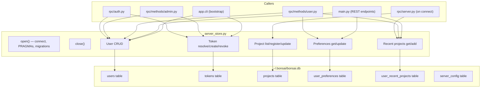

# Server Store — Module Design

> Parent: [Storage Architecture](../../../docs/STORAGE_ARCHITECTURE.md) | Status: **Active** | Created: 2026-04-13

## Purpose

Central abstraction for server-level and user-level persistent storage. Owns the SQLite database connection and provides typed async methods for user management, token resolution, project registry, and preference storage. All server-scoped data flows through this module.

## Internal Architecture

**Pattern:** Async facade over single `aiosqlite` connection.

## File Organization

| File | Responsibility | Depends On |
|------|---------------|------------|
| `server_store.py` | SQLite connection, schema, all CRUD methods | `aiosqlite`, `config.py` (get_data_dir) |
| `config.py` | `get_data_dir()` function, `ServerSettings.data_dir` | `pydantic-settings` |

## Public Interface

### Lifecycle

| Method | Signature | Description |
|--------|-----------|-------------|
| `open` | `async () -> None` | Open DB connection, set PRAGMAs, run migrations |
| `close` | `async () -> None` | Close DB connection |

### Users

| Method | Signature | Description |
|--------|-----------|-------------|
| `get_user` | `async (user_id: str) -> User \| None` | Look up by ID |
| `create_user` | `async (user_id: str, display_name: str, *, is_admin: bool = False) -> User` | Create new user |
| `ensure_user` | `async (user_id: str, display_name: str) -> User` | Get or create |
| `list_users` | `async () -> list[User]` | All users |
| `user_count` | `async () -> int` | Total user count |
| `admin_count` | `async () -> int` | Count of admin users |
| `set_admin` | `async (user_id: str, is_admin: bool) -> None` | Set/revoke admin flag |
| `delete_user` | `async (user_id: str) -> None` | Delete user + cascade (tokens, prefs, recents) |

### Tokens

| Method | Signature | Description |
|--------|-----------|-------------|
| `resolve_token` | `async (token: str) -> str \| None` | Token -> user_id |
| `create_token` | `async (user_id: str) -> str` | Generate `bns_` + 32 hex chars |
| `revoke_token` | `async (token: str) -> None` | Delete token |
| `list_tokens` | `async (user_id: str) -> list[Token]` | Tokens for user |

### Projects

| Method | Signature | Description |
|--------|-----------|-------------|
| `list_projects` | `async () -> list[KnownProject]` | All known projects |
| `register_project` | `async (path: str, name: str) -> None` | Idempotent upsert |
| `update_project_last_opened` | `async (path: str) -> None` | Update timestamp |
| `remove_project` | `async (path: str) -> None` | Remove from registry |

### User Preferences

| Method | Signature | Description |
|--------|-----------|-------------|
| `get_preferences` | `async (user_id: str) -> dict` | Preference JSON blob |
| `update_preferences` | `async (user_id: str, patch: dict) -> dict` | Merge patch, return result |

### User Recent Projects

| Method | Signature | Description |
|--------|-----------|-------------|
| `get_recent_projects` | `async (user_id: str, limit: int = 10) -> list[RecentProject]` | Ordered by last_opened DESC |
| `add_recent_project` | `async (user_id: str, project_path: str) -> None` | Upsert with current timestamp |

## Models

| Model | Fields | Description |
|-------|--------|-------------|
| `User` | `id, display_name, is_admin, created_at, updated_at` | Server-wide user identity |
| `Token` | `token, user_id, created_at` | Auth token |
| `KnownProject` | `path, name, registered_at, last_opened_at` | Registered project |
| `RecentProject` | `project_path, name, last_opened` | User's recent project entry |

Models are Python `dataclass` instances. `User` and `KnownProject` map 1:1 to DB rows.

## Design Decisions

| Decision | Choice | Rationale |
|----------|--------|-----------|
| Single connection | One `aiosqlite` connection | SQLite serializes writes anyway; avoids pool complexity |
| PRAGMAs in `open()` | Set once on connection | Connection-level settings in SQLite; must be set per-connection |
| `WITHOUT ROWID` | All TEXT-PK tables | No wasted hidden rowid for text-keyed lookups |
| Preferences as JSON | `prefs TEXT` column | Avoids schema migration per preference; Pydantic validates |
| Idempotent `register_project` | `INSERT OR REPLACE` | Called on every WebSocket connect; must be safe to repeat |
| `ensure_user` pattern | Get-or-create in one method | Simplifies callers during token migration |

## Dependencies

| Dependency | Usage |
|------------|-------|
| `aiosqlite` | Async SQLite access without blocking event loop |
| `core/config` | `get_data_dir()` for database file path |
| `secrets` | Token generation (`secrets.token_hex`) |

## Known Limitations

- Single `aiosqlite` connection may bottleneck under very high read concurrency (>100 concurrent reads). Add connection pool if needed.
- No token expiration — tokens live forever until revoked.
- Schema migrations are manual — will need Alembic when schema grows.
- At least one admin must exist — enforced by `admin_count()` checks in RPC layer, not at DB level.
