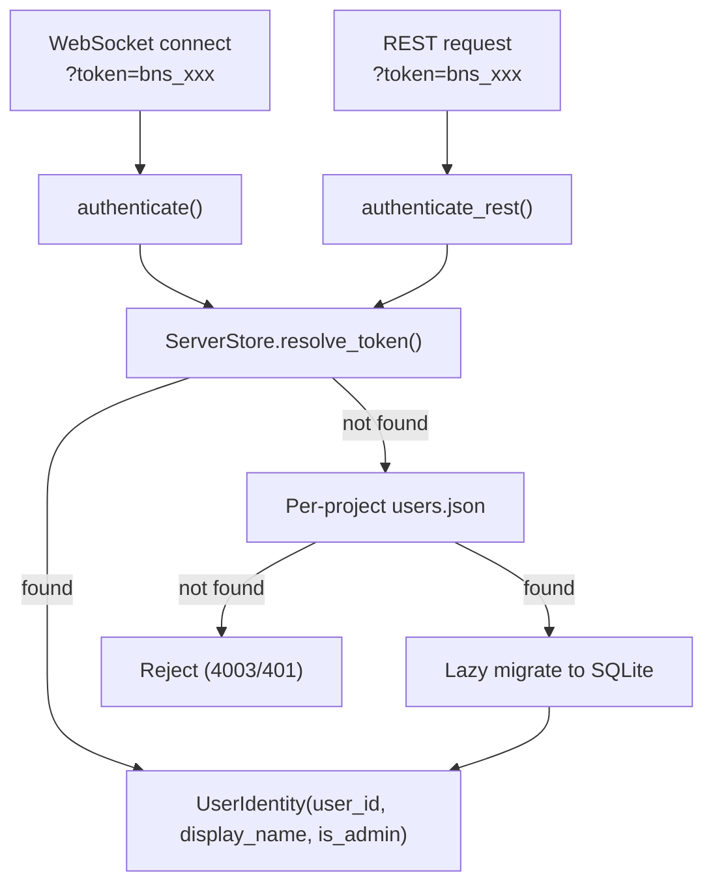

# Server-Wide Auth — Module Design

> Parent: [Storage Architecture](../../../docs/STORAGE_ARCHITECTURE.md) | Status: **Active** | Created: 2026-04-13

## Purpose

Migrate authentication from per-project `users.json` to server-wide SQLite token storage. Every connection requires a valid token — no anonymous access. Existing per-project tokens are lazily migrated on first use.

## Internal Architecture



## Current State (to be changed)

**File:** `backend/app/rpc/auth.py`

- `authenticate(project_root, token)` reads per-project `users.json`
- `allowAnonymous` flag permits tokenless access
- Each project has independent user/token lists
- Same person has separate tokens per project

## Target State

- `authenticate(server_store, project_root, token)` checks SQLite first
- Fallback to per-project `users.json` for backwards compatibility
- On fallback hit: lazy-migrate token + user to server-wide SQLite
- No token or invalid token → reject (no anonymous path)
- `allowAnonymous` removed from auth flow

## Auth Flow

### WebSocket Authentication

1. Client connects: `ws://host/ws?project=/path&token=bns_xxx`
2. No token → reject with code 4003
3. `server_store.resolve_token(token)` → `user_id`
4. If found → `server_store.get_user(user_id)` → `UserIdentity`
5. If not found → fall back to per-project `users.json`
   - If found there → `server_store.ensure_user()` + `server_store.register_token()` (migrate)
   - If not found → reject with code 4003

### REST Authentication

1. Token from `?token=` query param or `Authorization: Bearer` header
2. Same resolution logic as WebSocket
3. Invalid/missing → HTTP 401

### Bootstrap (first-time setup)

**Web UI (portable executable):** On first launch with zero users, frontend shows SetupScreen → `POST /api/setup` creates the first admin + token.

**CLI (development / server):**
```bash
cd backend && uv run python -m app.cli create-user --id danya --name "Danya" --admin
# Output: Created user "danya" (Danya) [admin]
# Token: bns_a8f3k2m9...
```

### Admin Role

`UserIdentity` includes `is_admin: bool` (default `False`). The `admin/*` RPC namespace requires `is_admin = True`. Per-project fallback users are always `is_admin = False`.

## Files to Modify

| File | Change |
|------|--------|
| `backend/app/rpc/auth.py` | Add `server_store` param to `authenticate()`, two-tier lookup, remove `allowAnonymous` |
| `backend/app/rpc/server.py` | Pass `server_store` to `authenticate()`, register project on connect |
| `backend/app/main.py` | Add REST auth helper, setup endpoints, CLI entry point for `create-user` |
| `backend/app/rpc/methods/admin.py` | **NEW** — Admin RPC handlers (`admin/*`) |

## Design Decisions

| Decision | Choice | Rationale |
|----------|--------|-----------|
| No anonymous users | Reject without token | Simplifies model; every connection has a user identity |
| Lazy migration | Fallback to per-project `users.json` | Zero-downtime; existing tokens keep working |
| Keep per-project files | Don't delete `users.json` | Backwards compat if someone downgrades |
| CLI bootstrap | `app.cli create-user` | Solves chicken-and-egg (need token to connect, but creation requires connection) |

## Known Limitations

- Per-project `users.json` `allowAnonymous` flag is ignored after this change — breaking for projects that relied on anonymous access
- No password/OAuth — token-only auth (tokens provisioned externally)
- Token migration is one-way (SQLite → project `users.json` sync not implemented)
