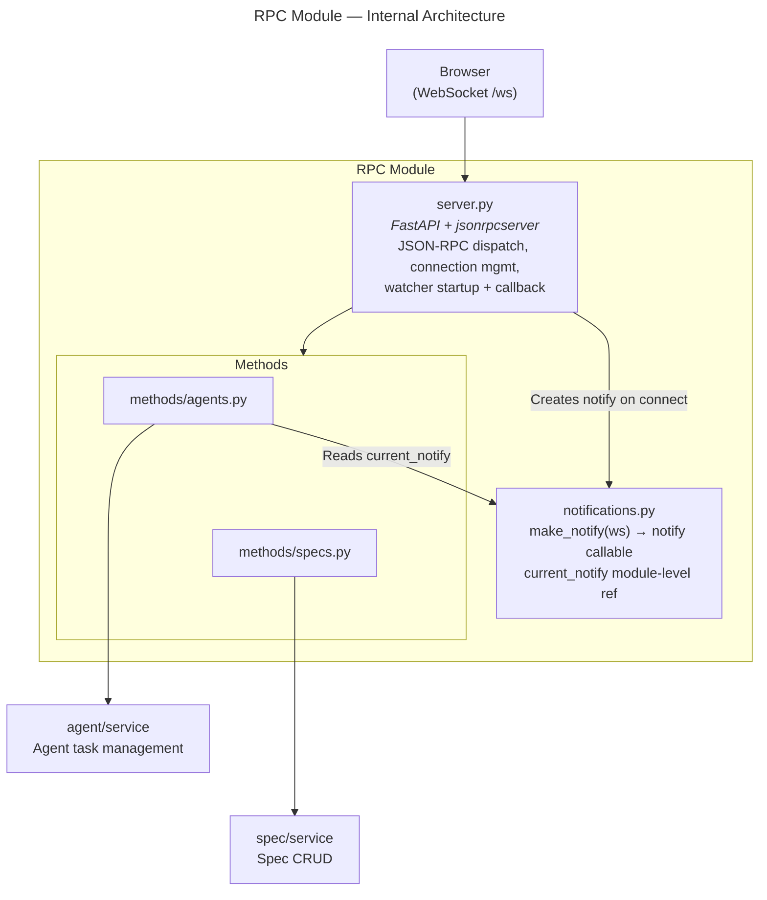
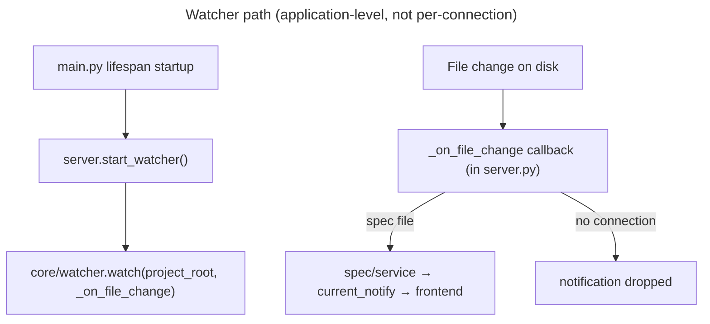
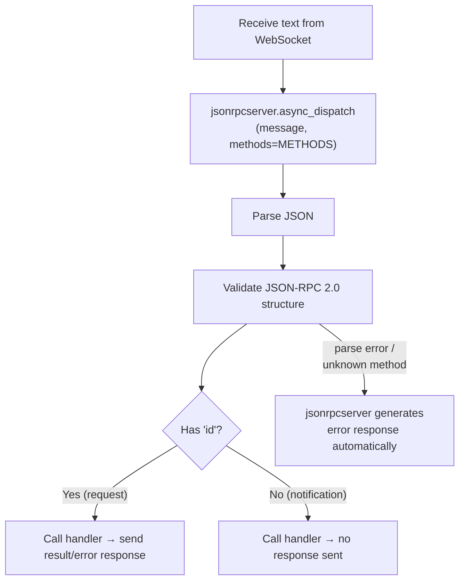

# RPC Module — Design Specification

> Parent: [DESIGN_DOC.md](../../../DESIGN_DOC.md) | Status: **Active** | Created: 2026-02-26

## Table of Contents
1. [Purpose](#purpose)
2. [Protocol Overview](#protocol-overview)
3. [Methods](#methods)
4. [Error Codes](#error-codes)
5. [Internal Architecture](#internal-architecture)
6. [File Organization & Public Interface](#file-organization--public-interface)
7. [JSON-RPC Dispatch](#json-rpc-dispatch)
8. [Connection Management](#connection-management)
9. [Watcher Integration](#watcher-integration)
10. [Design Decisions](#design-decisions)
11. [Dependencies](#dependencies)
12. [Known Limitations](#known-limitations)
13. [Related Specs](#related-specs)

## Purpose

The RPC module is the transport layer bridging the WebSocket connection and the domain modules.
It manages the WebSocket connection lifecycle, parses and dispatches incoming JSON-RPC 2.0
messages to domain handlers using `jsonrpcserver`, sends outgoing server→client messages
(notifications and server-initiated requests), and starts and routes the filesystem watcher.

## Protocol Overview

**Style:** JSON-RPC 2.0 over WebSocket — true bidirectional (LSP-style)

All communication happens over a single WebSocket at `/ws`. Messages follow JSON-RPC 2.0:
- **Requests** have `id` + `method` + `params`; the other side must send back a response with the same `id`
- **Notifications** omit `id`; fire-and-forget, no response expected

Both sides can send either. The server can initiate requests to the client (e.g. asking a question mid-agent-run), and the client responds via `agent/respond`.

**Wire format convention:** All JSON-RPC params and result keys use **camelCase** (e.g. `taskId`, `sessionId`, `specIds`). Python models use `snake_case` internally and convert via Pydantic `alias_generator` + `model_dump(by_alias=True)`.

## Methods

### Client → Server (requests)

| Method            | Params                                                                                       | Returns             | Description                                                                                                                                                 |
|-------------------|----------------------------------------------------------------------------------------------|---------------------|-------------------------------------------------------------------------------------------------------------------------------------------------------------|
| `spec/list`       | `{}`                                                                                         | `list[SpecSummary]` | List all specs with metadata                                                                                                                                |
| `spec/get`        | `{ id: str }`                                                                                | `SpecDetail`        | Get spec content and metadata                                                                                                                               |
| `spec/create`     | `{ type: str, path: str, content?: str, id?: str }`                                           | `SpecDetail`        | Create a new spec                                                                                                                                           |
| `spec/update`     | `{ id: str, content: str }`                                                                  | `SpecDetail`        | Update spec content                                                                                                                                         |
| `spec/delete`     | `{ id: str }`                                                                                | `null`              | Delete a spec                                                                                                                                               |
| `spec/graph`      | `{}`                                                                                         | `SpecGraph`         | Get spec hierarchy graph                                                                                                                                    |
| `agent/run`       | `{ specIds: list[str], config: AgentConfig }`                                                | `{ taskId: str, sessionId: str }` | Start a persistent agent session with spec context. Session enters `idle` state, ready for messages. |
| `agent/send`      | `{ taskId: str, text: str }`                                                                 | `null`              | Send a user message to the session, triggering a new turn. Session must be `idle`.                                                                          |
| `agent/status`    | `{ taskId: str }`                                                                            | `AgentTask`         | Get session status and metadata                                                                                                                             |
| `agent/list`      | `{}`                                                                                         | `list[AgentTask]`   | List all agent sessions                                                                                                                                     |
| `agent/interrupt` | `{ taskId: str }`                                                                            | `null`              | Cancel the current turn. Session stays `idle` and can accept new messages.                                                                                  |
| `agent/end`       | `{ taskId: str }`                                                                            | `null`              | Gracefully close the session. Session enters `done` state.                                                                                                  |
| `agent/respond`   | `{ taskId: str, requestId: str, response: AskUserQuestionResponse \| ToolApprovalResponse }` | `null`              | Respond to a pending server→client request. See [Agent Module models](../agent/README.md#interactive-requestresponse-models) for response type definitions. |

### Server → Client (notifications)

#### Spec Watcher Events

| Method | Params | Description |
| --- | --- | --- |
| `spec/didChange` | `{ id: str, changes: object }` | Spec file changed on disk |
| `spec/didCreate` | `{ id: str, path: str }` | New spec file detected |
| `spec/didDelete` | `{ id: str }` | Spec file removed |
| `registry/didUpdate` | `{ registry: object }` | registry.json changed |

#### Agent Streaming Events

| Method | Params | Description |
| --- | --- | --- |
| `agent/sessionStart` | `{ taskId, sessionId, model, tools[], cwd, permissionMode }` | Agent session initialized |
| `agent/textDelta` | `{ taskId, sessionId, text, streaming }` | Text output (streaming or full block) |
| `agent/toolCallStart` | `{ taskId, sessionId, toolUseId, toolName, toolInput, parentToolUseId? }` | Agent started a tool call |
| `agent/toolCallEnd` | `{ taskId, sessionId, toolUseId, toolName, output, isError }` | Tool call completed with result |
| `agent/subagentStart` | `{ taskId, sessionId, agentId, agentType, parentToolUseId }` | Subagent spawned |
| `agent/subagentEnd` | `{ taskId, sessionId, agentId }` | Subagent finished |
| `agent/notification` | `{ taskId, sessionId, message, title? }` | General agent notification |
| `agent/compact` | `{ taskId, sessionId, trigger, preTokens }` | Context window compacted |
| `agent/progress` | `{ taskId, sessionId, status, message }` | Task progress update |
| `agent/turnComplete` | `{ taskId, sessionId, result, costUsd, turns, durationMs, usage }` | Turn finished; session is `idle`, ready for next `agent/send` |
| `agent/interrupted` | `{ taskId, sessionId }` | Current turn was cancelled via `agent/interrupt`; session is `idle` |
| `agent/done` | `{ taskId, sessionId, result, costUsd, turns, durationMs, usage }` | Session closed (via `agent/end` or terminal condition) |
| `agent/error` | `{ taskId, sessionId, subtype, errors[], result, costUsd, turns, durationMs, usage }` | Session ended due to error |
| `agent/permissionDenied` | `{ taskId, sessionId, toolName, toolInput }` | Tool blocked by permission policy |

> **SDK event mapping:** `agent/sessionStart` ← `SDKSystemMessage` subtype `init` · `agent/textDelta` ← `SDKAssistantMessage` text block / `SDKPartialAssistantMessage` text_delta · `agent/toolCallStart` ← `SDKAssistantMessage` tool_use block · `agent/toolCallEnd` ← `SDKUserMessage` tool_result block · `agent/subagentStart` / `End` ← `SubagentStart` / `SubagentStop` hooks · `agent/notification` ← `Notification` hook · `agent/compact` ← `SDKCompactBoundaryMessage` · `agent/turnComplete` ← `SDKResultMessage` (turn ends, session stays open) · `agent/interrupted` ← `agent/interrupt` cancels current turn · `agent/done` ← session closed via `agent/end` · `agent/error` / `permissionDenied` ← `SDKResultMessage` error subtypes

> **Streaming text:** Requires `includePartialMessages: true` in SDK options to receive `agent/textDelta` with `streaming: true`. Without it, full text blocks are emitted per turn.

### Server → Client (requests)

The server suspends an `asyncio.Future` keyed by `requestId` until the client responds. If no response arrives within a timeout, the server auto-denies and continues.

| Method | Params | Expected Response | Description |
| --- | --- | --- | --- |
| `agent/askUserQuestion` | `{ taskId, requestId, questions: Question[] }` | [`AskUserQuestionResponse`](../agent/README.md#interactive-requestresponse-models) | Ask the user a question during an agent run |
| `agent/confirmAction` | `{ taskId, requestId, toolName, toolInput }` | [`ToolApprovalResponse`](../agent/README.md#interactive-requestresponse-models) | Request approval for a tool action |

Both methods originate from the SDK's `canUseTool` callback. `runner.py` distinguishes them by `tool_name`: `"AskUserQuestion"` → `agent/askUserQuestion`, any other tool → `agent/confirmAction`. See [Agent Module — Interactive Request/Response Models](../agent/README.md#interactive-requestresponse-models) for `Question`, `QuestionOption`, `AskUserQuestionResponse`, and `ToolApprovalResponse` type definitions.

## Error Codes

Domain exceptions raised inside handlers are mapped to JSON-RPC error responses:

| Exception | JSON-RPC Code | Message |
| --- | --- | --- |
| `SpecNotFoundError` | -32001 | "Spec not found" |
| `RegistryError` | -32002 | "Registry error" |
| `ValidationError` | -32003 | "Validation error" |
| `AgentTaskNotFoundError` | -32011 | "Agent task not found" |
| `FutureNotFoundError` | -32012 | "No pending request" |
| `KeyError` / missing params | -32602 | "Invalid params" |
| Any other exception | -32603 | "Internal error" |

Standard errors (-32700 parse error, -32601 method not found) are handled automatically by jsonrpcserver.

## Internal Architecture

**Pattern:** Three-layer — WebSocket transport + dispatch in `server.py`, domain-organized
handlers in `methods/`, outgoing message factory in `notifications.py`.





## File Organization & Public Interface

### server.py

**Responsibility:** WebSocket endpoint, connection management, JSON-RPC dispatch loop, watcher startup + callback.

**Dependencies:** jsonrpcserver, methods/specs, methods/agents, notifications, core/watcher, core/config, spec/service

| Export | Signature | Description |
| --- | --- | --- |
| `register_routes` | `(app: FastAPI, config: AppConfig) → None` | Register the `/ws` WebSocket endpoint on the FastAPI app. Called by `main.py` during setup. |
| `start_watcher` | `async (config: AppConfig) → WatchHandle` | Start `core/watcher` watching the project directory. Register the file-change callback. Called in `main.py` lifespan startup. |
| `stop_watcher` | `async (handle: WatchHandle) → None` | Stop the file watcher. Called in `main.py` lifespan shutdown. |

`METHODS` is a mapping from JSON-RPC method names to handler coroutines, assembled in `server.py` from the functions in `methods/specs.py` and `methods/agents.py`.

### notifications.py

**Responsibility:** `make_notify` factory + `current_notify` module-level variable — creates per-connection notify callable, holds reference to active callable.

**Dependencies:** none

| Export | Type / Signature | Description |
| --- | --- | --- |
| `make_notify` | `(websocket: WebSocket) → NotifyCallable` | Create a notify callable bound to the given WebSocket. Called by `server.py` on each new connection. |
| `current_notify` | `NotifyCallable \| None` | Module-level variable holding the active notify callable. Set by `server.py` on connect, cleared on disconnect. |

**`NotifyCallable`** type alias:
```python
NotifyCallable = Callable[[str, dict, str | None], Awaitable[None]]
```

**Returned callable signature:**
```python
async def notify(method: str, params: dict, request_id: str | None = None) -> None
```
- `request_id=None` → send JSON-RPC **notification** (message has no `id` field)
- `request_id` set → send JSON-RPC **request** (message includes `id` field; `request_id` value appears as both the JSON-RPC `id` and in `params.requestId` so the client can reference it in `agent/respond`)

### methods/specs.py

**Responsibility:** jsonrpcserver handlers for all `spec/*` methods.

**Dependencies:** spec/service

| Export | Signature | Description |
| --- | --- | --- |
| `list_specs` | `(**params) → list[SpecSummary]` | Handler for `spec/list` |
| `get_spec` | `(**params) → SpecDetail` | Handler for `spec/get` |
| `create_spec` | `(**params) → SpecDetail` | Handler for `spec/create` |
| `update_spec` | `(**params) → SpecDetail` | Handler for `spec/update` |
| `delete_spec` | `(**params) → None` | Handler for `spec/delete` |
| `get_graph` | `(**params) → SpecGraph` | Handler for `spec/graph` |

### methods/agents.py

**Responsibility:** jsonrpcserver handlers for all `agent/*` methods.

**Dependencies:** agent/service, notifications

| Export | Signature | Description |
| --- | --- | --- |
| `run_agent` | `(**params) → dict` | Handler for `agent/run` |
| `send_message` | `(**params) → None` | Handler for `agent/send` |
| `get_agent_status` | `(**params) → AgentTask` | Handler for `agent/status` |
| `list_agents` | `(**params) → list[AgentTask]` | Handler for `agent/list` |
| `interrupt_agent` | `(**params) → None` | Handler for `agent/interrupt` |
| `end_session` | `(**params) → None` | Handler for `agent/end` |
| `respond_agent` | `(**params) → None` | Handler for `agent/respond` |

`run_agent` captures `current_notify` at call time (the active connection's notify callable), passes it to `agent/service.run_task`, and immediately returns `{ taskId, sessionId }`. The agent session runs in the background; the runner enters a conversation loop waiting for messages.

`send_message` routes to `agent/service.send_message(task_id, text)`, which enqueues the message. The runner picks it up and starts a new turn.

`end_session` routes to `agent/service.end_session(task_id)`, which sends a sentinel to the runner's message queue, causing it to close the SDK client and emit `agent/done`.

`respond_agent` routes to `agent/service.respond(task_id, request_id, response)`, which resolves the pending `asyncio.Future` in `tracker.py`.

## JSON-RPC Dispatch



## Connection Management

- Single active WebSocket connection at a time (single developer tool, localhost only)
- On connect: create `notify = make_notify(ws)`, set `notifications.current_notify = notify`, begin dispatch loop
- On disconnect / close: set `notifications.current_notify = None`
- If a second client connects while one is already active, the new connection replaces the old one (previous connection is closed)

## Watcher Integration

1. `main.py` calls `server.start_watcher()` in the FastAPI lifespan startup event.
2. `start_watcher()` calls `core/watcher.watch([project_root], _on_file_change)`.
3. On file change, `_on_file_change(path, change_type)` runs:
   - Routes by file type:
     - `.specs/registry.json` → send `registry/didUpdate` via `current_notify`
     - Any path registered as a spec in the registry (`*.md` or `*.json` spec files) → call `spec/service` to validate/postprocess → send `spec/didChange`, `spec/didCreate`, or `spec/didDelete` via `current_notify`
     - Source files (`*.py`, `*.ts`, …) → no-op (future: coverage/health)
   - If `notifications.current_notify is None` (no connected client): notifications are dropped silently
4. At shutdown, `main.py` calls `server.stop_watcher(handle)`.

## Design Decisions

| Decision | Choice | Rationale |
|----------|--------|-----------|
| JSON-RPC library | `jsonrpcserver` | Handles parse errors, method-not-found, and response formatting automatically; eliminates boilerplate in handlers |
| Notify interface | Single `notify(method, params, request_id=None)` | Unified callable for notifications and server-initiated requests; decouples runner from WebSocket details |
| Watcher lifecycle | Application startup via `main.py` lifespan | Watcher is filesystem-level; filesystem changes are independent of client connection state |
| `current_notify` in `notifications.py` | Module-level mutable ref, set by `server.py` on connect/disconnect | Avoids circular import between `server.py` and `methods/agents.py`; `notifications.py` is the natural owner of active-connection state |
| Methods organized by domain namespace | `methods/specs.py`, `methods/agents.py` | Each file mirrors its domain module; easy to locate handlers by method prefix |
| `METHODS` dict assembled in `server.py` | Explicit mapping from method name to handler | Avoids implicit global state from decorator-based registration; makes method set inspectable |
| No RPC-layer models | Domain models serialized directly | Pydantic models in spec/ and agent/ serialize to JSON; no translation layer needed |

## Dependencies

| Dependency | Usage |
|------------|-------|
| `fastapi` | WebSocket endpoint and app integration |
| `jsonrpcserver` | JSON-RPC 2.0 message parsing and dispatch |
| `spec/service` | Spec CRUD operations; watcher postprocessing |
| `agent/service` | Agent task management |
| `core/watcher` | File change detection |
| `core/config` | Project root path for watcher |

## Known Limitations

- **No reconnect replay:** File changes that occur while no client is connected are not queued; they are dropped. A reconnecting client will not receive missed notifications.
- **Single connection only:** No explicit rejection or queuing of concurrent clients; the second connection silently replaces the first.
- **No authentication:** The WebSocket endpoint at `/ws` has no auth; assumes localhost-only access.
- **Pending agent futures on disconnect:** If the client disconnects mid-agent-run, `notifications.current_notify` becomes `None`; outgoing agent events are dropped. Pending `asyncio.Future` objects in `tracker.py` will time out per the configured deadline.

## Related Specs

- **Parent:** [Architecture Design](../../../DESIGN_DOC.md)
- **Depends on:** [Spec Module](../spec/README.md), [Agent Module](../agent/README.md), [Core Module](../core/README.md)
- **Related files:** `main.py` — FastAPI entry point; calls `register_routes` and manages watcher lifespan
