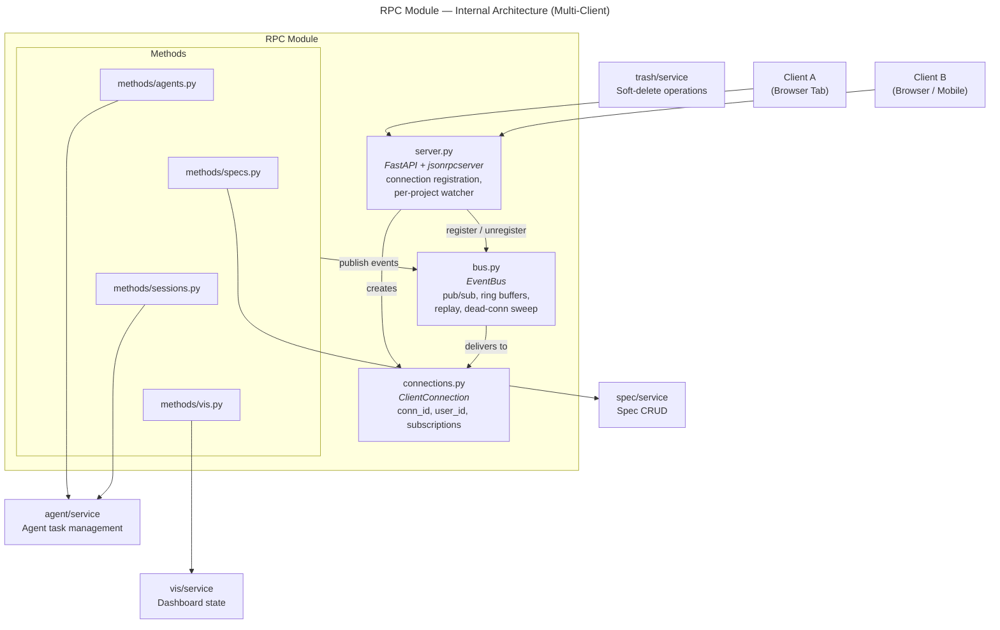
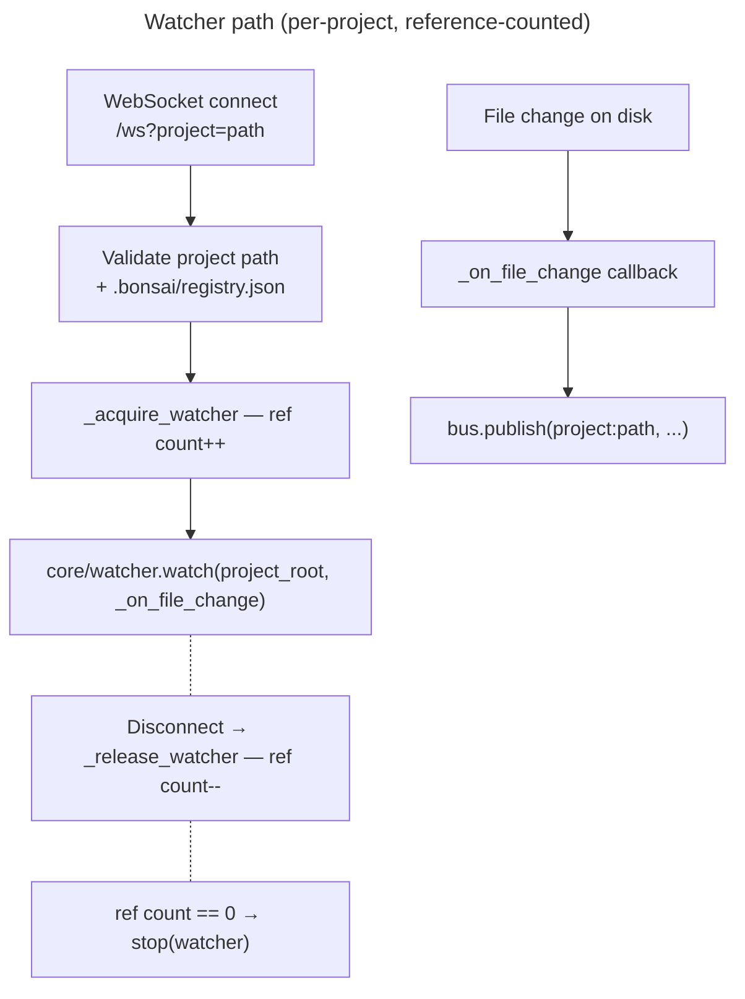
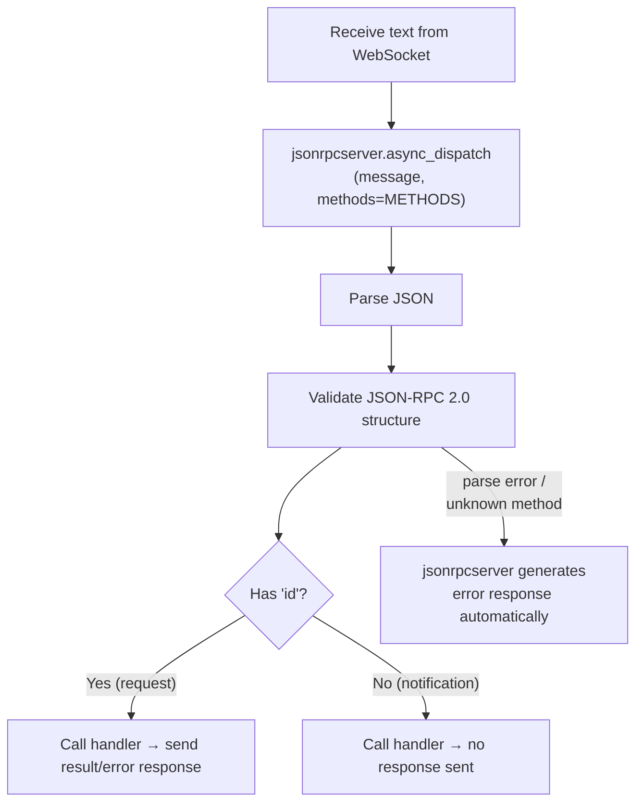

# RPC Module — Design Specification

> Parent: [DESIGN_DOC.md](../../../DESIGN_DOC.md) | Status: **Active** | Created: 2026-02-26 | Updated: 2026-04-12

## Table of Contents
1. [Purpose](#purpose)
2. [Protocol Overview](#protocol-overview)
3. [Methods](#methods)
4. [Error Codes](#error-codes)
5. [Internal Architecture](#internal-architecture)
6. [File Organization & Public Interface](#file-organization--public-interface)
7. [JSON-RPC Dispatch](#json-rpc-dispatch)
8. [Connection Management](#connection-management)
9. [Watcher Integration](#watcher-integration)
10. [Design Decisions](#design-decisions)
11. [Dependencies](#dependencies)
12. [Known Limitations](#known-limitations)
13. [Related Specs](#related-specs)

## Purpose

The RPC module is the transport layer bridging the WebSocket connection and the domain modules.
It manages the WebSocket connection lifecycle, parses and dispatches incoming JSON-RPC 2.0
messages to domain handlers using `jsonrpcserver`, sends outgoing server→client messages
(notifications and server-initiated requests), and starts and routes the filesystem watcher.

## Protocol Overview

**Style:** JSON-RPC 2.0 over WebSocket — true bidirectional (LSP-style)

All communication happens over a single WebSocket at `/ws?project=<path>`. Messages follow JSON-RPC 2.0:
- **Requests** have `id` + `method` + `params`; the other side must send back a response with the same `id`
- **Notifications** omit `id`; fire-and-forget, no response expected

Both sides can send either. The server can initiate requests to the client (e.g. asking a question mid-agent-run), and the client responds via `agent/respond`.

**Wire format convention:** All JSON-RPC params and result keys use **camelCase** (e.g. `bonsaiSid`, `sessionId`, `specIds`). Python models use `snake_case` internally and convert via Pydantic `alias_generator` + `model_dump(by_alias=True)`.

## Methods

### Client → Server (requests)

| Method            | Params                                                                                       | Returns             | Description                                                                                                                                                 |
|-------------------|----------------------------------------------------------------------------------------------|---------------------|-------------------------------------------------------------------------------------------------------------------------------------------------------------|
| `spec/list`       | `{}`                                                                                         | `list[SpecSummary]` | List all specs with metadata                                                                                                                                |
| `spec/get`        | `{ id: str }`                                                                                | `SpecDetail`        | Get spec content and metadata                                                                                                                               |
| `spec/create`     | `{ type: str, path: str, content?: str, id?: str }`                                           | `SpecDetail`        | Create a new spec                                                                                                                                           |
| `spec/update`     | `{ id: str, content: str }`                                                                  | `SpecDetail`        | Update spec content                                                                                                                                         |
| `spec/delete`     | `{ id: str }`                                                                                | `null`              | Delete a spec                                                                                                                                               |
| `spec/graph`      | `{}`                                                                                         | `SpecGraph`         | Get spec hierarchy graph                                                                                                                                    |
| `agent/run`       | `{ specIds: list[str], config: AgentConfig, skillId?: str }`                                 | `{ bonsaiSid: str }`   | Start a persistent agent session with spec and optional skill context. If `skillId` is provided, the skill's instructions (from the Bonsai plugin's `SKILL.md`) are loaded and prepended to the system prompt. Session starts in `idle` state, ready for messages. `sessionId` arrives later via `agent/sessionStart` notification. See [Agent Context](../agent/CONTEXT.md). |
| `agent/send`      | `{ bonsaiSid: str, text: str }`                                                                 | `null`              | Send a user message to the session, triggering a new turn. Session must be `idle`.                                                                          |
| `agent/status`    | `{ bonsaiSid: str }`                                                                            | `AgentTask`         | Get session status and metadata                                                                                                                             |
| `agent/list`      | `{}`                                                                                         | `list[AgentTask]`   | List all agent sessions                                                                                                                                     |
| `agent/interrupt` | `{ bonsaiSid: str }`                                                                            | `null`              | Cancel the current turn. Session stays `idle` and can accept new messages.                                                                                  |
| `agent/end`       | `{ bonsaiSid: str }`                                                                            | `null`              | Gracefully close the session. Session enters `done` state.                                                                                                  |
| `agent/respond`   | `{ bonsaiSid: str, requestId: str, response: AskUserQuestionResponse \| ToolApprovalResponse }` | `null`              | Respond to a pending server→client request. See [Agent Module models](../agent/README.md#interactive-requestresponse-models) for response type definitions. |
| `session/list`    | `{}`                                                                                         | `list[SessionSummary]` | List all sessions (in-memory active + on-disk archived from `.bonsai/sessions/`) |
| `session/get`     | `{ bonsaiSid: str }`                                                                            | `SessionData \| null`  | Get full session data including events from disk |
| `session/continue`| `{ bonsaiSid: str }`                                                                            | `{ bonsaiSid: str }`   | Resume a session — reuses the same `bonsaiSid`, loads old conversation as context for a new SDK session |
| `session/delete`  | `{ bonsaiSid: str }`                                                                            | `bool`              | Delete a session from disk |
| `session/subscribe` | `{ bonsaiSid: str }`                                                                          | `null`              | Subscribe calling connection to a session's event topic (multi-client) |
| `session/unsubscribe` | `{ bonsaiSid: str }`                                                                        | `null`              | Unsubscribe calling connection from a session's event topic |
| `agent/transcribe`| `{ audioBase64: str, mimeType: str }`                                                        | `{ text: str }`     | Transcribe audio via OpenAI Whisper API (fallback for browsers without Web Speech API). See [TRANSCRIBE.md](../agent/TRANSCRIBE.md). |
| `vis/state`       | `{}`                                                                                         | `DashboardState`    | Return the current dashboard state without recomputing. State is computed on WebSocket connect and after file changes. |
| `vis/recompute`   | `{}`                                                                                         | `DashboardState`    | Force a dashboard recompute from registry, specs, and tasks on disk. Returns the new state and pushes `vis/stateChanged` notification. |
| `trash/list`      | `{ type?: str }`                                                                             | `list[TrashedItem]` | List all trashed items, optionally filtered by type (`sessions`, `tickets`, `specs`, `plans`, `drafts`, `patches`) |
| `trash/purge`     | `{ type: str, id: str }`                                                                     | `null`              | Permanently delete a specific trashed item |
| `trash/empty`     | `{ type?: str }`                                                                             | `null`              | Permanently delete all trashed items, optionally filtered by type |
| `trash/restoreSpec` | `{ specId: str }`                                                                          | `{ registryEntry, links }` | Restore a trashed spec: moves file back to original location and returns registry entry + links for caller to re-insert into registry |
| `trash/restorePlan` | `{ ticketId: str }`                                                                        | `null`              | Restore a trashed plan file back to `.bonsai/plans/` |
| `trash/restoreDraft` | `{ trashItemId: str }`                                                                    | `{ manifestEntry }` | Restore a trashed draft file and return its manifest entry for re-insertion |
| `trash/restorePatches` | `{ ticketId: str }`                                                                     | `null`              | Restore trashed patches directory back to `.bonsai/spec-patches/` |
| `board/list`      | `{}`                                                                                         | `list[TicketSummary]` | List all meta-tickets |
| `board/get`       | `{ id: str }`                                                                                | `MetaTicket`        | Get full ticket with body, patches, links |
| `board/create`    | `{ title: str, body?: str, type?: str }`                                                     | `MetaTicket`        | Create a new meta-ticket |
| `board/update`    | `{ id: str, title?: str, body?: str, status?: str, type?: str }`                             | `MetaTicket`        | Update ticket fields |
| `board/delete`    | `{ id: str }`                                                                                | `null`              | Delete a meta-ticket |
| `board/reorder`   | `{ id: str, status: str, order: int }`                                                       | `MetaTicket`        | Move ticket to a status column at a position |
| `board/linkSpec`  | `{ ticketId: str, specId: str }`                                                             | `MetaTicket`        | Link a spec to a ticket |
| `board/unlinkSpec`| `{ ticketId: str, specId: str }`                                                             | `MetaTicket`        | Unlink a spec from a ticket |
| `board/attachSession` | `{ ticketId: str, sessionId: str }`                                                      | `MetaTicket`        | Attach an agent session to a ticket |
| `board/detachSession` | `{ ticketId: str, sessionId: str }`                                                      | `MetaTicket`        | Detach an agent session from a ticket |
| `board/getPlan`   | `{ ticketId: str }`                                                                          | `Plan \| null`      | Get the plan for a ticket |
| `board/createPlan`| `{ ticketId: str, title: str, steps: list, verification?: list }`                            | `Plan`              | Create a plan for a ticket |
| `board/savePlan`  | `{ ticketId: str, plan: dict }`                                                              | `Plan`              | Save/update a plan |
| `board/getPlanRaw`| `{ ticketId: str }`                                                                          | `{ content: str }`  | Get plan as raw markdown |
| `board/savePlanRaw`| `{ ticketId: str, content: str }`                                                           | `Plan`              | Save plan from raw markdown |
| `board/updateStep`| `{ ticketId: str, stepNumber: int, status: str, sessionId?: str }`                           | `Plan`              | Update a plan step's status |
| `board/getNextStep`| `{ ticketId: str }`                                                                         | `Step \| null`      | Get the next actionable step |
| `board/listDrafts`| `{ ticketId: str }`                                                                          | `list[DraftEntry]`  | List spec draft entries for a ticket |
| `board/getDraftDiff`| `{ ticketId: str, index: int }`                                                             | `DraftDiff`         | Get diff for a specific draft |
| `board/applyDraft`| `{ ticketId: str, index: int }`                                                              | `null`              | Apply a single draft to the registry |
| `board/applyAllDrafts`| `{ ticketId: str }`                                                                       | `null`              | Apply all drafts for a ticket |
| `board/discardDraft`| `{ ticketId: str, index: int }`                                                             | `null`              | Discard (trash) a single draft |
| `board/discardAllDrafts`| `{ ticketId: str }`                                                                     | `null`              | Discard all drafts for a ticket |
| `board/listPatches`| `{ ticketId: str }`                                                                         | `list[SpecPatch]`   | List applied spec patches for a ticket |
| `board/getPatchDiff`| `{ ticketId: str, index: int }`                                                             | `PatchDiff`         | Get diff for an applied patch |
| `board/revertPatch`| `{ ticketId: str, index: int }`                                                             | `MetaTicket`        | Revert an applied patch |
| `board/setOrchestrator`| `{ ticketId: str, sessionId: str }`                                                     | `MetaTicket`        | Set the orchestrator session for a ticket |
| `board/setPlanPath`| `{ ticketId: str, planPath: str }`                                                          | `MetaTicket`        | Set the plan file path on a ticket |
| `settings/get`    | `{}`                                                                                         | `ProjectSettings`   | Get current project settings |
| `settings/update` | `{ settings: dict }`                                                                         | `ProjectSettings`   | Validate and save settings |
| `settings/ensureFile`| `{}`                                                                                       | `ProjectSettings`   | Create settings file with defaults if missing |
| `models/list`     | `{}`                                                                                         | `list[ModelDef]`    | Get cached model list |
| `models/refresh`  | `{}`                                                                                         | `list[ModelDef]`    | Refresh models from API |
| `skills/list`     | `{}`                                                                                         | `list[SkillDef]`    | List available skills with icon, group, requires metadata |

### Server → Client (notifications)

#### Spec Watcher Events

| Method | Params | Description |
| --- | --- | --- |
| `spec/didChange` | `{ id: str, changes: object }` | Spec file changed on disk |
| `spec/didCreate` | `{ id: str, path: str }` | New spec file detected |
| `spec/didDelete` | `{ id: str }` | Spec file removed |
| `registry/didUpdate` | `{ registry: object }` | registry.json changed |

#### File Notifications

| Method | Params | Description |
| --- | --- | --- |
| `files/treeChanged` | `{}` | File added/deleted in project, or `.bonsaihide` modified |
| `file/didChange` | `{ path: str }` | File content modified on disk (relative path from project root) |

#### Agent Streaming Events

| Method | Params | Description |
| --- | --- | --- |
| `agent/ready` | `{ bonsaiSid }` | SDK client initialized; session transitions from `initializing` to `idle` |
| `agent/sessionStart` | `{ bonsaiSid, sessionId, model, tools[], cwd, permissionMode }` | Agent session initialized |
| `agent/textDelta` | `{ bonsaiSid, sessionId, text, streaming, agentId? }` | Text output (streaming or full block). `agentId` present when text originates from a subagent. |
| `agent/toolCallStart` | `{ bonsaiSid, sessionId, toolUseId, toolName, toolInput, agentId? }` | Agent started a tool call. `agentId` present when the tool call originates from a subagent. |
| `agent/toolCallEnd` | `{ bonsaiSid, sessionId, toolUseId, toolName, output, isError, agentId? }` | Tool call completed with result. `agentId` present when the tool call originates from a subagent. |
| `agent/subagentStart` | `{ bonsaiSid, sessionId, agentId, agentType, taskToolUseId? }` | Subagent spawned. `taskToolUseId` is the `toolUseId` of the Task tool call that spawned this subagent (used internally by the backend to resolve `agentId` on subsequent events via `parent_tool_use_id`). |
| `agent/subagentEnd` | `{ bonsaiSid, sessionId, agentId }` | Subagent finished |
| `agent/notification` | `{ bonsaiSid, sessionId, message, title? }` | General agent notification |
| `agent/compact` | `{ bonsaiSid, sessionId, trigger, preTokens }` | Context window compacted |
| `agent/progress` | `{ bonsaiSid, sessionId, status, message }` | Task progress update |
| `agent/turnComplete` | `{ bonsaiSid, sessionId, result, costUsd, turns, durationMs, usage }` | Turn finished; session is `idle`, ready for next `agent/send` |
| `agent/interrupted` | `{ bonsaiSid, sessionId }` | Current turn was cancelled via `agent/interrupt`; session is `idle`. Preceded by synthetic `agent/subagentEnd` for any subagents still open when the interrupt fired. |
| `agent/done` | `{ bonsaiSid, sessionId, result, costUsd, turns, durationMs, usage }` | Session closed (via `agent/end` or terminal condition) |
| `agent/error` | `{ bonsaiSid, sessionId, subtype, errors[], result, costUsd, turns, durationMs, usage }` | Session ended due to error |
| `agent/permissionDenied` | `{ bonsaiSid, sessionId, toolName, toolInput }` | Tool blocked by permission policy |
| `agent/statusChanged` | `{ bonsaiSid, status }` | Backend session status changed. Emitted by runner on `idle→running` and `running→idle` transitions. Frontend uses this as the authoritative status signal for non-first turns (since `agent/sessionStart` only fires once per runner). Added to `_SKIP_METRICS` — does not trigger metadata persistence. |

#### Multi-Client Sync Events

| Method | Params | Description |
| --- | --- | --- |
| `session/didCreate` | `{ bonsaiSid, name, skillId, specIds, filePaths, status, config, metaTicketId, createdAt }` | A session was created or started — published to project topic so all clients see the new session with full metadata |
| `session/userMessage` | `{ bonsaiSid, text, isMarkdown }` | A user sent a message from another client — append to chat stream |
| `agent/requestResolved` | `{ bonsaiSid, requestId, resolvedBy, response }` | An interactive request (question/approval) was answered by another client — dismiss the pending card |
| `connection/didJoin` | `{ connId, userId, displayName }` | A new client connected to the project |
| `connection/didLeave` | `{ connId, userId, displayName }` | A client disconnected from the project |

#### Visualization Events

| Method | Params | Description |
| --- | --- | --- |
| `vis/stateChanged` | `DashboardState` | Dashboard state recomputed (triggered by file changes to `.md`/`.json` files or explicit `vis/recompute`) |

> **SDK event mapping:** `agent/ready` ← `ClaudeSDKClient` context manager entered · `agent/sessionStart` ← `SDKSystemMessage` subtype `init` · `agent/textDelta` ← `SDKAssistantMessage` text block / `SDKPartialAssistantMessage` text_delta · `agent/toolCallStart` ← `SDKAssistantMessage` tool_use block · `agent/toolCallEnd` ← `SDKUserMessage` tool_result block · `agent/subagentStart` / `End` ← `SubagentStart` / `SubagentStop` hooks · `agent/notification` ← `Notification` hook · `agent/compact` ← `SDKCompactBoundaryMessage` · `agent/turnComplete` ← `SDKResultMessage` (turn ends, session stays open) · `agent/interrupted` ← `agent/interrupt` cancels current turn · `agent/statusChanged` ← `tracker.set_status()` in runner (idle↔running) · `agent/done` ← session closed via `agent/end` · `agent/error` / `permissionDenied` ← `SDKResultMessage` error subtypes
>
> **Subagent event correlation:** The SDK provides `parent_tool_use_id` on `AssistantMessage` and `UserMessage` to identify which Task tool call produced each message. The runner builds a `tool_use_id → agent_id` mapping from `SubagentStart` hooks, then resolves `parent_tool_use_id` to `agentId` on outgoing `textDelta`, `toolCallStart`, and `toolCallEnd` notifications. This enables deterministic event grouping on the frontend.

> **Streaming text:** Requires `includePartialMessages: true` in SDK options to receive `agent/textDelta` with `streaming: true`. Without it, full text blocks are emitted per turn.

### Server → Client (requests)

The server suspends an `asyncio.Future` keyed by `requestId` until the client responds. If no response arrives within a timeout, the server auto-denies and continues.

| Method | Params | Expected Response | Description |
| --- | --- | --- | --- |
| `agent/askUserQuestion` | `{ bonsaiSid, requestId, questions: Question[] }` | [`AskUserQuestionResponse`](../agent/README.md#interactive-requestresponse-models) | Ask the user a question during an agent run |
| `agent/confirmAction` | `{ bonsaiSid, requestId, toolName, toolInput }` | [`ToolApprovalResponse`](../agent/README.md#interactive-requestresponse-models) | Request approval for a tool action. When `toolName === "ExitPlanMode"`, `toolInput` is enriched with `planContent: string` (accumulated assistant text). See [ExitPlanMode enrichment](../agent/README.md#exitplanmode-plan-content-enrichment). |
| `agent/suggestSession` | `{ bonsaiSid, requestId, skill, specIds, name, reason }` | [`ToolApprovalResponse`](../agent/README.md#interactive-requestresponse-models) | Suggest a follow-up session to the developer. Approve creates a new session with the suggested skill/specs; dismiss returns `PermissionResultAllow` with `dismissed: true` so the agent continues. |

All methods originate from the SDK's `canUseTool` callback. `runner.py` distinguishes them by `tool_name`: `"AskUserQuestion"` → `agent/askUserQuestion`, `"SuggestSession"` → `agent/suggestSession`, `"ExitPlanMode"` → `agent/confirmAction` (enriched with `planContent`), any other tool → `agent/confirmAction`. See [Agent Module — Interactive Request/Response Models](../agent/README.md#interactive-requestresponse-models) for `Question`, `QuestionOption`, `AskUserQuestionResponse`, and `ToolApprovalResponse` type definitions. See [SuggestSession Backend Spec](../agent/tools/SUGGEST_SESSION.md) for the suggestion wire format.

## Error Codes

Domain exceptions raised inside handlers are mapped to JSON-RPC error responses:

| Exception | JSON-RPC Code | Message |
| --- | --- | --- |
| `SpecNotFoundError` | -32001 | "Spec not found" |
| `RegistryError` | -32002 | "Registry error" |
| `ValidationError` | -32003 | "Validation error" |
| `AgentTaskNotFoundError` | -32011 | "Agent task not found" |
| `FutureNotFoundError` | -32012 | "No pending request" |
| `KeyError` / missing params | -32602 | "Invalid params" |
| Any other exception | -32603 | "Internal error" |

Standard errors (-32700 parse error, -32601 method not found) are handled automatically by jsonrpcserver.

## Internal Architecture

**Pattern:** Four-layer — WebSocket transport + dispatch in `server.py`, EventBus pub/sub in `bus.py`,
domain-organized handlers in `methods/`, per-connection notify factory in `notifications.py`.





## File Organization & Public Interface

### server.py

**Responsibility:** WebSocket endpoint with per-connection project selection, connection management, JSON-RPC dispatch loop, per-connection watcher lifecycle.

**Dependencies:** jsonrpcserver, methods/specs, methods/agents, methods/vis, methods/trash, notifications, core/watcher, core/config, spec/service, vis/service, trash/service

| Export | Signature | Description |
| --- | --- | --- |
| `register_routes` | `(app: FastAPI) → None` | Register the `/ws` WebSocket endpoint on the FastAPI app. Called by `main.py` during setup. No config needed — config is built per-connection from the `project` query parameter. |

`METHODS` is a mapping from JSON-RPC method names to handler coroutines, assembled in `server.py` from the functions in `methods/specs.py`, `methods/agents.py`, and `methods/vis.py`.

`_start_watcher` is a private helper that starts a filesystem watcher scoped to the connection's project directory. Called inside `ws_endpoint` after project validation; stopped on disconnect.

### bus.py

**Responsibility:** EventBus — central pub/sub for multi-client notification routing. All server→client notifications flow through the bus.

**Dependencies:** connections.py

| Export | Type / Signature | Description |
| --- | --- | --- |
| `bus` | `EventBus` | Module-level singleton instance. Import and use directly. |
| `EventBus` | class | Pub/sub with per-topic ring buffers, replay, and dead-connection sweep. |
| `Event` | dataclass | A single published event (topic, method, params, request_id, timestamp). |

**Topics:**
- `project:{path}` — file changes, spec updates, vis state, board changes
- `session:{bonsai_sid}` — agent session events, interactive requests

**Key methods:**
- `register(conn)` / `unregister(conn_id)` — connection lifecycle
- `subscribe(conn_id, topic)` / `unsubscribe(conn_id, topic)` — subscription management
- `publish(topic, method, params, request_id=None)` — fan-out to subscribers
- `publish_to_project(path, method, params)` / `publish_to_session(sid, method, params)` — convenience
- `replay(conn_id, topic, since)` — replay buffered events on reconnect
- `cleanup_topic(topic)` — remove topic buffer and subscriptions (e.g. session ended)
- `start_sweep()` / `_sweep_dead()` — periodic removal of zombie connections

### connections.py

**Responsibility:** `ClientConnection` dataclass and `current_conn_id` context variable for identifying the calling connection in RPC handlers.

**Dependencies:** notifications.py

| Export | Type / Signature | Description |
| --- | --- | --- |
| `ClientConnection` | dataclass | Tracks conn_id, user_id, display_name, ws, project_path, subscriptions. |
| `current_conn_id` | `ContextVar[str]` | Set by dispatch loop so RPC handlers know which connection is calling. |

### notifications.py

**Responsibility:** `make_notify` factory — creates per-connection notify callables used by the EventBus internally. The module-level `current_notify` singleton has been removed in favour of the EventBus pub/sub model.

**Dependencies:** none

| Export | Type / Signature | Description |
| --- | --- | --- |
| `make_notify` | `(websocket: WebSocket) → NotifyCallable` | Create a notify callable bound to the given WebSocket. |

**`NotifyCallable`** type alias:
```python
NotifyCallable = Callable[[str, dict, str | None], Awaitable[None]]
```

### methods/specs.py

**Responsibility:** jsonrpcserver handlers for all `spec/*` methods.

**Dependencies:** spec/service

| Export | Signature | Description |
| --- | --- | --- |
| `list_specs` | `(**params) → list[SpecSummary]` | Handler for `spec/list` |
| `get_spec` | `(**params) → SpecDetail` | Handler for `spec/get` |
| `create_spec` | `(**params) → SpecDetail` | Handler for `spec/create` |
| `update_spec` | `(**params) → SpecDetail` | Handler for `spec/update` |
| `delete_spec` | `(**params) → None` | Handler for `spec/delete` |
| `get_graph` | `(**params) → SpecGraph` | Handler for `spec/graph` |

### methods/agents.py

**Responsibility:** jsonrpcserver handlers for all `agent/*` methods.

**Dependencies:** agent/service, notifications

| Export | Signature | Description |
| --- | --- | --- |
| `run_agent` | `(**params) → dict` | Handler for `agent/run` |
| `send_message` | `(**params) → None` | Handler for `agent/send` |
| `get_agent_status` | `(**params) → AgentTask` | Handler for `agent/status` |
| `list_agents` | `(**params) → list[AgentTask]` | Handler for `agent/list` |
| `interrupt_agent` | `(**params) → None` | Handler for `agent/interrupt` |
| `end_session` | `(**params) → None` | Handler for `agent/end` |
| `respond_agent` | `(**params) → None` | Handler for `agent/respond` |

`run_agent` calls `agent/service.run_task` (no `notify` parameter — the runner publishes via EventBus). Auto-subscribes all project connections to the new session topic. Returns `{ bonsaiSid }` immediately. The `sessionId` arrives later via `agent/sessionStart` notification.

`send_message` routes to `agent/service.send_message(bonsai_sid, text)`, which enqueues the message. Also publishes `session/userMessage` to the bus so other clients see the message in their chat stream.

`end_session` routes to `agent/service.end_session(bonsai_sid)`, which sends a sentinel to the runner's message queue, causing it to close the SDK client and emit `agent/done`.

`respond_agent` routes to `agent/service.respond(bonsai_sid, request_id, response)`, which resolves the pending `asyncio.Future` in `tracker.py`. Also publishes `agent/requestResolved` so other clients dismiss the pending approval card.

### methods/trash.py

**Responsibility:** jsonrpcserver handlers for all `trash/*` methods.

**Dependencies:** trash/service

| Export | Signature | Description |
| --- | --- | --- |
| `list_trashed` | `(service, **params) → list[dict]` | Handler for `trash/list` |
| `purge_trashed` | `(service, **params) → None` | Handler for `trash/purge` |
| `empty_trash` | `(service, **params) → None` | Handler for `trash/empty` |
| `restore_spec` | `(service, **params) → dict` | Handler for `trash/restoreSpec` — returns `{ registryEntry, links }` |
| `restore_plan` | `(service, **params) → None` | Handler for `trash/restorePlan` |
| `restore_draft` | `(service, **params) → dict` | Handler for `trash/restoreDraft` — returns `{ manifestEntry }` |
| `restore_patches` | `(service, **params) → None` | Handler for `trash/restorePatches` |

### methods/vis.py

**Responsibility:** jsonrpcserver handlers for all `vis/*` methods.

**Dependencies:** vis/service

| Export | Signature | Description |
| --- | --- | --- |
| `get_vis_state` | `(service, **params) → DashboardState` | Handler for `vis/state` — returns current state without recomputing |
| `recompute_vis` | `(service, **params) → DashboardState` | Handler for `vis/recompute` — forces recompute and returns new state |

## JSON-RPC Dispatch



## Connection Management

- **Multiple simultaneous WebSocket connections** — web browsers, mobile apps, multiple tabs
- WebSocket URL: `/ws?project=<path>[&last_seen=<timestamp>]`
- On connect:
  1. Validate `project` param exists (close with 4001 if missing)
  2. Call `ensure_project(project_path)` to auto-create missing `.bonsai/` meta-files and subdirectories (close with 4002 on filesystem error)
  3. Build per-connection `AppConfig`, `SpecService`. Reuse per-project `AgentService`, `VisualizationService`, `BoardService`, `ModelRegistry` (services survive reconnects).
  4. Create `ClientConnection` with unique `conn_id`, register with EventBus
  5. Publish `connection/didJoin` to existing project clients
  6. Subscribe to project topic + all active session topics
  7. Replay missed events if `last_seen` query param provided
  8. Start or ref-count per-project file watcher
  9. Begin JSON-RPC dispatch loop (sets `current_conn_id` context var per request)
- On disconnect: publish `connection/didLeave`, unregister from EventBus (cleans up all subscriptions), release watcher ref count

## Watcher Integration

The file watcher is **per-project, reference-counted**. It starts when the first client connects to a project and stops when the last client disconnects.

1. `_acquire_watcher(project_key, ...)` increments the ref count (or starts the watcher on first connection).
2. `_start_watcher()` calls `core/watcher.watch([project_root], _on_file_change)`.
3. On file change, `_on_file_change(changes)` publishes events to the **project topic** via `bus.publish`:
   - `.bonsai/registry.json` → `registry/didUpdate`
   - Spec files → `spec/didChange`, `spec/didCreate`, or `spec/didDelete`
   - `.bonsaihide` modified → `files/treeChanged`
   - Any modified file → `file/didChange` with relative path
4. `_release_watcher(project_key)` decrements the ref count. When it reaches 0, the watcher is stopped.

## Design Decisions

| Decision | Choice | Rationale |
|----------|--------|-----------|
| JSON-RPC library | `jsonrpcserver` | Handles parse errors, method-not-found, and response formatting automatically; eliminates boilerplate in handlers |
| EventBus pub/sub | Module-level singleton (`bus.py`) | All notifications flow through one bus. Services publish; bus routes to subscribers. Future-proof for adding push notifications, webhooks. |
| Topic hierarchy | `project:{path}` + `session:{sid}` | Project-level events (files, specs) broadcast to all. Session events go to subscribers. Simple two-level model. |
| Ring buffer replay | `deque(maxlen=200)` per topic | Handles reconnect gaps. Bounded memory. Events also persisted to `.events.jsonl` for full history. |
| Connection identity | `current_conn_id` ContextVar | Set per-request in dispatch loop. RPC handlers access via `current_conn_id.get()` without changing signatures. |
| Watcher lifecycle | Per-project, reference-counted | First connection starts watcher, last disconnection stops it. Shared across all connections to same project. |
| Phase 1 broadcast-all | Auto-subscribe all clients to all sessions | Simplest multi-client model. Phase 3 will add per-client subscription filtering. |
| First-responder-wins | `asyncio.Future.set_result()` once-only | No additional locking for interactive requests. Second responder gets `-32013` error. |
| Methods organized by domain namespace | `methods/specs.py`, `methods/agents.py`, etc. | Each file mirrors its domain module; easy to locate handlers by method prefix |
| Per-connection project selection | `?project=` query param on WebSocket URL | Allows the frontend to switch projects without restarting the backend |
| No RPC-layer models | Domain models serialized directly | Pydantic models in spec/ and agent/ serialize to JSON; no translation layer needed |

## Dependencies

| Dependency | Usage |
|------------|-------|
| `fastapi` | WebSocket endpoint and app integration |
| `jsonrpcserver` | JSON-RPC 2.0 message parsing and dispatch |
| `rpc/bus` | EventBus singleton for pub/sub notification routing |
| `rpc/connections` | ClientConnection dataclass, `current_conn_id` context variable |
| `rpc/notifications` | `make_notify` factory for per-connection callables |
| `spec/service` | Spec CRUD operations; watcher postprocessing |
| `agent/service` | Agent task management (no longer takes `notify` parameter) |
| `vis/service` | Dashboard state computation and push notifications |
| `trash/service` | Soft-delete operations for all `.bonsai/` data types |
| `board/service` | Ticket and plan management |
| `core/watcher` | File change detection |
| `core/config` | Project root path for watcher |

## Known Limitations

- **No authentication (Phase 2 pending):** The WebSocket endpoint at `/ws` has no auth. Any client on the network can connect. Phase 2 will add token-based auth via `.bonsai/users.json`.
- **No per-client filtering (Phase 3 pending):** All connections receive all session events for the project (broadcast-all). Phase 3 will add explicit subscribe/unsubscribe per session per client.
- **Ring buffer capacity:** Replay buffer holds 200 events per topic. Events older than that are lost from the buffer (still persisted to `.events.jsonl` on disk).
- **Pending agent futures on disconnect:** If all clients disconnect mid-agent-run, agent events are published to the bus with no subscribers (silently dropped). Events are still persisted to disk. Pending `asyncio.Future` objects in `tracker.py` will time out per the configured deadline.

## Related Specs

- **Parent:** [Architecture Design](../../../DESIGN_DOC.md)
- **Depends on:** [Spec Module](../spec/README.md), [Agent Module](../agent/README.md), [Core Module](../core/README.md)
- **Related files:** `main.py` — FastAPI entry point; calls `register_routes(app)`
