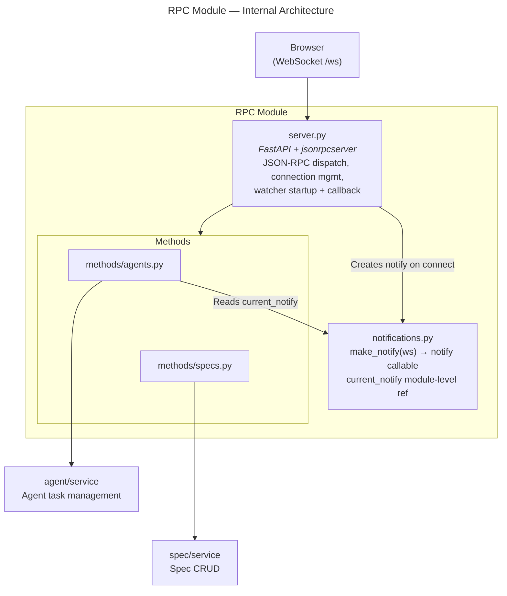
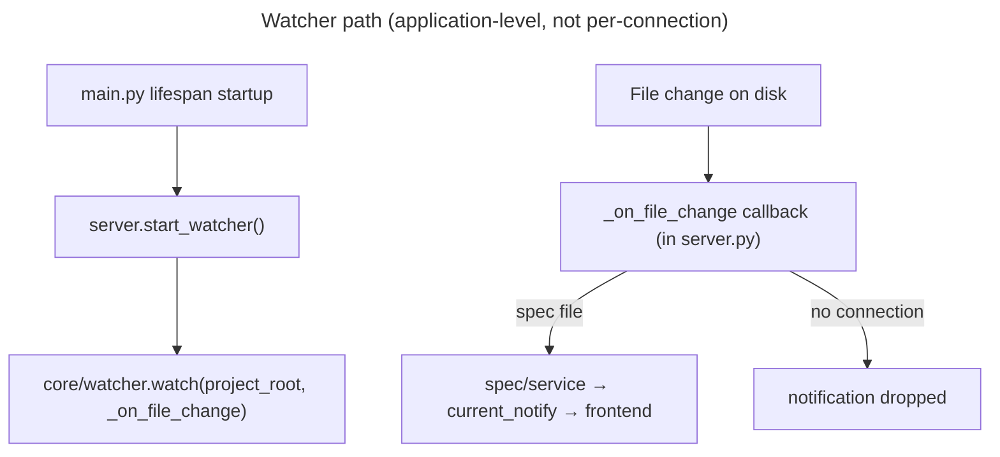
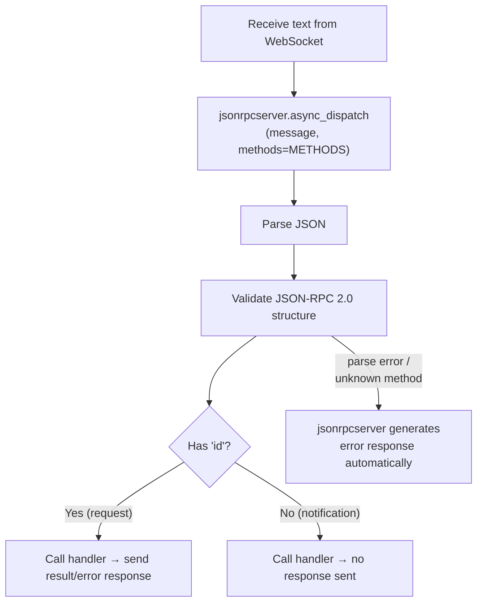

# RPC Module — Design Specification

> Parent: [DESIGN_DOC.md](../../../DESIGN_DOC.md) | Status: **Active** | Created: 2026-02-26

## Purpose

The RPC module is the transport layer bridging the WebSocket connection and the domain modules.
It manages the WebSocket connection lifecycle, parses and dispatches incoming JSON-RPC 2.0
messages to domain handlers using `jsonrpcserver`, sends outgoing server→client messages
(notifications and server-initiated requests), and starts and routes the filesystem watcher.

## Internal Architecture

**Pattern:** Three-layer — WebSocket transport + dispatch in `server.py`, domain-organized
handlers in `methods/`, outgoing message factory in `notifications.py`.





## File Organization

| File | Responsibility | Depends On |
|------|---------------|------------|
| `server.py` | WebSocket endpoint, connection management, JSON-RPC dispatch loop, watcher startup + callback | jsonrpcserver, methods/specs, methods/agents, notifications, core/watcher, core/config, spec/service |
| `notifications.py` | `make_notify` factory + `current_notify` module-level variable — creates per-connection notify callable, holds reference to active callable | — |
| `methods/__init__.py` | Empty — makes `methods/` a Python package | — |
| `methods/specs.py` | Handlers for all `spec/*` RPC methods | spec/service |
| `methods/agents.py` | Handlers for all `agent/*` RPC methods; `agent/run` reads `notifications.current_notify` | agent/service, notifications |

## Public Interface

### server.py

| Function | Signature | Description |
|----------|-----------|-------------|
| `register_routes` | `(app: FastAPI) → None` | Register the `/ws` WebSocket endpoint on the FastAPI app. Called by `main.py` during setup. |
| `start_watcher` | `() → WatchHandle` | Start `core/watcher` watching the project directory. Register the file-change callback. Called in `main.py` lifespan startup. |
| `stop_watcher` | `(handle: WatchHandle) → None` | Stop the file watcher. Called in `main.py` lifespan shutdown. |

### notifications.py

| Function / Variable | Signature / Type | Description |
|--------------------|-----------------|-------------|
| `make_notify` | `(websocket: WebSocket) → Callable` | Create a notify callable bound to the given WebSocket. Called by `server.py` on each new connection. |
| `current_notify` | `Callable \| None` | Module-level variable holding the active notify callable. Set by `server.py` on connect, cleared on disconnect. Read by `methods/agents.py` in `agent/run`. |

**Returned callable signature:**
```python
async def notify(method: str, params: dict, request_id: str | None = None) -> None
```
- `request_id=None` → send JSON-RPC **notification** (message has no `id` field)
- `request_id` set → send JSON-RPC **request** (message includes `id` field; `request_id` value appears as both the JSON-RPC `id` and in `params.requestId` so the client can reference it in `agent/respond`)

### methods/specs.py

Handlers registered with jsonrpcserver for all `spec/*` client→server methods. Each handler
receives keyword arguments from the JSON-RPC `params` object and returns a serializable result.

| Handler | JSON-RPC method | Params | Returns |
|---------|----------------|--------|---------|
| `list_specs` | `spec/list` | `{}` | `list[SpecSummary]` |
| `get_spec` | `spec/get` | `{ id }` | `SpecDetail` |
| `create_spec` | `spec/create` | `{ type, path, content? }` | `SpecDetail` |
| `update_spec` | `spec/update` | `{ id, content }` | `SpecDetail` |
| `delete_spec` | `spec/delete` | `{ id }` | `None` |
| `get_graph` | `spec/graph` | `{}` | `SpecGraph` |

### methods/agents.py

Handlers registered with jsonrpcserver for all `agent/*` client→server methods.

| Handler | JSON-RPC method | Params | Returns |
|---------|----------------|--------|---------|
| `run_agent` | `agent/run` | `{ specIds, config }` | `{ taskId: str }` |
| `get_agent_status` | `agent/status` | `{ taskId }` | `AgentTask` |
| `list_agents` | `agent/list` | `{}` | `list[AgentTask]` |
| `interrupt_agent` | `agent/interrupt` | `{ taskId }` | `None` |
| `respond_agent` | `agent/respond` | `{ taskId, requestId, response }` | `None` |

**Note on `agent/run`:** The handler captures `current_notify` at call time (the active connection's
notify callable), passes it to `agent/service.run_task`, and immediately returns the `taskId`.
The agent task runs asynchronously in the background; progress is pushed via `notify`.

**Note on `agent/respond`:** Routes to `agent/service.respond(task_id, request_id, response)`,
which resolves the pending `asyncio.Future` in `tracker.py`. Returns `None` (result: null).

## JSON-RPC Dispatch

Uses `jsonrpcserver` for all incoming message handling:



`METHODS` is a mapping from JSON-RPC method names to handler coroutines assembled in `server.py`
from the functions in `methods/specs.py` and `methods/agents.py`.

**Error mapping:** Domain exceptions raised inside handlers are mapped to JSON-RPC error responses
before jsonrpcserver returns them to the client:

| Exception | JSON-RPC code | Message |
|-----------|--------------|---------|
| `SpecNotFoundError` | -32001 | "Spec not found" |
| `RegistryError` | -32002 | "Registry error" |
| `ValidationError` | -32003 | "Validation error" |
| `AgentTaskNotFoundError` | -32011 | "Agent task not found" |
| `KeyError` / missing params | -32602 | "Invalid params" |
| Any other exception | -32603 | "Internal error" |

Standard errors (-32700 parse error, -32601 method not found) are handled automatically by jsonrpcserver.

## Connection Management

- Single active WebSocket connection at a time (single developer tool, localhost only)
- On connect: create `notify = make_notify(ws)`, set `notifications.current_notify = notify`, begin dispatch loop
- On disconnect / close: set `notifications.current_notify = None`
- If a second client connects while one is already active, the new connection replaces the old one (previous connection is closed)

## Watcher Integration

1. `main.py` calls `server.start_watcher()` in the FastAPI lifespan startup event.
2. `start_watcher()` calls `core/watcher.watch([project_root], _on_file_change)`.
3. On file change, `_on_file_change(path, change_type)` runs:
   - Routes by file type:
     - `.specs/registry.json` → send `registry/didUpdate` via `current_notify`
     - Any path registered as a spec in the registry (`*.md` or `*.json` spec files) → call `spec/service` to validate/postprocess → send `spec/didChange`, `spec/didCreate`, or `spec/didDelete` via `current_notify`
     - Source files (`*.py`, `*.ts`, …) → no-op (future: coverage/health)
   - If `notifications.current_notify is None` (no connected client): notifications are dropped silently
4. At shutdown, `main.py` calls `server.stop_watcher(handle)`.

## Design Decisions

| Decision | Choice | Rationale |
|----------|--------|-----------|
| JSON-RPC library | `jsonrpcserver` | Handles parse errors, method-not-found, and response formatting automatically; eliminates boilerplate in handlers |
| Notify interface | Single `notify(method, params, request_id=None)` | Unified callable for notifications and server-initiated requests; decouples runner from WebSocket details |
| Watcher lifecycle | Application startup via `main.py` lifespan | Watcher is filesystem-level; filesystem changes are independent of client connection state |
| `current_notify` in `notifications.py` | Module-level mutable ref, set by `server.py` on connect/disconnect | Avoids circular import between `server.py` and `methods/agents.py`; `notifications.py` is the natural owner of active-connection state |
| Methods organized by domain namespace | `methods/specs.py`, `methods/agents.py` | Each file mirrors its domain module; easy to locate handlers by method prefix |
| `METHODS` dict assembled in `server.py` | Explicit mapping from method name to handler | Avoids implicit global state from decorator-based registration; makes method set inspectable |
| No RPC-layer models | Domain models serialized directly | Pydantic models in spec/ and agent/ serialize to JSON; no translation layer needed |

## Dependencies

| Dependency | Usage |
|------------|-------|
| `fastapi` | WebSocket endpoint and app integration |
| `jsonrpcserver` | JSON-RPC 2.0 message parsing and dispatch |
| `spec/service` | Spec CRUD operations; watcher postprocessing |
| `agent/service` | Agent task management |
| `core/watcher` | File change detection |
| `core/config` | Project root path for watcher |

## Known Limitations

- **No reconnect replay:** File changes that occur while no client is connected are not queued; they are dropped. A reconnecting client will not receive missed notifications.
- **Single connection only:** No explicit rejection or queuing of concurrent clients; the second connection silently replaces the first.
- **No authentication:** The WebSocket endpoint at `/ws` has no auth; assumes localhost-only access.
- **Pending agent futures on disconnect:** If the client disconnects mid-agent-run, `notifications.current_notify` becomes `None`; outgoing agent events are dropped. Pending `asyncio.Future` objects in `tracker.py` will time out per the configured deadline.

## Related Specs

- **Parent:** [Architecture Design](../../../DESIGN_DOC.md)
- **Depends on:** [Spec Module](../spec/README.md), [Agent Module](../agent/README.md), [Core Module](../core/README.md)
- **Related files:** `main.py` — FastAPI entry point; calls `register_routes` and manages watcher lifespan
