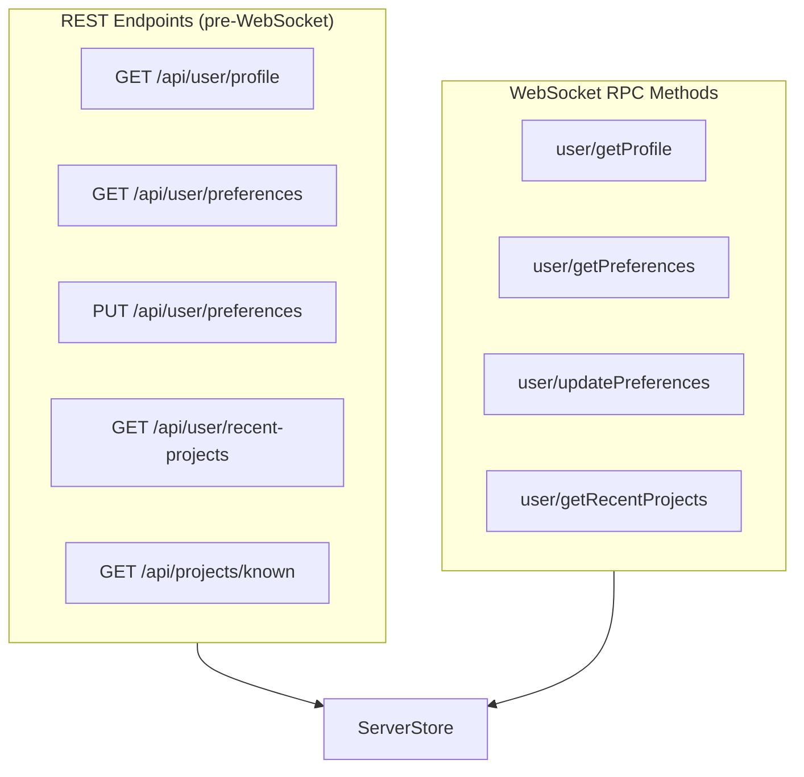

# User Preferences API — Module Design

> Parent: [Storage Architecture](../../../../docs/STORAGE_ARCHITECTURE.md) | Status: **Active** | Created: 2026-04-13

## Purpose

REST and WebSocket RPC endpoints for user profile, preferences, and recent projects. Enables cross-browser preference sync by moving data from browser localStorage to server-side SQLite storage.

## Internal Architecture



## REST Endpoints

Used by LoginScreen and ProjectPicker before any WebSocket connection exists.

| Endpoint | Method | Auth | Request | Response |
|----------|--------|------|---------|----------|
| `/api/user/profile` | GET | `?token=bns_xxx` | — | `{ userId, displayName, isAdmin, createdAt }` |
| `/api/user/preferences` | GET | `?token=bns_xxx` | — | `{ theme, soundEnabled, ... }` |
| `/api/user/preferences` | PUT | `?token=bns_xxx` | `{ theme?: "...", ... }` | Updated prefs |
| `/api/user/recent-projects` | GET | `?token=bns_xxx` | `?limit=10` | `[{ path, name, lastOpened }]` |
| `/api/projects/known` | GET | `?token=bns_xxx` | — | `[{ path, name, registeredAt, lastOpenedAt }]` |

All endpoints return 401 for missing/invalid tokens.

## WebSocket RPC Methods

Used during active project sessions for real-time preference sync.

| Method | Params | Response | Description |
|--------|--------|----------|-------------|
| `user/getProfile` | — | `{ userId, displayName, isAdmin, createdAt }` | Current user profile |
| `user/getPreferences` | — | `{ theme, soundEnabled, leftPanelCollapsed, ... }` | Full preference object |
| `user/updatePreferences` | `{ patch: { ... } }` | Updated prefs object | Merge patch into existing |
| `user/getRecentProjects` | `{ limit?: number }` | `[{ path, name, lastOpened }]` | User's recent projects |

## Preference Schema

Stored as JSON blob in `user_preferences.prefs`. Validated by Pydantic but schema is flexible (extra fields allowed).

```json
{
  "theme": "system",
  "soundEnabled": false,
  "fontSize": 13,
  "compactFontSize": 9,
  "leftPanelCollapsed": false,
  "rightPanelCollapsed": false,
  "leftActiveTab": "specs",
  "messageHistory": ["last message", "..."]
}
```

`updatePreferences` uses **merge semantics**: only provided keys are updated, others are preserved.

## Setup Endpoints (no auth required)

Used on first launch before any users exist.

| Endpoint | Method | Auth | Request | Response |
|----------|--------|------|---------|----------|
| `/api/setup/status` | GET | None | — | `{ needsSetup: bool }` |
| `/api/setup` | POST | None | `{ userId, name }` | `{ userId, displayName, token }` |

`POST /api/setup` returns 403 if any users already exist. The created user is always admin.

## Admin RPC Methods (admin-only)

All methods require `is_admin = true` on the calling user. Non-admins receive error `-32000`.

| Method | Params | Response | Description |
|--------|--------|----------|-------------|
| `admin/listUsers` | — | `{ users: [...] }` | All users with admin + token count |
| `admin/createUser` | `{ userId, name?, isAdmin? }` | `{ userId, name, token, isAdmin }` | Create user + token |
| `admin/deleteUser` | `{ userId }` | `{ ok: true }` | Delete user (not last admin) |
| `admin/setAdmin` | `{ userId }` | `{ ok: true }` | Grant admin |
| `admin/removeAdmin` | `{ userId }` | `{ ok: true }` | Revoke admin (not last admin) |
| `admin/revokeToken` | `{ token }` | `{ ok: true }` | Revoke specific token |

## File Organization

| File | Responsibility |
|------|---------------|
| `backend/app/rpc/methods/user.py` | RPC method handlers (`user/*`) |
| `backend/app/rpc/methods/admin.py` | Admin RPC handlers (`admin/*`) |
| `backend/app/main.py` | REST endpoint handlers (setup + user endpoints) |
| `frontend/src/api/methods/user.ts` | Frontend user RPC wrappers |
| `frontend/src/api/methods/admin.ts` | Frontend admin RPC wrappers |

## Design Decisions

| Decision | Choice | Rationale |
|----------|--------|-----------|
| Both REST + RPC | Dual transport | REST needed before WebSocket (LoginScreen/ProjectPicker); RPC for in-session sync |
| Merge-patch semantics | Partial updates | Frontend sends only changed keys, avoids overwrite races |
| JSON blob for prefs | Single `prefs` column | Avoids schema migration per preference |
| No per-project prefs sync | Server-only | Project-level `settings.json` stays separate (model, effort, etc.) |
