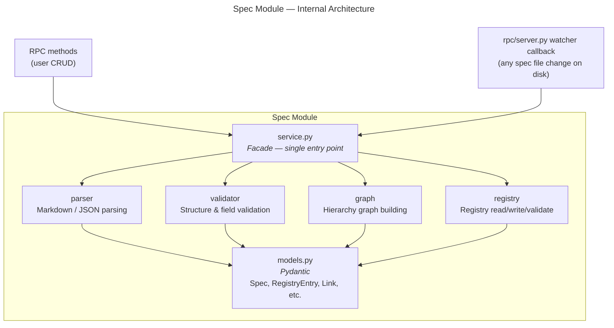

# Spec Module — Design Specification

> Parent: [DESIGN_DOC.md](../../../DESIGN_DOC.md) | Status: **Active** | Created: 2026-02-25

## Table of Contents
1. [Purpose](#purpose)
2. [Internal Architecture](#internal-architecture)
3. [File Organization](#file-organization)
4. [Public Interface](#public-interface)
5. [Design Decisions](#design-decisions)
6. [Dependencies](#dependencies)
7. [Known Limitations](#known-limitations)
8. [Related Specs](#related-specs)

## Purpose

The Spec module is the core domain layer of Bonsai. It owns all spec file operations — parsing spec files from disk (Markdown or JSON), validating their structure, managing the registry (`.bonsai/registry.json`), and building the hierarchy graph that maps parent-child and cross-reference relationships. All spec CRUD flows through this module's service layer, which is the single source of truth for spec state.

## Internal Architecture

**Pattern:** Service-centric (facade)

`service.py` is the single entry point for all spec operations. It is called from two directions:
1. **RPC methods** — user-initiated CRUD via JSON-RPC (`spec/create`, `spec/update`, etc.)
2. **Watcher callback** — automatic, when any spec file changes on disk (from any source: user, agent, external tool). The callback is registered by `rpc/server.py`, which calls `spec/service` to validate and postprocess, then pushes notifications to the frontend.

Both paths use the same service methods — there is no special case handling per caller.

## File Organization

| File | Responsibility | Depends On |
|------|---------------|------------|
| `models.py` | Pydantic models: Spec, RegistryEntry, Link, SpecGraph, SpecSummary, SpecDetail | — |
| `service.py` | Facade — all CRUD operations, delegates to other components | parser, validator, graph, registry, core/config |
| `parser.py` | Parse spec files: Markdown or JSON | models, core/fileio |
| `validator.py` | Validate spec structure, required fields, link integrity | models |
| `graph.py` | Build in-memory hierarchy graph from registry entries + links | models |
| `registry.py` | Read/write/validate `.bonsai/registry.json` — atomic writes, schema validation | models, core/fileio |

## Public Interface

### Service Layer (called by RPC methods)

**Class:** `SpecService(config: AppConfig)`

`trash_service` attribute (injected by `rpc/server.py`) enables soft-delete for `delete_spec`.

| Method | Signature | Description |
|--------|-----------|-------------|
| `list_specs` | `() → list[SpecSummary]` | List all specs with metadata from registry |
| `get_spec` | `(id: str) → SpecDetail` | Get full spec content + metadata |
| `create_spec` | `(type: str, path: str, content: str?, id: str?) → SpecDetail` | Create spec file + registry entry. `title` is auto-derived from the first heading in content (or from path if no content). `id` is auto-generated if not provided, `status` defaults to `draft`. |
| `update_spec` | `(id: str, content: str) → SpecDetail` | Update spec content on disk + registry |
| `delete_spec` | `(id: str) → None` | Soft-delete spec file via `trash_service` (with registry entry + links snapshot for full restore), then remove from registry. Falls back to hard-delete if no `trash_service` is injected. |
| `get_graph` | `() → SpecGraph` | Return full hierarchy graph (nodes + edges) |

### Models

| Model | Fields | Description |
|-------|--------|-------------|
| `Spec` | type, content, metadata (dict \| None) | Parsed spec from disk; `metadata` is the parsed JSON object for JSON specs; `None` for Markdown specs |
| `RegistryEntry` | id, type, path, title, status, covers, tags, created, updated | Single entry in registry.json |
| `Link` | from_id, to_id, type | Relationship between specs. Fields serialize to `from`/`to` in JSON (Pydantic alias) since `from` is a Python reserved keyword. |
| `SpecSummary` | id, type, path, status, title, tags, covers, created, updated | Lightweight listing model |
| `SpecDetail` | id, type, path, status, title, tags, content, links | Full spec with content |
| `SpecGraph` | nodes: list[RegistryEntry], edges: list[Link] | Complete hierarchy |

### Output Contracts

| Method | Returns | Error Cases |
|--------|---------|-------------|
| `list_specs` | `list[SpecSummary]` (may be empty) | Registry file missing or malformed |
| `get_spec` | `SpecDetail` | Spec not found, file missing on disk |
| `create_spec` | `SpecDetail` | Path conflict, invalid type |
| `update_spec` | `SpecDetail` | Spec not found, validation failure |
| `delete_spec` | `None` | Spec not found. Spec file is moved to `.bonsai/trash/specs/{id}/` with a registry snapshot in `_trash.json` for future restore. |
| `get_graph` | `SpecGraph` | Registry malformed |

## Design Decisions

| Decision | Choice | Rationale |
|----------|--------|-----------|
| Registry storage | Single JSON file (`.bonsai/registry.json`) | Simplicity — easy to implement, debug, and version control as one atomic file |
| Spec format | Markdown or JSON | Human-readable and git-friendly; Markdown suits narrative specs, JSON suits structured data; both co-exist in the registry |
| Graph storage | In-memory, rebuilt on changes | Simplicity — no persistence layer to maintain, graph is derived from registry which is the source of truth |
| Internal pattern | Service facade | Simplicity — single entry point makes the module easy to test and reason about |

## Dependencies

| Dependency | Usage |
|------------|-------|
| `core/config` | Project root path, spec directory config |
| `core/fileio` | File read/write/delete for spec files and registry |
| `trash/service` | Soft-delete for spec files (injected via `trash_service` attribute) |
| `pydantic` | Model validation and serialization |

## Known Limitations

- **Incomplete feature support:** Spec diffing, merge conflict resolution, and bulk operations (move, rename with link updates) are not yet designed. Some spec types may need additional parsing logic as the format evolves.
- **No link management API:** Link CRUD is not exposed via `spec/*` methods. Links are managed through direct `registry.json` edits (picked up by the watcher). A `spec/link` method family may be added later.
- **No registry metadata update API:** Updating registry metadata (title, status, tags, covers) is not exposed as a dedicated method. Metadata changes require direct `registry.json` edits.
- **Performance bottlenecks:** Single JSON registry file may become slow for projects with hundreds of specs. The in-memory graph rebuild on every change does not scale to very large spec trees. No caching layer is planned for v1.

## Sub-modules

None currently — all files are at the module level. As complexity grows, `parser.py` or `graph.py` may warrant sub-module extraction.

## Related Specs

- **Parent:** [Architecture Design](../../../DESIGN_DOC.md)
- **Depends on:** [Goal & Requirements](../../../GOAL&REQUIREMENTS.md)
- **Related modules:** `rpc/methods/specs.py` (JSON-RPC interface to this module)
