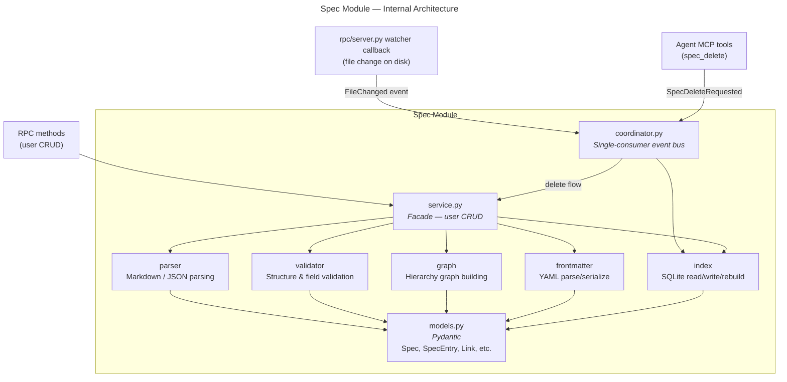

# Spec Module — Design Specification

> Parent: [DESIGN_DOC.md](../../../DESIGN_DOC.md) | Status: **Active** | Created: 2026-02-25

## Table of Contents
1. [Purpose](#purpose)
2. [Internal Architecture](#internal-architecture)
3. [File Organization](#file-organization)
4. [Public Interface](#public-interface)
5. [Design Decisions](#design-decisions)
6. [Dependencies](#dependencies)
7. [Known Limitations](#known-limitations)
8. [Related Specs](#related-specs)

## Purpose

The Spec module is the core domain layer of Bonsai. It owns all spec file operations — parsing YAML frontmatter and content from Markdown files, validating their structure, managing the SQLite index (`~/.bonsai/indexes/<project-hash>/index.db`, stored outside the repo in the server data directory), and building the hierarchy graph that maps parent-child and cross-reference relationships. Frontmatter in each spec file is the **sole source of truth**; the SQLite index is a generated cache. See [Frontmatter + SQLite Index Design](../../../.bonsai/design_docs/FRONTMATTER_REGISTRY_DESIGN.md) for the full architecture.

## Internal Architecture

**Pattern:** Service-centric (facade)

`service.py` is the single entry point for user-initiated spec operations. Index mutations are serialized through the `IndexCoordinator`:

1. **RPC methods** — user-initiated CRUD via JSON-RPC (`spec/create`, `spec/update`, etc.) → `service.py`
2. **Watcher callback** — automatic, when any spec file changes on disk. The callback emits `FileChanged` events to the `IndexCoordinator`, which serializes all index mutations through a single consumer task. See [INDEX_CONCURRENCY.md](INDEX_CONCURRENCY.md) for the full concurrency model.
3. **Agent tools** — `spec_delete` routes through the coordinator's `request_delete()` for serialized deletion with the full SpecService flow.

## File Organization

| File | Responsibility | Depends On |
|------|---------------|------------|
| `models.py` | Pydantic models: Spec, SpecEntry, Link, SpecGraph, SpecSummary, SpecDetail | — |
| `service.py` | Facade — all CRUD operations, delegates to other components | parser, frontmatter, validator, graph, index, core/config |
| `parser.py` | Parse spec files: read content from disk | models, core/fileio |
| `frontmatter.py` | YAML frontmatter parsing and serialization | models |
| `validator.py` | Validate frontmatter fields, required fields, link integrity | models |
| `graph.py` | Build in-memory hierarchy graph from index entries + links | models |
| `index.py` | SQLite index management — `open_and_check()` (open + version probe), `initialize()` (single-pass for tests), upsert, query; includes `get_all_documents()` for unmanaged files. `is_ready` property (backed by `asyncio.Event`) indicates initialization state. `wait_ready(timeout)` for blocking callers. `rebuild()` uses `_ready_event.clear()`/`.set()` and wraps all mutations in a single `BEGIN IMMEDIATE` transaction. File reads use `aiofiles`; `_find_md_files()` runs via `asyncio.to_thread()`. | models, aiosqlite, aiofiles, pathspec |
| `coordinator.py` | IndexCoordinator — single-consumer event bus (`asyncio.Queue`) that serializes all index mutations. Event types: `FileChanged`, `RebuildRequested` (with 500ms debounce), `DiffScanRequested`, `SpecDeleteRequested`. Created per-project, ref-counted with watchers. `spec_service` injected for full delete flow. | index, pathspec |

## Public Interface

### Service Layer (called by RPC methods)

**Class:** `SpecService(config: AppConfig, index: SpecIndex | None = None)`

`index` is the SQLite-backed `SpecIndex` instance. Must be provided — callers open the index before constructing the service. `trash_service` attribute (injected by `rpc/server.py`) enables soft-delete for `delete_spec`.

Read methods (`list_specs`, `get_graph`) return empty results when `index.is_ready` is `False` (during background initialization). `get_spec` and write methods (`create_spec`, `update_spec`, `delete_spec`) raise `IndexNotReadyError`.

| Method | Signature | Description |
|--------|-----------|-------------|
| `list_specs` | `(type?, status?, tag?, covers?) → list[SpecSummary]` | List specs from index, filtered by optional type/status/tag/covers params |
| `get_spec` | `(id: str) → SpecDetail` | Get full spec content + metadata |
| `create_spec` | `(type: str, path: str, content: str?, id: str?) → SpecDetail` | Create spec file with frontmatter. `title` is auto-derived from the first heading in content (or from path if no content). `id` is auto-generated if not provided, `status` defaults to `draft`. Watcher indexes the new file. |
| `update_spec` | `(id: str, content: str) → SpecDetail` | Update spec content on disk (preserves frontmatter). Watcher re-indexes. |
| `delete_spec` | `(id: str) → None` | Soft-delete spec file via `trash_service`, clean dangling links from other specs' frontmatter, watcher re-indexes affected files. Falls back to hard-delete if no `trash_service` is injected. |
| `get_graph` | `() → SpecGraph` | Return full hierarchy graph (nodes + edges + unmanaged documents) |
| `get_links` | `(ids: list[str], direction?, link_type?) → list[Link]` | Return links involving given spec IDs, with optional direction/type filtering |
| `get_referencing_specs` | `(target_id: str) → list[SpecEntry]` | Return specs whose outgoing links reference target_id |

### Models

| Model | Fields | Description |
|-------|--------|-------------|
| `Frontmatter` | id, type, status, title, parent, depends-on, references, implements, covers, tags | **Single source of truth** for YAML frontmatter schema. Validates required/optional fields, extracts links, serializes to ordered dict. Extra fields allowed (`extra = "allow"`). |
| `Spec` | type, content, metadata (dict \| None) | Parsed spec from disk; `metadata` is the parsed JSON object for JSON specs; `None` for Markdown specs |
| `SpecEntry` | id, type, path, title, status, covers, tags, extras, content_hash, indexed_at | Single row in SQLite `specs` table (derived from frontmatter) |
| `Link` | from_id, to_id, type | Relationship between specs. Fields serialize to `from`/`to` in JSON (Pydantic alias) since `from` is a Python reserved keyword. |
| `SpecSummary` | id, type, path, status, title, tags, covers, created, updated | Lightweight listing model |
| `SpecDetail` | id, type, path, status, title, tags, content, links | Full spec with content |
| `DocumentEntry` | path, title | Unmanaged .md file (no frontmatter) — row in SQLite `documents` table |
| `SpecGraph` | nodes: list[SpecEntry], edges: list[Link], documents: list[DocumentEntry] | Complete hierarchy including unmanaged documents |

### Output Contracts

| Method | Returns | Error Cases |
|--------|---------|-------------|
| `list_specs` | `list[SpecSummary]` (may be empty) | Returns `[]` while index is initializing |
| `get_spec` | `SpecDetail` | Spec not found, file missing on disk, `IndexNotReadyError` during init |
| `create_spec` | `SpecDetail` | Path conflict, invalid type, duplicate ID, `IndexNotReadyError` during init |
| `update_spec` | `SpecDetail` | Spec not found, validation failure |
| `delete_spec` | `None` | Spec not found. File moved to `.bonsai/trash/specs/{id}/`. Dangling refs in other specs' frontmatter are cleaned. |
| `get_graph` | `SpecGraph` (includes `documents` list) | Index missing (triggers rebuild) |

## Design Decisions

| Decision | Choice | Rationale |
|----------|--------|-----------|
| Metadata storage | YAML frontmatter in each spec file | Self-contained, git-friendly, no merge conflicts. [Full design](../../../.bonsai/design_docs/FRONTMATTER_REGISTRY_DESIGN.md) |
| Index storage | Per-project SQLite (`~/.bonsai/indexes/<hash>/index.db`, outside repo) | Fast SQL queries, rebuildable from frontmatter. Replaces `registry.json`. |
| Graph storage | In-memory, rebuilt from SQLite on changes | Graph is derived from the index which mirrors frontmatter |
| Internal pattern | Service facade | Simplicity — single entry point makes the module easy to test and reason about |
| Document filtering | Built-in skip paths + `.bonsaihide` at index time | `.bonsai/` infrastructure dirs (trash, cache, sessions, plans) are never meaningful as unmanaged docs. Index-time filtering is consistent with `.bonsaihide`. Explicit list — new dirs require code change. |
| Index initialization | Single-pass `initialize()` replacing `open()` + `_ensure_schema()` + `ensure_ready()` | Eliminates fresh-DB bug where version was stamped before rebuild. One version check, one code path. |
| bonsaihide filtering | `pathspec.PathSpec` (gitignore syntax) in `_find_md_files()` and `reindex_file()` | Unified with file tree sidebar. Patterns stored on `SpecIndex`, loaded from shared `core/bonsaihide` module. Applied on both full rebuild and incremental per-file reindex. `.bonsaihide` changes trigger a full rebuild. |

## Dependencies

| Dependency | Usage |
|------------|-------|
| `core/config` | Project root path, spec directory config |
| `core/fileio` | File read/write/delete for spec files |
| `aiosqlite` | SQLite index read/write |
| `aiofiles` | Non-blocking file reads in index rebuild and reindex |
| `trash/service` | Soft-delete for spec files (injected via `trash_service` attribute) |
| `pydantic` | Model validation and serialization |
| `pathspec` | gitignore-style pattern matching for `.bonsaihide` filtering in `_find_md_files()` |
| `core/bonsaihide` | Shared `.bonsaihide` pattern loading (used by both file tree API and index rebuild) |

## Known Limitations

- **Incomplete feature support:** Spec diffing, merge conflict resolution, and bulk operations (move, rename with link updates) are not yet designed.
- **Links are frontmatter-only:** Link management is done by editing frontmatter in spec files (by agents via `Edit` tool or by users directly). No dedicated RPC method for link CRUD — the watcher picks up changes.
- **Index rebuild cost:** Full rebuild scans all `.md` files in the project. Incremental updates via content hashing mitigate this for normal operation, but first-clone rebuild may be slow for large projects. Rebuild uses a single atomic SQLite transaction (WAL mode), so readers see pre-rebuild data until the commit — no empty or partial states.
- **Explicit document skip list:** Built-in skip paths for `.bonsai/` internal dirs are an explicit constant in `_find_md_files()`. New `.bonsai/` subdirs that produce `.md` files require manual addition to the list.

## Sub-modules

None currently — all files are at the module level. As complexity grows, `parser.py` or `graph.py` may warrant sub-module extraction.

## Related Specs

- **Parent:** [Architecture Design](../../../DESIGN_DOC.md)
- **Depends on:** [Goal & Requirements](../../../GOAL&REQUIREMENTS.md)
- **Related modules:** `rpc/methods/specs.py` (JSON-RPC interface to this module)
