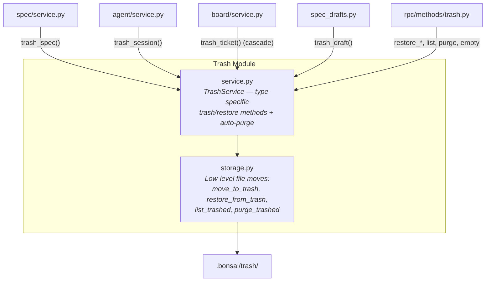

# Trash Module — Design Specification

> Parent: [DESIGN_DOC.md](../../../DESIGN_DOC.md) | Status: **Active** | Created: 2026-03-30 | Updated: 2026-04-09

## Table of Contents
1. [Purpose](#purpose)
2. [Internal Architecture](#internal-architecture)
3. [Storage Layout](#storage-layout)
4. [Supported Types](#supported-types)
5. [Cascade Behavior](#cascade-behavior)
6. [Auto-Purge](#auto-purge)
7. [File Organization](#file-organization)
8. [Public Interface](#public-interface)
9. [Design Decisions](#design-decisions)
10. [Dependencies](#dependencies)
11. [Known Limitations](#known-limitations)
12. [Related Specs](#related-specs)

## Purpose

The Trash module provides universal soft-delete for all `.bonsai/` data. Instead of permanently removing files, every deletion moves data to `.bonsai/trash/{type}/{id}/` with a `_trash.json` sidecar that records the original location, timestamp, item type, and type-specific context needed for restore. Items can be restored individually, purged manually, or auto-purged after a configurable retention period.

## Internal Architecture

**Pattern:** Stateless service + storage layer



`service.py` is the facade. It provides type-specific methods (e.g. `trash_spec`, `restore_plan`) that know which files to collect and what context to snapshot. It delegates all file moves to `storage.py`, which is type-agnostic.

`storage.py` handles the low-level operations: moving files into a trash subdirectory, writing the `_trash.json` sidecar, restoring files to their original location, listing trashed items, and permanently deleting trashed items.

## Storage Layout

```
.bonsai/trash/
  sessions/{bonsai_sid}/
    {bonsai_sid}.json
    {bonsai_sid}.events.jsonl
    _trash.json
  tickets/{ticket_id}/
    {ticket_id}.json
    _trash.json
  specs/{spec_id}/
    <spec file>
    _trash.json
  plans/{ticket_id}/
    {ticket_id}.md
    _trash.json
  drafts/{ticket_id}--{index}/
    <draft file (if any)>
    _trash.json
  patches/{ticket_id}/
    <patch files>
    _trash.json
```

Each subdirectory contains the original data files plus a `_trash.json` sidecar.

### `_trash.json` Schema

```json
{
  "trashedAt": "2026-04-09T12:00:00+00:00",
  "originalDir": "/absolute/path/to/original/directory",
  "type": "spec",
  "context": { }
}
```

| Field | Type | Description |
|-------|------|-------------|
| `trashedAt` | `str` (ISO 8601) | Timestamp when the item was trashed |
| `originalDir` | `str` (absolute path) | Directory the files were moved from; used for restore |
| `type` | `str` | Item type (matches the subdirectory name) |
| `context` | `dict` | Type-specific metadata needed for restore |

## Supported Types

| Type | Trash ID | Context Contents | Restore Behavior |
|------|----------|-----------------|------------------|
| `sessions` | `{bonsai_sid}` | `{}` — file restore is sufficient | Move `.json` + `.events.jsonl` back to `.bonsai/sessions/` |
| `tickets` | `{ticket_id}` | `{"cascaded": [...]}` — list of cascade-trashed item paths | Move `.json` back to `.bonsai/meta-tickets/` |
| `specs` | `{spec_id}` | `{"registryEntry": {...}, "links": [...]}` — full registry snapshot | Move spec file back; caller re-inserts registry entry + links |
| `plans` | `{ticket_id}` | `{"ticketId": "..."}` | Move `.md` back to `.bonsai/plans/` |
| `drafts` | `{ticket_id}--{index}` | `{"ticketId": "...", "manifestEntry": {...}}` | Move draft file back; caller re-inserts manifest entry |
| `patches` | `{ticket_id}` | `{"ticketId": "..."}` | Move patch files back to `.bonsai/spec-patches/{ticket_id}/` |

## Cascade Behavior

Trashing a ticket with `cascade=True` (the default) cascades to related data in this order:

1. **Plan** — trash `.bonsai/plans/{ticket_id}.md` (if exists)
2. **Drafts** — trash each draft entry individually from the manifest (reverse index order), then remove the empty `spec-drafts/{ticket_id}/` directory
3. **Patches** — trash `.bonsai/spec-patches/{ticket_id}/` directory (if exists)
4. **Ticket** — trash the ticket JSON file itself, recording cascaded item paths in `context.cascaded`

Each cascade-trashed item is an independent trash entry and can be restored individually without restoring the parent ticket.

## Auto-Purge

Expired trash items are automatically cleaned up based on the `trash_retention_days` setting in `.bonsai/settings.json` (default: `30`). Setting the value to `0` disables auto-purge.

**Execution:**
- **On startup:** `auto_purge()` runs once during `create_app` lifespan (in `main.py`)
- **Periodic:** An `asyncio` background task runs `auto_purge()` every hour via a sleep loop; the task is cancelled on shutdown

**Logic:** `auto_purge(retention_days)` scans all `_trash.json` files across all type subdirectories. Items where `trashedAt` is older than `retention_days` are permanently deleted via `purge_trashed()`. Returns the count of purged items.

## File Organization

| File | Responsibility | Depends On |
|------|---------------|------------|
| `service.py` | `TrashService` class — type-specific trash/restore methods, generic list/purge/empty, auto-purge | storage.py |
| `storage.py` | Low-level file operations: `move_to_trash`, `restore_from_trash`, `list_trashed`, `purge_trashed` | shutil, json (stdlib only) |

## Public Interface

### TrashService

**Class:** `TrashService(project_root: Path)`

Injected into other services by `rpc/server.py` via attribute assignment:
- `spec_service.trash_service`
- `agent_service.trash_service`
- `board_service.trash_service`
- `board_service.spec_drafts.trash_service`

#### Type-Specific Methods

| Method | Signature | Description |
|--------|-----------|-------------|
| `trash_session` | `(bonsai_sid: str) → None` | Move session `.json` + `.events.jsonl` to trash |
| `restore_session` | `(bonsai_sid: str) → None` | Restore session files to `.bonsai/sessions/` |
| `trash_ticket` | `(ticket_id: str, *, cascade: bool = True) → None` | Move ticket JSON to trash; cascade to plan + drafts + patches |
| `restore_ticket` | `(ticket_id: str) → None` | Restore ticket JSON to `.bonsai/meta-tickets/` |
| `trash_spec` | `(spec_id, spec_file, registry_entry, links) → None` | Move spec file to trash with registry snapshot in context |
| `restore_spec` | `(spec_id: str) → tuple[dict, list[dict]]` | Restore spec file; return `(registry_entry, links)` for re-insertion |
| `trash_plan` | `(ticket_id: str) → None` | Move plan `.md` to trash |
| `restore_plan` | `(ticket_id: str) → None` | Restore plan to `.bonsai/plans/` |
| `trash_draft` | `(ticket_id, draft_index, manifest_entry, draft_file) → None` | Move single draft entry to trash with manifest metadata |
| `restore_draft` | `(trash_item_id: str) → dict` | Restore draft file; return manifest entry for re-insertion |
| `trash_patches` | `(ticket_id: str) → None` | Move patch directory to trash |
| `restore_patches` | `(ticket_id: str) → None` | Restore patches to `.bonsai/spec-patches/` |

#### Generic Operations

| Method | Signature | Description |
|--------|-----------|-------------|
| `list_trashed` | `(item_type: str \| None = None) → list[dict]` | List all trashed items, optionally filtered by type |
| `purge` | `(item_type: str, item_id: str) → None` | Permanently delete a specific trashed item |
| `empty_trash` | `(item_type: str \| None = None) → None` | Permanently delete all trashed items, optionally by type |
| `auto_purge` | `(retention_days: int) → int` | Purge items older than retention period; returns count |

### Storage Layer (storage.py)

| Function | Signature | Description |
|----------|-----------|-------------|
| `move_to_trash` | `(trash_dir, item_type, item_id, source_files, original_dir, *, context) → None` | Move files to `{trash_dir}/{type}/{id}/` and write `_trash.json` sidecar |
| `restore_from_trash` | `(trash_dir, item_type, item_id) → dict` | Move files back to `originalDir`, remove trash entry, return context |
| `list_trashed` | `(trash_dir, item_type?) → list[dict]` | Scan trash directories and return item metadata |
| `purge_trashed` | `(trash_dir, item_type, item_id) → None` | Permanently delete a trash entry (`shutil.rmtree`) |

## Design Decisions

| Decision | Choice | Rationale |
|----------|--------|-----------|
| File move, not copy | `shutil.move` for data files | No partial state on failure; original files are gone after successful move |
| Sidecar pattern | `_trash.json` alongside trashed files | Self-documenting trash — metadata travels with the data, no central index to corrupt |
| Type-specific context | Spec stores registry snapshot, draft stores manifest entry | Each type needs different metadata for correct restore; generic storage layer doesn't need to know the semantics |
| Storage/service split | `storage.py` is type-agnostic, `service.py` knows types | Storage layer is reusable and testable in isolation; service layer encodes domain logic (which files to collect, what context to snapshot) |
| Cascade on ticket trash | Default `cascade=True` | Orphaned plans/drafts/patches are confusing; cascade keeps data consistent. Individual items are still independently restorable. |
| Silent skip on missing | Trash methods log and skip when source files don't exist | Prevents errors on double-delete or race conditions |
| Auto-purge via background task | `asyncio.create_task` with hourly sleep loop | Simple, no external scheduler dependency. Runs within the existing server process. |
| Retention setting | `trash_retention_days` in `ProjectSettings` | User-configurable via `.bonsai/settings.json`; `0` disables auto-purge |

## Dependencies

- No external dependencies. Uses `shutil`, `json`, and `datetime` from Python stdlib.
- `service.py` imports from `storage.py` only.

## Known Limitations

- **No atomic restore for specs:** `restore_spec` returns the registry entry and links for the caller to re-insert. If the caller fails after file restore but before registry update, the spec file exists on disk without a registry entry.
- **No cross-item restore for cascades:** Restoring a ticket does not automatically restore its cascaded plan/drafts/patches. Each must be restored individually.
- **No concurrent access protection:** No file locking. Concurrent trash/restore of the same item could cause issues. In practice, only one service instance operates at a time.

## Related Specs

- **Parent:** [Architecture Design](../../../DESIGN_DOC.md)
- **Used by:** [Spec Module](../spec/README.md), [Agent Module](../agent/README.md), [RPC Module](../rpc/README.md)
- **Settings:** [Core Module](../core/README.md) (`trash_retention_days` in `ProjectSettings`)
