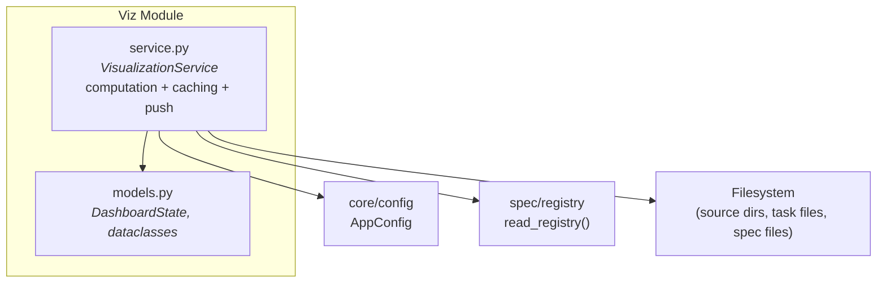

# Viz Module — Design Specification

> Parent: [DESIGN_DOC.md](../../../DESIGN_DOC.md) | Status: **Active** | Created: 2026-03-11

## Table of Contents
1. [Purpose](#purpose)
2. [Internal Architecture](#internal-architecture)
3. [File Organization](#file-organization)
4. [Public Interface](#public-interface)
5. [Dashboard State](#dashboard-state)
6. [Computation Pipeline](#computation-pipeline)
7. [Design Decisions](#design-decisions)
8. [Dependencies](#dependencies)
9. [Known Limitations](#known-limitations)
10. [Related Specs](#related-specs)

## Purpose

The Viz module computes and maintains a live dashboard state for the Bonsai web UI. It aggregates data from the spec registry, source tree, task files, and lint checks into a single `DashboardState` that the frontend consumes to render the spec-driven development dashboard.

The module operates in two modes:
- **Pull:** Frontend requests current state via `viz/state` RPC — returns cached state without recomputing.
- **Push:** File watcher triggers `recompute()` on `.md`/`.json` changes → pushes `viz/stateChanged` notification to the frontend.

## Internal Architecture

**Data flow:**
1. `_read_registry()` — delegates to `spec.registry.read_registry()` via `AppConfig.get_registry_path()`
2. `_find_source_dirs()` — walks project tree for code directories
3. `_compute_coverage()` — matches source dirs to spec `covers` fields
4. `_compute_freshness()` — compares spec file mtime vs code file mtime
5. `_run_lint()` — checks required sections and broken links
6. `_parse_tasks()` — reads `current_tasks/**/*.md` for task status
7. `_compute_workflow_steps()` — derives workflow phase from spec types and task completion
8. `_make_recommendations()` — generates actionable suggestions

## File Organization

| File | Responsibility | Depends On |
|------|---------------|------------|
| `models.py` | Dataclasses: `DashboardState`, `WorkflowStep`, `CoverageEntry`, `TaskEntry`, `LintIssue`, `Recommendation` | — |
| `service.py` | `VisualizationService` — computation pipeline, state caching, push notifications | core/config, spec/registry, models |

## Public Interface

### VisualizationService

**Constructor:** `VisualizationService(config: AppConfig)`

| Method | Signature | Description |
|--------|-----------|-------------|
| `bind_notify` | `(notify: NotifyFn) -> None` | Bind a WebSocket push callback. Called by `server.py` on each new connection. |
| `get_state` | `() -> DashboardState` | Return cached state without recomputing. Used by `viz/state` RPC. |
| `refresh` | `() -> None` | Recompute state synchronously, no push notification. Called on WebSocket connect. |
| `recompute` | `async () -> DashboardState` | Recompute state and push `viz/stateChanged` if bound. Called by file watcher on `.md`/`.json` changes and by `viz/recompute` RPC. |

**`NotifyFn`** type: `Callable[[str, dict], Awaitable[None]]`

## Dashboard State

`DashboardState` is a plain dataclass serialized via `asdict()`. All fields use snake_case (no alias conversion — the frontend receives snake_case keys).

### Summary Metrics

| Field | Type | Description |
|-------|------|-------------|
| `coverage_pct` | `int` | Percentage of source directories covered by a spec |
| `spec_count` | `int` | Total specs in registry |
| `active_count` | `int` | Specs with status "active" |
| `stale_count` | `int` | Specs where code is newer than spec file |
| `task_count` | `int` | Total tasks in `current_tasks/` |
| `tasks_done` | `int` | Tasks with status "Done" |
| `tasks_pending` | `int` | `task_count - tasks_done` |
| `lint_errors` | `int` | Lint errors (missing files, broken links) |
| `lint_warnings` | `int` | Lint warnings (missing sections) |

### Workflow

| Field | Type | Description |
|-------|------|-------------|
| `workflow_phase` | `str` | Current phase ID (e.g., `"module-specs"`, `"implementation"`) |
| `workflow_steps` | `list[WorkflowStep]` | Ordered workflow steps with status |

### Detail

| Field | Type | Description |
|-------|------|-------------|
| `coverage` | `list[CoverageEntry]` | Per-directory coverage with freshness |
| `pending_tasks` | `list[TaskEntry]` | Tasks not yet done |
| `lint_issues` | `list[LintIssue]` | All lint issues |
| `recommendations` | `list[Recommendation]` | Actionable suggestions |

### Meta

| Field | Type | Description |
|-------|------|-------------|
| `computed_at` | `str` | ISO timestamp of last computation |
| `one_liner` | `str` | Human-readable summary (e.g., `"75% coverage | 30/36 tasks done | 2 stale | 0 lint error(s)"`) |

## Computation Pipeline

The `_compute()` method runs the full pipeline synchronously and returns a new `DashboardState`. It is called by both `refresh()` and `recompute()`.

### Coverage

A source directory is "covered" if any spec's `covers` list has a path that is a prefix of the source dir (or vice versa). Coverage percentage = covered dirs / total source dirs.

### Freshness

For each spec with a non-empty `covers` list:
- Compare spec file's `mtime` to the max `mtime` of any code file under its covered paths
- `fresh` = spec is newer, `stale` = code is newer, `n/a` = no code files or spec file missing

### Lint

Two categories:
- **Structure checks:** For recognized spec types (`architecture-design`, `module-design`, `task-spec`, `goal-and-requirements`), verify required `##` sections exist in the spec file
- **Link integrity:** Verify all link `from`/`to` IDs reference existing specs in the registry

### Workflow Steps

Fixed 5-step workflow: Goal & Requirements → Architecture Design → Module Specs → Task Specs → Implementation. Each step's status is derived from whether specs of the corresponding type exist with "active" or "done" status.

## Design Decisions

| Decision | Choice | Rationale |
|----------|--------|-----------|
| Dataclasses, not Pydantic | `DashboardState` and children are `@dataclass` with `asdict()` | Viz models are internal and never deserialized from JSON. Dataclasses are simpler and avoid Pydantic overhead for a read-only data structure. |
| Delegate to spec/registry | `_read_registry()` calls `spec.registry.read_registry()` | Avoids duplicating JSON parsing and validation. Uses typed `RegistryEntry`/`Link` models rather than raw dicts. |
| Accept AppConfig | Constructor takes `AppConfig`, not `Path` | Uses `config.get_registry_path()` for registry location. Follows the same pattern as `SpecService` and `AgentService`. |
| Synchronous compute | `_compute()` is sync; `recompute()` is async only for the notify call | File I/O is fast on local disk. No benefit from async file reads for small files (<4KB reads). |
| Cached state | `get_state()` returns last computed state | Frontend can poll without triggering recomputation. Watcher-driven `recompute()` keeps state fresh. |
| Push + pull | `viz/stateChanged` notification + `viz/state` RPC | Push keeps UI live; pull ensures fresh state on page load / reconnect. |

## Dependencies

| Dependency | Usage |
|------------|-------|
| `core/config` | `AppConfig` for project root and registry path |
| `spec/registry` | `read_registry()` for typed registry access |
| `spec/models` | `RegistryEntry`, `Link` model types |

## Known Limitations

- **No incremental computation:** Every recompute walks the full source tree and re-reads all spec files. Fine for small-to-medium projects; may need caching for large codebases.
- **Freshness is mtime-based:** File modification time can be misleading (e.g., `touch` without content change). Git-aware freshness would be more accurate.
- **Fixed workflow steps:** The 5-step workflow is hardcoded. Projects with different methodologies can't customize the pipeline.
- **No frontend key convention:** Dashboard state uses `snake_case` keys (via `asdict()`), unlike the rest of the protocol which uses `camelCase`. Frontend must handle both conventions.

## Related Specs

- **Parent:** [Architecture Design](../../../DESIGN_DOC.md)
- **Depends on:** [Core Config](../core/README.md) (for `AppConfig`), [Spec Module](../spec/README.md) (for registry access)
- **Consumed by:** [RPC Module](../rpc/README.md) (`methods/viz.py` handlers, `server.py` watcher integration)
