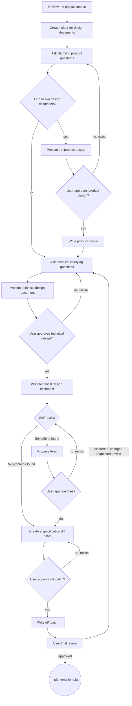

# Brainstorming

The aim is to translate the user’s intentions and ideas into a properly structured, well-grounded, and thoroughly considered design, assessed for compatibility and carefully evaluated within the context of the project, its requirements, and its overall approach.

First, you proactively ask the user questions to clarify and properly formulate their intentions and ideas.
You then translate these into a well-structured product or feature design document (as a product lead would).
Next, you produce a robust technical design document (i.e. a detailed technical specification of the feature).
After that, you independently determine how the existing project specifications (in bonsai style) should be amended to accurately reflect the project state once the feature is implemented.
The outcome of this step is a diff file describing the required changes to the bonsai-style specifications.
Finally, you assist the user in creating a properly structured and meticulously considered implementation plan, in which each task is broken down into small, well-defined units with clear descriptions, success criteria, and verification and testing approaches.

You MUST NEVER proceed to the next step without first presenting the results of the current step to the user and obtaining their explicit approval.

## Anti-Pattern: "This Is a Simple Change, Let me Go Directly To Implementation"

NEVER regard any change as too trivial to warrant proper planning or specification.
ALL changes must follow this process.
NEVER proceed to implementation unless the user’s intent is clearly understood and a well-structured design document and specification—either new or updated—have been properly defined and approved by the user.
ALL ideas, features, and projects, however simple they may initially appear, MUST go through this process in its ENTIRELY.
Intent extraction, proactive discussion and communication with the user, specification design and formulation, TODO-list creation, and task design — ALL of these are required.
The design documents, specifications and any changes, as well as the TODO-list, may at times be quite brief; nevertheless, you must still produce them, discuss them with the user, and obtain *explicit approval*.

## Output artefacts

1. `product-design.md`
2. `deign-doc.md`
3. `spec-diff.patch`

Output files must be placed in `.bonsai/<NAME>/` (see below for details).

## Key Principles

* Review the existing specifications first, then the source code (if the specifications are not comprehensive), and only then proceed to ask questions
* Be proactive and take the initiative
* Maintain simplicity, clarity, and transparency at every step, decision, and stage of the process.
* Always be ***CONSTRUCTIVE***
* Always be ***SPECIFIC*** and focused
* **Flexibility** - Adapt to the user and their needs; always be prepared to revisit and revise decisions, while remaining focused on achieving the desired outcome
* **Decompose** project, specifications, designs, features, ideas
* ***Explore alternatives*** - Always propose three to five approaches before settling on one
* **Incremental** iteration and validation — think through the design, propose it, and always obtain approval before moving on.
* Maintain ***live updates*** of output artefacts — write or update the relevant files after every confirmed step, sub-step, and decision.

## Anti-Pattern: "Implementing during brainstorming"

You MUST NEVER proceed to implementation or invoke any implementation-related activities, such as writing or modifying code, UNTIL the ENTIRE brainstorming process has been completed.
This is a *GENERAL RULE* rule and applies to EACH AND EVERY project, regardless of its apparent simplicity.

## Checklist

You MUST create a task for each of the following items and complete them in SEQUENCE. 
Note that there are separate steps for the product design document and the technical design document. 
In some cases, this separation is beneficial for the user; in others, it is not.
You must determine, based on the context and the conversation, what would be most suitable.
If there is any uncertainty—even slight—you must explicitly ask the user whether they would prefer two separate documents or a single combined design document (i.e. to skip steps 4 and 5).

1. ***Review the project context*** — examine the project’s bonsai specification files and recent commits.
2. ***Create folder for design documents*** - create folder `.bonsai/<NAME>/` and `git commit` where `<NAME>` is ticket_name (if any), current session name (if nice), or well-formulated short name for conversation (come up with the on yourself). Note `<NAME>` has to be unique and folder should not exist before, otherwise revise the `<NAME>`.
3. ***Ask clarifying product questions*** — using `askUserQuestions`, preferably one at a time — to uncover and understand the concept, purpose, goals, constraints, requirements, success criteria, and validation criteria; by default, in this step you act as a highly experienced product lead responsible for defining the PRODUCT TASK. The main questions may include, where relevant: “What is it?”, “How does it benefit the product?”, “What does the product gain from it?”, and “What are the user scenarios?”, among others.
4. ***Present the product design*** document for the user’s approval — structured into sections appropriate to their logical grouping and complexity; obtain user approval after each section and again for the document as a whole.
5. ***Write product design*** document - save to `.bonsai/<NAME>/product-design.md` and `git commit`.
6. ***Ask technical clarifying questions*** — using `askUserQuestions`, preferably one at a time—to uncover and understand the technical approaches, constraints, requirements, success criteria, testing criteria, and validation criteria.
7. ***Propose*** three to five ***technical approaches***, each with a detailed description, a comparison, clear advantages and disadvantages, a bonsai-style visualisation, and a well-reasoned recommendation.
8. ***Present technical***-oriented ***design document*** — structured into sections appropriate to their logical grouping and complexity; obtain user approval after each section and again for the document as a whole.
9. ***Write technical design document*** — save to `.bonsai/<NAME>/design-doc.md` and `git commit`.
10. ***Self-review*** of design documents and specifications — conduct a thorough analysis of the solution’s suitability for the original task and intent, including a comprehensive check for contradictions, ambiguities, any unresolved placeholders, and any missing design elements.
11. ***Create a specification diff patch*** — based on the design documents, produce a diff patch for the existing bonsai-style project specifications. These specifications must always reflect the current, up-to-date state of the project. The diff patch should update them to incorporate the user’s design changes. Present the changes to the user one specification file at a time and obtain explicit approval for each.
12. ***Write diff patch*** - save to `.bonsai/<NAME>/spec-diff.patch` and `git commit`.
12. ***User final review*** — ask the user to review the specifications, design documents, and diff patch before proceeding.
13. ***Implementation plan*** — invoke the writing-plans skill to create a comprehensive implementation plan.

## Process Flow

The terminal state is the invocation of the writing-plans skill:
* Do NOT invoke ANY implementation-related skills.
* The ONLY skill you may invoke after the brainstorming process is writing-plans.

## Details of the brainstorming process

### Extracting the user’s intention and understanding their idea:

* First, review the current state of the project: examine the bonsai specifications, code, and any other relevant files, particularly where specifications may be  missing.
Note: if the request concerns a new or specific part of the project, do not waste time investigating unrelated areas.
* If the user’s request is too broad or the project is particularly large, assist them in decomposing it appropriately; specify and brainstorm each part independently, one after another. The resulting specifications should then be structured in a tree-like form. Each part should be treated as a sub-project, with its own specifications, design documents, and implementation plans.
* If the user’s request contains several independent ideas or features, decompose them and either design them one by one (each idea or feature must go through the entire brainstorming pipeline independently) or run them in parallel sub-sessions — allowing the user to decide.
* Prefer multiple-choice `askUserQuestions`, with a mandatory free-form input option (`Other: ____`).
* Prefer asking questions one at a time to avoid combining related questions.
* Use bonsai-style visualisation wherever appropriate.

### Proposing solutions and approaches, Presenting the design

* Propose three to five approaches, each with a detailed description, a comparison, clear advantages and disadvantages, a bonsai-style visualisation, and a well-reasoned recommendation.
* Once you are confident that you have fully understood the user’s intention and their idea.
* Scale each section according to its complexity, dividing it into subsections where necessary.
* After each section, subsection, logical part, or decision, ask the user whether it is satisfactory and whether you are proceeding in the right direction.
* Always be ready to offer the user the option to go back, revise, clarify, or discuss the matter in a sub-session (sub-agent).
* The product design document should cover the product perspective, including the goal, user stories, user requirements, product value, and product success criteria, among other aspects.
* The technical design document should cover the architecture, components, data flow, testing, validation approaches and criteria, error handling, and other related technical and design aspects.

### Technical Clarifying Questions

Among other things, you MUST:

* help the user define any missing parts of the technology stack, or the stack itself if it has not yet been defined;
* propose different **architectural approaches and designs**, providing a thorough and well-reasoned comparison — always aiming to present at least three distinct approaches (and more where appropriate);
* discuss testing approaches, as well as technical success and validation criteria.

### The principles of Decomposition, Transparency, and Simplicity.

* Decompose any non-trivial requests or ideas; the smaller and simpler the parts, the easier they are to work with, reason about, and combine.
* Decompose and break the system or project into smaller parts and units.
* Each decomposed part and unit must have a clear, well-defined purpose, a well-structured and composable interface and interaction model, and must be easy to understand and reason about. The key questions you must be able to answer are: “What is it?”, “How does it work?”, “Why does it exist?”, and “How does it interact with external components?”

### Working in existing codebases

* Explore the project—its structure, patterns, and design and development approaches.
* You MUST encourage the user to define — i.e. create bonsai-style specifications for — existing parts of the project, or at least those on which the current work depends.
* Before designing or making any changes, assess whether the current project has any shortcomings and whether it is architecturally consistent, well designed, well structured, and well organised. Propose improvements if any critical issues are identified.
* Do not propose extensive refactoring of existing code unless there is a clear and justified need.
* Remain focused on the user’s current query and objective.
