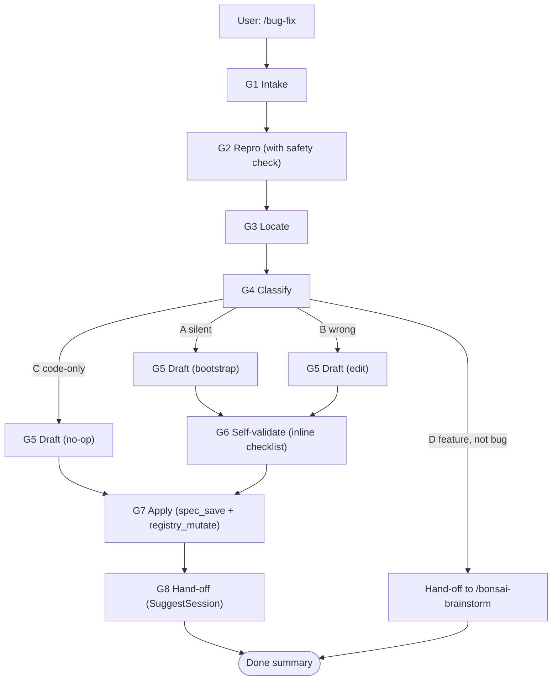

# Bug Fix

You are running an **algorithmic, gate-by-gate bug-triage pipeline**. A bug is, by definition, a **discrepancy between intent and behaviour** — *intent* lives in the project's bonsai specifications, *behaviour* lives in the source code. This skill fixes the **spec half** of that discrepancy (or bootstraps a properly-connected spec when the affected area is uncovered), then hands off the **code half** to a separate session via `SuggestSession`.

The pipeline has **eight gates** (G1–G8). Each gate has a strict contract: defined inputs, the tools it may use, the named in-prompt data shape it produces, and an explicit ratification step where the user confirms before the pipeline advances. Gates fire in strict order. A failure to ratify aborts the pipeline cleanly with a short post-mortem.

This skill performs **no code edits**. It only edits files under `.bonsai/`. The single deliverable is a corrected/extended specification plus a `SuggestSession` hand-off card — never an `Edit`/`Write` against `backend/`, `frontend/`, `claude-plugin/skills/`, `run.sh`, or any other source path.

## Architecture



## Persistent pipeline tracker

**Before running G1**, initialise a persistent progress-tracker so the user can see the eight-gate position throughout the session. Always pass `visId: "bug-fix-pipeline"` and update it after each gate completes (status transitions: `pending → current → done`; on abort, the active step becomes `error` and downstream steps stay `pending`).

Initialise:

```json
{
  "type": "progress-tracker",
  "title": "/bug-fix pipeline",
  "visId": "bug-fix-pipeline",
  "data": {
    "steps": [
      {"label": "G1 Intake",        "status": "current"},
      {"label": "G2 Repro",         "status": "pending"},
      {"label": "G3 Locate",        "status": "pending"},
      {"label": "G4 Classify",      "status": "pending"},
      {"label": "G5 Draft",         "status": "pending"},
      {"label": "G6 Self-validate", "status": "pending"},
      {"label": "G7 Apply",         "status": "pending"},
      {"label": "G8 Hand-off",      "status": "pending"}
    ]
  }
}
```

After **every** gate transition (G1 → G2, G2 → G3, …), re-emit `bonsai_visualize` with the same `visId: "bug-fix-pipeline"` so the UI updates in place. Do not create a new tracker per gate — re-use the same `visId`.

For **case D**, set G5/G6/G7 to `skipped` and G8 to `current` after G4 ratifies. For **case C**, G5/G6 are `skipped` and G7/G8 proceed normally. On **abort**, set the active step to `error`; do not retroactively rewrite earlier `done` steps.

## Inputs and outputs (data shapes)

The pipeline operates on these named in-prompt structures. Keep them in working memory; **do not write any of them to disk**. Each gate produces or refines exactly the shape(s) listed in its contract.

```
BugReport       = { symptom: str, expected: str, severity: enum, repro_hint?: str }
ReproOutcome    = { attempted: bool, observed?: str, matches_symptom: bool, note: str }
Evidence        = { suspected_files: [path], covering_specs: [SpecRef], gap: bool }
SpecRef         = { id: str, path: str, type: str, covers: [path] }
Classification  = { case: "A"|"B"|"C"|"D", justification: str, confidence: "high"|"med"|"low" }
SpecEdit        = { path: str, kind: "create"|"modify", before?: str, after: str,
                    parent_id?: str, sibling_ids?: [str], covers: [path] }
LintResult      = { issues: [{severity, where, message}] }
AppliedEdits    = { saved: [{spec_id, path, kind}], skipped: [{path, reason}] }
HandoffPayload  = { prompt: str, specIds: [str], reason: str,
                    bugReport: BugReport, reproOutcome: ReproOutcome,
                    classification: Classification }
```

- `severity ∈ { "blocker", "major", "minor", "cosmetic" }`.
- `Classification.case ∈ { "A", "B", "C", "D" }`. **Case D** ("feature, not bug") short-circuits the pipeline: G5–G8 are skipped and the skill emits a hand-off to `/bonsai-brainstorm` with the intake context.
- `kind = "create"` for case-A bootstraps; `kind = "modify"` for case-B edits.

## G1 Intake

**Inputs:** the optional `[short symptom]` argument passed with `/bug-fix`.
**Tools:** `AskUserQuestion` (3–4 calls, one question at a time).
**Output:** a `BugReport`.
**Ratification:** the user picks a value for each question; "skip" is allowed for `repro_hint` only.

If the argument is non-empty, treat it as a draft `BugReport.symptom` and confirm/refine it via the first question; otherwise ask for the symptom in free-form.

Use `AskUserQuestion` for the following, ideally one question at a time:

1. **Symptom** — *"What is observed when the bug fires?"*
   - "Use draft from argument" — pre-fills with the slash-command argument (only shown if non-empty).
   - "Refine in free-form" — user writes the symptom from scratch.
   - "Cancel" — abort the pipeline cleanly.
2. **Expected behaviour** — *"What should happen instead?"* Free-form text via the "Other" path; offer a small set of templated leading options if the symptom suggests them (e.g., "Should not crash", "Should fall back gracefully"), otherwise go straight to free-form.
3. **Severity** (single-select):
   - "blocker" — production-broken / data-loss / blocks all work.
   - "major" — important workflow broken; workaround painful.
   - "minor" — annoying but workaround exists.
   - "cosmetic" — visual / wording / non-functional.
4. **Repro hint (optional)** — *"How can I trigger this? (command, env, steps — or skip)"*
   - "Provide a command" — user supplies a shell command in free-form.
   - "Provide steps (no runnable command)" — user types steps in prose; skill records them but will **not** execute anything in G2.
   - "Skip — I have no repro" — `repro_hint` is left unset; G2 will mark `attempted: false`.

After all four answers, compose the `BugReport`:

```
BugReport = {
  symptom:    <answer to Q1>,
  expected:   <answer to Q2>,
  severity:   <answer to Q3>,
  repro_hint: <answer to Q4, omitted if "Skip">
}
```

Present the assembled `BugReport` via `bonsai_visualize` `summary-box` (see *Visualizations* below) and ask `AskUserQuestion`: **Confirm / Edit / Abort**. Only on Confirm advance to G2.

## G2 Repro

**Inputs:** `BugReport.repro_hint` (may be unset).
**Tools:** `Bash` — **only** if `repro_hint` is a runnable command **and** it passes the safety deny-list.
**Output:** a `ReproOutcome`.
**Ratification:** see flow below; the user gates execution explicitly.

### Flow

1. **No `repro_hint`** — set `ReproOutcome = { attempted: false, matches_symptom: false, note: "unverified — user supplied no repro" }`. Note the `unverified` flag prominently in working memory; G8's hand-off prompt **must** repeat it. Skip to G3.

2. **`repro_hint` is prose-only steps** (Q4 was "Provide steps") — do **not** execute anything. Set `ReproOutcome = { attempted: false, matches_symptom: false, note: "unverified — steps recorded, no runnable command" }`. Skip to G3.

3. **`repro_hint` is a runnable command** — apply the **G2 deny-list match first** (see *G2 Repro safety deny-list* sub-section). On match: **refuse**, name the rule that fired, and ask `AskUserQuestion` for a non-destructive alternative (options: "Provide a different command" / "Convert to prose-only steps" / "Skip repro"). Loop back to step 1, 2, or 3 with the new answer; never silently weaken the deny-list.

   On no match, classify the command as **trivial** (a single read-only command like `nc -l 8000` or `./run.sh`) or **non-trivial** (anything else, or anything with redirection, pipes, multiple statements, or environmental side-effects). Even when the command is trivial, **show it to the user** before executing, with `AskUserQuestion`: **Run / Skip / Edit**.
   - **Run** — call `Bash` on the command; capture stdout, stderr, and exit code.
   - **Edit** — accept a revised command in free-form; re-enter step 3 (deny-list match again, then Run/Skip/Edit again).
   - **Skip** — set `ReproOutcome = { attempted: false, matches_symptom: false, note: "unverified — user skipped" }` and advance to G3.

4. **Compose `ReproOutcome`** (after a Run):
   ```
   ReproOutcome = {
     attempted:       true,
     observed:        <one-paragraph summary of stdout/stderr/exit code>,
     matches_symptom: <true if observation reproduces BugReport.symptom; false otherwise>,
     note:            <"verified" if matches_symptom else "mismatch — see observed">
   }
   ```

5. **Mismatch handling** — if `attempted` is true but `matches_symptom` is false, ask `AskUserQuestion`:
   - "Refine symptom" — go back to G1 Q1 with the new observation in hand.
   - "Proceed anyway" — keep `ReproOutcome` as-is; G8's hand-off prompt will state the symptom is unverified-by-mismatch.
   - "Abort" — emit a short post-mortem and exit cleanly.

The `unverified` flag (any `ReproOutcome` with `attempted: false` *or* `matches_symptom: false`) propagates all the way to G8 and is mandatory in the hand-off `prompt`.

## G3 Locate

**Inputs:** `BugReport.symptom`, the codebase, the spec registry.
**Tools:** `Grep`, `Glob`, `Read`, `mcp__bonsai-specs__registry_query` (with `covers=<path>`).
**Output:** an `Evidence`.
**Ratification:** present the evidence; user can add or remove files via free-form before advancing.

### Tool calls

1. **Grep / Glob** — search the codebase for symbols, error strings, file names, and keywords mentioned in `BugReport.symptom` and `BugReport.expected`. Prefer specific, anchored patterns to broad ones; bias toward backend (`backend/app/...`) and frontend (`frontend/src/...`) source paths first, then top-level scripts (`run.sh`, etc.).
2. **Read** — open the most plausible candidate files at the relevant line ranges. Capture `file:line` references (e.g., `run.sh:80-85`) to use later in G8's `Evidence.suspected_files`.
3. **`mcp__bonsai-specs__registry_query`** — for each suspected file path, query the registry with `covers=<path>` to find covering specs. Collect each hit as a `SpecRef = { id, path, type, covers }`.

### Composing `Evidence`

```
Evidence = {
  suspected_files: [<file:line refs from steps 1–2>],
  covering_specs:  [<SpecRef from step 3, deduplicated>],
  gap:             <true if every suspected_file has zero covering_specs; false otherwise>
}
```

If `gap` is true, set the working hypothesis to **case A** (silent) — it will be confirmed in G4. If at least one covering spec exists, the working hypothesis is **case B or C**.

### Ratification

Render `Evidence` via `bonsai_visualize` `data-table` titled *"Suspected files vs covering specs"*:

- **Columns:** `["Suspected file", "Covering spec(s)"]`.
- **Rows:** one per `suspected_files` entry; the second column lists every `SpecRef.id` whose `covers` matches, or "— (no spec)" when none.

Then ask `AskUserQuestion`:
- "Evidence looks right" — advance to G4.
- "Add files" — collect free-form paths; re-query the registry for the new entries; re-render the table.
- "Remove files" — collect free-form paths to drop; recompute `gap`; re-render.
- "Abort" — emit a short post-mortem and exit cleanly.

Loop until the user picks "Evidence looks right". Never advance to G4 with stale `Evidence`.

## G4 Classify

**Inputs:** `Evidence`, `BugReport.expected`.
**Tools:** `mcp__bonsai-specs__spec_get` for each `Evidence.covering_specs` entry.
**Output:** a `Classification` with `case ∈ {A, B, C, D}`.
**Ratification:** present reasoning + classification via `bonsai_visualize` `summary-box`; user picks **Confirm / Reclassify / Abort**.

### Read the covering specs

For each `SpecRef` in `Evidence.covering_specs`, call `mcp__bonsai-specs__spec_get` and extract:

- The spec's stated intent (Purpose, Expected behaviour, Public Interface, etc., depending on type).
- Any explicit guarantees / non-guarantees relevant to `BugReport.symptom`.
- Whether the spec already documents the area where the bug fires.

### Decide the case

Apply the case taxonomy verbatim from product-design §1 / design-doc §2 G4:

| Case | Spec says | Code does | Classification meaning | Routing |
|---|---|---|---|---|
| **A — Silent** | Nothing about this area (`Evidence.gap` is true) | The wrong thing | The spec corpus has a coverage gap; we must **add** intent. | G5 Draft (bootstrap, see §Tier-selection). |
| **B — Wrong** | Something incorrect or outdated | The wrong thing | Existing spec drifted from intent; we must **correct** it. | G5 Draft (focused diff against existing spec). |
| **C — Code-only** | The right thing | The wrong thing | Spec is fine; only code needs to change. | G5 Draft is a **no-op**; pipeline still runs G7/G8 to fire `SuggestSession` with the unchanged spec ids. |
| **D — Feature, not bug** | The right thing for current scope | The right thing for current scope | The user's `expected` describes new functionality the project never intended. | **Short-circuit**: skip G5–G7 entirely; G8 reroutes to `/bonsai-brainstorm`. |

### Case D feature-request guard

Before settling on A/B/C, scan `BugReport.expected` and any covering spec content for **case D signals**:

- The covering spec(s), read in full, already describe behaviour that **matches the current code**, and `BugReport.expected` requests behaviour the spec never claimed.
- Wording in `BugReport.expected` like *"should also..."*, *"want to add..."*, *"would be nice if..."*, *"new option to..."*, *"support for..."*.
- The user's expected behaviour introduces a new capability, configuration knob, or surface area.

If any signal fires **and** there is no spec hint that this behaviour was ever intended, classify as **case D**. Justification must explicitly cite the signals.

Case D **short-circuits the pipeline**: skip G5, G6, G7. Proceed directly to G8, which uses the case-D `/bonsai-brainstorm` reroute prompt (see G8).

### Composing `Classification`

```
Classification = {
  case:          "A" | "B" | "C" | "D",
  justification: <2–4 sentences citing concrete evidence and (for D) the signals fired>,
  confidence:    "high" | "med" | "low"
}
```

`confidence` rubric:
- **high** — Evidence is unambiguous; covering spec read end-to-end (or absent for case A) and matches the case definition cleanly.
- **med** — Evidence is consistent with the chosen case but could plausibly support another; one or two judgement calls were needed.
- **low** — More than one case is reasonable; reclassification is plausible.

### Ratification

Render the classification via `bonsai_visualize` `summary-box` titled *"Classification"*:

```
{
  "type": "summary-box",
  "title": "Classification",
  "visId": "bug-fix-classification",
  "data": {
    "sections": [
      { "heading": "Case", "items": [{ "label": "Case", "value": "<A|B|C|D> — <one-line meaning>" }] },
      { "heading": "Justification", "items": [{ "label": "Reasoning", "value": "<Classification.justification>" }] },
      { "heading": "Confidence", "items": [{ "label": "Level", "value": "<high|med|low>" }] }
    ]
  }
}
```

Then ask `AskUserQuestion`:
- "Confirm" — advance (to G5 for A/B/C, directly to G8 for D).
- "Reclassify" — collect free-form additional input from the user (e.g., "no, the spec at `<id>` does mention this — see line 42").
- "Abort" — emit a short post-mortem and exit cleanly.

### Low-confidence Reclassify loop

If `confidence` is `"low"` **and** the user picks "Reclassify", **re-run G3 then G4** with the user's new input incorporated into the search. Keep looping until either confidence rises (then re-ratify) or the user picks "Confirm" or "Abort". Never advance to G5/G8 from a `"low"`-confidence classification without explicit user confirmation.

## G5 Draft

**Inputs:** `Classification`, `BugReport`, `Evidence`.
**Tools (case A):** `mcp__bonsai-specs__registry_query` (for parent/sibling lookup); the **3-section bootstrap template** below.
**Tools (case B):** `mcp__bonsai-specs__spec_get` to read existing content; compose a focused diff.
**Tools (case C):** none — this gate is a **no-op**.
**Output:** `DraftEdits = [SpecEdit]` (possibly empty for case C).
**Ratification (case A only, when borderline):** `bonsai_visualize` `comparison` + `AskUserQuestion` to pick tier. Always: per-file diff preview before approval.

> Case **D** never reaches G5 — it short-circuits at G4 to G8.

### Case A — bootstrap

The affected area has no covering spec (`Evidence.gap` is true). Apply the **tier-selection heuristic**, then build the edit using the **3-section bootstrap template**.

#### Tier-selection heuristic

| Signal | Tier suggested |
|---|---|
| Expected behaviour fits in ≤ 5 sentences AND closest parent spec has a natural home section | **Inline** |
| Expected behaviour fits in ≤ 5 sentences but no natural home in existing specs | **Tiny stub** |
| Expected behaviour requires multiple sub-sections, interfaces, or describes a whole module | **Delegate** to `/module-design` |
| Expected behaviour is a focused sub-component of an existing module | **Delegate** to `/submodule-design` |

If the heuristic returns a borderline result, **ask the user** rather than deciding. Use `bonsai_visualize` `comparison` titled *"Bootstrap tier"* with one option per tier (showing a 1-line description + pros/cons), then `AskUserQuestion` with the same tier names. Do **not** pick silently.

For **Delegate**: stop the Draft gate and invoke `/module-design` (or `/submodule-design`) via the Skill tool, supplying `BugReport` (especially `expected`) as the initial input. Once the new spec is saved, **resume `/bug-fix` at G6** with `DraftEdits` populated from the delegated session's output.

#### 3-section bootstrap template (Inline and Tiny-stub tiers)

Use this template **literally** for `SpecEdit.after` (case A, Inline or Tiny-stub):

```markdown
# {Title}

## Purpose
{One paragraph: what this component is, why it exists. ≤ 60 words.}

## Expected behaviour
{Plain-English description of the intended behaviour for the area covered by
this spec. Includes the corrected intent for the bug. Mention edge cases and
any explicit guarantees / non-guarantees. Bullet points encouraged.}

## Cross-references
- **Parent:** {spec id / link}
- **Siblings:** {spec ids / links, if any}
- **Covers:** {file paths or globs}
```

For the **Inline** tier, the same three sub-sections appear as a *new section* of the closest existing parent spec (heading depth +1 below the parent's existing structure). No standalone file is created; `SpecEdit.kind = "modify"` and the diff is surgical.

For the **Tiny stub** tier, a new standalone file is created at a path under `.bonsai/` that fits the spec's scope (e.g., `.bonsai/RUN_SCRIPT.md` for a developer-workflow spec). `SpecEdit.kind = "create"`. Use `mcp__bonsai-specs__registry_query` to find a sensible parent (nearest architecture or module spec) and any siblings whose `covers` overlaps; populate `parent_id`, `sibling_ids`, and `covers` accordingly.

#### Connectivity is non-negotiable (all tiers)

- Parent link must point to the closest ancestor architecture/module spec.
- At least one sibling cross-reference if peers exist; otherwise an explicit "no peers — first spec for this area" note in the *Cross-references* section.
- `covers` must list the relevant file paths (matching `Evidence.suspected_files`).
- Registry entry will be added/updated via `registry_mutate` at G7.

### Case B — focused edit

A covering spec exists but is wrong or outdated. Read it via `mcp__bonsai-specs__spec_get` (the full text, not a slice) and compute a focused diff: only the **lines that need to change** — typically a paragraph in *Expected behaviour* or a bullet in a behaviour list. Never rewrite whole sections when a sentence-level edit suffices.

`SpecEdit.kind = "modify"`. `SpecEdit.before` holds the existing relevant snippet; `SpecEdit.after` holds the corrected version. `parent_id`, `sibling_ids`, and `covers` are inherited from the existing spec unless they themselves are stale.

### Case C — no-op

`Classification.case == "C"` means the spec is already correct. `DraftEdits = []`. **G6 is skipped entirely** (no edits to lint), and G7 fires only to refresh the registry mtime if needed; otherwise G7 is also a no-op. The pipeline still proceeds to **G8**, which fires `SuggestSession` with the unchanged covering spec ids in `specIds` (so the new session re-reads the intent).

### Per-file diff preview (cases A and B)

For **each** `SpecEdit` in `DraftEdits`, render a diff preview before any G6 lint check:

- **Tiny-stub create** (case A): show the full `after` content, plus the parent / siblings / covers it will register.
- **Inline modify** (case A): show a unified diff of the parent spec, highlighting the new section.
- **Modify** (case B): show a unified diff of the focused before/after.

Use `bonsai_visualize` `data-table` or a fenced markdown diff block as the medium; either is acceptable. Always advance through G6 next, never directly to G7.

## G6 Self-validate

**Inputs:** `DraftEdits`.
**Tools:** the **inline lint checklist** below, run by this skill prompt against each `SpecEdit`. **Do not** invoke `/spec-lint` here — full project lint runs naturally after G7's `spec_save`.
**Output:** `LintResult = { issues: [...] }`.
**Ratification:** if `issues` is non-empty, ask `AskUserQuestion`: **Fix and re-validate / Apply anyway / Abort**.

> Case **C** skips G6 entirely (no edits).

### Procedure

For each `SpecEdit` in `DraftEdits`, run the **G6 inline lint checklist** (see sub-section below). Collect every failure into `LintResult.issues` with `{severity, where, message}`:

- `severity` — `"error"` for connectivity failures (missing parent, code-path under non-spec dirs, broken `covers`); `"warning"` for soft hits (sibling-refs missing when peers exist but heuristic is uncertain, generic title).
- `where` — `<spec path or id> :: <checklist item number>`.
- `message` — one-line human summary; include the offending text or path.

### Ratification

If `LintResult.issues` is empty, advance to G7 silently.

If `LintResult.issues` is non-empty, render via `bonsai_visualize` `status-list` titled *"G6 lint issues"* (one entry per issue, status `error` or `warning`, `meta` showing `where`). Then ask `AskUserQuestion`:

- **"Fix and re-validate"** — go back into the relevant `SpecEdit`, address the issues (e.g., add the missing parent link, populate `covers`, fix template completeness), re-run the checklist. Loop until clean or the user picks one of the other options.
- **"Apply anyway"** — only honoured for `warning`-severity issues. For `error`-severity issues the option is hidden / disabled, and the only remaining choices are Fix or Abort. When Apply-anyway is taken, record the unresolved warnings in working memory; G8's hand-off `prompt` must mention them ("G6 applied with warnings: ...").
- **"Abort"** — emit a short post-mortem and exit cleanly.

The full project-wide `/spec-lint` runs naturally after `spec_save` at G7 (and at later sessions); G6 is a **pre-flight sanity gate**, not a replacement.

## G7 Apply

**Inputs:** lint-clean `DraftEdits` (or `[]` for case C).
**Tools:** `mcp__bonsai-specs__spec_save` (per file) and `mcp__bonsai-specs__registry_mutate` (for links + `covers`).
**Output:** `AppliedEdits = { saved: [...], skipped: [...] }`.
**Ratification:** **per-file final approval** before each `spec_save` call.

### Procedure

If `DraftEdits` is empty (case C, or all edits were skipped at G5 review), set `AppliedEdits = { saved: [], skipped: [...] }` and advance to G8. Otherwise, **for each** `SpecEdit`:

1. **Conflict check** — if the target file's mtime changed since G3 read it (i.e., another writer modified the spec while this pipeline was running), abort and report. The user re-runs `/bug-fix` from scratch. Do **not** silently re-read and continue.

2. **Final approval** — ask `AskUserQuestion`: **Apply / Edit / Skip**.
   - **Apply** — proceed to step 3.
   - **Edit** — accept a revised `SpecEdit.after` (or refined `before/after` for case B); re-run G6 against the revised edit, then return here.
   - **Skip** — record `{ path, reason: "user-skipped" }` in `AppliedEdits.skipped` and move to the next edit.

3. **`spec_save`** — call `mcp__bonsai-specs__spec_save` with the `SpecEdit.path`, `SpecEdit.after` content, the spec `type` (inferred from the path / template — typically `module-design` or `submodule-design` for tiny-stub / inline edits), and `status: "active"`.

4. **`registry_mutate`** — add or refresh:
   - `covers` to match `SpecEdit.covers`.
   - `parent` link to `SpecEdit.parent_id` (if set).
   - sibling cross-refs to each `SpecEdit.sibling_ids[i]` (link type `references` or `siblings` per registry conventions).

5. **Record** — push `{ spec_id, path, kind }` into `AppliedEdits.saved`.

### Per-file save tracking

Surface the live save status via `bonsai_visualize` `progress-tracker` titled *"G7 spec save"*:

- One step per `SpecEdit`, label `<path>` (or `<spec_id>` after save returns), status `pending → current → done`/`error`/`skipped`.
- Update the tracker after **each** `spec_save` + `registry_mutate` pair so the user sees progress in real time.

If any `spec_save` returns an error, mark that step `error` in the tracker, push `{ path, reason: <error message> }` into `AppliedEdits.skipped`, and ask `AskUserQuestion`: **Retry / Skip / Abort** before continuing.

## G8 Hand-off

**Inputs:** `BugReport`, `ReproOutcome`, `Classification`, `AppliedEdits`, `Evidence`.
**Tools:** `SuggestSession` (Bonsai MCP, exposed as `mcp__bonsai-proactive__SuggestSession`).
**Output:** a single suggested-session card (or none, see *Empty edits due to skip* branch).
**Ratification:** the user accepts or dismisses the card; the skill emits a Done summary either way.

There are three branches.

### Branch 1 — Normal hand-off (cases A, B, C)

Fire `SuggestSession` with the following payload, substituting the values from working memory:

```
prompt: """
Bug: {BugReport.symptom}
Expected: {BugReport.expected}
Repro: {ReproOutcome.note} ({"verified" if ReproOutcome.attempted and ReproOutcome.matches_symptom else "unverified"})

The following specs were updated to reflect the correct intent:
{for each AppliedEdit in AppliedEdits.saved:
  "- {AppliedEdit.path} ({AppliedEdit.kind}): {one-line summary of change}"}

Your task: bring the code into alignment with these specs. Do NOT redesign
the spec. Do NOT widen scope. Suspected files: {Evidence.suspected_files}.

When done, run the repro to confirm the fix.

If you discover a related but distinct issue while making this change,
surface it in your final summary but do **not** act on it. Run `/bug-fix`
for it separately.
"""
specIds: [<every spec id touched OR — for case C — every covering spec id from Evidence>]
reason: "Code alignment for bug: {BugReport.symptom}"
```

**Case-specific tweaks:**

- **Case A** — `specIds` includes all newly-created and inline-modified spec ids from `AppliedEdits.saved`.
- **Case B** — `specIds` includes the modified covering spec ids from `AppliedEdits.saved`.
- **Case C** — `AppliedEdits.saved` is empty by definition; populate `specIds` with the **unchanged but relevant** covering spec ids from `Evidence.covering_specs` so the new session can re-read the intent. The `prompt`'s "specs were updated" block becomes:
  ```
  No spec changes were needed — the existing specs already capture the
  correct intent. Re-read these specs before changing code:
  {for each SpecRef in Evidence.covering_specs: "- {SpecRef.path} (id: {SpecRef.id})"}
  ```

**The chained-bug guard line is appended verbatim, always.** It is the last paragraph of `prompt` in every case. Reproduce it character-for-character:

> *If you discover a related but distinct issue while making this change, surface it in your final summary but do **not** act on it. Run `/bug-fix` for it separately.*

If `ReproOutcome` is unverified for any reason, the `Repro:` line in `prompt` must say `"unverified"` and `note` must be carried through verbatim — never paper over the unverified flag.

If G6 was applied with warnings (Apply-anyway picked), append `"G6 applied with warnings: <bullet list of warning messages>"` after the Repro line.

### Branch 2 — Case D reroute to /bonsai-brainstorm

When `Classification.case == "D"`, **replace** the SuggestSession payload with:

```
prompt: """
The user reported the following as a bug, but on inspection the requested
behaviour is new functionality the project never intended:

  Symptom: {BugReport.symptom}
  Expected: {BugReport.expected}
  Reasoning: {Classification.justification}

Treat this as a feature design and run /bonsai-brainstorm.
"""
specIds: []
reason: "Reroute to /bonsai-brainstorm: feature request, not a bug."
```

`specIds` is intentionally **empty** for case D; no spec was edited and no covering spec is the "right" target — the brainstorming flow will determine which specs (if any) eventually need to change. The chained-bug guard is **not** appended in this branch (the next session is brainstorming, not bug-fix).

### Branch 3 — Empty edits due to user-skipped diffs (no hand-off)

If `Classification.case ∈ {A, B}` **but** `AppliedEdits.saved` is empty because the user picked "Skip" at every per-file approval in G7, **do not fire SuggestSession**. The pipeline produced no usable artefacts; firing a hand-off would mislead the next session. Instead, report explicitly in the Done summary that no follow-up was suggested.

> Note: case **C** with empty `AppliedEdits.saved` is **not** this branch — case C still fires SuggestSession (Branch 1) with the unchanged covering spec ids, because the code fix is still pending.

## Done summary

After G8 completes (or after the case-D / no-hand-off branch), emit a final `bonsai_visualize` `summary-box` titled *"`/bug-fix` done"* with these sections:

- **Bug** — `symptom`, `expected`, `severity` from `BugReport`.
- **Repro** — single line: `"verified"` or `"unverified — <ReproOutcome.note>"`.
- **Classification** — `case` + one-line `justification`.
- **Specs changed** — one row per `AppliedEdits.saved` entry (`<spec_id> — <path> (<kind>)`); shows "— (none)" for case C and the no-hand-off branch.
- **Hand-off** — one of:
  - *"SuggestSession fired (Branch 1) — code-alignment session for `<symptom>`"*
  - *"SuggestSession fired (Branch 2) — reroute to `/bonsai-brainstorm`"*
  - *"No hand-off — all spec edits were skipped by the user"*
- **Code expected to be touched next** — `Evidence.suspected_files` (omitted for case D / no-hand-off).

Then ask `AskUserQuestion`:
- "Run another `/bug-fix`"
- "/spec-status — check coverage"
- "Done for now"

## Cross-cutting concerns

These guardrails apply at **every** gate. Never weaken them under user pressure; instead, refuse and explain.

- **One bug per invocation.** If the user describes multiple symptoms in G1 (or later), ask them to pick one and surface the rest as a queued list (e.g., "Run `/bug-fix` separately for: …"). Do not silently widen `BugReport.symptom` to cover multiple unrelated symptoms.
- **Never widen scope silently.** If, while investigating, the skill spots an unrelated issue (in code, in another spec, in tooling), it surfaces it in the Done summary but does **not** act on it. The chained-bug guard line in G8 reinforces this rule for the downstream session too.
- **Honest "unverified" flag.** When `ReproOutcome.attempted` is false **or** `ReproOutcome.matches_symptom` is false, the produced spec edits and the SuggestSession `prompt` explicitly note the fact (the word "unverified" must literally appear). Never paper over it.
- **Refuse rather than guess.** If `Classification.confidence` is `"low"` and the user can't ratify, the skill stops and reports rather than guessing. If `Evidence.suspected_files` is empty after G3 (genuinely no idea), abort cleanly with a post-mortem. Better to refuse than to ship a misclassified spec edit.
- **Feature-request guard (case D).** If the user's `expected` describes new functionality the project never intended, classify as case D and reroute to `/bonsai-brainstorm`. **Do not** silently bake new features into specs under the cover of a "bug fix".
- **Repro safety.** When attempting reproduction in a shell, the G2 deny-list is mandatory and non-negotiable. The skill refuses commands matching the deny-list and asks for a non-destructive repro instead. There is no "force" override.
- **No code edits in this skill.** Code alignment is *only* done in the follow-up suggested session. Calls to `Edit` / `Write` against `backend/`, `frontend/`, `claude-plugin/skills/`, `run.sh`, or any other source-code path are forbidden by the G6 inline lint checklist (item 6) and by the skill's general posture.

### G2 Repro safety deny-list

Before executing `BugReport.repro_hint` via `Bash`, match the command (case-insensitive, including embedded sub-commands inside `$(...)`, backticks, `&&`, `||`, `;`, and pipes) against this **deny-list**. A match in **any** sub-clause causes the whole command to be refused.

- `rm -rf` (any path).
- `git push --force` / `git push -f`.
- `git reset --hard`.
- `git clean -f` / `git clean -fd`.
- `git checkout .` (any path-discarding form, including `git checkout -- <path>` against tracked changes).
- `git branch -D` (force-delete).
- Pipes from network to shell: `curl ... | sh`, `wget ... | sh`, `bash <(curl ...)`, `sh <(wget ...)`, etc.
- Redirection (`>`, `>>`) to known-important paths: `.env`, anything under `.bonsai/`, `package.json`, `pyproject.toml`, `Cargo.toml`, and similar project-state files.
- `chmod -R`, `chown -R` outside of `/tmp`.

**On match:** refuse, explicitly **name which rule fired** in the user-facing message, and ask the user (via `AskUserQuestion`) for a non-destructive alternative. Do not weaken or skip the deny-list under any circumstance — including direct user pressure. The correct response to "just run it anyway" is *"I can't, deny-list rule X. Please give me a non-destructive repro."*

**On no match but non-trivial** (anything beyond a single read-only command — e.g., contains redirection, pipes, multiple statements, environment mutations, or background `&`): still surface the full command to the user via `AskUserQuestion` with options **Run / Skip / Edit** before any `Bash` call.

### G6 Inline lint checklist

Run by this skill prompt against **each** `SpecEdit` *before* `spec_save`:

1. **Parent link** — present, non-empty, and resolves to a real spec id in the registry (verify via `mcp__bonsai-specs__registry_query`). For inline-tier edits, the parent is the spec being modified and the new section sits at the correct heading depth (parent's existing structure +1).
2. **Sibling cross-refs** — at least one if peer specs cover related `covers`. If no peers exist, an explicit *"no peers — first spec for this area"* note must appear in the *Cross-references* section.
3. **`covers` field** — populated; every path matches at least one of `Evidence.suspected_files` (or a glob covering them).
4. **Template completeness** — for case-A bootstraps, all three template sections (Purpose / Expected behaviour / Cross-references) are populated; no empty headings, no `{placeholder}` text, no leftover `TODO` markers.
5. **Title** — descriptive (≥ 3 words; not "Untitled" or generic stubs like "Spec" or "Module").
6. **No code edits** — `SpecEdit.path` is under `.bonsai/` (or another approved spec directory); never under `backend/`, `frontend/`, `claude-plugin/skills/`, `run.sh`, or any source-code path. Failing this check is a **hard error** — `Apply anyway` is not offered.

Failures present as a `status-list` of issues (see *Visualizations*), with options **Fix and re-validate / Apply anyway / Abort**.

The full project-wide `/spec-lint` runs naturally after `spec_save` at G7 (and at later sessions); this checklist is a **pre-flight sanity gate**, not a replacement.

## Failure & abort handling

- **At any gate**, if the user picks "Abort", emit a short post-mortem (which gates ran, what was concluded so far, what — if anything — was saved) and exit cleanly. Update the persistent progress-tracker so the active gate becomes `error` and downstream gates stay `pending`. Do **not** call `SuggestSession`.
- **G2 deny-list match** — see *G2 Repro safety deny-list*; refuse and ask the user for a non-destructive repro. Never weaken the deny-list.
- **G2 mismatch** — observation contradicts the symptom → user-mediated branch (Refine symptom / Proceed anyway / Abort). On Proceed anyway, `ReproOutcome.matches_symptom` stays false and propagates to G8.
- **G4 low-confidence** — if `Classification.confidence` is `"low"` and the user picks "Reclassify", **re-run G3 then G4** with the user's additional input incorporated into the search. Loop until confidence rises (then re-ratify) or the user picks Confirm or Abort.
- **G4 case D** — feature, not bug → skip G5–G7, hand off to `/bonsai-brainstorm` (G8 Branch 2). The persistent tracker shows G5/G6/G7 as `skipped`.
- **G5 conflict** — if a draft would touch a spec already modified externally (mtime changed since G3 read it), abort and report; the user re-runs `/bug-fix` from scratch. Do not silently re-read.
- **G6 inline checklist failure** — `error`-severity issues (missing parent, no-code-edits violation, broken `covers`) hide the "Apply anyway" option; only Fix-and-re-validate or Abort are offered. `warning`-severity issues allow Apply-anyway, but the warnings propagate into G8's hand-off `prompt`.
- **G7 spec_save error** — mark the affected step `error` in the per-file progress-tracker, push `{ path, reason: <error message> }` into `AppliedEdits.skipped`, and ask Retry / Skip / Abort. Other already-saved edits are kept.
- **No SuggestSession at end** — if `AppliedEdits.saved` is empty AND `Classification.case == "C"`, the skill **still** calls `SuggestSession` (Branch 1 with `specIds` populated from `Evidence.covering_specs`). If `AppliedEdits.saved` is empty due to **user-skipped diffs** in G7 (cases A/B), hand-off is **not** fired (G8 Branch 3) and the Done summary reports that no follow-up was suggested.

## Visualizations

`bonsai_visualize` calls fire at every gate's ratification step plus the persistent pipeline tracker. The mapping is exhaustive — every gate has at least one visualization.

| Gate | Visualization | `visId` (suggested) |
|---|---|---|
| Persistent | `progress-tracker` *"`/bug-fix` pipeline"* — eight gate steps; updated after every gate transition | `bug-fix-pipeline` |
| **G1** | `summary-box` *"Bug intake"* with rows: symptom, expected, severity, repro hint | `bug-fix-intake` |
| **G2** | (no dedicated visualization required; the deny-list refusal and Run/Skip/Edit confirmation are handled via `AskUserQuestion`. Optional: `summary-box` *"Repro outcome"* if the command was Run.) | `bug-fix-repro` (optional) |
| **G3** | `data-table` *"Suspected files vs covering specs"* — columns `["Suspected file", "Covering spec(s)"]` | `bug-fix-evidence` |
| **G4** | `summary-box` *"Classification"* with sections Case / Justification / Confidence | `bug-fix-classification` |
| **G5** | `comparison` *"Bootstrap tier"* (case A only, when borderline) showing Inline / Tiny stub / Delegate; per-file diff preview as fenced markdown or `data-table` | `bug-fix-tier`, `bug-fix-diff` |
| **G6** | `status-list` *"G6 lint issues"* — one entry per issue, status `error` / `warning`, `meta` showing `where` | `bug-fix-lint` |
| **G7** | `progress-tracker` *"G7 spec save"* — one step per `SpecEdit`; updated after each `spec_save` + `registry_mutate` pair | `bug-fix-save` |
| **G8** | `summary-box` *"Hand-off summary"* with all artefacts (followed by the Done summary's own `summary-box`) | `bug-fix-handoff` |

Re-use a `visId` to update a visualization in place; introduce a new `visId` for a fresh visualization. When in doubt, prefer in-place updates so the user sees a coherent narrative.
