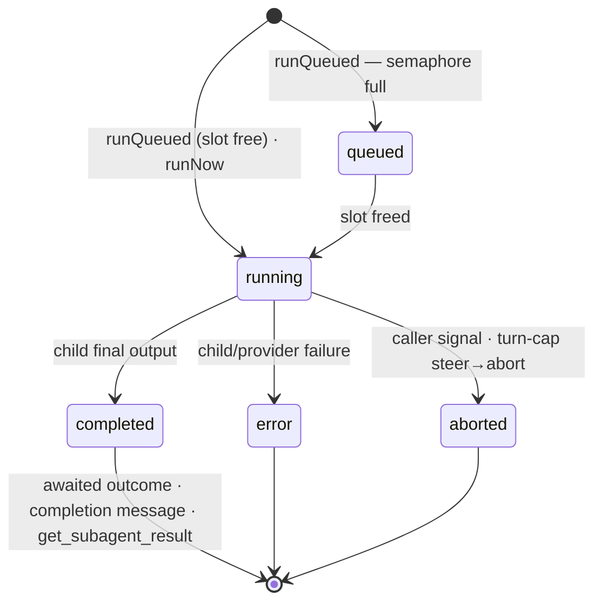
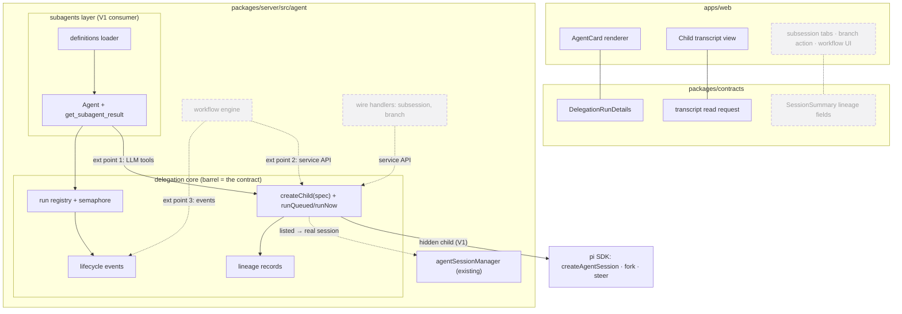

# Delegation core — session fabric: spawn, fork, lineage, extension points

## Summary

A `delegation` sub-module in `packages/server/src/agent/`: the framework for creating agent
sessions *from* agent sessions. One creation primitive with orthogonal axes; a handle that owns
the run loop; lineage, a run registry, and lifecycle events as extension points. **V1 implements
exactly one axis combination — subagents ([[task-subagent-support]], the extensibility check);**
every other combination is typed in the contract and rejected loudly until its consumer lands.
Reading order: the contract below is the artifact under review; everything after it explains
semantics and boundaries; the decision log at the end records how each choice was reached.

## Request & vision (user, 2026-08)

The deliverable is **the ground-base mechanism and its extension points**, on which these patterns
will be built (by us and, eventually, by the user for their own workflows):

- **Subagents** — tool-driven, non-interactive children; result returns to the parent. *V1, the
  first consumer.*
- **Interactive subsessions** — fully interactive sessions created from the current one ("discuss
  this question in a subsession"); the **user** talks to it. *Future; UX deliberately unpinned.*
- **Session branching** — fork a conversation at a message and continue separately (pi-native:
  session files are trees). *Future.*
- **Custom workflows (Claude-style)** — user-defined orchestration: delegated steps, DAGs with
  joins, human-in-the-loop gates. Must be supportable in **all three styles**: LLM-orchestrated
  (tools only), declarative definitions + engine, programmatic TypeScript. *Future.*

## The contract

Host-side types on the `delegation` barrel; `DelegationRunDetails` lives in `packages/contracts`.

```ts
// ── The service (= the barrel) ───────────────────────────────────────
interface DelegationService {
  createChild(spec: CreateChildSpec): Promise<ChildHandle>;
  findChild(sessionId: string): ChildHandle | undefined;    // by CHILD id — "find" = may be absent
  childrenOf(parentSessionId: string): ChildHandle[];       // by PARENT id — the key is in the name
  onLifecycle(l: (e: LifecycleEvent) => void): () => void;  // the workflow extension point
  disposeChildrenOf(parentSessionId: string): Promise<void>; // the cascade — manager calls it on parent dispose
}

// ── Phase 1: creation — identity + shape, ZERO run concerns ──────────
interface CreateChildSpec {
  parent: string;                   // parent sessionId — workspaceId, cwd, and model/thinking
                                    // defaults are DERIVED from the live parent (inconsistent
                                    // triples unrepresentable; unknown parent → typed error)
  info: ChildInfo;                  // descriptive metadata — never behavior (type below)
  origin?: { kind: "fresh" }        // default
         | { kind: "fork"; sourceSessionId: string; entryId?: string }  // rejected in V1
         | { kind: "seeded"; digest: string };                          // rejected in V1 (V2+)
  visibility: "hidden" | "listed"; // REQUIRED, no default; "listed" rejected in V1
  interactive?: boolean;            // default false; true rejected in V1 (until subsessions)
  workspace?: WorkspaceProvider;    // absent = shared parent cwd; the isolation seam
  session?: SessionOptions;         // pi-mirrored subset; absent = parent-like — rejected in V1
}

// Descriptive metadata — recorded in lineage (SpawnRecord.info), stamped into
// DelegationRunDetails; ZERO behavioral effect (behavior travels exclusively in `session`).
// All strings are open sets by convention — new consumers add values, never contract changes.
interface ChildInfo {
  createdBy: string;                // "tool:Agent" | "user" | "workflow:<name>" | …
  roleName?: string;                // display label
  roleSource?: string;              // e.g. "builtin" — the core never learns the definition taxonomy
}

// pi's names, pi's semantics (a mirrored subset of createAgentSession's signature) — a pi user
// recognizes every field; a future pi option (e.g. scopedModels) is adopted by adding its mirror.
// The INFRASTRUCTURE options are deliberately NOT mirrored: modelRuntime, sessionManager,
// settingsManager, resourceLoader, customTools are assembled by the core (shared runtime, hidden
// session dir, gated loaders) — exposing them would let a consumer bypass storage/lineage/trust.
interface SessionOptions {
  model?: { provider: string; id: string }; // default: parent's current model
  thinkingLevel?: ThinkingLevel;            // default: parent's current level
  tools?: string[];                         // pi allowlist semantics
  excludeTools?: string[];                  // pi denylist semantics — survives registry rebuilds
  // loader-level shaping, flattened (the core translates to resourceLoader overrides):
  systemPrompt?: string;                    // → systemPromptOverride (consumer assembles body + bridge + env)
  contextFiles?: boolean;                   // default false — worktree AGENTS.md opt-in
  skills?: string[];                        // explicit skill selection, default none
}

// The isolation seam — generative: a provider returns a value the core consumes at run start.
// "Where does a child run and what brackets the run" is a strategy (git worktree, tmpdir,
// container, remote sandbox), never core behavior; the core consumes only a cwd + teardown hook.
interface WorkspaceProvider {
  prepare(ctx: { sessionId: string; parentSessionId: string; baseCwd: string; roleName?: string })
    : Promise<{ cwd: string; dispose(outcome: { status: RunStatus }): { resultAddendum?: string } | undefined }>;
}

// ── Phase 2: the handle — the ONLY way to drive a child (raw AgentSession never exposed) ──
interface ChildHandle {
  readonly sessionId: string;       // the child AgentSession id — THE id, everywhere
  readonly record: SpawnRecord;
  readonly snapshot: RunSnapshot | undefined;  // latest run (registry projection)
  runQueued(task: string, opts?: RunOptions): Promise<RunOutcome>; // waits for a per-parent slot
  runNow(task: string, opts?: RunOptions): Promise<RunOutcome>;    // bypasses the queue — loud-rejected in V1 (no consumer)
  steer(text: string): Promise<void>;          // while running (turn-cap wrap-up uses this internally)
  abort(): Promise<void>;                      // abort the current run
  dispose(): Promise<void>;                    // abort + workspace.dispose + release
  onEvent(l: (e: LifecycleEvent) => void): () => void; // this child only
}

interface RunOptions {
  maxTurns?: number;                // run governance — NOT in SessionOptions (pi has no such option;
                                    // the mirror stays pure) and per-RUN (a chain reuses a child with different caps)
  signal?: AbortSignal;             // caller cancellation (tool signal, engine fail-fast)
  onUpdate?: (details: DelegationRunDetails) => void;  // REPLACE-style snapshots → partialResult
}

// Expected outcomes are VALUES — the run methods resolve with status even for error/aborted
// (cards need the details); they REJECT only on contract misuse, with a typed error.
interface RunOutcome {
  status: "completed" | "error" | "aborted";
  finalText?: string;               // last assistant text
  details: DelegationRunDetails;    // final snapshot (usage, duration — pi-owned numbers)
  errorMessage?: string;
}

class DelegationError extends Error {
  code: "not-implemented"        // V1-rejected axis combination
      | "invalid-combination"    // permanently invalid (hidden+interactive; a run method on an interactive child)
      | "unknown-parent"         // parent not live in the manager
      | "already-running"        // one run at a time per child — steer instead
      | "disposed";
}

type LifecycleEvent =
  | { type: "child-created"; record: SpawnRecord }
  | { type: "run-queued" | "run-started"; sessionId: string; parentSessionId: string }
  | { type: "run-terminal"; sessionId: string; parentSessionId: string; outcome: RunOutcome }
  | { type: "child-disposed"; sessionId: string; parentSessionId: string };

// Lineage — the persisted edge (V1: derived from the storage layout, see "Storage & lineage")
interface SpawnRecord {
  sessionId: string; parentSessionId: string; workspaceId: string;
  originKind: "fresh" | "fork" | "seeded"; entryId?: string;
  info: ChildInfo;
  interactive: boolean; visibility: "hidden" | "listed";
  createdAt: string; sessionFile: string;
}

// Registry projection (in-memory, keyed by parent sessionId): the LATEST run per child.
// Multi-run bookkeeping (workflow chains running a child sequentially) is the caller's.
interface RunSnapshot {
  status: "queued" | "running" | "completed" | "error" | "aborted";
  task: string;
  details: DelegationRunDetails;
  finalText?: string;
  collected: boolean;               // a detached (unawaited) run's result was collected
}

// Wire/renderer contract (packages/contracts): server and web share this one type.
interface DelegationRunDetails {
  childSessionId: string;           // THE id on the wire
  roleName?: string; roleSource?: string;   // open — mirrors ChildInfo
  task: string;
  status: "queued" | "running" | "completed" | "error" | "aborted";
  model?: string;
  usage: { input: number; output: number; cacheRead: number; cacheWrite: number;
           cost: number; turns: number; contextTokens: number };
  durationMs: number;
  activity?: string;                // last tool/step line — the live card
}
```

Also exported, pure: `deriveChildSessionFile(dataDir, workspaceId, parentSessionId,
childSessionId)` — the transcript path without a live handle (post-restart reads).

## Patterns = axis combinations

| Pattern | Spec | Driven by |
|---|---|---|
| **Subagent** (V1) | `{origin: fresh, visibility: hidden, interactive: false, info: {createdBy: "tool:Agent", roleName, roleSource}, session: from definition}` | `runQueued(task)` — awaited (foreground) or not (background) |
| Interactive subsession | `{origin: fresh \| fork, visibility: listed, interactive: true, info: {createdBy: "user"}}` | the user, via the manager — never a run method |
| Branch | `{origin: fork(current, entryId), visibility: listed, interactive: true, info: {createdBy: "user"}}` (no `session`) | the user |
| Workflow step | `{interactive: false, info: {createdBy: "workflow:<name>"}}` | `runQueued`/`runNow` by an engine |
| Workflow human gate | `{interactive: true, visibility: listed, info: {createdBy: "workflow:<name>"}}` — engine-*created*, human-*driven*: expressible because behavior and provenance are separate fields | the user; engine awaits its conclusion |

## Semantics

### Interactive vs non-interactive (the one behavior split the core enforces)

| | `interactive: false` | `interactive: true` |
|---|---|---|
| Who prompts | the spawner (tool call / engine) | the human (composer) |
| WS prompt input | rejected | accepted (requires `listed`; `hidden + interactive` rejects) |
| Semaphore | `runQueued` waits for a slot; `runNow` bypasses | n/a — the run methods reject |
| `RunOptions.maxTurns` | applies (cap → steer → abort) | n/a |
| Completion | terminal events + `finalText`; delivery (tool result / completion message) is the consumer's | no `finalText` — a "conclude" action when subsessions land |

### Run lifecycle



### Waiting & control

| Mechanism | Behavior |
|---|---|
| Foreground | `await child.runQueued(task)`. pi executes a batch's tool calls concurrently (verified: `pi-agent-core` `executeToolCallsParallel`), so N `Agent` calls = N children in flight — no `tasks[]`/chain DSL needed. |
| Concurrency | Semaphore **per parent session**, default 4; FIFO. Why: the model decides how many spawns to emit — each child is a full LLM session, so unbounded spawn multiplies token spend, provider 429 pressure, and load on the one shared event loop (no crash isolation). Resource governance, not correctness. Host-wide ceiling: config follow-up. |
| Background | Don't await the promise. Completion → `run-terminal` event; the subagent tool layer additionally injects a `subagent-completion` custom message into the parent. |
| Result collection | Registry snapshot via `findChild(id)`: terminal → final output + details, marks `collected`; running → status snapshot (not an error); unknown id → error naming the restart-loss case + the derived transcript path. |
| Join / wait-all | **Not core.** Engine control flow over `run-terminal` events / run promises — see Appendix A. |
| Turn cap | `RunOptions.maxTurns`: on cap, `steer()` a wrap-up instruction, then `abort()`. No wall-clock timeout (provider retries are pi's job). |
| Abort | `signal` in `RunOptions` (tool abort, engine fail-fast) → child abort. Parent dispose → `disposeChildrenOf` cascade. A mid-turn parent abort kills only awaited (foreground) runs via their signals; detached runs survive turn aborts. |
| Restart | Foreground dangling toolCalls → healed by the existing generic `repairDanglingToolCalls`. Registry is in-memory: detached runs are lost (accepted); transcripts remain on disk and stay openable. |

### Storage & lineage

- **Hidden children persist under the ThinkRail data dir, never pi's default sessions root:**
  `~/.thinkrail/delegation/<workspaceId>/<parentSessionId>/<child>.jsonl` via
  `SessionManager.create(cwd, sessionDir)` — verified: pi accepts a custom `sessionDir` on
  `create`/`open`/`list`/`forkFrom` (the last covers the future `fork` axis). Hidden by
  construction: the workspace's `listSessions` scans only the default root.
- **V1 lineage = the storage layout.** The directory structure *is* the parent edge; the
  transcript path derives from `(workspaceId, parentSessionId, childSessionId)` with no index
  file. A persisted `SpawnRecord` index becomes real when `listed` visibility lands (the type
  exists now, the file does not).
- **The core stores only the parent edge — a tree, never a DAG.** A workflow's steps are all
  spawned with `parent = the run's root session` (siblings); the DAG's data-flow edges are the
  engine's own record. Consequences: whole-run cancel = the existing cascade on the root's
  children (no graph traversal); a join is engine control flow, not a session.
- **Retention:** children are deleted when their **workspace** is archived
  (`removeWorkspaceSessions` extends to `delegation/<workspaceId>/`); closing a tab deletes
  nothing (same as parents). No per-parent GC in V1.
- `listed` children (future) ride everything that exists — manager registration → tabs, WS
  streaming, hydration, restart repair; the wire's `SessionSummary` grows optional lineage fields
  then, not now.

## Architecture (solid = V1, dashed = future consumers)



## Extension points (exactly three, plus one seam)

1. **LLM tools** (the `Agent` tool now) — extension factories over the service. Serves
   LLM-orchestrated workflows with zero further machinery.
2. **The service API** (the barrel) — wire handlers (branch, subsession) and programmatic
   workflows call it directly.
3. **Lifecycle events** — a declarative workflow engine subscribes; every event carries
   `{sessionId, parentSessionId}` so engines build their own step graphs without the core storing
   a DAG.

Plus the **workspace seam** (`WorkspaceProvider`): child isolation (git worktree, tmpdir,
container) as a pluggable strategy. ThinkRail's natural provider already exists — the
projects/workspaces feature owns `git worktree` creation; merge-back semantics live in the
provider's `dispose` (`resultAddendum` tells the parent where work landed), never in the core.
(Pattern validated by gotgenes' ADR-0002 seam + companion worktrees package.)

## Scope & readiness rules (user-settled)

**V1 = the core + subagents, nothing else.** Future patterns are out of scope, their UX unpinned —
but the core must be ready: the **contract carries the full axis space; the implementation stays
minimal**. Unexercised combinations (`listed`, `fork`, `seeded`, `interactive: true`, `runNow`,
`session` absent) **reject loudly** with typed errors — the seam is real, the dead code is not. A
future pattern's first consumer must only *fill in* its combination, never reshape the contract.
Report-back from a subsession to its parent (when subsessions land) is pi-native
(`sendMessage`/`followUp`) — no core provision needed beyond lineage.

## V1 acceptance

1. `createChild` + `runQueued` + lineage + registry/events implemented for the subagent
   combination, consumed by the `Agent` tool with **zero private child-assembly code** in the tool
   layer.
2. Unsupported combinations fail loud with typed errors (unit-pinned).
3. The contract reviewed on paper against each future pattern (subsession / branch / all three
   workflow styles) before the implementation is called done — recorded here.
4. Module boundary: `delegation` sub-module with a barrel; consumers import through it; decisions
   promoted to [[submodule-server-agent]]'s SPEC.

## Appendix A — worked example: a DAG engine on the V1 surface (non-normative)

The engine owns the step graph; the core contributes spawn + outcomes. Join = `Promise.all`;
fan-out = nodes sharing a dep (the semaphore paces them); a human gate = a `listed + interactive`
child whose conclusion the engine awaits instead of a run outcome.

```ts
async function runNode(node: StepNode, inputs: string[], signal: AbortSignal): Promise<string> {
  const child = await delegation.createChild({ parent: rootSessionId,
    visibility: "hidden", info: { createdBy: `workflow:${dagName}`, roleName: node.role },
    session: optionsFor(node) });
  try {
    const out = await child.runQueued(renderTask(node.task, inputs), { signal, maxTurns: node.maxTurns });
    if (out.status !== "completed") throw new StepFailed(node, out);
    return out.finalText ?? "";
  } finally { await child.dispose(); }
}

async function runDag(dag: Dag, cancel: AbortSignal): Promise<void> {
  const failFast = new AbortController();               // one failure aborts running siblings
  cancel.addEventListener("abort", () => failFast.abort(cancel.reason));
  const results = new Map<NodeId, Promise<string>>();
  for (const node of dag.topological()) {
    results.set(node.id, (async () => {
      const inputs = await Promise.all(node.deps.map((d) => results.get(d)!));  // ← join
      failFast.signal.throwIfAborted();                 // downstream never spawns after failure
      return runNode(node, inputs, failFast.signal);
    })());
  }
  try { await Promise.all(results.values()); }
  catch (e) { failFast.abort(e); throw e; }
}
```

Abort layering: step failure → fail-fast signal (engine policy — could retry instead); whole-run
cancel → same signal; root-session dispose → the core's cascade as backstop. All step sessions are
lineage-siblings under the root — parent edge ≠ dependency edge.

## Appendix B — decision log (how the contract got its shape)

1. **Two-phase surface** (`createChild` → `runQueued`/`runNow`) chosen over one mega-`spawnSession`
   and over per-pattern constructors (design-options round): creation and running are different
   moments; the run loop (semaphore, usage aggregation, turn caps) is owned **once** instead of
   per-consumer; most states become valid-by-construction. Per-pattern sugar (e.g. `runSubagent`)
   may appear in consumer layers later — never as the core contract.
2. **`driver: "tool" | "user" | "orchestrator"` enum rejected**: it conflated behavior with
   consumer identity, was a closed set (new consumer = contract reshape), and couldn't express the
   human-gate mix (engine-created, human-driven). Replaced by `interactive` (behavior) +
   `ChildInfo.createdBy` (open provenance).
3. **`SessionOptions` mirrors pi's spawn signature** (user decision) — pi's names/semantics for the
   session-shaping subset; the infrastructure subset is firewalled (see the type comment).
4. **`maxTurns` in `RunOptions`**, not `SessionOptions` (mirror purity — pi has no such option) and
   not creation (per-run: a chain reuses a child with different caps).
5. **Pacing = two explicit methods** (user round; supersedes a `pacing` option and its brief
   deletion): a `run()` that silently parks on a queue is hidden policy — the call site must say
   which it wants. `runNow` loud-rejects in V1 (no consumer), consistent with the readiness rule.
6. **`visibility` required, no default** (user round) — same call-site transparency rule. It stays
   a *core* axis because its consequences (storage root, manager registration) are creation-time
   actions only the core may perform, and it is not derivable from `interactive`.
7. **`ChildInfo`** groups descriptive metadata (user round) — the "metadata, never behavior"
   boundary is structural; role label **inlined** as `roleName`/`roleSource` (no nested object for
   two strings; mirrors `DelegationRunDetails`); `roleSource` an open string (the
   builtin/personal/project taxonomy is the subagents layer's vocabulary).
8. **One id, eagerly created**: a run *is* a child session; the child exists from `createChild`
   (queued = only its first prompt waits), so the id is stable for cards/transcripts from birth.
   No separate run UUID.
9. **`parent` is the only identity input** — `workspaceId`/`cwd`/model defaults derive from the
   live parent; inconsistent triples unrepresentable; parent must be live (`unknown-parent`).
10. **Run methods resolve for run failures** (`error`/`aborted` are values with details); typed
    `DelegationError` rejections only for contract misuse.
11. **One run at a time per child**; sequential runs allowed; registry keeps the latest snapshot —
    multi-run history is the caller's bookkeeping. (Revisit if a fleet view ever needs history.)
12. **`background` deleted from the core** — detachment = not awaiting the promise; the registry
    tracks the run either way.
13. **`toolCallId` removed** — run↔toolCall pairing is the tool layer's own bookkeeping.
14. **`SubagentRunDetails` → `DelegationRunDetails`** — the wire type is pattern-generic.
15. **`findChild` / `childrenOf`** (from `getChild`/`listChildren`) — the two lookups key on
    different ids; the name now carries the key.
16. **Raw `AgentSession` never exposed** — the handle is the sole control path; out-of-band
    prompting of a queued child is structurally impossible.
