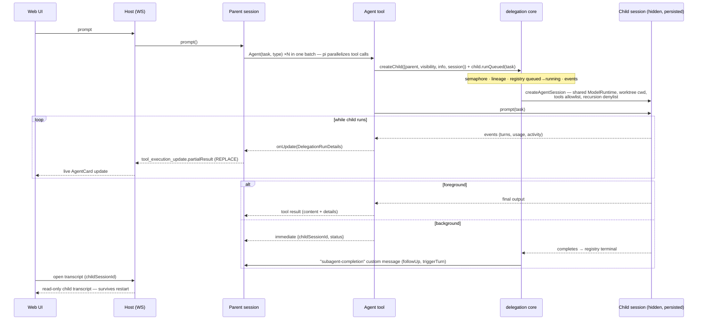

# Subagent support in ThinkRail — own-build design

## Summary

The agent in a chat tab delegates work to specialized child agents with isolated context windows:
foreground delegation, parallel fan-out, background runs, a live delegation card, and an openable
child transcript. Shipped as **`packages/pi-subagents`, a portable pure-pi extension package**,
and built as **the first consumer of the delegation core** ([[task-delegation-core]]
— read that first; it owns creation, running, storage, lineage, waiting, and abort semantics).
This spec owns only what is subagent-specific: the LLM-facing tools, agent definitions
(discovery/precedence/trust), the definition → spawn mapping, and the web UI.

In core terms, one subagent run is:

```ts
const child = await delegation.createChild({ parent, visibility: "hidden",
  info: { createdBy: "tool:Agent", roleName, roleSource }, session: fromDefinition(def) });
const outcome = await child.runQueued(task, { maxTurns, signal, onUpdate });  // or unawaited = background
```

— the `Agent` tool contains **zero private child-assembly code** (the core's acceptance
criterion: subagents are the proof the framework is usable).

**Why own-build (user decision, 2026-08):** third-party pi subagent extensions were surveyed
twice and one adoption was attempted and rolled back; the surveyed options kept mismatching our
multi-session embedded host, compiled binary, and web renderers (subprocess spawning in some,
process-wide registries/discovery, TUI management) — though the in-process spawn pattern two of
them prove (pi SDK as peerDependency) is exactly what we now reuse (core decision #17). History:
this file's git/scratch history; our per-session-discovery fix survives upstream as
tintinweb/pi-subagents PR #223 (no longer a dependency).

## Settled decisions (user-aligned, 2026-08)

1. **Portable workspace package** — `packages/pi-subagents`, a pure-pi extension (pi SDK as a
   `peerDependency`) consuming [[task-delegation-core]]'s `packages/pi-delegation`. ThinkRail's
   server embeds the factory per session, handing it the host-bound `DelegationService`; under
   vanilla pi the extension constructs the service with default bindings. It must **load and work
   in pure pi** (default tool rendering; no pi-tui widget in V1). *Supersedes the original
   "host-owned bundled extension" decision — reversed in the PR #261 review round (the package
   boundary proposal, strengthened by the user's pure-pi requirement; research + rationale: core
   decision log #17–21).*
2. **Tool naming: Claude Code style** — `Agent` (spawn; models are trained on the convention) +
   `get_subagent_result` (collect detached results). `steer_subagent` deferred to V2.
3. **V1 scope: foreground + parallel fan-out + background runs.**
4. **Transcripts persisted, openable anytime** — children are hidden pi sessions on disk; the card
   links to a read-only transcript view that works during the run, after completion, and after a
   host restart.
5. **Built-in agents: small curated set** (~4, scout / researcher / worker / reviewer spirit),
   tuned to ThinkRail's spec-first workflow; personal + worktree definitions add more.
6. **Precedence/trust: worktree definitions can never shadow built-in or personal names** (mirrors
   the skills invariant; community libs order it the other way — that enabled the "repo ships
   `Explore.md`" attack). Worktree defs ride the project's existing trust posture (same as
   pi-native `.pi` resources); no separate admission gate (earlier user decision).
7. **Child context: narrow by default, per-definition opt-ins** (nicobailon's model — the
   most-adopted mechanism; comparison in Appendix). A child sees the definition body + an env
   block (cwd, git branch, platform) + the task. Opt-ins: `inherit_project_context: true`
   (worktree AGENTS.md), `skills:` (explicit list). No parent-conversation inheritance in V1;
   fork-mode inheritance is the recorded growth path.

## What this layer owns

- **Tool surface.** `Agent({ subagent_type, task, run_in_background? })` — one call per child;
  parallel fan-out = several calls in one batch (pi runs them concurrently, the core's semaphore
  paces them; no `tasks[]`/chain DSL — the model sequences chains itself). `run_in_background` is
  a *tool* parameter: the tool simply doesn't await `runQueued()` and returns
  `{childSessionId, status}` immediately. `get_subagent_result(sessionId)` reads the core registry
  (semantics in the core spec). Recursion guard: children get `excludeTools: ["Agent",
  "get_subagent_result"]` — a denylist survives pi's tool-registry rebuilds (gotgenes #725).
- **Definitions.** `AgentDefinition` = community-compatible `.md` with frontmatter (`name`,
  `description`, `tools`, `model`, `thinking`, `max_turns`, `inherit_project_context`, `skills`) +
  body = system prompt. Discovery per session (our loaders are per-session — the process-wide
  discovery flaw of the community libs cannot exist here): built-ins → `~/.pi/agent/agents/*.md` →
  `<worktree>/.pi/agents/*.md` + `<worktree>/.agents/agents/*.md`, first-name-wins in that order
  (decision 6).
- **The mapping (policy, not mechanism).** definition → `session` options (pi-mirrored:
  tools/model/thinking/systemPrompt/contextFiles/skills; `model:` fuzzy-resolved against the
  session's available models — the extension ctx's model registry, the same data ThinkRail's
  `settledAvailableModels` serves — default = parent's current model+thinking), + `info.roleName`/
  `roleSource`, + `RunOptions.maxTurns`. Assembled system prompt = definition body + sub-agent
  guidance bridge + env block (stable material first, for KV-cache prefix reuse).
- **Background completion delivery.** On an unawaited run's terminal event, inject a
  `subagent-completion` custom message into the parent via `pi.sendMessage(…, { deliverAs:
  "followUp", triggerTurn: true })` — `details = DelegationRunDetails`, text = the child's final
  output. Lost on host restart (accepted, same class as other followUp messages); the transcript
  survives regardless.
- **Web UI.** `registerToolRenderer("Agent", …)` card rendering `DelegationRunDetails` from
  `partialResult` (all statuses, live activity/usage); a compact `subagent-completion`
  custom-message card; the child transcript view — a `contracts` read request keyed
  `(workspaceId, parentSessionId, childSessionId)` (all three known to the card), rendered
  read-only with the existing chat primitives.

## V1 flow



Restart behavior, abort cascades, storage layout, and the one-id rule are the core's — see
[[task-delegation-core]] (notably: a dangling foreground `Agent` toolCall after a host crash is
healed by the existing generic `repairDanglingToolCalls`; no subagent-specific machinery).

## Open questions — all resolved

1. ~~Verify `custom` messages cross the **live** WS event stream (hydration already carries them).~~
   **Verified twice:** pi's `sendCustomMessage` emits `message_start`/`message_end` on every delivery
   path (source-checked: queued-followUp drain and idle `triggerTurn` both go through the agent
   loop's message events), and the `@agent` e2e's background test pins it end to end — the completion
   card appears live, no reload.
2. ~~Built-in agent set contents.~~ Settled during implementation: scout / planner / worker /
   reviewer as TS constants (`builtins.ts`), all opting into the curated child extension set.

## Implementation status (final — this task spec is retired `done`)

All work-plan steps are **done** — see the core spec's status table for the full ledger. The web
layer landed per the settled rendering decisions (2026-08, research round): `Agent` renders as a
stock collapsed ToolCard whose header line is live (the Claude Code convention — surveyed against
Codex's pinned runtime panel and OpenCode's clickable box; user chose the stock-card variant), the
report sits behind a fold on the finished card, the child transcript opens as a read-only overlay
dialog polling ~2.5s while the run is live, and the `subagent-completion` message is its own compact
transcript card (the OpenCode notice pattern + a report fold). Boundary + invariants:
`apps/web/src/chat/tools/subagent/SPEC.md`; chat integration: `apps/web/src/chat/SPEC.md`.

## V1 work plan

0. **The delegation core lands first** ([[task-delegation-core]]). Everything below consumes it.
1. `packages/pi-subagents`: definitions loader (precedence + trust), the `Agent` +
   `get_subagent_result` tools via an extension factory taking the delegation service; the server
   embeds it with the bound service; `DelegationRunDetails` mirrored into `contracts` (core
   decision #20).
2. Transcript read request in `contracts` + host handler (path via `deriveChildSessionFile`).
3. Web: `AgentCard` (all statuses), `subagent-completion` card, child transcript view, linked from
   the card.
4. Tests: definitions/precedence units + renderer units (no-agent); one `@agent` e2e spec
   (foreground + parallel + background completion + transcript open); the on-demand pure-pi smoke
   (core acceptance #5). SPEC.md promotions: the two package SPECs, agent module (the embedder
   binding), chat tools, contracts.

## Appendix — child-context research record (2026-08, source-verified)

How the reference implementations assemble child context (basis for decision 7):

| Lib | Base system prompt | AGENTS.md | Skills | Parent conversation |
|---|---|---|---|---|
| pi example | pi default, body **appended** (`--append-system-prompt`) | yes (subprocess runs full default discovery) | yes | no |
| tintinweb | own prompt (body) | no | inherits user skills; `skills:` preload | opt-in digest |
| gotgenes | `prompt_mode`: **append** = parent's prompt verbatim as byte-identical prefix (KV-cache reuse) + bridge + body + env; **replace** = body + env | via parent prefix in append mode | always inherits | opt-in digest |
| nicobailon | **clean by default** (no base prompt, no project files, no skills catalog) | opt-in `inheritProjectContext` | opt-in `inheritSkills` / `skills:` | `context: "fork"` — child forks the parent's persisted session |

Field split: narrow-by-default with opt-ins (nicobailon, gotgenes-replace, tintinweb) vs
project-aware (pi example, gotgenes-append). Chosen: nicobailon's narrow-by-default (decision 7) —
most adopted (3.1k★ / 56k dl/wk) and the cleanest base for a multi-pattern system; gotgenes'
KV-cache prompt ordering is adopted within our own layout; nicobailon's fork mode maps onto the
core's `origin: fork` growth path.
