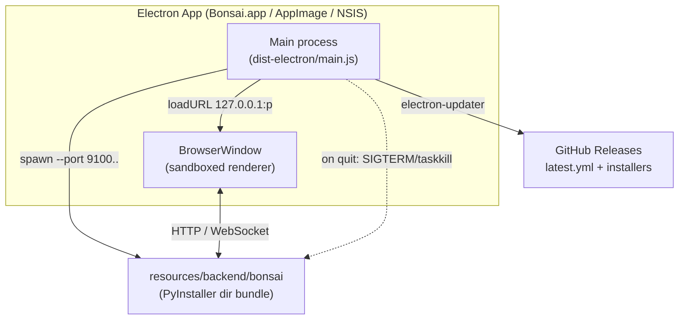

# Electron Module — Design Specification

> Parent: [DESIGN_DOC.md](../DESIGN_DOC.md) | Status: **Active** | Created: 2026-05-06

## Table of Contents
1. [Purpose](#purpose)
2. [Internal Architecture](#internal-architecture)
3. [File Organization](#file-organization)
4. [Public Interface](#public-interface)
5. [Design Decisions](#design-decisions)
6. [Auto-Update](#auto-update)
7. [Dependencies](#dependencies)
8. [Known Limitations](#known-limitations)
9. [Related Specs](#related-specs)

## Purpose

The Electron module is the **end-user distribution channel**. It produces native installers (`.dmg` / `.AppImage` / `.exe`) that ship Bonsai as a desktop application — a wrapper around the existing PyInstaller backend bundle plus an Electron `BrowserWindow` showing the React UI.

The standalone PyInstaller executable (`packaging/dist/bonsai`, `bonsai-dir/bonsai`) remains the developer/debugging path. Electron is layered on top of that build product, not a replacement for it.

## Internal Architecture

**Pattern:** Electron main process + child Python backend process. The backend is the existing PyInstaller bundle, spawned with `--port <p> --no-browser --host 127.0.0.1`. The renderer simply loads `http://127.0.0.1:<p>/` — there is no Node IPC bridge, no preload-exposed APIs.



Lifecycle:
1. Single-instance lock (`app.requestSingleInstanceLock`) — second launch focuses the existing window.
2. **Reserve** a free port in 9100–9199 (`src/ports.ts` — the listening socket is held open until the moment of `spawn()` to narrow the TOCTOU race against another local binder).
3. Spawn the backend bundle, pipe stdout/stderr to `app.getPath('logs')/backend.log`.
4. TCP-poll the port until the server accepts a connection (30 s timeout).
5. Open `BrowserWindow` (sandbox + contextIsolation, no Node integration) and `loadURL`.
6. Trigger `autoUpdater.checkForUpdatesAndNotify()` once the window is up (packaged Linux/Windows builds only — skipped on darwin until signing, see [Auto-Update](#auto-update)).
7. On `before-quit`: SIGTERM the child, wait 5 s, SIGKILL on timeout. On Windows use `taskkill /F /T` to propagate the kill to the whole tree.

## File Organization

| File | Responsibility |
|------|----------------|
| `package.json` | Electron metadata, scripts, electron-builder config (`extraResources`, per-OS targets, `publish`) |
| `tsconfig.json` | TypeScript compile config (CommonJS → `dist-electron/`) |
| `src/main.ts` | App lifecycle: single-instance lock, window creation, before-quit shutdown |
| `src/backend.ts` | Spawn / kill / log the PyInstaller child process |
| `src/paths.ts` | Resolve backend binary: `BONSAI_BACKEND_DIR` env > `process.resourcesPath/backend` (packaged) > `../packaging/dist/bonsai-dir` (dev) |
| `src/ports.ts` | `reserveFreePort` (holds the listening socket on a port in 9100–9199 until the caller releases it just before `spawn()`) and TCP wait-for-ready |
| `src/updater.ts` | electron-updater wiring (no-op in dev / unpackaged builds, and gated off on darwin until signing) |
| `src/shellEnv.ts` | Imports the user's interactive login-shell env into `process.env` at startup (bash/zsh/fish). Lets Finder/dock-launched apps see `ANTHROPIC_API_KEY`, custom `PATH`, etc. that live in `~/.zshrc` / `~/.bash_profile` / `~/.config/fish/config.fish`. |
| `src/credentials.ts` | Resolves `ANTHROPIC_API_KEY` (env → `<dataDir>/.env`) and forwards into the spawned backend's env. The env step covers the common case once `shellEnv.ts` has run; the dotenv fallback covers unusual shells (tcsh/nushell) and explicit per-app overrides. |
| `scripts/stage-backend.js` | Copy `packaging/dist/bonsai-dir/` → `electron/resources/backend/` for `extraResources` |
| `scripts/build.sh` | One-command end-to-end build (frontend → PyInstaller → stage → electron-builder) |

## Public Interface

This module produces installers, not a runtime API. Build commands:

```bash
# Local end-to-end build (current OS)
./electron/scripts/build.sh

# Reuse an existing PyInstaller build
./electron/scripts/build.sh --skip-backend

# Dev: launch Electron against the local PyInstaller dir
cd electron && npm install && npm run dev
```

`npm run dev` requires a prior `pyinstaller bonsai.spec` build in `packaging/`. It uses `BONSAI_BACKEND_DIR=../packaging/dist/bonsai-dir` to bypass the packaged-resources lookup.

### Build Outputs

| Platform | Output | Approx. size |
|----------|--------|--------------|
| macOS | `dist/Bonsai-<v>-{arm64,x64}.dmg` + `.zip` | ~150 MB per arch |
| Linux | `dist/Bonsai-<v>.AppImage` | ~140 MB |
| Windows | `dist/Bonsai Setup <v>.exe` (NSIS) | ~140 MB |

Each installer also produces auto-update sidecars (`latest.yml`, `latest-mac.yml`, `latest-linux.yml`, `*.blockmap`) which `electron-updater` reads from the GitHub release.

## Design Decisions

| Decision | Choice | Rationale |
|----------|--------|-----------|
| **Backend hosting** | Spawn the existing PyInstaller `bonsai-dir/bonsai` as a child | Reuses the production-tested build. No Python embedding work, no divergence between CLI and desktop builds. |
| **Port** | Free port in 9100–9199, picked at startup | Avoids collision with the dev backend on 8000. Range is high enough to not conflict with common services. |
| **UI** | BrowserWindow loads `http://127.0.0.1:<port>` | The backend already serves the React app via FastAPI `StaticFiles`. No need to bundle the frontend separately into Electron. |
| **No preload / no Node integration** | `contextIsolation: true`, `nodeIntegration: false`, `sandbox: true` | The renderer is just a browser pointed at localhost — no privileged Node APIs needed. Smallest attack surface. |
| **Health check** | TCP connect to the picked port (250 ms retry, 30 s timeout) | Doesn't depend on a specific HTTP route; works as soon as uvicorn binds. |
| **Single-instance lock** | `app.requestSingleInstanceLock()` | Two backends sharing `~/.bonsai/` would corrupt the SQLite stores. |
| **Quit lifecycle** | `before-quit`: SIGTERM child, 5 s grace, SIGKILL fallback. Windows uses `taskkill /F /T` | uvicorn flushes state on SIGTERM. The taskkill `/T` flag propagates to the whole process tree on Windows where SIGTERM doesn't traverse. |
| **Backend bundle staging** | `scripts/stage-backend.js` copies `packaging/dist/bonsai-dir/` into `electron/resources/backend/` before electron-builder runs | electron-builder's `extraResources` reads from `electron/resources/backend/`. The source location is overridable via `BONSAI_BACKEND_DIR` for CI matrix builds. |
| **No code signing** | `mac.identity: null`, no signing on Windows | Matches `packaging/README.md` — code signing costs $200–400/year and is deferred until distribution scales. macOS auto-update is broken without signing; documented below. |
| **Build tool** | `electron-builder` | Mature, supports per-OS installers, integrates with `electron-updater`, GitHub publish provider. |
| **Update channel** | GitHub Releases (`JetBrains/bonsai`) | Simplest provider, no extra hosting. Same artifact location as the existing nightly release. |

## Anthropic Credentials

The spawned PyInstaller backend needs `ANTHROPIC_API_KEY` to call the
Anthropic API. The complication: when the user launches the packaged
`Bonsai.app` from Finder/dock, macOS launchd starts it with a minimal env —
no shell `PATH`, no exported `ANTHROPIC_API_KEY`. `npm run dev` inherits the
terminal env and works; the packaged app does not unless we do the work.

### Shell-env import (primary path)

`src/shellEnv.ts` runs once, before app initialization, and spawns the
user's interactive login shell to capture its env:

```
$SHELL -ilc 'echo MARKER; env; echo MARKER'
```

Output is parsed line-by-line and merged into `process.env` (existing keys
are not overwritten — launchd-set vars and test overrides win). The marker
brackets the env block so noise from rc files (Powerlevel10k instant
prompt, fish greeting, etc.) is ignored. This is the same pattern used by
VS Code, Hyper, GitHub Desktop, and the `shell-env` npm package.

**Supported shells.** bash, zsh, fish, dash, ksh, sh — anything that
accepts `-i`, `-l`, and `-c COMMAND` and runs `/usr/bin/env`. Exotic shells
(tcsh/csh, nushell, powershell on \*nix) silently fall through to the
dotenv path below. Windows is a no-op — Windows env *is* system env.

**Skip conditions.** The import is skipped if any of these hold:
- `process.platform === 'win32'`
- `BONSAI_NO_SHELL_ENV=1` (test override / kill switch for users with
  pathological rc files)
- `TERM_PROGRAM` already set in the env (terminal-launched: env is already
  complete, no need to pay the 100–300 ms shell spawn cost). We deliberately
  do NOT key on `$_` — launchd's helper sets it on Finder/dock launches
  too, so checking it would skip the import on exactly the launches that
  need it. The regression spec sets `_` in the launched env to actively
  guard against re-introducing the bogus heuristic.

**Cost.** One `$SHELL -ilc` invocation at startup. Typically 100–300 ms.
Capped at a 5 s timeout so a hanging rc file (e.g. one that calls `read`)
fails closed rather than blocking the app forever.

### Per-app dotenv (fallback)

`src/credentials.ts` runs after shell-env import, just before spawning the
backend. Resolution order:

1. `process.env.ANTHROPIC_API_KEY` (set by the user's shell, by `npm run
   dev`, or imported by `shellEnv.ts`).
2. `<dataDir>/.env` line `ANTHROPIC_API_KEY=...` where `<dataDir>` is
   `BONSAI_DATA_DIR` if set, else `~/.bonsai/`. Documented user-controlled
   fallback for users on shells we can't import, or anyone who wants the
   key scoped to Bonsai instead of system-wide.

If both miss, the backend starts anyway and fails with the SDK's
`Not logged in · Please run /login` `turn_error` on the first session turn.

End-user setup instructions live in the root README under "End user
setup". Regression coverage:
- `e2e/electron/tests/session-start-from-shell-env.spec.ts` — launches
  Electron with a stripped env and a fake `$SHELL` that exports the key,
  asserting `shellEnv.ts` imports it.
- `e2e/electron/tests/session-start-from-data-dir-env.spec.ts` — launches
  Electron with `BONSAI_NO_SHELL_ENV=1` and seeds `<dataDir>/.env`,
  asserting the dotenv fallback still works.

## Auto-Update

`electron-updater` is loaded only when `app.isPackaged` is true **and** `process.platform !== 'darwin'`. On Linux and Windows, startup calls `checkForUpdatesAndNotify()` against the GitHub Releases API, downloads any newer release in the background, and applies it on next quit. On macOS the call is short-circuited entirely — see below.

**Constraints:**
- Only **stable semver releases** drive a real update — the package.json `version` must increase. The rolling `nightly-latest` tag re-uses the same version (currently `0.1.0`) on every push, so the updater sees no-op. Nightlies are for testers; users wanting the latest bits re-download manually.
- **macOS auto-update is disabled until we sign the app.** Squirrel.Mac (the macOS update mechanism) requires a notarized signature; an unsigned `.app` triggers `checkForUpdatesAndNotify()` to throw "Could not get code signature for running application" on every launch. Rather than let that log spam every startup, `src/updater.ts` returns early on `darwin` and never wires the listeners. Linux AppImage and Windows NSIS auto-update with unsigned builds.

To enable proper auto-update for end users, the next steps (out of scope for this iteration) are:
1. Acquire an Apple Developer ID and notarize the macOS build.
2. Establish a release-versioning workflow (semver bump on each stable release).
3. Decide whether nightlies should publish on a separate channel (`alpha`/`beta`).

## Dependencies

| Dependency | Usage |
|------------|-------|
| `electron` | Runtime + bootstrap (devDependency — bundled by electron-builder into the app) |
| `electron-builder` | Build tool: produces per-OS installers + auto-update metadata |
| `electron-updater` | Runtime: checks GitHub Releases, downloads, applies updates |
| `typescript` | Compiles `src/*.ts` → `dist-electron/*.js` |
| `packaging/` (PyInstaller bundle) | Provides the `bonsai-dir/` directory bundle staged into `electron/resources/backend/` |

## Known Limitations

- **Unsigned builds.** macOS Gatekeeper quarantines on first launch — users must right-click → Open. Windows SmartScreen warns on first run. Documented for end users in the release notes.
- **macOS auto-update disabled** until signing — see [Auto-Update](#auto-update).
- **Nightly auto-update is a no-op** because the version doesn't bump per push. Users must re-download to follow `nightly-latest`.
- **Bundle size**: ~140–150 MB per platform (Electron runtime ~80 MB + Python runtime + native deps ~60 MB). This is normal for cross-stack desktop apps. No size optimization attempted in v1.
- **No tray/background mode**: closing the window quits the app and stops the backend.
- **macOS single-file PyInstaller binary**: still ships in the standalone CLI release for consistency with the directory bundle, but is broken on macOS Sequoia (per `packaging/README.md`). The Electron app uses the directory bundle, so it's unaffected.

## Related Specs

- **Parent:** [Architecture Design](../DESIGN_DOC.md)
- **Depends on:** [Packaging Module](../packaging/README.md) (provides the PyInstaller `bonsai-dir/`)
- **Depends on:** [Frontend](../frontend/README.md) (built into the PyInstaller bundle)
- **Related:** `.github/workflows/build.yml` — CI matrix that produces installers and the GitHub release
