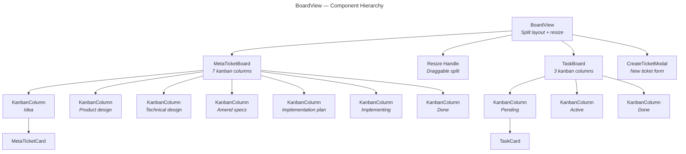

# BoardView — Sub-Specification

> Parent: [Frontend Module](../../../README.md) | Status: **Active** | Created: 2026-03-27

## Table of Contents
1. [Purpose](#purpose)
2. [Component Architecture](#component-architecture)
3. [File Organization](#file-organization)
4. [Component Interface](#component-interface)
5. [Store & API](#store--api)
6. [Design Decisions](#design-decisions)
7. [Known Limitations](#known-limitations)
8. [Related Specs](#related-specs)

## Purpose

The BoardView is the two-level kanban interface for project management. The top half displays tickets organized by lifecycle status (Idea → Product design → Technical design → Amend specs → Implementation plan → Implementing → Done — seven columns, mirroring the brainstorm-aligned ticket flow). The bottom half shows legacy task-spec cards (Pending, Active, Done). A draggable resize handle splits the two boards. The Board is a fixed tab in the center panel tab bar, always available alongside session and ticket detail tabs.

## Component Architecture



## File Organization

| File | Responsibility | Props |
|------|---------------|-------|
| `BoardView.tsx` | Split layout with draggable resize handle (top ratio 20%-80%), "+ New" button, loading state | `onOpenTicket: (id) => void` |
| `MetaTicketBoard.tsx` | Groups tickets into 7 status columns, renders KanbanColumn for each | `tickets: MetaTicketSummary[]`, `onOpenTicket: (id) => void` |
| `MetaTicketCard.tsx` | Card displaying title, type badge, spec count, plan progress, session count | `ticket: MetaTicketSummary`, `onClick: () => void` |
| `TaskBoard.tsx` | Legacy task-spec kanban with 3 columns (reads from specStore task specs) | (none) |
| `TaskCard.tsx` | Simple card showing task title and status | `task: SpecSummary`, `onClick: () => void` |
| `KanbanColumn.tsx` | Reusable column with header, count badge, scrollable card area | `title: string`, `count: number`, `children: ReactNode` |
| `CreateTicketModal.tsx` | Modal form: title (required), type dropdown, body textarea | `open: boolean`, `onClose: () => void` |
| `BoardView.css` | Board layout and card styles | |

## Component Interface

### BoardView

**Props:**
```typescript
interface BoardViewProps {
  onOpenTicket: (id: string) => void;
}
```

**State:**
- `modalOpen: boolean` — CreateTicketModal visibility
- `topRatio: number` — split ratio for top/bottom sections (default 0.5)

**Behavior:**
- Reads `tickets` and `loading` from `boardStore`
- Converts ticket Map to array for MetaTicketBoard
- Resize handle uses mousedown/mousemove/mouseup for dragging
- Shows loading placeholder when tickets are empty and loading

### MetaTicketBoard

Distributes tickets into columns by status:

| Column | Status Filter | Color Accent |
|--------|--------------|-------------|
| Idea | `status === "idea"` | Neutral |
| Product design | `status === "product-design"` | Teal |
| Technical design | `status === "technical-design"` | Slate |
| Amend specs | `status === "spec-diff"` | Blue |
| Implementation plan | `status === "implementation-plan"` | Gold |
| Implementing | `status === "implementing"` | Green |
| Done | `status === "done"` | Muted |

### MetaTicketCard

Displays:
- Title (truncated)
- Type badge (feature/bug/idea/improvement)
- Spec count from `linkedSpecIds.length`
- Plan indicator if `planPath` is set
- Session count from `sessionIds.length`

Click opens the ticket detail view via `onOpenTicket(ticket.id)`.

### CreateTicketModal

Form fields:

| Field | Type | Required | Default |
|-------|------|----------|---------|
| Title | text input | Yes | (empty) |
| Type | select dropdown | No | `"feature"` |
| Body | textarea | No | (empty) |

Submit calls `boardStore.createTicket(title, body, type)` and closes the modal.

## Store & API

### boardStore (Zustand)

```typescript
interface BoardStore {
  tickets: Map<string, MetaTicketSummary>;
  openTicketIds: string[];
  activeTicketId: string | null;
  loading: boolean;
  error: string | null;

  // Actions
  fetchTickets: () => Promise<void>;
  createTicket: (title, body?, type?) => Promise<MetaTicket>;
  updateTicket: (id, updates) => Promise<MetaTicket>;
  deleteTicket: (id) => Promise<void>;
  openTicket: (id) => void;
  closeTicket: (id) => void;
  activateTicket: (id) => void;
  showBoard: () => void;

  // Notification handlers (called from wireEvents)
  handleDidChange: (ticket: MetaTicketSummary) => void;
  handleDidCreate: (ticket: MetaTicketSummary) => void;
  handleDidDelete: (id: string) => void;
}
```

### API Layer (`api/methods/board.ts`)

| RPC Method | Function | Params | Returns |
|------------|----------|--------|---------|
| `board/list` | `list()` | (none) | `MetaTicketSummary[]` |
| `board/get` | `get(id)` | `{ id }` | `MetaTicket` |
| `board/create` | `create(title, body?, type?)` | `{ title, body?, type? }` | `MetaTicket` |
| `board/update` | `update(id, updates)` | `{ id, ...updates }` | `MetaTicket` |
| `board/delete` | `delete(id)` | `{ id }` | `null` |
| `board/linkSpec` | `linkSpec(ticketId, specId)` | `{ ticketId, specId }` | `MetaTicket` |
| `board/unlinkSpec` | `unlinkSpec(ticketId, specId)` | `{ ticketId, specId }` | `MetaTicket` |
| `board/attachSession` | `attachSession(ticketId, sessionId)` | `{ ticketId, sessionId }` | `MetaTicket` |
| `board/setOrchestrator` | `setOrchestrator(ticketId, sessionId)` | `{ ticketId, sessionId }` | `MetaTicket` |
| `board/getPlan` | `getPlan(ticketId)` | `{ ticketId }` | `Record \| null` |
| `board/createPlan` | `createPlan(ticketId, title, steps, verification?)` | `{ ticketId, title, steps, verification? }` | `Record` |
| `board/updateStep` | `updateStep(ticketId, stepNumber, status, sessionId?)` | `{ ticketId, stepNumber, status, sessionId? }` | `Record` |
| `board/getNextStep` | `getNextStep(ticketId)` | `{ ticketId }` | `Record \| null` |
| `board/readArtifact` | `readArtifact(ticketId, kind)` | `{ ticketId, kind }` | `ArtifactReadResult` |
| `board/previewPatchApply` | `previewPatchApply(ticketId)` | `{ ticketId }` | `PreviewPatchApplyResult` |

### Types (`types/board.ts`)

```typescript
type MetaTicketStatus =
  | "idea" | "product-design" | "technical-design" | "spec-diff"
  | "implementation-plan" | "implementing" | "done";
type MetaTicketType = "feature" | "bug" | "idea" | "improvement";
type ArtifactKind = "product_design" | "technical_design" | "spec_diff" | "implementation_plan";

interface MetaTicket {
  id: string;
  title: string;
  body: string;
  status: MetaTicketStatus;
  type: MetaTicketType;
  productDesignPath: string | null;
  technicalDesignPath: string | null;
  specDiffPath: string | null;
  implementationPlanPath: string | null;
  technicalDesignStale: boolean;
  specDiffStale: boolean;
  implementationPlanStale: boolean;
  specDiffAppliedAt: string | null;
  orchestratorSessionId: string | null;
  linkedSpecIds: string[];
  sessionIds: string[];
  created: string;
  updated: string;
}

interface MetaTicketSummary {
  // Mirror of MetaTicket minus the body, plus `specDiffApplied: boolean`
  // (derived from `specDiffAppliedAt is not None`).
}
```

The right pane of the ticket detail view shows a **TicketDescriptionBanner** at the top, always visible, rendering `ticket.body` with an inline ✎ Edit button. Description is a ticket-level field (not an artifact); it sits between the progress bar and the dynamic artifact / plan / session panel.

See `.tr/design_docs/TICKET_LIFECYCLE_DESIGN.md` for the canonical spec of the lifecycle, allowed transitions, patch-apply contract, and artifact storage layout.

## Design Decisions

| Decision | Choice | Rationale |
|----------|--------|-----------|
| Two-level split layout | Tickets top, task-specs bottom | Tickets are the primary workflow; task-specs are legacy read-only context. Split makes both visible. |
| Draggable resize handle | Mouse event listeners on resize div | Same pattern as MetaTicketDetail sidebar resize. No library dependency. |
| Fixed Board tab | Always visible in center panel tab bar | Board is a primary navigation target, not something you open and close. |
| Map-based ticket store | `Map<string, MetaTicketSummary>` | O(1) lookups by ID for notification handlers. Preserves insertion order for iteration. |
| Notification handlers | `handleDidChange`, `handleDidCreate`, `handleDidDelete` | Backend pushes ticket changes; handlers update the Map in place without re-fetching the full list. |
| Ticket tabs as overlay | `openTicketIds` + `activeTicketId` in boardStore | Clicking a card opens a detail tab; clicking the Board tab returns to the kanban. Multiple tickets can be open as tabs. |
| Delete cascades to sessions | `deleteTicket`/`handleDidDelete` call `sessionStore.removeSessionsForTicket` | The backend trashes a deleted ticket's sessions; the store drops them locally (sessions, tabs, cached list) so the Sessions panel doesn't show a ghost ticket folder. |

## Known Limitations

- **No drag-and-drop:** Cards cannot be dragged between columns to change status. Status changes require opening the ticket detail.
- **No search or filtering:** All tickets are shown in all columns. Large boards may need filtering by type, assignee, or text search.
- **No card reordering:** Cards within a column are in creation order (from `list_tickets` API). Custom ordering is not supported.
- **Legacy TaskBoard is read-only:** Task-spec cards display spec data but have no CRUD operations via the board.

## Related Specs

- **Parent:** [Frontend Module](../../../README.md)
- **Sibling:** [MetaTicketDetail](../MetaTicketDetail/README.md) (ticket detail view, opened from card click)
- **Backend:** [Board Module](../../../../backend/app/board/README.md) (data model and service)
- **Store:** [boardStore](../../store/boardStore.ts), [types/board.ts](../../types/board.ts)
- **API:** [api/methods/board.ts](../../api/methods/board.ts)
