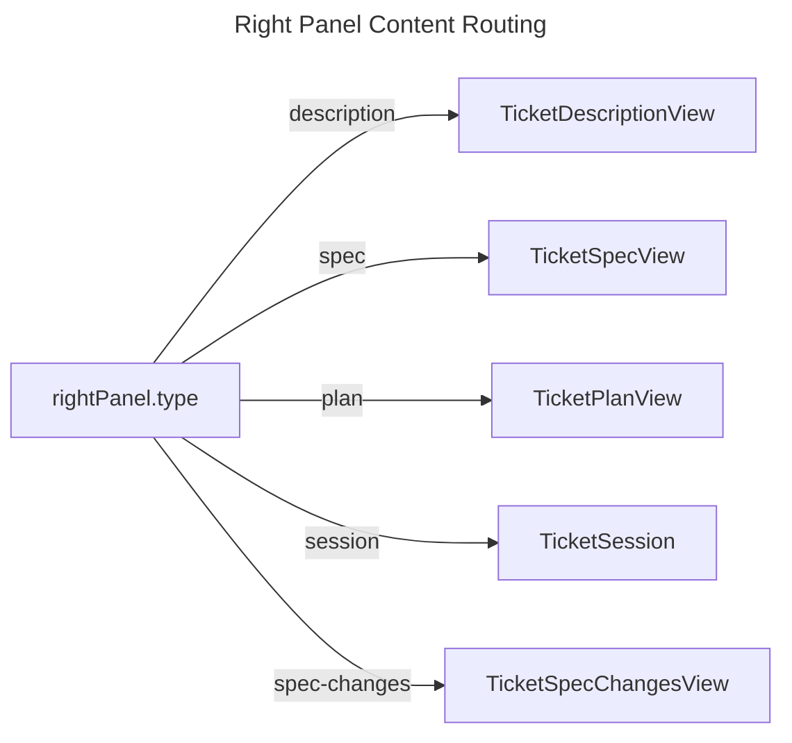

# MetaTicketDetail — Sub-Specification

> Parent: [Frontend Module](../../../README.md) | Status: **Active** | Created: 2026-03-27

## Table of Contents
1. [Purpose](#purpose)
2. [Component Architecture](#component-architecture)
3. [File Organization](#file-organization)
4. [Component Interface](#component-interface)
5. [Right Panel Content Routing](#right-panel-content-routing)
6. [Lifecycle Skills](#lifecycle-skills)
7. [Design Decisions](#design-decisions)
8. [Known Limitations](#known-limitations)
9. [Related Specs](#related-specs)

## Purpose

The MetaTicketDetail is the full-screen view for a single meta-ticket, opened as a tab from the BoardView. It provides a resizable sidebar (left) with ticket metadata and a tabbed content area (right) that shows the description, specs, plan, or an embedded agent session depending on the ticket's lifecycle stage.

The view orchestrates the ticket lifecycle: fetching the ticket and plan, managing panel navigation, starting skill-appropriate sessions, and showing progress through the state pipeline.

## Component Architecture

```mermaid
---
title: MetaTicketDetail — Component Hierarchy
---
graph TD
    MetaTicketDetail["MetaTicketDetail<br/><i>Orchestrator: fetch, state, resize</i>"]

    MetaTicketDetail --> TicketInfo["TicketInfo<br/><i>Left sidebar</i>"]
    MetaTicketDetail --> ResizeHandle["Resize Handle"]
    MetaTicketDetail --> RightArea["Right Content Area"]

    RightArea --> TicketProgressBar["TicketProgressBar<br/><i>Sticky state pipeline + actions</i>"]
    RightArea --> TicketDescriptionView["TicketDescriptionView<br/><i>Read/edit description</i>"]
    RightArea --> TicketSpecView["TicketSpecView<br/><i>Spec viewer (placeholder)</i>"]
    RightArea --> TicketPlanView["TicketPlanView<br/><i>Plan document viewer</i>"]
    RightArea --> TicketSession["TicketSession<br/><i>Embedded ChatStream + InputArea</i>"]
    RightArea --> TicketSpecChangesView["TicketSpecChangesView<br/><i>Spec changes grouped by session</i>"]

    TicketInfo --> Header["Header Card<br/><i>ID, title, status/type dropdowns</i>"]
    TicketInfo --> DescPreview["Description Preview<br/><i>Resizable height, clickable</i>"]
    TicketInfo --> SpecsList["Linked Specs List<br/><i>Clickable spec items</i>"]
    TicketInfo --> PlanSteps["Plan Steps List<br/><i>Clickable step items</i>"]
    TicketInfo --> SessionsList["Sessions List<br/><i>Clickable session items</i>"]
    TicketInfo --> SpecChangesSec["Spec Changes Section<br/><i>Count + clickable link (if specChanges exist)</i>"]
```



## File Organization

| File | Responsibility | Key Props |
|------|---------------|-----------|
| `MetaTicketDetail.tsx` | Orchestrator: fetches ticket + plan, manages `rightPanel` state, `leftWidth` resize, session starting | `ticketId: string` |
| `TicketInfo.tsx` | Left sidebar: header card (ID, title, status/type dropdowns, timestamps, summary counts), description preview, clickable specs/plan/sessions lists | `ticket, plan, onTicketUpdated, rightPanel, onSelectPanel` |
| `TicketProgressBar.tsx` | Sticky bar: state pipeline dots (idea through done), computed primary action button, "More" dropdown for secondary actions | `ticket, onStartSession, onSelectPanel` |
| `TicketSession.tsx` | Embedded session with full parity to standalone SessionPanel: ChatStream, InputArea (with Continue/Start buttons), SessionStatusLine (model/cost/effort), StickyContextBar, RestoredBar. Auto-selects skill by ticket state. | `ticket, embeddedSid, onSessionStarted` |
| `TicketDescriptionView.tsx` | Description view: MarkdownEditor (initialMode="preview") with Edit/Preview tabs, "Describe with AI" button for embedded agent session, split pane when session active | `ticket, onTicketUpdated` |
| `TicketSpecView.tsx` | Placeholder spec viewer ("coming soon") | `specId, specTitle` |
| `TicketPlanView.tsx` | Three-tab plan editor: **View** (read-only rendered milestones+steps), **Steps** (structured form for adding/editing milestones and steps), **Raw** (MarkdownEditor for direct markdown editing). Uses `board/savePlan` and `board/savePlanRaw` RPCs. | `plan, ticketId, onPlanUpdated` |
| `TicketSpecChangesView.tsx` | Right panel tab showing spec changes grouped by session. Each session group is collapsible and lists individual `SpecChange` entries with change_type badge, spec title, summary, and expandable detail. | `ticket: MetaTicket` |
| `TicketDraftsView.tsx` | Spec drafts review panel: lists pending draft entries from `.tr/spec-drafts/{ticket_id}/`. Monaco DiffEditor for side-by-side comparison (original vs draft). Per-entry Apply/Discard buttons + global Apply All/Discard All. Uses `board/listDrafts`, `board/getDraftDiff`, `board/applyDraft` RPCs. | `ticketId, onDraftsChanged?` |
| `MetaTicketDetail.css` | All detail view styles | |

## Component Interface

### MetaTicketDetail (orchestrator)

**Props:**
```typescript
interface MetaTicketDetailProps {
  ticketId: string;
}
```

**State:**
```typescript
ticket: MetaTicket | null          // fetched on mount
plan: Record<string, unknown> | null  // fetched if ticket.planPath exists
error: string | null
rightPanel: RightPanelContent      // which content to show in right area
leftWidth: number                  // sidebar width in px (default 280, min 200)
```

**Mount behavior:**
1. Fetch ticket via `board/get`
2. Auto-select right panel based on ticket state:
   - If ticket has active sessions (in sessionStore) -> show last active session
   - Else if ticket has plan -> show plan
   - Else -> show description
3. If ticket has plan path -> fetch plan via `board/getPlan`

### RightPanelContent Type

```typescript
type RightPanelContent =
  | { type: "description" }
  | { type: "spec"; specId: string; specTitle: string }
  | { type: "plan" }
  | { type: "session"; sessionId: string }
  | { type: "spec-changes" };
```

### TicketInfo (left sidebar)

Sections displayed top-to-bottom:

| Section | Content | Interaction |
|---------|---------|-------------|
| Header Card | Ticket ID, title, status dropdown, type dropdown, created/updated timestamps, summary (spec count, session count, plan step progress) | Status/type dropdowns trigger `updateTicket` |
| Description Preview | Body text with resizable max-height (default 140px, min 60px) | Click opens description in right panel |
| Specifications | List of linked specs with title and status badge | Click opens spec in right panel |
| Plan | Plan steps list with status icons (pending/executing/done/failed) and step count | Click opens plan or step session in right panel |
| Sessions | All session IDs with live status from sessionStore | Click opens session in right panel |
| Spec Changes | Shown when `ticket.specChanges` is non-empty. Displays count of spec changes with a summary line. | Click opens TicketSpecChangesView in right panel |

**Step status icons:**

| Status | Icon |
|--------|------|
| `done` | Checkmark |
| `executing` | Filled circle |
| `failed` | X mark |
| `pending` | Empty circle |

### TicketProgressBar

The progress bar sits at the top of the right panel and shows two things:

**1. State Pipeline** — visual dots for the 6 lifecycle states:

```
 (past)----(past)----(past)----(current)----(future)----(future)
  Idea     Described  Specified  Planned     Executing    Done
```

| Dot State | Meaning |
|-----------|---------|
| `past` | State already completed |
| `current` | Current ticket status |
| `future` | State not yet reached |

**2. Computed Actions** — primary button + "More" dropdown, purely state-driven (no body/planPath checks for primary button):

| Ticket State | Primary Action | Secondary Actions |
|-------------|----------------|-------------------|
| `idea` | "Describe with AI" (start ticket-describe) | "Edit Description" |
| `described` | "Specify with AI" (start ticket-specify) | "Edit Description", "Revise with AI" |
| `specified` | "Plan with AI" (start ticket-plan) | "Add more specs", "Edit Description" |
| `planned` | "Execute" (start ticket-execute) | "Revise plan", "Add specs" |
| `executing` (no live orchestrator) | "Execute" (start ticket-execute) | "View plan" |
| `executing` (live orchestrator) | "Continue" (show orchestrator session) | "View plan" |
| `done` | (none) | (none) |

Note: The `plan` prop was removed from TicketProgressBar. The component now derives all actions purely from `ticket.status`.

### TicketSession

**Phase detection:** auto-selects skill based on ticket state:

| Ticket State | Skill ID | Label | Session Name |
|-------------|----------|-------|-------------|
| `idea` | `ticket-describe` | "Describe with AI" | `"Describe: {title}"` |
| `described` | `ticket-specify` | "Specify with AI" | `"Specify: {title}"` |
| `specified` | `ticket-plan` | "Plan with AI" | `"Plan: {title}"` |
| `planned` / `executing` | `ticket-execute` | "Execute" | `"Execute: {title}"` |

**Session configuration:**

| Field | Execute Session | Other Sessions |
|-------|----------------|----------------|
| `specIds` | `ticket.linkedSpecIds` | `[]` |
| `maxTurns` | 100 (feature-specific override) | from `buildDefaultSessionConfig()` |
| `ticketId` | `ticket.id` | `ticket.id` |

Other knobs (`model`, `effort`, `permissionMode`) come from `buildDefaultSessionConfig()` (`frontend/src/utils/sessionConfig.ts`), which reads the user-scoped `sessionDefaults` (managed via the header's "User settings" dialog and persisted in the AppStore). Execute overrides `maxTurns` to 100 because plan execution typically needs more turns than the user's default.

When no active session is selected, shows a start prompt with phase description and button. When active, renders with **full parity to the standalone SessionPanel**:
- `StickyContextBar` — skill/spec/model info bar
- `ChatStream` — event rendering with context card visibility tracking
- `SessionStatusLine` — model switcher, cost counter, effort selector, permission mode toggle
- `InputArea` — with Continue button (idle sessions), Start button (skill sessions), interrupt, message history
- `RestoredSessionBar` — resume button for restored sessions

## Right Panel Content Routing

The right content area renders one of six views based on `rightPanel.type`:



Panel selection sources:
- **Auto-select on mount** (based on ticket state, see MetaTicketDetail mount behavior)
- **TicketInfo sidebar clicks** (description, spec item, plan, session item)
- **TicketProgressBar actions** (primary/secondary action buttons)
- **Session start** (switches to session panel when new session created)
- **TicketInfo "Spec Changes" click** (switches to spec-changes panel)

## Lifecycle Skills

The 4 lifecycle skills are defined in `claude-plugin/skills/` and loaded by the agent runtime:

| Skill ID | Purpose | Used When |
|----------|---------|-----------|
| `ticket-describe` | Generate structured ticket description from rough idea | Ticket has no body |
| `ticket-specify` | Create formal specifications from description | Status is `idea` with body |
| `ticket-plan` | Create implementation plan from specifications | Status is `specified` |
| `ticket-execute` | Execute plan steps via orchestrator pattern | Ticket has plan |

The execute session name starts with `"Execute:"` which triggers auto-detection in `AgentService.run_task` to set the orchestrator via `board_svc.set_orchestrator`.

## Design Decisions

| Decision | Choice | Rationale |
|----------|--------|-----------|
| Resizable sidebar | Mouse drag handler, min 200px, max 50% viewport | Same resize pattern as BoardView split. Developer can prioritize sidebar or content. |
| Auto-panel selection on mount | Priority: active session > plan > description | Shows the most relevant content immediately. If work is in progress (session), show it. |
| Computed progress actions | State-based action computation in useMemo | One function determines all available actions. Easy to extend with new states. |
| Embedded sessions | ChatStream + InputArea rendered inline, not in a separate panel | Ticket context is always visible alongside the session. No context-switching. |
| Phase-based skill auto-selection | `getPhaseConfig()` maps ticket state to skill | Reduces decision fatigue. Developer just clicks the primary action. |
| Orchestrator detection by name | `"Execute: {title}"` prefix triggers set_orchestrator | Convention-based, avoids explicit orchestrator flag in session creation. |
| Plan as `Record<string, unknown>` | TypeScript uses untyped record for plan data | Plans are complex and evolving. Typed models would require constant sync with backend. Plan data now includes `milestones` (list of milestone objects with nested `steps`) instead of a flat `steps` array, plus `allSteps` for flat access. |

## Known Limitations

- **TicketSpecView is a placeholder:** Displays "coming soon" instead of actual spec content. Full spec rendering is deferred.
- **No real-time ticket updates:** If another user/agent modifies the ticket, the detail view does not auto-refresh. Requires manual navigation away and back.
- **Single session per view:** Only one session is embedded at a time. Switching sessions discards the previous session's scroll position.
- ~~No milestone grouping in TicketPlanView~~ **Resolved:** TicketPlanView now renders milestones with headers and nested steps.
- ~~No plan editing~~ **Resolved:** TicketPlanView has three tabs (View/Steps/Raw) for viewing and editing plans. Steps tab provides structured form editing; Raw tab uses MarkdownEditor for direct markdown access.
- **Description edit is basic:** Plain textarea, no Markdown preview or rich text editing.
- **Stale reference validation:** TicketInfo now shows `StaleRefsBanner` warnings when `linkedSpecIds` or `sessionIds` reference deleted items. Cleanup is available via `fixStaleTicketRefs()` in boardStore.

## Related Specs

- **Parent:** [Frontend Module](../../../README.md)
- **Sibling:** [BoardView](../BoardView/README.md) (kanban view, navigates here on card click)
- **Backend:** [Board Module](../../../../backend/app/board/README.md), [PlanService](../../../../backend/app/board/PLAN_SERVICE.md)
- **Agent:** [Orchestrator tools](../../../../backend/app/agent/tools/ORCHESTRATOR.md) (suggest_step, step completion)
- **Depends on:** [ChatStream](../ChatStream/) (embedded session rendering), [sessionStore](../../store/sessionStore.ts), [boardStore](../../store/boardStore.ts)
