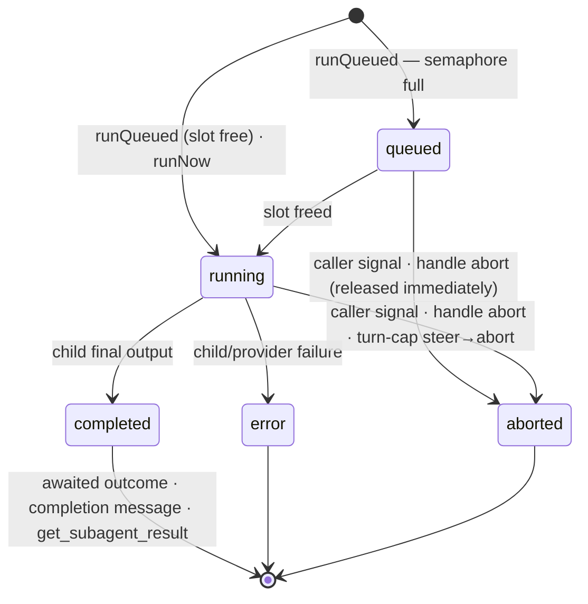

## Responsibility

`pi-delegation` is the **portable, pure-pi delegation core**: the framework for creating agent
sessions *from* agent sessions. One creation primitive (`createChild`) with orthogonal axes; a
handle that owns the run loop (per-parent FIFO pacing, turn caps, usage aggregation); lineage as
the storage layout; an in-memory run registry; and lifecycle events. The contract itself lives on
the barrel (`src/types.ts`, every type documented in place); this SPEC records the semantics, the
boundary, and the decision log.

**V1 implements exactly one axis combination** — hidden, non-interactive, fresh-origin children
with explicit `SessionOptions` — consumed by [[module-pi-subagents]]. Every other combination is
typed in the contract and **loud-rejected** with a typed `DelegationError` until its consumer
lands (the enumeration: scope & readiness rules below).

## Public surface (the barrel, `index.ts`)

- `createDelegationService(bindings)` — the service (`DelegationService`): `createChild` /
  `findChild` / `childrenOf` / `onLifecycle` / `disposeChildrenOf`.
- `DelegationBindings` — everything host-specific: `resolveParent` (required; returns
  `ParentContext` — `Pick<ExtensionContext, "cwd" | "model" | "thinkingLevel">` plus optional
  `modelRuntime` and `modelRegistry` fields. The parent's own retained `modelRuntime` is preferred
  over every fallback: an embedder whose sessions each retain their creation-time runtime generation
  (ThinkRail) must give a child its *parent's* generation, or a parent kept alive on a Central-only
  model after a disconnect would delegate into a runtime lacking its provider (PR #303 review
  follow-up). `modelRegistry` is the public pure-pi compatibility path: when neither a parent nor
  service runtime is bound, the core mirrors its opaque extension-provider registrations into the
  self-created runtime before each child is resolved, including removing registrations that have
  disappeared. ThinkRail projects the manager's live session incl. the entry's generation runtime;
  pure pi passes the extension's own `ctx`, including its registry), `delegationRoot`, `scope`,
  `modelRuntime` (a `ModelRuntime` value **or a live provider** `() => ModelRuntime |
  Promise<ModelRuntime>`, resolved **per `createChild`**: an embedder's runtime can be generational
  — ThinkRail swaps runtime generations on Central connect/disconnect — and a value captured at
  service creation would pin every later child to the first generation while new parent chats move
  on (PR #303 review finding); absent → the service self-creates one runtime **per parent lineage**
  and caches it until `disposeChildrenOf(parent)` — a service may resolve parents backed by different
  registries, so one mutable fallback must never synchronize provider state across them),
  `maxConcurrentPerParent`, `childExtensionFactories` (the curated set a child MAY load — decision
  #25).
- Storage helpers: `defaultDelegationRoot` / `delegationSessionDir` / `deriveChildSessionFile`
  (post-restart transcript reads) / `DEFAULT_SCOPE`.
- The contract types themselves (incl. `DelegationError`/`DelegationErrorCode`) — enumerated and
  documented in place in `src/types.ts`, not restated here.

## Boundary

- **Allowed deps:** the pi SDK (`@earendil-works/pi-coding-agent`, `@earendil-works/pi-ai`) as
  **peerDependencies** — the loading runtime supplies them; `node:*`.
- **Forbidden:** any `@thinkrail/*` package (this package must work under vanilla pi);
  `@earendil-works/pi-tui` (headless by design — rendering is the embedder's);
  importing another workspace package's internals.
- `DelegationRunDetails` is **authored here and mirrored into `@thinkrail/contracts`** (never
  imported from it, never re-exported by it) — the `pi-todos` DTO posture.
- Consumers import **through the barrel only**; `src/` is internal.
- The raw child `AgentSession` never crosses the barrel — `ChildHandle` is the sole control path.

## Patterns = axis combinations

| Pattern | Spec | Driven by |
|---|---|---|
| **Subagent** (V1) | `{origin: fresh, visibility: hidden, interactive: false, info: {createdBy: "tool:Agent", roleName, roleSource}, session: from definition}` | `runQueued(task)` — awaited (foreground) or not (background) |
| Interactive subsession | `{origin: fresh \| fork, visibility: listed, interactive: true, info: {createdBy: "user"}}` | the user, via the manager — never a run method |
| Branch | `{origin: fork(current, entryId), visibility: listed, interactive: true, info: {createdBy: "user"}}` (no `session`) | the user |
| Workflow step | `{interactive: false, info: {createdBy: "workflow:<name>"}}` | `runQueued`/`runNow` by an engine |
| Workflow human gate | `{interactive: true, visibility: listed, info: {createdBy: "workflow:<name>"}}` — engine-*created*, human-*driven*: expressible because behavior and provenance are separate fields | the user; engine awaits its conclusion |

## Semantics

### Interactive vs non-interactive (the one behavior split the core enforces)

| | `interactive: false` | `interactive: true` |
|---|---|---|
| Who prompts | the spawner (tool call / engine) | the human (composer) |
| WS prompt input | rejected | accepted (requires `listed`; `hidden + interactive` rejects) |
| Semaphore | `runQueued` waits for a slot; `runNow` bypasses | n/a — the run methods reject |
| `RunOptions.maxTurns` | applies (cap → steer → abort) | n/a |
| Completion | terminal events + `finalText`; delivery (tool result / completion message) is the consumer's | no `finalText` — a "conclude" action when subsessions land |

### Run lifecycle

Every `runQueued` run passes through `queued` — `run-queued` is emitted even when a slot is free
and `running` follows immediately (a uniform event stream is simpler for consumers than a
conditional first state; the diagram's direct `running` entry remains the semantic for `runNow`
when it lands). Entering `queued` initializes matching `RunSnapshot.status` and
`RunSnapshot.details.status`; the transition to `running` updates both fields and the run's
`onUpdate` callback together before `run-started` is emitted, so consumers never observe
contradictory in-flight status surfaces.

### Waiting & control

| Mechanism | Behavior |
|---|---|
| Foreground | `await child.runQueued(task)`. pi executes a batch's tool calls concurrently (verified: `pi-agent-core` `executeToolCallsParallel`), so N `Agent` calls = N children in flight — no `tasks[]`/chain DSL needed. |
| Per-run outcome | A `RunOutcome`'s `finalText` and `details.usage` belong to **that run alone**: the run captures a baseline (message count + session stats) before `prompt()`, derives `finalText` only from messages the run added, and reports usage/cost/token **deltas** against the baseline — never the child session's cumulative totals. A reusable child running sequential tasks would otherwise return the previous run's text after a preflight failure and double-count usage (PR #302 review finding). `contextTokens` stays a point-in-time snapshot by design. |
| Concurrency | Semaphore **per parent session**, default 4; FIFO. Why: the model decides how many spawns to emit — each child is a full LLM session, so unbounded spawn multiplies token spend, provider 429 pressure, and load on the one shared event loop (no crash isolation). Resource governance, not correctness. Host-wide ceiling: config follow-up. |
| Background | Don't await the promise. Completion → `run-terminal` event; the subagent tool layer additionally injects a `subagent-completion` custom message into the parent. |
| Result collection | Registry snapshot via `findChild(id)`: terminal → final output + details, marks `collected`; running → status snapshot (not an error); unknown id → error naming the restart-loss case + the derived transcript path. |
| Join / wait-all | **Not core.** Engine control flow over `run-terminal` events / run promises: join = `Promise.all` over run outcomes; fan-out = spawns sharing a dependency (the semaphore paces them); fail-fast = one shared `AbortController` across sibling `RunOptions.signal`s. |
| Turn cap | `RunOptions.maxTurns`: on cap, `steer()` a wrap-up instruction, then `abort()`. No wall-clock timeout (provider retries are pi's job). |
| Abort / dispose | `signal` in `RunOptions` (tool abort, engine fail-fast) and `ChildHandle.abort()` both cancel the active run through one run-scoped signal. The handle path must cancel a run that is still **queued**, not merely call `abort()` on its idle pi session: queued cancellation resolves immediately while the eventual slot grant is handed straight back, and no provider work starts (PR #302 review finding, regression-pinned). A running cancellation aborts the pi session. `ChildHandle.dispose()` first marks the child disposed, cancels through that same signal, and awaits the run's terminal settlement before disposing the pi session and removing the child; a queued run therefore cannot hang behind a sibling or emit terminal lifecycle work after `child-disposed` (follow-up PR #302 review finding, regression-pinned). Every child owns one shared teardown promise: concurrent handle disposal and parent disposal both await it, so `disposed` means admission is closed rather than teardown is already complete. Parent dispose → `disposeChildrenOf` cascade, which includes already-disposing children still registered to that parent, then **marks every captured child disposed and signals every active run synchronously before awaiting any shared teardown**; it cannot return while child work is still settling (second follow-up PR #302 review finding, regression-pinned). Aborting a running child frees its semaphore slot, and an unmarked or uncancelled queued sibling could otherwise issue provider work or remain pending during the cascade. A mid-turn parent abort kills only awaited (foreground) runs via their signals; detached runs survive turn aborts. |
| Restart | Foreground dangling toolCalls → healed by the embedder's generic transcript repair (ThinkRail: `repairDanglingToolCalls`). Registry is in-memory: detached runs are lost (accepted); transcripts remain on disk and stay openable. |

### Storage & lineage

- **Hidden children persist under the embedder-bound delegation root, never pi's default sessions
  root:** `<delegationRoot>/<scope>/<parentSessionId>/<child>.jsonl` via
  `SessionManager.create(cwd, sessionDir)` — verified: pi accepts a custom `sessionDir` on
  `create`/`open`/`list`/`forkFrom` (the last covers the future `fork` axis). ThinkRail binds
  `~/.thinkrail/delegation` with `scope = workspaceId`; pure pi defaults to
  `<piAgentDir>/delegation` with `scope = "default"`. Hidden by construction: session listings
  scan only the default root.
- **V1 lineage = the storage layout.** The directory structure *is* the parent edge; the
  transcript path derives from `(scope, parentSessionId, childSessionId)` with no index file. A
  persisted `SpawnRecord` index becomes real when `listed` visibility lands (the type exists now,
  the file does not).
- **The core stores only the parent edge — a tree, never a DAG.** A workflow's steps are all
  spawned with `parent = the run's root session` (siblings); the DAG's data-flow edges are the
  engine's own record. Consequences: whole-run cancel = the existing cascade on the root's
  children (no graph traversal); a join is engine control flow, not a session.
- **Retention is the embedder's:** ThinkRail ties child lifetime to the **workspace** (archival
  deletes; closing a tab deletes nothing — mechanics: [[submodule-server-agent]]). Pure pi: no GC.
  No per-parent GC anywhere in V1.
- `listed` children (future) ride everything that exists — manager registration → tabs, WS
  streaming, hydration, restart repair; the wire's `SessionSummary` grows optional lineage fields
  then, not now.

## V1 child assembly (what the core owns, consumers never see)

The child's resource loader is **narrow by default**: no discovered extensions, no prompt
templates, no themes; context files, skills, and the embedder's curated extension set
(`extensions: true` — decision #25) are explicit `SessionOptions` opt-ins; `systemPrompt` maps to
`systemPromptOverride`. Model/thinking default to the live parent's current values; `cwd` is the
parent's. Runtime precedence is parent `modelRuntime` → service `modelRuntime` → cached self-created
runtime. The self-created path caches a separate runtime and mirrored-registration set per parent
lineage; `disposeChildrenOf(parent)` drops that cache entry with the lineage. It mirrors the parent's
public `modelRegistry` registrations before each spawn: every previously mirrored id is unregistered
before the current native providers and opaque configured-provider configs are replayed. Rebuilding
rather than merging is required because pi provider re-registration preserves omitted fields; without
the unregister, a same-id replacement can retain stale config such as secret headers. This preserves
extension-supplied provider behavior and config-contained auth without
reading either; it cannot reproduce credentials or mutable state held only inside the original
runtime, which is why exact runtime injection remains the stronger embedder contract. Storage: the
lineage section above.

## Extension points (exactly three, plus one seam)

1. **LLM tools** (the `Agent` tool now) — extension factories over the service. Serves
   LLM-orchestrated workflows with zero further machinery.
2. **The service API** (the barrel) — wire handlers (branch, subsession) and programmatic
   workflows call it directly.
3. **Lifecycle events** — a declarative workflow engine subscribes; every event carries
   `{sessionId, parentSessionId}` so engines build their own step graphs without the core storing
   a DAG.

Plus the **workspace seam** (`WorkspaceProvider`): child isolation (git worktree, tmpdir,
container) as a pluggable strategy. ThinkRail's natural provider already exists — the
projects/workspaces feature owns `git worktree` creation; merge-back semantics live in the
provider's `dispose` (`resultAddendum` tells the parent where work landed), never in the core.
(Pattern validated by gotgenes' ADR-0002 seam + companion worktrees package.)

## Portability & embedding (user-settled, 2026-08)

The layer must **work under vanilla pi** — no ThinkRail. `pi-delegation` itself is a library; the
extension vanilla pi actually loads is its first consumer, [[module-pi-subagents]]. The SDK is a
`peerDependency` (field-verified as the community's in-process pattern — decision #17); peer deps are
exempt from the repo's exact-pin rule, and value-importing the SDK is safe here because the package
lives server-side by construction and never reaches `contracts`/`web` (the wire type is mirrored —
decision #20).

An embedder constructs the service via `createDelegationService(bindings)` and hands it to
consumers — ThinkRail keeps the handle for the manager's dispose cascade and the future wire
handlers, and passes it to the `pi-subagents` factory; under vanilla pi the `pi-subagents`
extension constructs it with defaults. Everything host-specific enters through the one
`DelegationBindings` bag (typed + documented in `src/types.ts`); **every field has a pure-pi
default except `resolveParent`**, which cannot default inside a library — the embedder owns the
live-parent lookup (ThinkRail: the manager; pure pi: the consuming extension's own `ctx`).

**Pure-pi V1 bar (user-settled):** the consuming extension loads and runs correctly under vanilla
pi with pi's **default tool rendering** — no pi-tui widget in V1 (the rich live card is the web
renderer's job). Verified on demand by `bun run smoke:subagents` (described in
[[module-pi-subagents]]). npm publication stays possible; not a V1 goal.

## Scope & readiness rules (user-settled)

**V1 = the core + subagents, nothing else.** Future patterns are out of scope, their UX unpinned —
but the core must be ready: the **contract carries the full axis space; the implementation stays
minimal**. Unexercised combinations (`listed`, `fork`, `seeded`, `interactive: true`, `runNow`,
`session` absent, a `workspace` provider) **reject loudly** with typed errors — the seam is real,
the dead code is not. A future pattern's first consumer must only *fill in* its combination, never
reshape the contract.

The contract was checked on paper against each future pattern (2026-08, post-implementation):
*subsession* — `{origin: fresh|fork, listed, interactive}` is expressible; run methods on an
interactive child reject (`invalid-combination`). *Branch* — `{origin: fork(entryId), listed,
interactive}` with no `session` options is expressible; pi's `forkFrom` accepts the custom
`sessionDir` (verified). *Workflows* — all three styles map onto the three extension points with
only `runQueued` + `signal` + the dispose cascade. One caveat stands: `WorkspaceProvider`'s call
sequencing (`prepare` names the child id, which exists only after creation) is pinned by its first
consumer, the ThinkRail worktree provider. Report-back from a subsession to its parent (when
subsessions land) is pi-native (`sendMessage`/`followUp`) — no core provision needed beyond
lineage.

## Decision log (how the contract got its shape)

1. **Two-phase surface** (`createChild` → `runQueued`/`runNow`) chosen over one mega-`spawnSession`
   and over per-pattern constructors (design-options round): creation and running are different
   moments; the run loop (semaphore, usage aggregation, turn caps) is owned **once** instead of
   per-consumer; most states become valid-by-construction. Per-pattern sugar (e.g. `runSubagent`)
   may appear in consumer layers later — never as the core contract.
2. **`driver: "tool" | "user" | "orchestrator"` enum rejected**: it conflated behavior with
   consumer identity, was a closed set (new consumer = contract reshape), and couldn't express the
   human-gate mix (engine-created, human-driven). Replaced by `interactive` (behavior) +
   `ChildInfo.createdBy` (open provenance).
3. **`SessionOptions` mirrors pi's spawn signature** (user decision) — pi's names/semantics for the
   session-shaping subset; the infrastructure subset (modelRuntime, sessionManager,
   settingsManager, resourceLoader, customTools) is firewalled — exposing it would let a consumer
   bypass storage/lineage/trust.
4. **`maxTurns` in `RunOptions`**, not `SessionOptions` (mirror purity — pi has no such option) and
   not creation (per-run: a chain reuses a child with different caps).
5. **Pacing = two explicit methods** (user round; supersedes a `pacing` option and its brief
   deletion): a `run()` that silently parks on a queue is hidden policy — the call site must say
   which it wants. `runNow` loud-rejects in V1 (no consumer), consistent with the readiness rule.
6. **`visibility` required, no default** (user round) — same call-site transparency rule. It stays
   a *core* axis because its consequences (storage root, manager registration) are creation-time
   actions only the core may perform, and it is not derivable from `interactive`.
7. **`ChildInfo`** groups descriptive metadata (user round) — the "metadata, never behavior"
   boundary is structural; role label **inlined** as `roleName`/`roleSource` (no nested object for
   two strings; mirrors `DelegationRunDetails`); `roleSource` an open string (the
   builtin/personal/project taxonomy is the subagents layer's vocabulary).
8. **One id, eagerly created**: a run *is* a child session; the child exists from `createChild`
   (queued = only its first prompt waits), so the id is stable for cards/transcripts from birth.
   No separate run UUID.
9. **`parent` is the only identity input** — `scope`/`cwd`/model defaults derive from the
   live parent; inconsistent triples unrepresentable; parent must be live (`unknown-parent`).
10. **Run methods resolve for run failures** (`error`/`aborted` are values with details); typed
    `DelegationError` rejections only for contract misuse.
11. **One run at a time per child**; sequential runs allowed; registry keeps the latest snapshot —
    multi-run history is the caller's bookkeeping. (Revisit if a fleet view ever needs history.)
12. **`background` deleted from the core** — detachment = not awaiting the promise; the registry
    tracks the run either way.
13. **`toolCallId` removed** — run↔toolCall pairing is the tool layer's own bookkeeping.
14. **`SubagentRunDetails` → `DelegationRunDetails`** — the wire type is pattern-generic.
15. **`findChild` / `childrenOf`** (from `getChild`/`listChildren`) — the two lookups key on
    different ids; the name now carries the key.
16. **Raw `AgentSession` never exposed** — the handle is the sole control path; out-of-band
    prompting of a queued child is structurally impossible. (The `resolveParent` binding hands the
    *embedder's* live parent to the core — embedder-side plumbing, not a consumer surface.)
17. **Portable core — the package is the deliverable** (2026-08, PR #261 review round): the user
    settled the requirement that the layer works **without ThinkRail, in pure pi**. Field research
    (source-verified): the pi example spawns `pi --mode json -p --no-session` subprocesses;
    nicobailon spawns subprocesses (foreground + detached runner); **gotgenes and tintinweb run
    children in-process via `createAgentSession` with the pi SDK as a peerDependency** — proving
    in-process pure-pi children are a solved pattern. The core therefore moved from a
    `packages/server` sub-module to `packages/pi-delegation`; ThinkRail is one embedder.
18. **Host-injected spawn seam rejected** (resolves the PR #261 boundary proposal — adopted in
    strengthened form): a `SpawnBackend` the host injects would require a second, in-package
    pure-pi run loop to satisfy #17, duplicating the loop decision #1 deliberately owns once. No
    reference implementation injects a spawner — all four keep spawning inside the extension and
    face their seams *outward* (lifecycle events, providers, RPC). The proposal's boundary half is
    adopted — strengthened: the whole core goes portable, not just the tool layer.
19. **Two packages** — `pi-delegation` (framework) + `pi-subagents` (first consumer): "the
    framework is the deliverable" enforced by construction; future consumers (workflow engine,
    subsession/branch wire handlers) take delegation without subagents. (gotgenes keeps its core
    inside its subagents package; we split because our future consumers are host features — a
    host importing "subagents" to get delegation misnames the dependency.)
20. **`DelegationRunDetails` mirrored into `contracts`, never imported** — the `pi-todos` DTO
    posture keeps `web → contracts`-only intact and the package host-free. (Rejected: authoring
    the type in the package and re-exporting through `contracts` — `contracts` imports no
    extension packages.)
21. **Pure-pi V1 bar: loads + works under default rendering** (user-settled) — no pi-tui widget in
    V1; the rich live card ships web-side.
22. **`collectResult()` added to `ChildHandle`** (implementation round): the `collected` flag needs
    a maintainer, and a side-effectful `snapshot` getter was the only alternative — `snapshot`
    stays a pure read; collection is the explicit act.
23. **`resolveParent` returns a projection, not the `AgentSession`** (user round, subagents
    implementation): pi's extension API exposes only `ExtensionContext` projections — an extension
    can never retrieve its own `AgentSession`, so the raw-session binding was unsatisfiable in pure
    pi. The core reads exactly `cwd`/`model`/`thinkingLevel` (+liveness) off a parent, so
    `ParentContext = Pick<ExtensionContext, …>` (type reuse over new types — user note) covers all
    verified usage in both worlds and structurally prevents the core from driving the parent.
24. **`RunSnapshot.errorMessage`** (review round 2): the terminal snapshot keeps an errored run's
    reason — without it, a detached error collected later via `get_subagent_result` carried zero
    diagnostic (the completion message had it, the collection path didn't).
25. **Child extensions: a curated, embedder-bound set — never inheritance, never disk discovery**
    (user round). `SessionOptions.extensions: true` loads exactly
    `DelegationBindings.childExtensionFactories` (pi's loader loads injected factories even under
    `noExtensions` — verified); the `tools` allowlist gates which of the set's tools are callable;
    children with extensions are bound `mode: "print"` (headless — `ctx.hasUI` false, dialogs
    skipped). Literal "inherit the parent's extensions" is rejected: interactive tools
    (ask_user_question) hang a hidden non-interactive child, and blanket loading multiplies heavy
    extensions per child (gotgenes' documented V8-heap incident class). **Subsessions still ride
    the delegation core** — a subsession IS `createChild({visibility: "listed", interactive: true,
    origin: fresh | fork})`, with the core owning creation, lineage, the registry, and lifecycle
    events exactly as for any child; what the curated-set mechanism does NOT cover is a listed
    child's *resource assembly*: when the listed axis lands, the core acquires an embedder seam so
    a listed child's loader is built by the host's normal session path (ThinkRail:
    `createSession`'s own loader — full bundled set incl. visualize + ask_user_question, skills,
    admission) and the child registers in the host's manager (tab, WS streaming, hydration).
26. **Public provider replay for the pure-pi fallback; exact runtime reuse for embedders.** Pi's
    extension context exposes `modelRegistry` but not its backing `ModelRuntime`, while
    `createAgentSession` requires a runtime. A self-created child runtime therefore synchronizes the
    registry's public `getRegisteredProviderIds` / `getRegisteredNativeProvider` /
    `getRegisteredProviderConfig` values before every spawn and unregisters stale mirrors. The
    runtime and mirror set are keyed by parent lineage and dropped by `disposeChildrenOf`; otherwise
    syncing a second parent could remove or replace a provider still used by the first parent's
    children. This is opaque replay, not provider interpretation, private-field access, or extension
    re-execution. It makes standalone children compatible with provider-registering extensions while
    preserving the stronger parent-runtime path for runtime-only credentials and state.
