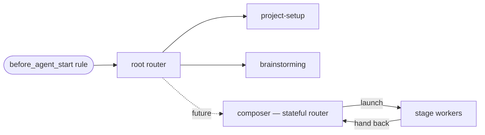

## Responsibility

`pi-thinkrail-workflow` is a pi extension that ships ThinkRail's **workflow system**: a family of
**process/workflow skills** — skills that codify how the agent should *run a piece of work* — governed
by the meta-layer in "The workflow system" below. (Contrast: `pi-spec-graph` defines what the spec
model is; `pi-visualize` is a rendering tool.) It ships two skills today:

- **`brainstorming`** — turns a raw feature request into a validated design, captured as a spec-graph
  `task-spec`, before any implementation starts, mirroring the discipline this repo already applies to
  itself (draft → active specs, "the spec leads the code").
- **`project-setup`** — for project inception only (an empty workspace, no code yet): turns a raw idea
  into a `goal-and-requirements.md` through a tailored conversation (vision, MVP scope, success criteria,
  technology), then hands off to `brainstorming` for the features that follow. Ported from old thinkrail's
  `claude-plugin` `new-project` skill, with its tool calls remapped to what actually exists here (see that
  skill's own file for the mapping table) — the conversational design (working-model inference,
  personal-vs-public routing, MVP-first elicitation) is preserved; anything with no equivalent (a
  progress-tracker/summary-box visualization, a ticket/board hand-off) is dropped in favour of plain text.

This package is the seed of a growing family. Future workflow skills are added as sibling
`skills/<name>/` sub-modules per meta-rule 12 below; a new tool goes under a `tools/` sub-module if one
is ever needed. Nothing about the layout — or the system's shape — changes to add the next skill.

## The workflow system (meta-layer)

The rules that govern every workflow skill in this package. Decided in [[task-workflow-system]]
(researched against obra/superpowers, gsd-build/gsd-2, Anthropic's skill-authoring guidance, and
JetBrains/thinkrail-v1 — whose workflows are an *example* of a possible future complex workflow, not a
template).

### Concept model

- **Workflow** — a repeatable way of running a piece of work, codified as one or more skills.
- **Workflow skill** — one skill = one phase *or one branch* of a workflow; short, imperative,
  workflow-focused, with heavy reference material in sibling files read on demand.
- **Handoff** — the explicit, by-name transition at the end of a workflow skill, or a declared
  terminal state.
- **Gate** — a hard discipline point (e.g. "no implementation before the design is approved"),
  written with anti-rationalization notes, not soft advice.
- **Artifacts** — *durable*: spec-graph nodes (task-spec working docs, promoted module SPECs);
  *ephemeral*: per-workflow working files (resume state, scratch plans) with a cleanup contract.

### Skill roles & handoff contracts

Every workflow skill takes exactly one of **two roles**; everything richer is a *pattern* built from
them.

| Role | Body contains | Ends by |
|---|---|---|
| **Router** | classification rules + handoffs only | naming what runs next |
| **Worker** | one phase's steps | a handoff — fixed successor, back to its caller, or a terminal state |

The **root router** is the single always-on entry; branch skills may route further (fractal routing).

**Patterns** (vocabulary, not roles — no instances yet; for complex work):

- **Composer** — a *stateful router*: agrees a per-task pipeline with the user, records it in the
  task-spec's **Pipeline section** (checkboxes = plan + frontier + history), and walks it, adjusting as
  findings land; the workers it launches hand back to it. Its between-stage checking discipline is its
  own design, not a system rule. The family may hold several composers drawing on a shared pool of
  stages.
- **Stage** — any worker reached from a pipeline: upstream artifacts in, one artifact out, hands back
  to its caller. The same worker can also run standalone (fixed-successor/terminal handoff) —
  stage-ness is how a worker is *used*, not what it *is*.

No runtime machinery: pipeline state is task-spec content; stage transitions are ordinary handoffs.



### Meta-rules

**Structure**
1. One phase/branch per skill. When a workflow needs a conditional fork, each branch becomes its own
   skill and the *choice rules stay in the skill before the fork*.
2. Routers route; workers work. A router contains classification rules + handoffs only — never a
   branch's steps. A worker skill embeds no routing beyond its own terminal handoff.
3. Skills are concise and workflow-focused: target < ~150 lines of body; push reference detail into
   sibling files named in the step that needs them (progressive disclosure).

**Discovery & entry**
4. One always-on entry: the `before_agent_start` rule points at the root router. Other skills are
   reached by routing/handoff; a skill may *also* carry a narrow self-trigger `description` (as
   `project-setup` does) when its trigger is unmistakable.
5. `description` = triggering conditions only ("Use when …"), never a summary of the workflow's steps
   — a step-summary tempts the agent to follow the description and skip the body.

**Chaining**
6. Explicit handoffs: every workflow skill ends by naming its successor skill or its terminal state.
   Cross-reference skills by name; never inline another skill's steps, never force-load files.
7. Say each thing once: a rule or step lives in exactly one skill; others point at it.

**Artifacts**
8. Durable output goes to the spec graph: decisions accrete in the task-spec and are promoted into
   module SPECs. No parallel durable plan/state format.
9. A workflow *may* declare ephemeral working files (resume/continue state, scratch plans) when it
   needs to stop/resume or pass info between phases. Contract: the skill names the file's location and
   shape, the file is consumed/deleted when the work lands, and it never becomes the record — anything
   durable is promoted to specs before cleanup.

**Scaling**
10. Scale by route and composition, not by prose: the router sends simple work down short paths;
    optional phases carry explicit "when to use / when to skip" criteria; complex work composes a
    per-task pipeline of stage workers. Depth lives in the route taken.
11. Gates where discipline matters, matching the form to the failure: prohibitions + red-flags for
    discipline violations; positive recipes for output shape.

**Maintenance**
12. Adding a workflow = add `skills/<name>/` + one routing line in the root router + one row in the
    family table below. Nothing else changes shape.
13. The spec leads: system-shaping changes update this SPEC.md first; the authoring skill carries only
    the actionable checklist and points here for rationale.
14. Verify by use: a new or changed skill isn't done until a real request has been observed flowing
    through it.

### Workflow family

| Skill | Role | Status |
|---|---|---|
| `brainstorming` | design workflow (feature/change → validated task-spec) | active; fate under review — routed as-is |
| `project-setup` | project inception (empty workspace → goal-and-requirements) | active |
| `choosing-a-workflow` | root router — classification + routing | decided, not yet built |
| `writing-workflow-skills` | authoring checklist for adding workflows | decided, not yet built |

The family is open and grows from real use; candidates (research/spike, refactor, bug-fix, a composing
skill in the composer pattern, with its stage workers) each get their own task-spec when they earn
their place. Until
`choosing-a-workflow` lands, the `before_agent_start` rule keeps pointing at `brainstorming`; the
decided entry model (rule → root router) takes effect when the router is built
([[task-workflow-system]] tracks this).

## Boundary

- **Allowed deps:** `@earendil-works/pi-coding-agent` (**types only** — `ExtensionAPI`/`ExtensionFactory`),
  as a `peerDependency`. No `typebox` in v1: this package registers no custom tool, only a
  `before_agent_start` rule and skill content.
- **Forbidden:** any `@thinkrail/*` package, `apps/web`, `packages/server` internals — reached only by
  tool *name* (`ask_user_question`, `spec_*`), never by import.
- **Not portable, and honest about it.** Unlike `pi-spec-graph` and `pi-visualize`, this package's skill
  content assumes the host's `ask_user_question` tool (`packages/server/src/agent/askUserQuestion.ts`) is
  present in the session — that tool exists only in thinkrail. This package does not claim to run
  under vanilla `pi`; it is a workspace-internal module, not a portable capability. It stays its own
  package rather than folding into `packages/server` anyway, for the same reason `packages/shared` isn't
  folded into `server`: non-portable is not the same as infra-runtime-coupled. A `SKILL.md` has no runtime
  coupling to the WS/session layer — it only needs a path handed to `additionalSkillPaths`.

## Structure

```
pi-thinkrail-workflow/
  SPEC.md
  index.ts                   — ExtensionFactory: registers the before_agent_start rule below
  skills/
    brainstorming/SKILL.md    — the brainstorming workflow
    project-setup/SKILL.md    — the project-inception workflow (empty project → goal-and-requirements.md)
  package.json                — pi: { extensions: ["./index.ts"], skills: ["./skills"] }
```

## Knowledge delivery

Same mechanism as `pi-spec-graph` ([[module-spec-graph]]): each workflow lives in its own skill,
auto-discovered via the `pi.skills` manifest / `additionalSkillPaths`. A short, byte-stable
`before_agent_start` rule (mirroring `pi-spec-graph`'s `SPEC_RULE`) nudges the agent toward the
brainstorming skill before creative/feature work, the same way `pi-spec-graph`'s rule nudges it toward
spec tools before exploring or planning. The rule is a pointer, not a restatement — the workflow's actual
steps live once, in the skill. `project-setup` carries no rule of its own — it's a much narrower trigger
(an empty project) that the agent finds via the skill's own `description`, per the "nothing about the
layout changes to add the next skill" note above.

## The brainstorming skill (outline)

Full wording is authored in `skills/brainstorming/SKILL.md`; this is the shape it must follow:

1. **Orient** via `spec_grep`/`spec_get`/`spec_graph` first (per the spec-graph skill), code second.
2. **Scope check** — flag decomposition before going deep if the request spans independent features.
3. **Open a `task-spec`** immediately via `spec_create` — this is the one live design artifact; no
   separate doc format.
4. **Clarify** via `ask_user_question`, batched to its own constraints (≤4 questions/call, "don't chain
   calls back-to-back" — a deliberate deviation from one-question-at-a-time interactive styles): batch
   related questions into a round, open a new round only when answers surface genuinely new questions.
5. **Propose 2-3 approaches** with trade-offs, written into the `task-spec`; may be surfaced as an
   `ask_user_question` single-select (each approach as an option, its trade-off as the description).
6. **Present the design in sections**, updating the `task-spec` live, confirming as it goes.
7. **Self-review** — placeholder/consistency/scope/ambiguity check, plus `spec_validate`.
8. **Promote** settled decisions into the touched module's `SPEC.md` (`spec_create`/`spec_update`,
   draft → active).
9. **Final user review**, then **implement directly against the finalized spec** — pi has no separate
   plan-writing skill, so the spec (or its own checklist) is the plan. Keep it honest as code lands; per
   `task-spec`'s own definition ([[module-spec-graph]]), retire it once **the work itself** lands, not
   merely once the design is promoted — it stays as the working record through implementation.

## The project-setup skill (outline)

Full wording is authored in `skills/project-setup/SKILL.md`; it is a functional port of old thinkrail's
`claude-plugin` `new-project` skill, with every tool call remapped to what exists in this pi environment
(the skill file itself documents the mapping — `spec_save` → `spec_create`/`edit`/`spec_update`,
`AskUserQuestion` → `ask_user_question`, `WebSearch`/`WebFetch` → `web_search`/`fetch_content`,
`GOAL&REQUIREMENTS.md`/`DESIGN_DOC.md` → `goal-and-requirements.md`/`architecture.md`) and every feature
with no equivalent here dropped (`thinkrail_visualize`'s progress-tracker/summary-box types, the
`SessionFinalize`/`CreateBoardTicket`/ticket-queuing done-screen — this app has no board/ticket system).
Shape:

1. **Infer a working model** from the user's initial request (audience, domain, tech depth, scope signal,
   urgency) — never re-ask what's already known.
2. **Fast-path a pre-filled document** — if the request already reads like a spec, parse it straight into
   `goal-and-requirements.md` and only ask about what's genuinely missing.
3. **Confirm Overview and Problem**, one `ask_user_question` at a time, tailored to the stated domain —
   never generic.
4. **Route** Personal vs. Public/PRD from the working model, asking only if genuinely ambiguous.
5. **Elicit branch-specific sections** (features, tech, success criteria, goals, NFRs) via batched
   `ask_user_question` calls, each v1 feature justified against a Goal or Success condition.
6. **Research alternatives** via `web_search`/`fetch_content` — always offered, never skipped.
7. **Review the full draft** in plain markdown before finalizing.
8. **Save**: `spec_create` once (type: `goal-and-requirements`), `edit` per confirmed section as the
   conversation progresses, `spec_update` to `status: done` at the end — then hand off to `brainstorming`
   in plain text for the features that follow.

## Error handling

- No UI (headless host) → `ask_user_question` reports unavailable; `brainstorming` states its assumptions
  explicitly in the `task-spec` rather than blocking; `project-setup` does the same in
  `goal-and-requirements.md`.
- User skips/declines questions → proceed on labeled, explicitly-marked-unconfirmed assumptions.
- Zero-spec project → still works: a `task-spec` (or a fresh `goal-and-requirements.md`) only needs
  frontmatter `id` + `type`, no pre-existing graph required.

## thinkrail integration

`packages/server/src/agent/extensions.ts` adds this package the same way as `pi-spec-graph`:
`require.resolve("pi-thinkrail-workflow/index.ts")` on `additionalExtensionPaths`, its `skills/` dir on
`additionalSkillPaths`.

## Testing

No dedicated unit test for `index.ts` (mirrors `pi-spec-graph`'s own `index.ts`, which has none either —
a rule string and tool registration aren't meaningfully unit-testable). Verification is a manual smoke
test per skill: for `brainstorming`, a real feature request triggers the skill, a `task-spec` appears,
questions render as an `ask_user_question` card, an approved design gets promoted into a module `SPEC.md`.
For `project-setup`, a fresh idea in an empty workspace triggers the skill, `goal-and-requirements.md`
appears and grows section by section, and the finished spec's `status` flips to `done`. A tagged `@agent`
e2e spec is a reasonable follow-up once a skill's wording stabilizes — not required for v1.

## Non-goals

- A vanilla-pi-portable brainstorming or project-setup skill (would require replacing `ask_user_question`
  with a lowest-common-denominator question mechanism — not worth it for a thinkrail-only host
  feature).
- Building out the rest of the skill family now — the meta-layer is in force and the structure is
  ready, but future workflows are designed one task-spec at a time when they earn their place.
- Any runtime/engine layer for workflows (YAML pipelines, DAG tools, stage sessions) — this system is
  skills-only; pipeline state lives in task-spec content, not machinery.
- Reimplementing old thinkrail's `claude-plugin` **ticket/board engineering workflow** (its
  ticket-orchestrator, ticket-implement, bug-fix, spec-review, etc. skills — used by the thinkrail team to
  build thinkrail itself) as a pi package. That is dev-tooling for a different, ticket-based product and
  has no board/ticket system to run against here. This does **not** rule out porting an individual
  *product-facing* skill like `new-project` → `project-setup`, adapted to this app's own tools, when it's
  useful to ThinkRail's own users.
