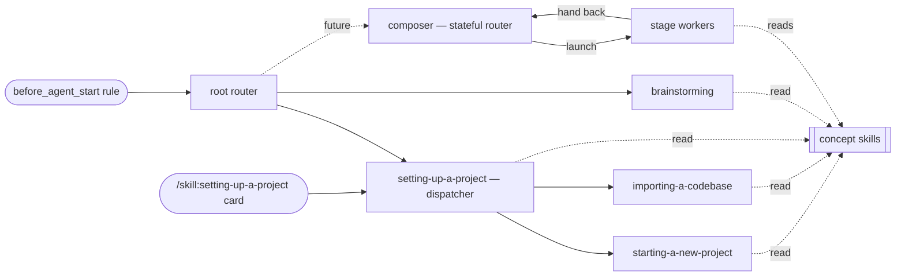

## Responsibility

This directory is the **workflow skill family**: process skills that codify how the agent should *run
a piece of work*. This spec is the family's **meta-layer** — the concept model, the three skill roles,
and the meta-rules that govern every workflow skill here. It is the authoritative *why*; the
`writing-workflow-skills` skill carries the actionable authoring checklist and points back here (its
"(rule N)" citations are the meta-rules below). Packaging, delivery, and the package boundary live in
the parent, [[module-thinkrail-workflow]].

Provenance: designed in the (since retired) workflow-system task-spec, researched against
obra/superpowers, gsd-build/gsd-2, Anthropic's skill-authoring guidance, and JetBrains/thinkrail-v1 —
whose workflows are an *example* of a possible future complex workflow, not a template.

## Concept model

- **Workflow** — a repeatable way of running a piece of work, codified as one or more skills.
- **Workflow skill** — one skill = one *externally reachable* workflow *or one shared concept*;
  short, imperative, workflow-focused.
- **Sibling doc** — a file beside a skill's `SKILL.md` holding an internal workflow node (a branch,
  stage, or shared tail) or reference detail; named at the exact step that hands to it, read on
  demand, never discoverable on its own (rules 1 and 3).
- **Concept** — one topic's reusable rules, conventions, or mental model — shared ground the
  process skills stand on, codified as its own skill when more than one skill needs it.
- **Handoff** — the explicit, by-name transition at the end of a workflow skill, or a declared
  terminal state.
- **Gate** — a hard discipline point (e.g. "no implementation before the design is approved"),
  written with anti-rationalization notes, not soft advice.
- **Artifacts** — the **spec tree** (the durable record: decisions, contracts, limitations,
  principles — everything the code can't reveal) and **temp docs** (scaffolding for one piece of
  work: a task-spec and/or workflow-declared working files), governed by rules 8–9. The split is
  *lifecycle*, not storage — the task-spec lives in-graph while alive (spec tooling) yet is a temp
  doc.

## Skill roles & handoff contracts

Every workflow skill takes exactly one of **three roles**; everything richer is a *pattern* built from
them.

| Role | Body contains | Ends by |
|---|---|---|
| **Router** | classification rules + handoffs only | naming what runs next |
| **Worker** | one workflow's steps — in its body and its sibling docs | a handoff — fixed successor, back to its caller, or a terminal state (declared in the doc where the flow ends, rule 6) |
| **Concept** | one topic's reusable rules, conventions, or mental model — no steps, no routing | nothing — no ending section at all; control simply returns to its reader |

The **root router** is the single always-on entry; branch skills may route further (fractal routing).
A **concept** is not a process building block — routers and workers name it at the exact step that
needs it, and it is never a route: the router classifies *work*, and a concept is not work.

**Patterns** (vocabulary, not roles — no instances yet; for complex work):

- **Composer** — a *stateful router*: agrees a per-task pipeline with the user, records it in the
  task-spec's **Pipeline section** (checkboxes = plan + frontier + history), and walks it, adjusting as
  findings land; the workers it launches hand back to it. Its between-stage checking discipline is its
  own design, not a system rule. The family may hold several composers drawing on a shared pool of
  stages.
- **Stage** — any worker reached from a pipeline: upstream artifacts in, one artifact out, hands back
  to its caller. The same worker can also run standalone (fixed-successor/terminal handoff) —
  stage-ness is how a worker is *used*, not what it *is*.

No runtime machinery — the system is skills-only (no YAML pipelines, DAG tools, or stage sessions):
pipeline state is task-spec content; stage transitions are ordinary handoffs.

## Meta-rules

**Structure**
1. One *externally reachable* unit per skill — a workflow is one skill if it is reached only as a
   whole (routed to, called by another skill, or self-triggered); one topic per concept skill.
   **Skill boundaries follow external reachability, not workflow shape**: a workflow's internal shape
   — forks, branches, stages, joins, revise loops — lives in sibling docs, with the *choice rules
   staying in the doc (or spine) before the fork*. An internal doc is promoted to its own skill when
   it needs *independent addressability* — an external caller (another skill or a router), a genuine
   self-trigger, or a direct entry point (a UI / `/skill:` command seed): a single consumer can
   justify a skill when something outside the parent must reach it directly. Never promote for shape
   or size alone.
2. Routers route; workers work; concepts inform. A router contains classification rules + handoffs
   only — never a branch's steps; asking a question or inspecting the workspace *to classify* is
   routing, not work. A worker embeds no routing of *work* beyond its own ending — a fork among its
   own sibling docs (rule 1) is internal flow, not routing. A concept skill contains no steps and no handoffs; it may state norms about its topic, but *when*
   they are enforced belongs to the process skill that references it.
3. Skills are concise and workflow-focused: target < ~150 lines per file — the `SKILL.md` spine and
   each sibling doc alike. Sibling docs carry the workflow's internal nodes (rule 1) as well as
   reference detail, named in the exact step that hands to them (progressive disclosure); the spine
   carries the doc map, and each internal-node doc opens with a one-line contract: what is confirmed
   on entry, what it saves, where control goes next. Rules needed by a *second skill* are extracted
   into a concept skill — no premature extraction; within one skill's docs, shared content lives in
   one doc pointed at by the others.

**Discovery & entry**
4. One always-on entry: the `before_agent_start` rule points at the root router. Skills are otherwise
   reached by routing/handoff, or — when the trigger is unmistakable — by a narrow self-trigger
   `description`: alongside a route (as `setting-up-a-project` does) or, for skills outside the router's work
   classification (meta/authoring skills), self-trigger alone (as `writing-workflow-skills` does).
   Concept skills are reached by name from the skill step that needs them and may add a narrow
   self-trigger; they never take a routing line (see the roles table — a concept is not work).
5. `description` = triggering conditions only ("Use when …"), never a summary of the workflow's steps
   — a step-summary tempts the agent to follow the description and skip the body.

**Chaining**
6. Explicit endings: every process skill ends by naming its successor skill or its terminal state —
   an internally forking worker (rule 1) ends by naming the sibling doc that continues the flow, and
   each internal doc ends the same way (next doc, return point, or the terminal state, declared in
   the doc where the flow actually ends); a concept skill has nothing to run next and writes no
   ending section — control simply returns to its reader. Cross-reference skills by name; never inline another skill's steps, never
   force-load another skill's files.
7. Say each thing once: a rule or step lives in exactly one skill; others point at it. A rule needed
   by more than one skill is extracted into a concept skill and pointed at, never copied.

**Artifacts**
8. The spec tree is the only durable record; how and when durable content reaches it is the
   workflow's call — written straight into the tree as decisions land (no temp doc at all), promoted
   incrementally from a task-spec as decisions settle, or promoted when the work lands. What never
   varies: durable content is in the tree before its temp doc is cleaned up, and there is no
   parallel durable plan/state format.
9. Temp docs are optional and belong to their workflow. When used, the task-spec is the default
   spine — design, plan, pipeline state, and review notes live as its sections; extra working files
   (resume state, scratch plans) are declared by naming their location and shape. The owning
   workflow also owns cleanup — delete when the work lands, by default; a temp doc never becomes
   the record.

**Scaling**
10. Scale by route and composition, not by prose: the router sends simple work down short paths;
    optional phases carry explicit "when to use / when to skip" criteria; complex work composes a
    per-task pipeline of stage workers. Depth lives in the route taken.
11. Gates where discipline matters, matching the form to the failure: prohibitions + red-flags for
    discipline violations; positive recipes for output shape.

**Maintenance**
12. Adding a workflow = add `skills/<name>/` + one routing line in the router that owns it — the root
    router by default, or the nearest sub-router when the skill is a branch under an already-routed
    workflow (fractal routing) — (self-trigger-only skills and concept skills per rule 4 skip the
    router line — a designed exception, never a size call) + one row in the family table below,
    including its **Routed from** entry. Nothing else changes shape.
13. The spec leads: system-shaping changes update this SPEC.md first; the authoring skill carries only
    the actionable checklist and points here for rationale.
14. Verify by use — **suspended: a known limitation, not currently a done-gate**. The intended rule:
    a new or changed skill isn't done until a real request has been observed flowing through it —
    for a concept, observed being loaded through a reference (or its self-trigger) and applied.
    **Cheap observation tooling now exists**: the headless workflow-test harness
    ([[module-workflow-tests]]) drives a real agent through a skill per `defineScenario` and records
    each run. What still keeps the gate suspended: runs land only in a **gitignored local log**
    (`e2e/.workflow-runs.jsonl` — a deliberate decision, not an accident), so there is no durable,
    shared record to bind a done-gate to. Until then: unverified skills still ship as `active`,
    their verification debt is recorded honestly in the family table (`unverified by use`), and
    observed runs — manual or harness — are still noted when they happen.

**Naming**
15. Names are verb-first, active voice, kebab-case (adopted from obra/superpowers' writing-skills
    guidance): gerunds for process skills (`choosing-a-workflow`, `setting-up-a-project`); a concept
    skill is named for its topic (`asking-user-questions`). Name the work the skill runs or the
    insight it carries — never the artifact it produces or the role that runs it. Directory name =
    frontmatter `name`.

## Workflow family

| Skill | Role — purpose | Routed from | Status |
|---|---|---|---|
| `brainstorming` | worker — design workflow (feature/change → validated task-spec) | `choosing-a-workflow` (root) | active; routed as-is — needs rework (see Current limitations & gaps); route-in observed by the routing suite, a mid-flow round-trip by the harness smokes, a full run manually (2026-07: request → task-spec → round → promotion → retired) |
| `setting-up-a-project` | router (sub) — dispatcher: detect the workspace's state (specs present / empty / code-only) and route | `choosing-a-workflow` (root) + self-trigger + the app's `/skill:setting-up-a-project` seed | active; all three dispatcher routes observed green by the routing suite (empty → starting, code → importing, specced → offer + no worker) |
| `starting-a-new-project` | worker — inception interview (empty repo → goal-and-requirements) | `setting-up-a-project` + narrow self-trigger | active; route-in observed by the routing suite; the interview itself unverified by use (rule 14 suspended — a slice-3 candidate via the user simulator) |
| `importing-a-codebase` | worker — existing codebase → first spec graph (derive + minimal interview) | `setting-up-a-project` + narrow self-trigger | active; covered by a tagged `@agent` e2e; route-in also observed by the routing suite |
| `asking-user-questions` | concept — `ask_user_question` rounds, options, inference confirmation, degradation | — (reached by name, rule 4) | active; observed by use (2026-07 manual: loaded through brainstorming's reference, a round composed + resolved) |
| `writing-specs` | concept — the spec quality bar (short / honest / on-rails) for every spec-producing flow | — (reached by name, rule 4) | active; observed by use (2026-07 manual: self-triggered for a spec revision and applied) |
| `choosing-a-workflow` | router (root) — classification + routing | — (always-on entry, rule 4) | active; all three classifications observed by the routing suite — feature → brainstorming and onboarding → setup family green; the "anything else" row has an observed gap (see Current limitations & gaps) |
| `writing-workflow-skills` | worker — authoring checklist for adding workflows | — (self-trigger only, rule 4) | active |

The family is open and grows from real use; candidates (research/spike, refactor, bug-fix, a composing
skill in the composer pattern with its stage workers, and **extending an existing spec graph** — the
dispatcher's accepted review/extend offer, today a declared no-workflow path) each get their own
task-spec when they earn their place. The concept role has two instances: `asking-user-questions`,
extracted per rules 3/7 when brainstorming and the setup trio carried drifting copies of the tool
norms, and `writing-specs`, extracted the same way when the setup trio carried three drifting copies
of the spec quality bar.
Meta-rule 4's entry model is in effect: the parent module's `before_agent_start` rule points at
`choosing-a-workflow`, which routes to today's family; `writing-workflow-skills` (self-trigger only)
and the concept skills (reached by name) sit outside the routing table.

## Current limitations & gaps

The family's known debt, stated per its own honesty bar and tracked here until each item earns its
fix:

- **Rule 14 (verify-by-use) is suspended** — not currently a done-gate. The rule above carries the
  full rationale (observation is now cheap; the missing half is a durable run record); the family
  table carries per-skill `unverified by use` debt — after the 2026-07 manual observations, only
  `starting-a-new-project`'s interview still carries it. Slice 3 — worker flows via the user
  simulator ([[module-thinkrail-workflow]] § Testing) — would burn down the rest.
- **Questions bypass the root router — observed by the routing suite (advisory judge finding).** For
  a pure question the agent answers directly without reading `choosing-a-workflow`, so the router's
  "anything else" one-line declaration ("No workflow skill covers this; proceeding directly.") never
  happens. Root cause: the always-on `WORKFLOW_RULE` names "a request, feature, change, fix, or
  fresh project idea" — **questions are not listed** — while this router's own description does claim
  them. The bypass is question-specific, not a broken row: for a non-question "anything else"
  request the full path — router read, declaration, proceed — was observed working manually (2026-07:
  a review request). The binding outcome is still correct either way (no worker skill loads), so the
  routing scenario passes deterministically and the judge re-flags the missing declaration on every
  run — keeping the drift visible until it's resolved. Resolving it (extend the rule's wording vs.
  narrow the router's claim) is a behavior change to the always-on rule and needs its own
  brainstormed task, not a test-slice side effect.
- **`brainstorming` needs rework.** It predates the family's concept extractions: it does not name
  `writing-specs` at the step that promotes a validated design into module SPECs — an observed
  defect, not a hypothetical (2026-07: a full manual run promoted design into a module SPEC without
  the bar being loaded) — and its scope — the "too small" judgment it owns, its relationship to a
  future composer pipeline — is under review. It routes and runs as-is until that rework lands.
- **Extending an existing spec graph has no worker.** Partial graph → complete graph (a missing
  `architecture.md`, un-specced modules, stale nodes) falls between the two setup workers:
  `importing-a-codebase` refuses specced repos, `brainstorming` designs new work rather than
  documenting existing reality, and the dispatcher — a router — must not do the work itself. The
  dispatcher carries only the operational instruction (its "Graph extension" section): announce in
  one line that no skill covers it, then align to the user's request on judgment, holding the
  `writing-specs` bar — the rationale lives here, not in the skill — until the
  `extending-a-spec-graph` candidate earns its place.
- **`writing-specs` overlaps the spec-graph skill** ([[module-spec-graph]]): both carry lean/honest
  spec guidance today. The declared split — this family owns the quality bar, spec-graph owns graph
  mechanics (frontmatter, links, tools) — is convention only, enforced by nothing. As `writing-specs`
  grows into the home for the family's spec and spec-graph rules, the spec-graph skill's guidance
  should slim to mechanics — or the drift the extraction fixed returns one package up.
- **Most of the family's candidates are unbuilt** (the candidates list above) — deliberate, since
  each earns its place through real use; but until then, complex work (research/spikes, refactors,
  bug-fixes, multi-stage pipelines) has no dedicated route and falls to the root router's "no
  matching workflow" ending.

## Per-skill design notes

Each workflow's steps live once, in its own `SKILL.md` — the authoritative wording. Each skill body
also carries its own degradation behavior (headless host with no `ask_user_question` UI, skipped or
declined answers, a workspace with no pre-existing spec graph); nothing is configured here. What
follows is only the rationale the skill bodies don't state:

- **`brainstorming`** mirrors the discipline this repo applies to itself ("the spec leads the code"):
  request → validated design in a spec-graph `task-spec` → promotion into module SPECs → implement
  directly against the finalized spec — there is deliberately no separate plan artifact; the spec is
  the plan. Clarification is *batched* through `ask_user_question`'s own constraints (rounds of up to
  4 questions, never chained back-to-back) — a deliberate deviation from the one-question-at-a-time
  style common in interactive brainstorming skills; those tool norms now live once in
  `asking-user-questions`.
- **the setting-up-a-project trio** arrived with the Welcome-screen work (as `project-setup` /
  `project-new` / `project-import`; renamed under rule 15) and was adapted to this system in place.
  `setting-up-a-project` is a **sub-router** (dispatcher): it inspects the workspace to classify
  (specs present / empty / code-only) — routing, not work, per rule 2 — and is reached from the root
  router, by self-trigger, and by the app's "Set up project" card's `/skill:setting-up-a-project`
  seed: the direct entry point that justifies its skill-hood under rule 1's addressability test
  (`starting-a-new-project` / `importing-a-codebase` are likewise single-consumer skills justified by
  direct reachability when the situation is unmistakable). `starting-a-new-project` distills old
  thinkrail's `new-project` port —
  working-model inference, personal-vs-PRD routing, MVP-first elicitation, alternatives research,
  incremental save; board/progress-tracker mechanics dropped (no equivalent here). `importing-a-codebase`
  (net-new) reverse-engineers a first spec graph from code + agent files, interviewing only for the
  intent the code can't reveal. Adaptation touches were deliberately minimal: descriptions trimmed to
  triggers (rule 5), inlined question norms replaced by pointers to `asking-user-questions` (rule 7),
  endings made explicit (rule 6), the drifting copies of the spec bar later extracted into
  `writing-specs` (rules 3/7) — the flows themselves are untouched.
- **`asking-user-questions`** carries the family's `ask_user_question` norms once: rounds, option
  design, the inference-confirmation pattern, and skip/headless degradation. Callers keep the *when* —
  and say where assumptions get recorded.
- **`writing-specs`** carries the family's spec quality bar once — short / honest / on-rails — and is
  the accruing home for the family's rules about specs and the spec graph as they grow. Graph
  *mechanics* (frontmatter, link kinds, the `spec_*` tools) stay with the spec-graph skill
  ([[module-spec-graph]]); this concept is the bar the workflows hold on top of them. Extracted per
  rules 3/7 when the setup trio carried three drifting copies of the bar (and the dispatcher — a
  router — carried norms it shouldn't, per rule 2).
