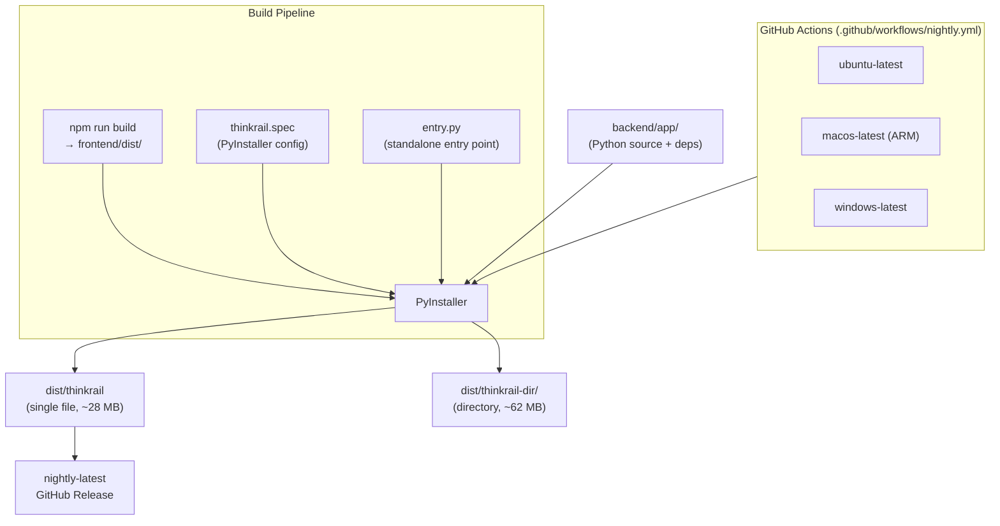

# Packaging Module — Design Specification

> Parent: [DESIGN_DOC.md](../DESIGN_DOC.md) | Status: **Active** | Created: 2026-04-09

## Table of Contents
1. [Purpose](#purpose)
2. [Internal Architecture](#internal-architecture)
3. [File Organization](#file-organization)
4. [Public Interface](#public-interface)
5. [Design Decisions](#design-decisions)
6. [Dependencies](#dependencies)
7. [Known Limitations](#known-limitations)
8. [Related Specs](#related-specs)

## Purpose

The Packaging module provides build infrastructure for creating portable ThinkRail executables. It bundles the Python runtime, all backend dependencies (including native Rust/C extensions like pydantic-core, watchfiles, httptools), and the pre-built frontend into a single standalone binary per platform.

This module is **build-time infrastructure**, not runtime code. It is consumed by CI/CD (GitHub Actions) and optionally by developers building locally. The output is a self-contained executable that requires no Python, Node.js, or any other prerequisite on the target machine.

## Internal Architecture

**Pattern:** Build pipeline — two static files configure the build tool (PyInstaller) and a CI workflow orchestrates cross-platform builds.



The build pipeline has two phases:
1. **Frontend build**: `npm ci && npm run build` produces static files in `frontend/dist/`
2. **PyInstaller bundle**: Combines `entry.py` (entry point), the backend Python package, all dependencies, and `frontend/dist/` into a standalone executable

## File Organization

| File | Responsibility | Depends On |
|------|---------------|------------|
| `entry.py` | Standalone CLI entry point: argparse for `--port`/`--host`/`--no-browser`, auto browser open, starts uvicorn | `uvicorn`, `app.main` |
| `thinkrail.spec` | PyInstaller spec: declares hidden imports, data files (frontend dist), produces onefile + onedir | PyInstaller |

**Related CI file:** `.github/workflows/nightly.yml` — orchestrates cross-platform builds and publishes to GitHub Releases.

## Public Interface

This module has no runtime API. Its "interface" is the CLI of the produced executable:

### CLI

```
thinkrail [OPTIONS]

Options:
  --port PORT        Server port (default: 8000)
  --host HOST        Bind address (default: 127.0.0.1)
  --no-browser       Don't auto-open browser on startup
```

### Build Commands

**Local build:**
```bash
cd frontend && npm run build           # Build frontend
cd packaging && pyinstaller thinkrail.spec --noconfirm --distpath dist --workpath build
```

**CI build:** Triggered automatically on push to `main` via `.github/workflows/nightly.yml`.

### Build Outputs

| Output | Path | Size | Description |
|--------|------|------|-------------|
| Single file | `dist/thinkrail` | ~28 MB | Self-extracting executable. Extracts to temp dir on first run. |
| Directory | `dist/thinkrail-dir/` | ~62 MB | Executable + `_internal/` support files. Faster startup. |

### PyInstaller Configuration

**Hidden imports** (packages with dynamic loading that PyInstaller cannot trace statically):
- `uvicorn` — dynamically loads protocol implementations
- `pydantic`, `pydantic_core` — Rust-backed validation engine
- `fastapi`, `starlette` — routing internals
- `jsonrpcserver` — dynamic method dispatch
- `anthropic`, `claude_agent_sdk` — AI SDK
- `httpx` — transitive dependency of `mcp` (via `claude-agent-sdk`)
- `pydantic_settings` — `.env` file loading
- `app` — all backend application modules

**Bundled data:** `frontend/dist/` is included as `frontend_dist` data directory, accessible at runtime via `sys._MEIPASS / "frontend_dist"`.

**Excluded packages:** `pytest`, `pytest_asyncio`, `tkinter` — test/dev-only, not needed at runtime.

## Design Decisions

| Decision | Choice | Rationale |
|----------|--------|-----------|
| **Packaging tool** | PyInstaller over Nuitka, PyApp | Most mature (15+ years), largest community, best CI support, built-in hooks for all our native extensions. See analysis in plan. |
| **Dual output** | Both onefile and onedir from one build | Same `Analysis` pass, one flag difference. Offers users a choice: convenience (onefile) vs. startup speed (onedir). |
| **Dedicated entry point** | `packaging/entry.py` separate from `backend/app/main.py` | Clean separation: `main.py` is the dev entry point (used by `uv run`), `entry.py` is the packaged entry point (CLI args, browser open). Avoids polluting the dev path with packaging concerns. |
| **Frontend bundled as data** | `frontend/dist/` → `frontend_dist` via PyInstaller datas | Frontend is pre-built static files. No Node.js needed at runtime. Backend serves them via FastAPI `StaticFiles`. |
| **Python 3.11 in CI** | Pin to 3.11 on GitHub Actions | Better PyInstaller compatibility than bleeding-edge Python. Local dev can use any 3.11+. |
| **Rolling nightly release** | Single `nightly-latest` tag, updated on every push to main | Stable download URL for early testers. No version management overhead during early development. |
| **No code signing** | Unsigned executables initially | Code signing costs $200-400/year. Can be added later when distributing to a wider audience. Document workarounds for macOS Gatekeeper and Windows SmartScreen. |
| **Browser auto-open** | Timer-based (1.5s delay after uvicorn start) | Simple approach. The delay ensures uvicorn is accepting connections before the browser requests the page. |

## Dependencies

| Dependency | Usage |
|------------|-------|
| `PyInstaller` | Build tool: bundles Python runtime + packages + data into executable |
| `uvicorn` | Runtime: ASGI server (started by `entry.py`) |
| `app.main.create_app` | Runtime: FastAPI application factory |
| GitHub Actions | CI: cross-platform build orchestration |
| `softprops/action-gh-release` | CI: creates/updates GitHub releases |

## Known Limitations

- **No cross-compilation:** Must build on each target OS. GitHub Actions handles this via matrix builds, but local builds only produce executables for the current OS.
- **macOS Gatekeeper:** Unsigned executables are quarantined. Users must run `xattr -d com.apple.quarantine thinkrail-macos` or right-click > Open.
- **Windows SmartScreen:** Unsigned executables trigger a warning. Users click "More info" > "Run anyway".
- **Single-file startup latency:** The onefile executable extracts to a temp directory on launch (~3-8 seconds). Subsequent launches may be faster if the OS caches the extraction.
- **Transcription unavailable:** The `openai` package (used for Whisper transcription) is not included in the build. Transcription requires the full dev setup.
- **tkinter excluded:** The file browse dialog fallback to tkinter is unavailable in packaged mode. Users need `zenity` (GTK) or `kdialog` (KDE) on Linux for the file picker.

## Related Specs

- **Parent:** [Architecture Design](../DESIGN_DOC.md) (Deployment section)
- **Depends on:** [Core Module](../backend/app/core/README.md) (frozen mode detection in `config.py`)
- **Depends on:** [Frontend](../frontend/README.md) (build output: `frontend/dist/`)
- **Related:** `.github/workflows/nightly.yml` (CI/CD workflow)
