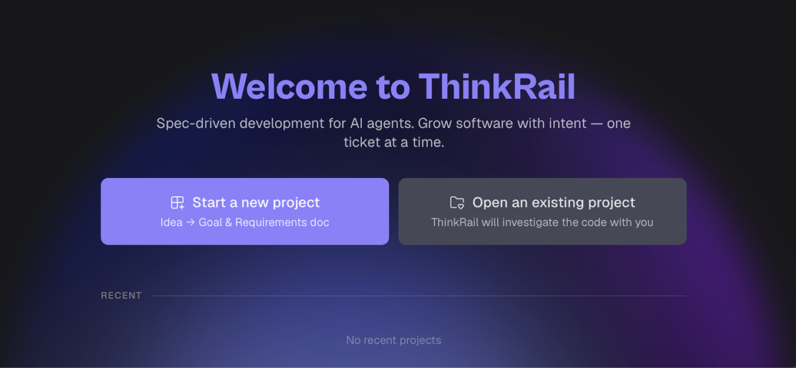
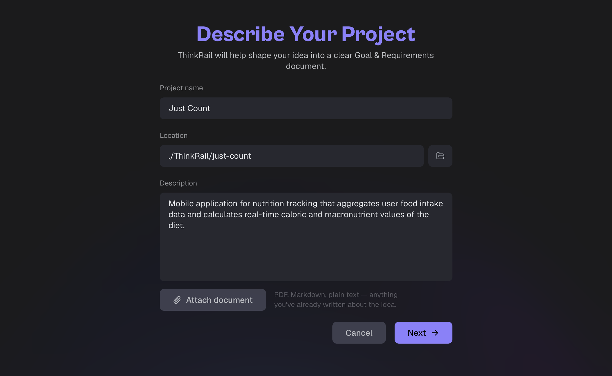
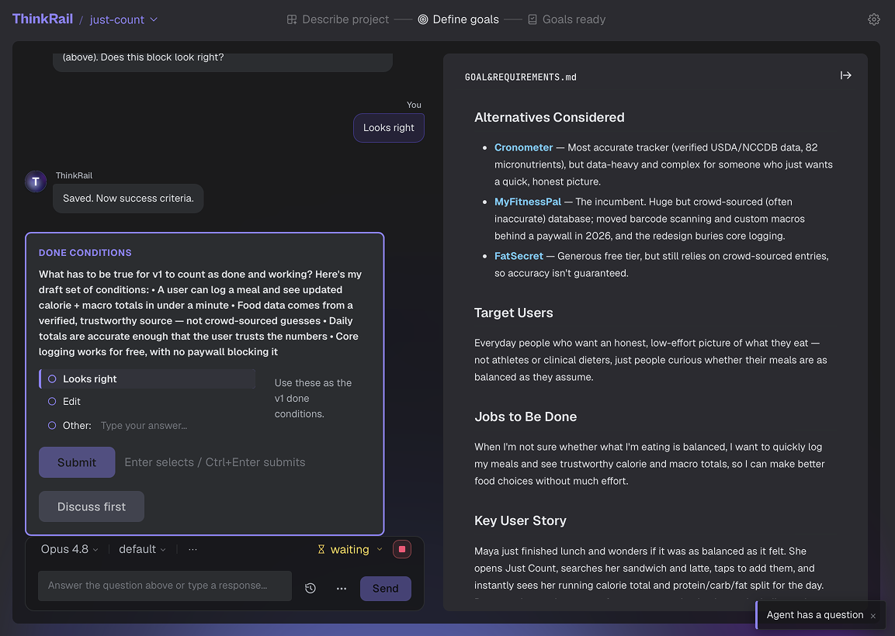
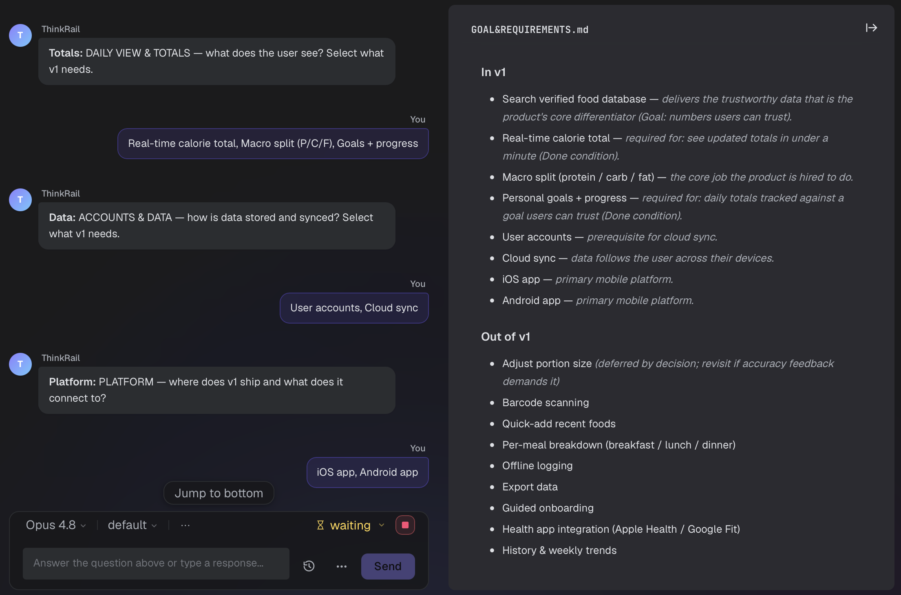
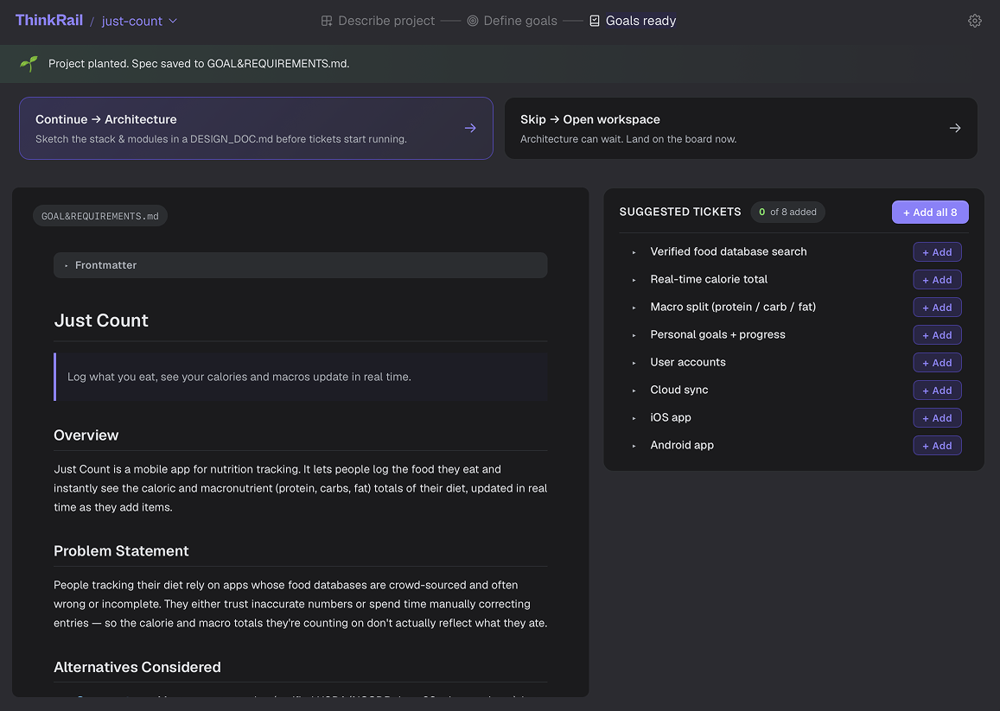
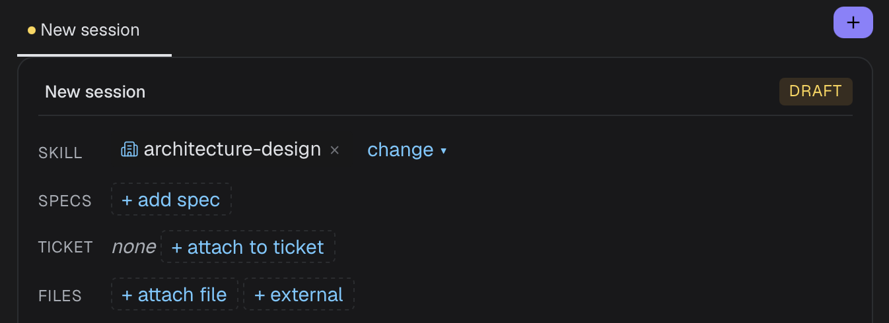

# Starting a New Project

This guide covers the case where you're starting **from scratch**: you have only an idea and no code yet. ThinkRail helps turn the idea into a clear **Goal & Requirements** document, and then into an architecture.

> **In short:** Describe the idea → ThinkRail creates the project folder → the agent shapes the goal and requirements → move on to architecture → the project is ready to work on.

---

## When to use this guide

Use this guide for a new project with no existing code. If you already have a codebase, see [Onboarding an Existing Project](./onboarding-existing-project.md).

---

## 1. Start a new project

On the **"Welcome to ThinkRail"** start screen, click:

> **Start a new project**
> _Idea → Goal & Requirements doc_



---

## 2. Project creation

### 2.1 Describe the project

The **"Describe Your Project"** form opens:

> _ThinkRail will help shape your idea into a clear Goal & Requirements document._



Fill in the fields:

#### Project Name (required)
The project's name, e.g. `inventory service`. Up to 80 characters.

#### Location (required)
The path where the project folder will be created. Defaults to `~/ThinkRail/<project-name>`.

- The folder name is derived automatically from the project name (lowercase, hyphens instead of spaces).
- Click **Browse** to pick a different parent folder.
- You can edit the path manually.

#### Description (required — text or file)
Describe the idea, goals, and context of the project in the text area.

- Submit the form with **Cmd+Enter** / **Ctrl+Enter**.

#### Attach document (optional)
You can attach an existing write-up of the idea. The attached file is read as **plain text**, so use a text-based format: `.txt`, `.md`, `.csv`, `.json`, `.yaml`, `.yml`. Binary formats (`.pdf`, `.doc`, `.docx`) can be selected but won't be parsed — copy the text into the Description field instead.

> You must fill in the **name** and provide **either a description or an attached file** — otherwise the **Next** button stays disabled.

Click **Next**. ThinkRail creates the project folder, opens the workspace, shows **"Starting…"**, and automatically starts the goal-definition session — nothing else is required from you.

### 2.2 Define the goal & requirements

This is where the real work of project creation happens: you and the agent talk through the idea and shape it into a **product document** (`GOAL&REQUIREMENTS.md`).

The screen splits into two panes:

- **Left** — the chat with the agent.
- **Right** — a live preview of `GOAL&REQUIREMENTS.md`.

The stepper at the top:

1. **Describe project** ✓
2. **Define goals** ← in progress
3. **Goals ready**

The agent reads your idea (and the attached document, if any) and shapes `GOAL&REQUIREMENTS.md` with sections:

- Overview
- Goals & Success Metrics
- Target Users
- Design Constraints
- Open Questions

Answer the agent's questions in the chat to make the document more accurate. The agent asks focused questions — for example, what must be true for v1 to count as done — and you reply with quick options or free text. The live preview on the right updates as each section is saved.



It also helps you draw the line between what ships now and what waits, so the requirements end up with clear **In v1** and **Out of v1** sections.



---

## 3. What's next

Once the goal and requirements are ready, the stepper shows **Goals ready** and a banner confirms _Project planted. Spec saved to GOAL&REQUIREMENTS.md._ Two options appear:

> **Continue → Architecture**
> _Sketch the stack & modules in a DESIGN_DOC.md before tickets start running_

> **Skip → Open workspace**
> _Architecture can wait. Land on the board now._

On the right you'll also see **Suggested Tickets** derived from the requirements — add them individually with **+ Add**, or all at once with **+ Add all**.



Choosing **Continue → Architecture** starts an architecture-design session. The agent reads `GOAL&REQUIREMENTS.md` and creates **`DESIGN_DOC.md`**:

- tech stack decisions;
- module breakdown;
- interface definitions;
- deployment architecture.

---

## 4. The foundation is set

This doesn't mean the project is finished — it means the groundwork is in place: ThinkRail now understands what the project is about, and the goal, requirements, and architecture are captured as specs.

After the architecture session finishes, the project is considered **initialized**. The next time you open it, you'll go straight to the workspace — the helper forms are no longer shown.

---

## What gets created on disk

```
~/ThinkRail/your-project/        # created automatically
├── .tr/
│   ├── settings.json            # project settings
│   ├── GOAL&REQUIREMENTS.md      # goal and requirements
│   ├── DESIGN_DOC.md             # architecture
│   ├── sessions/                # session transcripts
│   └── index.db                 # spec index
└── … project files
```

---

## Tips

- The specifications (`GOAL&REQUIREMENTS.md`, `DESIGN_DOC.md`) are plain Markdown files. You can refine them.
- The next step is detailing modules and creating tickets. Specifications turn into tasks on the board, which the agent works through one at a time.

---

## FAQ

**I picked the wrong folder for the project.** The folder is created at the path you specified in step 2.1. If you made a mistake, close the project, delete the created folder, and start the flow again.

**Can I skip the architecture step?** You can come back to it later by starting a **New session** with the `architecture-design` skill, but it's recommended to define the architecture before tickets start running — it sets the boundaries for all the work that follows.

<p align="center">
  
</p>

**I already have a document describing the idea.** Attach it via **Attach document** in step 2.1 — the agent will take it into account when shaping the goal and requirements.
