# Working with Tickets

Tickets are how you grow your project in ThinkRail — one change at a time. A ticket starts as a short description of *what you want* ("Confirm before deleting a meal"); ThinkRail walks it through design, planning, and implementation, producing reviewable documents at each step and ending in real code changes.

This page shows how to work with tickets, and what's **not yet supported**. Screenshots are from a real run on a small sample app (*Just Count*, a calorie tracker).

> **In a hurry?** Open the **Board**, click **New ticket**, and type a one-line description. ThinkRail interviews you briefly, proposes a pipeline of stages, runs each stage as a chat session you drive, and ships the change. The rest of this page is the detail.

---

## Contents

- [The big picture](#the-big-picture)
- [Finding your way around](#finding-your-way-around)
- [The Board](#the-board)
- [Creating a ticket](#creating-a-ticket)
- [Intake: a short interview](#intake-a-short-interview)
- [Choosing a pipeline](#choosing-a-pipeline)
- [Running a stage](#running-a-stage)
- [Artifacts](#artifacts)
- [Controlling how a ticket runs](#controlling-how-a-ticket-runs)
- [Between-stage checks](#between-stage-checks)
- [Finishing the ticket](#finishing-the-ticket)
- [What works, and what doesn't yet](#what-works-and-what-doesnt-yet)
- [Tips](#tips)

---

## The big picture

Under the hood, a ticket runs a small **spec-driven loop**. You say what you want, and ThinkRail turns it into shipped code by, in order:

1. **Capturing your decisions as design docs** — *what* the change should do (product design) and *how* to build it (technical design).
2. **Reconciling them with your existing specs** — updating the project's design docs to match, and surfacing any contradictions before they reach code.
3. **Turning that into a plan** — the work broken into concrete, ordered steps.
4. **Implementing the plan** — real code changes, reviewed as they're made.

```
Describe → Product design → Technical design → Update specs → Plan → Implement → Done
```

Each step is a **stage**, and each stage runs as a chat session you can review and steer. The next stage only starts once the current one finishes — so the design is settled before the plan, and the plan before any code. The rest of this page walks through each stage; this is just the shape of the whole thing.

---

## Finding your way around

**Projects.** On launch, ThinkRail shows a project picker — start a new project, open an existing one, or pick a recent. You can switch projects anytime from the project name at the top-left.

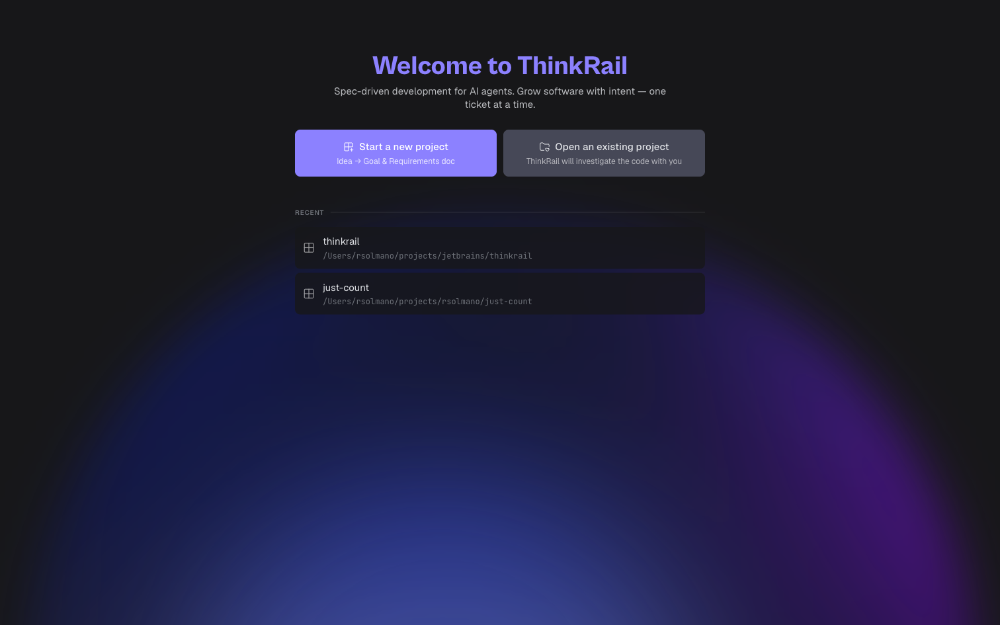

**Two views.** The header has two tabs:

- **Board** — the Kanban of tickets.
- **Workspace** — where the work happens: chat sessions, specs, and files.

**The Workspace has three panels:**

- **Left — Sessions / Specs / Files.** *Sessions* lists your tickets; each ticket is a group you can expand to reveal its **🎼 Orchestrator** and its **stages** — click any to open that chat. *Specs* is your project's design docs; *Files* is the file tree.
- **Center — tabs.** Whatever you open — a ticket's detail view, the orchestrator, or a stage session — opens as a tab here.
- **Right — Artifacts.** The documents the current ticket has produced, plus a **Context** tab showing the agent's token usage.

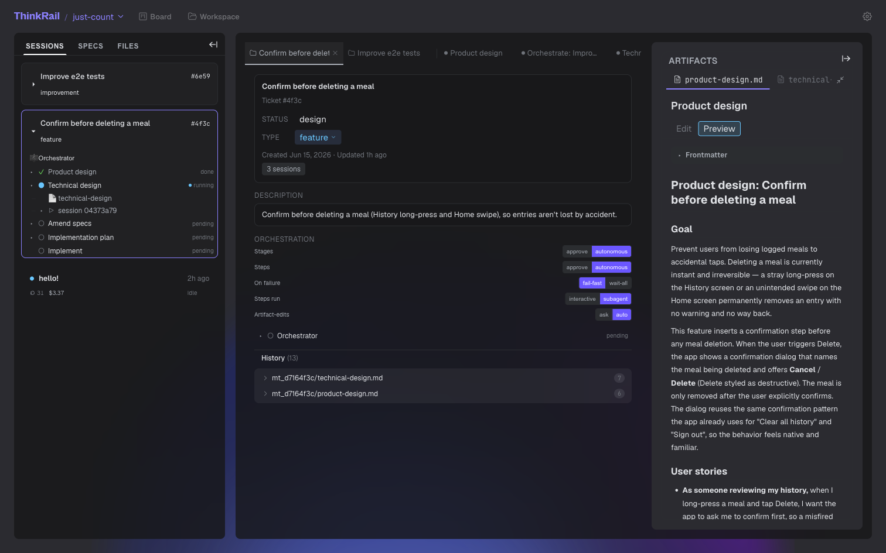

To open a ticket, **double-click its card** on the Board. To jump to a running stage or the orchestrator, expand the ticket in the **Sessions** sidebar and click it.

---

## The Board

The **Board** is home for tickets — a Kanban board whose four columns track a ticket's progress:

**Created → Design → Implementation → Done**

Tickets move between columns automatically as their work progresses; you don't drag them across (though you can reorder cards within a column).

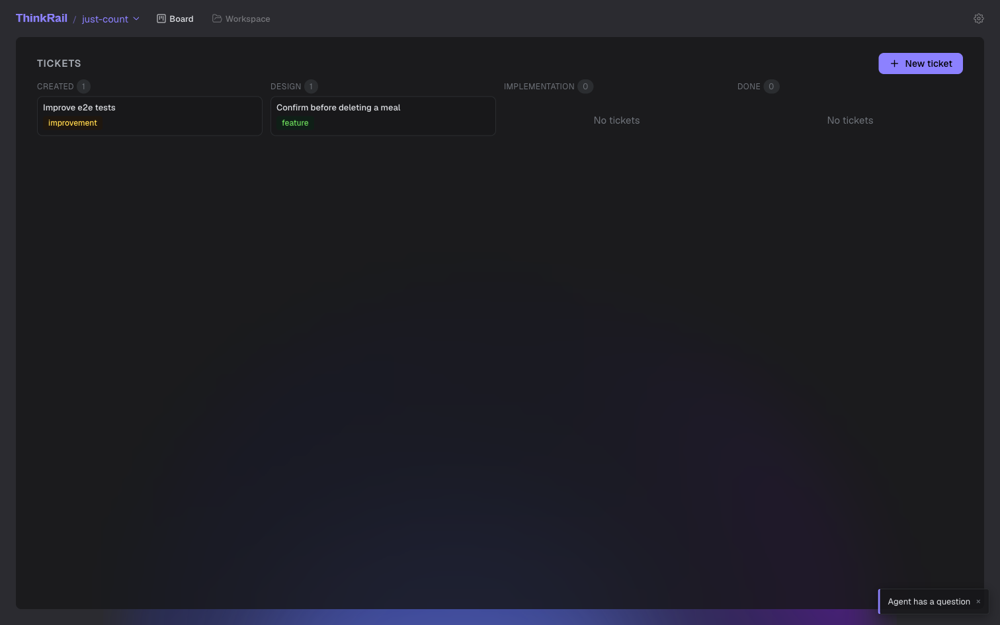

Each card shows the title and a coloured **type** badge — `feature`, `bug`, `idea`, or `improvement`. **Double-click** a card to open it, single-click to preview it, right-click for options.

---

## Creating a ticket

Click **New ticket** and fill in the dialog (titled *New Meta-Ticket*):

- **Title** — a short name for the change.
- **Type** — Feature / Bug / Idea / Improvement.
- **Description** *(optional)* — a sentence on the intent. You can leave it blank; ThinkRail helps you write it.

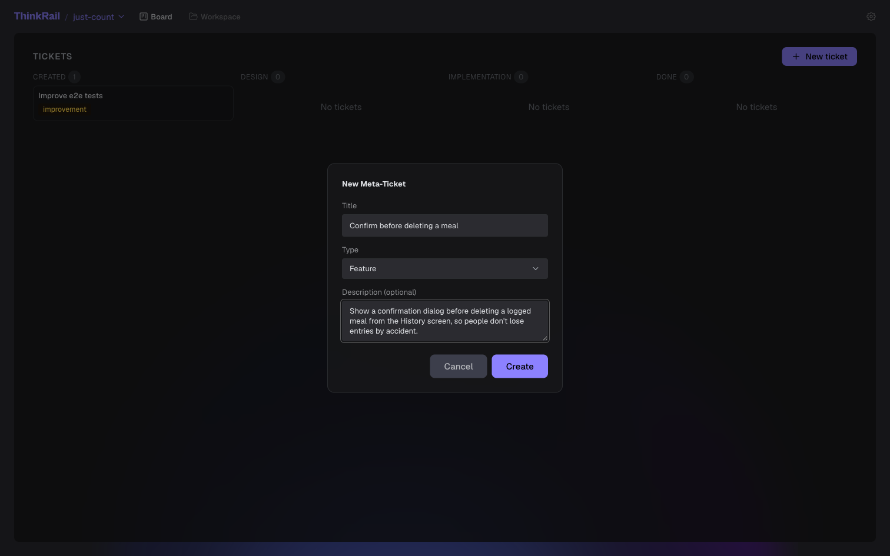

Click **Create**. The ticket lands in **Created**, and ThinkRail starts working on it in the background.

Opening a ticket shows its detail view — title, status, description, the **Orchestration** controls, the list of **stages**, and an **Artifacts** panel on the right.

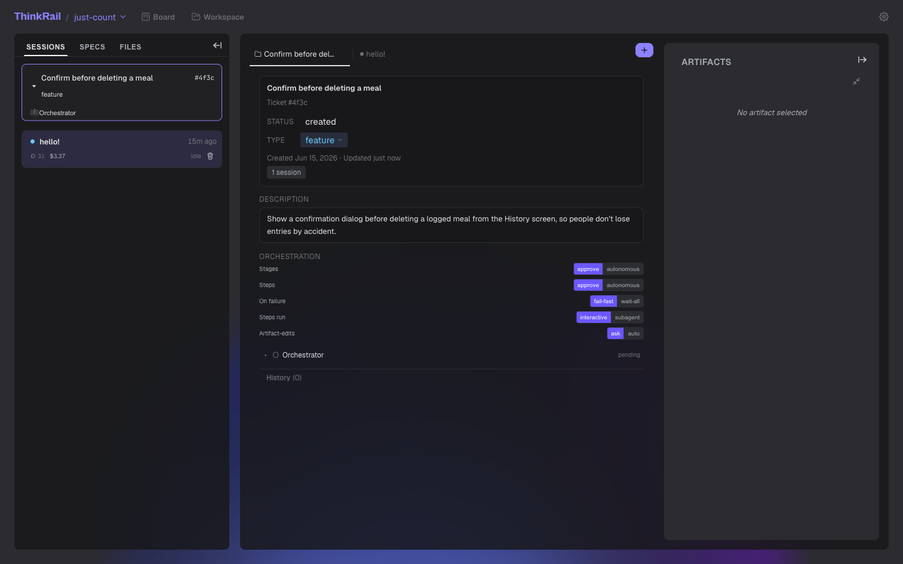

---

## Intake: a short interview

Each ticket gets a dedicated **🎼 Orchestrator** — an assistant that drives the whole ticket. It starts by asking one or two quick questions to pin down *what the ticket is about* (not how to build it), and helps you tighten the description to a single line.

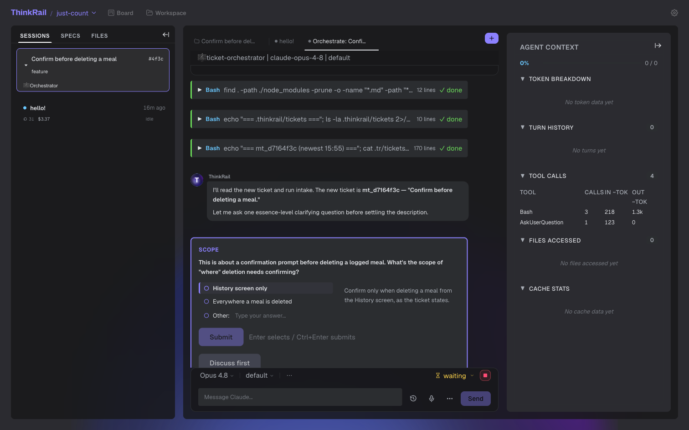

Each question is a card with suggested answers and a free-text **Other** option; the recommended choice is marked. Pick one and **Submit**.

---

## Choosing a pipeline

Next, the orchestrator asks which **pipeline** to run — the sequence of stages that takes this ticket from idea to code:

- **Full** — Product design → Technical design → Amend specs → Implementation plan → Implement.
- **Simplified** — a leaner subset for small, well-understood changes.
- **Inlined brainstorming** — a single brainstorming stage that is the whole pipeline.

You can also tick optional **add-on** stages (e.g. UI-mockups, AI-criticism), or leave them off to keep it lean.

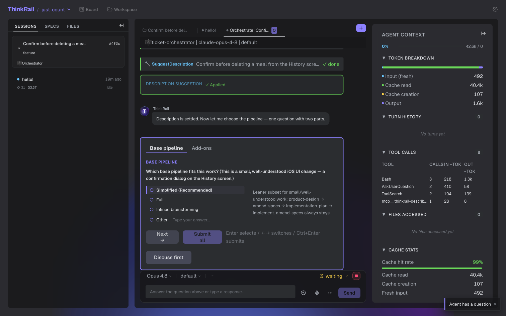

It then lays out the stages and — unless you've set it to run autonomously — asks before launching the first one.

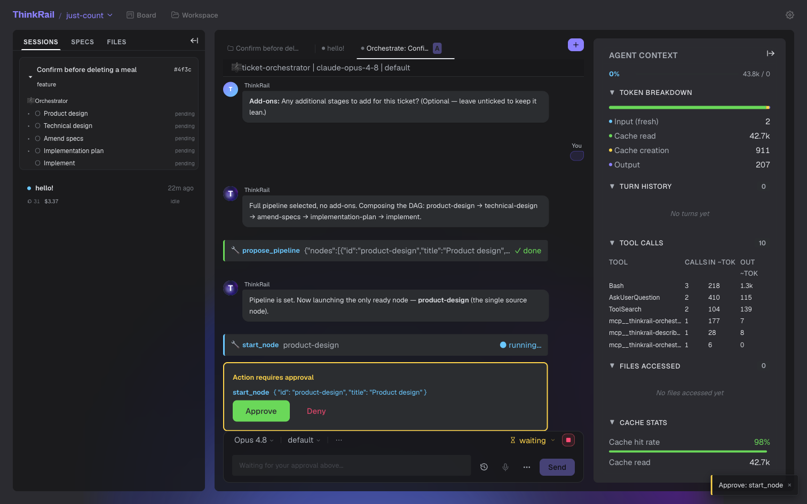

> Add-on stages have a known limitation today — see [what doesn't yet work](#what-works-and-what-doesnt-yet).

---

## Running a stage

The core idea: **each stage runs as its own chat session that you drive.** Launching a stage (say *Product design*) opens a real session you can talk to, just like any agent chat.

A design stage usually:

1. explores the relevant code on its own,
2. asks you a few focused questions, one at a time,
3. writes its result to an artifact and self-reviews,
4. **finalizes** — handing back to the orchestrator, which launches the next stage.

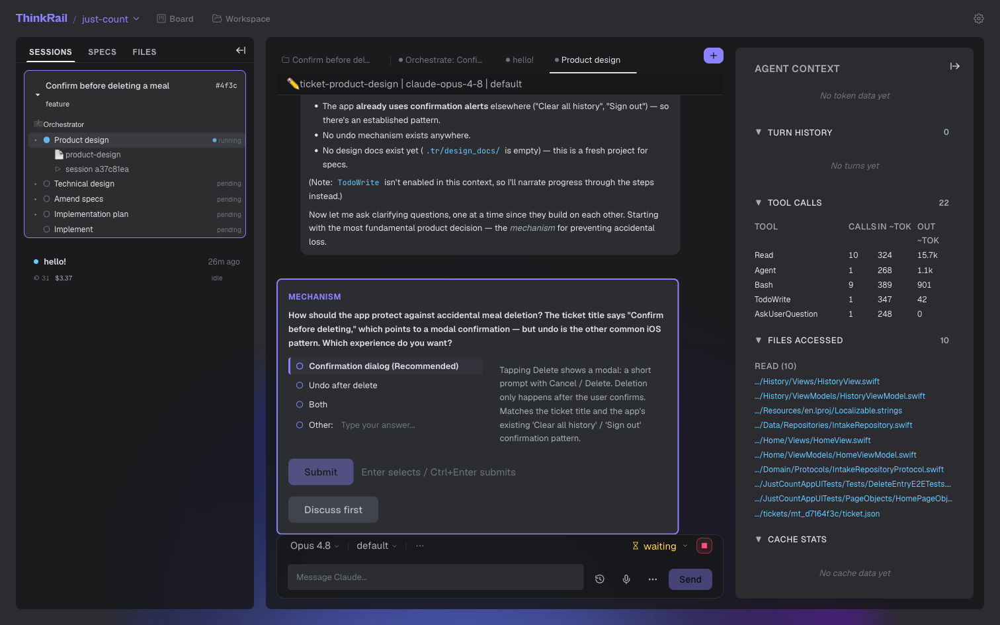

You can answer the questions, steer in free text, or tell the stage to use sensible defaults and wrap up.

The ticket's **stages** list (in the detail view and the sessions sidebar) shows where things stand — each stage is **pending** (○), **running** (●), **done** (✓), or **failed** (✕). Stages run in order, and the orchestrator can add, drop, or re-order them as it learns more.

---

## Artifacts

Stages produce **artifacts** — short markdown documents that capture the thinking *before* any code is written. They appear in the **Artifacts** panel, with Edit and Preview tabs.

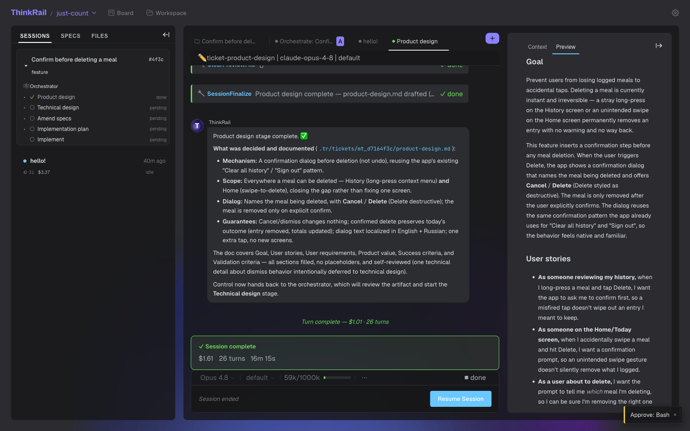

The Full pipeline produces:

- **Product design** — goal, user stories, requirements, value, success criteria.
- **Technical design** — architecture, components, interfaces, data flow, testing.
- **Spec amendments** — proposed edits to your project's design docs, reviewed as a diff.
- **Implementation plan** — the work split into ordered steps.

Because the design is reviewable text first, you catch problems while they're cheap to fix.

---

## Controlling how a ticket runs

The **Orchestration** controls decide how hands-on a run is:

| Setting | Options | Effect |
| --- | --- | --- |
| **Stages** | approve / autonomous | Ask before launching each stage, or proceed automatically. |
| **Steps** | approve / autonomous | Same, for steps inside the implementation stage. |
| **On failure** | fail-fast / wait-all | Stop at the first failure, or collect failures first. |
| **Steps run** | interactive / subagent | Run implementation steps as chat sessions you drive, or as autonomous subagents. |
| **Artifact-edits** | ask / auto | Prompt before writing artifact files, or write them automatically. |

Change these anytime: `approve` + `interactive` for a closely-reviewed run, `autonomous` + `auto` for a hands-off one.

> These control *when ThinkRail pauses for you*. They don't stop a stage from interviewing you, and they don't disable the normal prompts before sensitive actions (running a command, editing source).

---

## Between-stage checks

When a stage finishes, the orchestrator reviews its artifact against the goal and the earlier stages before moving on. It can flag an inconsistency, adjust the pipeline, or tighten the description.

For instance, in the sample run the product-design stage broadened the scope (from one screen to *everywhere* a meal can be deleted), and the orchestrator surfaced that for a decision instead of letting the design drift from the ticket. That's what keeps the stages coherent with each other and with your intent.

---

## Finishing the ticket

The final **Implement** stage executes the plan — each step runs as a chat session or an autonomous subagent (your choice), and its edits go through ThinkRail's change review. When implementation finishes and every stage is done, the ticket moves to **Done**.

---

## What works, and what doesn't yet

**Works today:** creating tickets; the automatic intake interview; pipeline choice (Full / Simplified / Inlined brainstorming); stages that run as interactive sessions and produce reviewable artifacts; the orchestration controls; between-stage consistency checks; and the implementation stage carrying a ticket through to Done.

**The main gap — add-on / custom stages can fail to launch.** Every stage is backed by a *skill*. ThinkRail can only launch a stage whose skill is one of its built-in pipeline skills (product design, technical design, amend specs, implementation plan, implement, brainstorming). When you add a **custom stage** that isn't part of the default pipeline — an add-on like *Tech research* or *AI-criticism* — the orchestrator gives it a descriptive skill name (e.g. `deep-research`) that **isn't installed**, so launching it fails:

```
Skill 'deep-research' not found: …/skills/deep-research/SKILL.md does not exist
```

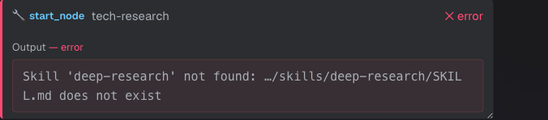

In practice:

- **Full and Simplified pipelines always work** — every stage in them has a real skill.
- A **pipeline with add-on stages** can hit this: the extra stage can't run on its own. The orchestrator handles it gracefully — it skips the stage and folds the value into a neighbouring one — but the dedicated stage doesn't run.

This is the kind of pipeline that triggers it (note the extra *Tech research* and *AI criticism* stages):

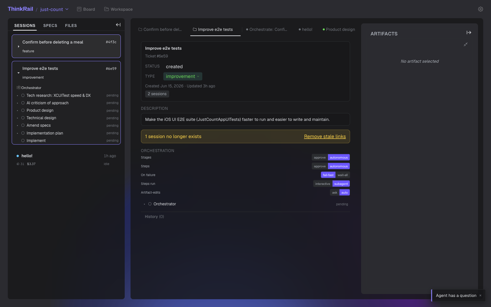

**Workaround:** stick to **Full** or **Simplified** (no add-ons) for a run that completes end-to-end. If you want research or critique, ask for it *inside* a design stage rather than as a separate stage.

**Two things to expect, by design:** design stages will interview you a question at a time, and ThinkRail still asks before sensitive actions even in autonomous mode.

---

## Tips

- **Keep the description short** — a line or two. The real detail lives in the artifacts.
- **Answer intake decisively** — the recommended option is usually right for a small change.
- **`approve` + `interactive`** when you want to review; **`autonomous` + `auto`** when you trust the plan.
